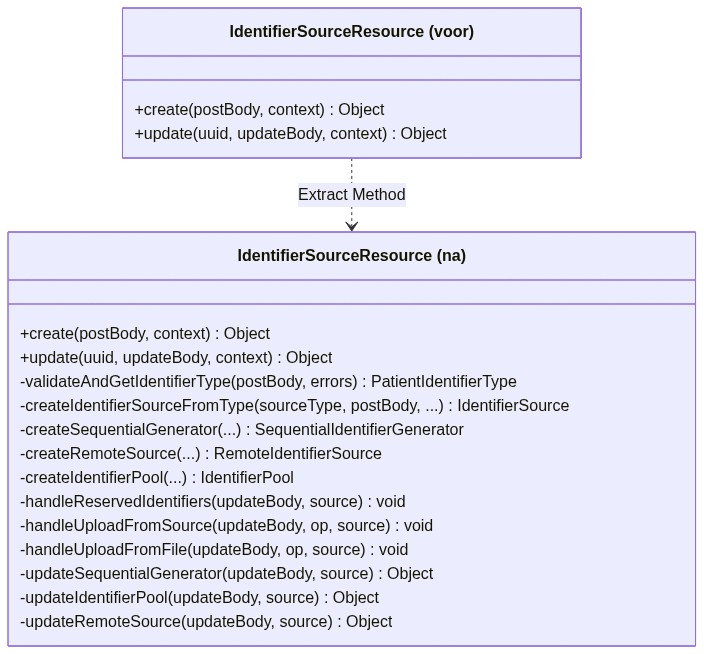

# Aangepast ontwerp en refactoring-onderbouwing

**Groep: C6**

| Naam: | Nummer: |
|---|---|
| Raf van Hooijdonk | 2230382 |
| Rowen Albers | 2227982 |
| Simon Eulenpesch | 2226731 |
| Sinan Sagir | 2235816 |

---

## 1. Doel en scope

Dit document beschrijft het aangepaste ontwerp voor de geselecteerde verbeteringen aan de `idgen`-module en onderbouwt de keuzes met ontwerpprincipes, refactoringpatronen en overwogen alternatieven. Het sluit aan op de geprioriteerde verbeteracties in `Groep_6_Analyse-Onderhoudbaarheid.md` sectie 8.2 en op de testopzet in `Groep_6_Testplan.md`.

De realisatie van deze ontwerpen is uitgevoerd als PoC in commit 303c735 (15/06/2026, "mitigated 201 code quality issues") en aanvullend 7d41fbc (diamond operators). Dit document beschrijft het ontwerp achter die realisatie.

**Scope:** de structurele code-aanpassingen voor onderhoudbaarheid (complexiteit, duplicatie, leesbaarheid). Buiten scope: security-hardening (CodeQL, commit 73d9b94) en de testtoevoegingen (zie `Groep_6_Testplan.md`).

---

## 2. Methodiek

De aanpak volgt de refactoring-discipline van Martin Fowler: kleine, gedragsbehoudende transformaties, telkens gedekt door de bestaande testsuite zodat regressie direct zichtbaar wordt. Per verbeteractie uit de prioritering is bepaald welk ontwerpprincipe wordt geschonden, welk refactoringpatroon dit herstelt en welke alternatieven zijn overwogen.

De geselecteerde verbeteringen (uit `Groep_6_Analyse-Onderhoudbaarheid.md` sectie 8.2):

| Actie | Verbetering | Ontwerpprobleem | Prioriteit |
|---|---|---|---|
| 1 | Multi-threading fix (static / geen gedeelde mutable state) | Race condition | Kritiek |
| 3 | Brain Methods opsplitsen | Te hoge cognitive complexity | Hoog |
| 4 | Magic strings naar constanten | Duplicatie (DRY-schending) | Hoog |
| 5 | Validator unit-testbaar maken | Testbaarheid + complexity | Hoog |
| 8, 9 | Diamond operator, `@Override` | Leesbaarheid, consistentie | Laag |

---

## 3. Aangepast ontwerp per verbetering

### 3.1 Validator: Extract Method en Guard Clause

**Huidig ontwerp (voor):** `SequentialIdentifierGeneratorValidator.validate()` was één methode met geneste `if/else`-blokken, inline validator-loading en lengtecontroles. Cognitive Complexity 27 (drempel 15). De geneste `else`-tak maakte de methode moeilijk te volgen en te testen.

**Aangepast ontwerp (na):** de methode is opgesplitst in drie kleinere methoden met één verantwoordelijkheid elk:

```
validate(o, errors)
  -> super.validate(o, errors)          // naam-validatie (basisklasse)
  -> guard: firstIdentifierBase vereist
  -> guard: identifierType vereist (early return)
  -> validateIdentifierType(source, firstId, errors)   // extracted
  -> checkLengthConstraints(source, firstId, errors)   // extracted
```

**UML-klassediagram (voor en na):**


In de voor-situatie zit alle validatielogica in één methode (`validate`). In de na-situatie orkestreert `validate` alleen nog en zijn de twee deeltaken afgesplitst naar private methoden, waardoor de cognitive complexity onder de drempel komt en de deeltaken los testbaar zijn.

**Toegepaste patronen:**
- **Extract Method** (Fowler): `validateIdentifierType()` en `checkLengthConstraints()` afgesplitst.
- **Replace Nested Conditional with Guard Clauses** (Fowler): de `else`-tak na de `identifierType == null`-controle is vervangen door een `return`, waardoor de happy path plat blijft.

**Ontwerpprincipes:** Single Responsibility (elke methode doet één ding) en KISS (de hoofdmethode leest nu als een checklist).

**Alternatief overwogen:** de validatie volledig in een aparte `ValidationChain`/Chain of Responsibility gieten. Afgewezen: voor drie regels introduceert dat meer abstractie dan het oplost (YAGNI). Extract Method haalt de complexiteit onder de drempel met minimale structuur.

**Effect:** de afgesplitste methoden zijn los testbaar. De toegevoegde `SequentialIdentifierGeneratorValidatorTest` (11 tests) brengt de klasse van 0% naar 71,9% line coverage (zie `Groep_6_Testplan.md` sectie 4.5).

### 3.2 IdentifierSourceResource: Brain Methods opsplitsen

**Huidig ontwerp (voor):** twee methoden (regel 142 en 318) met Cognitive Complexity 101 en 106, elk 144 tot 165 regels, tot 39 lokale variabelen. SonarCloud classificeerde beide als Brain Method.

**Aangepast ontwerp (na):** de methoden zijn opgeknipt in kleinere private hulpmethoden. Het bestand bevat na de refactoring 17 private methoden (commit 303c735, 351 gewijzigde regels), elk met een afgebakende deeltaak (parsen van een deelrequest, opbouwen van een representatie, enz.).

**Schematisch UML (conceptueel; exacte methodenamen in de broncode):**



De twee Brain Methods zijn opgesplitst: de publieke methoden orkestreren nog en de deeltaken zijn naar private hulpmethoden verplaatst. Dit verlaagt de cognitive complexity per methode zonder de publieke REST-API te wijzigen.

**Toegepaste patronen:**
- **Extract Method** (Fowler): herhaaldelijk toegepast om samenhangende blokken uit de Brain Methods te halen.
- **Compose Method** (Kerievsky): de overgebleven hoofdmethode bestaat na refactoring vrijwel alleen uit aanroepen op hetzelfde abstractieniveau.

**Ontwerpprincipes:** Single Responsibility en Separation of Concerns; de complexiteit is verdeeld over benoembare eenheden in plaats van geconcentreerd in één methode.

**Alternatief overwogen:** de klasse opsplitsen in meerdere resource-klassen (volledige architecturele splitsing). Afgewezen voor deze PoC: dat raakt de OpenMRS REST-contracten en vergt regressietesten buiten de scope. Extract Method verlaagt de complexity zonder de publieke API te breken; de volledige splitsing is genoteerd als vervolgactie.

**Validatie:** de verse SonarCloud-meting op `main` (16/06/2026) bevestigt de reductie. De twee methoden gaan van CC 101 en 106 (baseline 12/06) naar CC 21 en CC 20 (`IdentifierSourceResource` L265 en L353), een reductie van ongeveer 80%. Beide blijven net boven de drempel van 15; de volledige sprong naar nul vergt de klassesplitsing die hieronder als alternatief is afgewogen. Zie `Groep_6_Testplan.md` sectie 8.3 en 8.4.

### 3.3 Magic strings: Extract Constant

**Huidig ontwerp (voor):** string-literals zoals `"identifierType"`, `"source"`, `"[AUDIT] UserID: "` en `"SYSTEM"` stonden 4 tot 10 keer herhaald per bestand (rule `java:S1192`). Dit is de hoofdoorzaak van de 10,8% duplicatie in de omod-laag.

**Aangepast ontwerp (na):** de literals zijn geëxtraheerd naar `private static final`-constanten. Bevestigd in onder andere `BaseIdentifierSourceService` (`AUDIT_USER_PREFIX`, `SYSTEM_USER`) en de resource handlers.

**Toegepaste patronen:**
- **Extract Constant** (Fowler / Replace Magic Literal).

**Ontwerpprincipes:** DRY (Don't Repeat Yourself); één definitie, één plek om te wijzigen. In een medische context (patiënt-ID-validatie) verlaagt dit het risico dat een wijziging op één plek vergeten wordt.

**Alternatief overwogen:** een enum of een centrale `Constants`-klasse voor alle veldnamen. Afgewezen: de literals zijn klasse-lokaal van betekenis; per klasse een constante houdt de cohesie hoog en voorkomt een god-constantenklasse.

### 3.4 Multi-threading: gedeelde mutable state wegnemen

**Huidig ontwerp (voor):** `LocationBasedPrefixProvider` en `LocationBasedSuffixProvider` muteerden een instantie-`Set` vanuit een niet-statische methode (rule `java:S2696`). In een multi-threaded OpenMRS-omgeving (meerdere gelijktijdige HTTP-requests) leidt dit tot race conditions bij ID-generatie.

**Aangepast ontwerp (na):** de betreffende methode is static gemaakt of de gedeelde `Set` is verwijderd, zodat er geen gedeelde veranderlijke toestand meer is.

**Ontwerpprincipes:** thread-safety door immutability / geen gedeelde state; dit is tevens een correctheidsfix, niet alleen onderhoudbaarheid.

**Alternatief overwogen:** synchronisatie (`synchronized` of een concurrent collectie). Afgewezen: locking voegt complexiteit en contention toe; de state was niet nodig op instantieniveau, dus wegnemen is eenvoudiger en sneller (KISS).

### 3.5 Leesbaarheid: diamond operator en @Override

**Aangepast ontwerp:** `new ArrayList<String>()` vervangen door `new ArrayList<>()` (commit 7d41fbc, ~35 plekken) en ontbrekende `@Override`-annotaties toegevoegd (commit 303c735).

**Ontwerpprincipes:** KISS en consistentie; `@Override` maakt de intentie expliciet en laat de compiler contractbreuken vangen. Dit zijn kleine, automatisch toepasbare verbeteringen met laag risico.

---

## 4. Overzicht toegepaste principes en patronen

| Refactoringpatroon | Bron | Toegepast op | Verbeteractie |
|---|---|---|---|
| Extract Method | Fowler | Validator, `IdentifierSourceResource` | 3, 5 |
| Replace Nested Conditional with Guard Clauses | Fowler | Validator | 5 |
| Compose Method | Kerievsky | `IdentifierSourceResource` | 3 |
| Extract Constant | Fowler | Resource handlers, services | 4 |
| Remove shared mutable state | n.v.t. (concurrency) | Location-based providers | 1 |

| Ontwerpprincipe | Waar toegepast |
|---|---|
| Single Responsibility (SOLID) | Validator, Brain Methods opsplitsen |
| DRY | Magic strings naar constanten |
| KISS | Guard clauses, geen onnodige abstractie, diamond operator |
| Separation of Concerns | Brain Methods naar deeltaken |
| YAGNI | Geen Chain of Responsibility / volledige klassesplitsing in deze PoC |

---

## 5. Alternatieven en gemotiveerde keuzes (samenvatting)

| Verbetering | Gekozen aanpak | Overwogen alternatief | Motivatie keuze |
|---|---|---|---|
| Validator-complexity | Extract Method + Guard Clause | Chain of Responsibility | Minder abstractie, complexity onder drempel (YAGNI) |
| Brain Methods | Extract Method binnen klasse | Klasse opsplitsen in meerdere resources | Behoudt publieke REST-API, geen contractbreuk in PoC |
| Magic strings | Constante per klasse | Centrale enum/Constants-klasse | Behoudt cohesie, vermijdt god-klasse |
| Multi-threading | State wegnemen / static | Synchronisatie | Eenvoudiger, geen lock-contention (KISS) |

---

## 6. Koppeling naar realisatie en validatie

- **Prioritering en onderbouwing:** `Groep_6_Analyse-Onderhoudbaarheid.md` sectie 8.2 (Deel 3).
- **Realisatie (PoC):** commit 303c735 (39 java-bestanden) en 7d41fbc (diamond operators), op `main` (Deel 5).
- **Validatie:** de bestaande testsuite blijft groen na de refactoring (151 tests, 0 failures, 0 errors); de voor/na op metriekniveau is gemeten via SonarCloud op `main` (16/06/2026) en uitgewerkt in `Groep_6_Testplan.md` sectie 8 (Deel 6 in `docs/checklist.md`).

---

## 7. Verantwoording en kritische reflectie AI-tooling

### 7.1 Beschrijving en verantwoording van toolinggebruik
Tijdens de analyse-, ontwerping- en realisatiefase van dit PoC is intensief gebruikgemaakt van de AI-assistent **Claude** (Anthropic). De assistent is ingezet voor zowel code-gerichte onderhoudbaarheidstaken als voor beveiligingsanalyses en compliancedocumentatie.

#### Inzet voor onderhoudbaarheid en refactoring
Claude is ingezet als ondersteunende *pair programmer* voor de volgende codetaken:
- **Codegeneratie en scripting:** Het schrijven en valideren van het geautomatiseerde Python-script (`add_override.py`) dat op basis van broncodereferenties op 93 regels de `@Override`-annotaties heeft ingevoegd.
- **Refactoring-ondersteuning:** Het genereren van oplossingsrichtingen voor het opsplitsen van de complexe methoden in `IdentifierSourceResource` en de validator-klasse conform het Single Responsibility Principle.
- **Code-opruiming:** Het opsporen en vervangen van verouderde syntax door de diamond operator (`<>`) in de gehele `openmrs-module-idgen` workspace.

#### Inzet voor security-hardening en compliancedocumentatie
Daarnaast is Claude ingezet voor risico-evaluaties en compliancetaken:
- **Exploit- en pentestdocumentatie:** Ondersteuning bij het opstellen van het gedetailleerde pentestrapport (`Groep_6_Pentestrapport.md`), inclusief de technische toelichting van de `ysoserial` gadget chain voor kwetsbaarheid CVE-2015-7501 in `commons-collections`.
- **Mitigatieadvies:** Het ontwerpen van de specifieke XML dependencyManagement-configuratie in de root `pom.xml` om de kwetsbare `commons-collections` versie 3.2 veilig te upgraden naar 3.2.2 zonder regressie.
- **NEN-7510 & Threat Modeling:** Assistentie bij het structureren van de preventieve en correctieve barrières in de Bow-Tie-analyses, en het mappen van specifieke beheersmaatregelen (zoals Ctrls 8.8, 8.15 en 5.36) aan de gezochte compliancedocumenten.

### 7.2 Kritische reflectie op AI-tooling (predicaat "Goed")
Hoewel Claude de ontwikkelsnelheid en nauwkeurigheid bij repetitief werk aanzienlijk heeft vergroot, waren handmatige ingrepen en kritische evaluaties op verschillende momenten noodzakelijk om de correctheid en stabiliteit te waarborgen:

1. **Spring ASM-incompatibiliteit (Java 8 Bytecode):**
   Claude stelde voor om loops in `BaseIdentifierSourceService` en `IdentifierSourceResource` te moderniseren met Java 8 Stream/Lambda-expressies. Echter, tijdens het draaien van de testsuite bleek de verouderde Spring ASM classpath-scanner van OpenMRS te crashen met een `ArrayIndexOutOfBoundsException` op lambda-bytecode. De groep heeft dit handmatig moeten analyseren en teruggedraaid naar traditionele iteratieve loops om runtime-stabiliteit te behouden.
2. **API-compatibiliteit behouden:**
   Claude stelde voor om ongebruikte parameters in de MVC-controllers te verwijderen om aan de CodeQL-metriek `java/unused-parameter` te voldoen. Handmatige inspectie wees echter uit dat dit de handtekening van de openbare web-API zou breken en compilatiefouten in gerelateerde teststubs zou veroorzaken. De groep heeft handmatig besloten de handtekeningen te behouden en de waarschuwingen te mitigeren met `@SuppressWarnings("unused")`.
3. **Fouten in automatische annotatieplaatsing:**
   Het door Claude gegenereerde Python-script plaatste in `HibernateIdentifierSourceDAO.java` bij `saveLogEntry()` per ongeluk een `@Override`-annotatie *binnen* het Javadoc-blok in plaats van erboven. Dit leidde tot compilerwaarschuwingen. Dit is handmatig opgespoord en hersteld.

Het succesvol realiseren van de PoC toont aan dat Claude een krachtige versneller is voor refactoring- en risico-analyses, maar dat diepe domeinkennis en handmatige kwaliteitscontroles (met name rondom legacy-frameworks en compiler-limits) onmisbaar blijven.

---

## 8. Bronnen

- [Martin Fowler - Refactoring: Improving the Design of Existing Code (2018)](https://martinfowler.com/books/refactoring.html)
- [Refactoring catalogus - Extract Function/Method](https://refactoring.com/catalog/extractFunction.html)
- [Refactoring catalogus - Replace Nested Conditional with Guard Clauses](https://refactoring.com/catalog/replaceNestedConditionalWithGuardClauses.html)
- [Joshua Kerievsky - Refactoring to Patterns (Compose Method)](https://www.industriallogic.com/xp/refactoring/composeMethod.html)
- [SonarSource - Cognitive Complexity](https://www.sonarsource.com/docs/CognitiveComplexity.pdf)
- [ISO 25010:2011 - Maintainability](https://www.iso.org/standard/35733.html)
