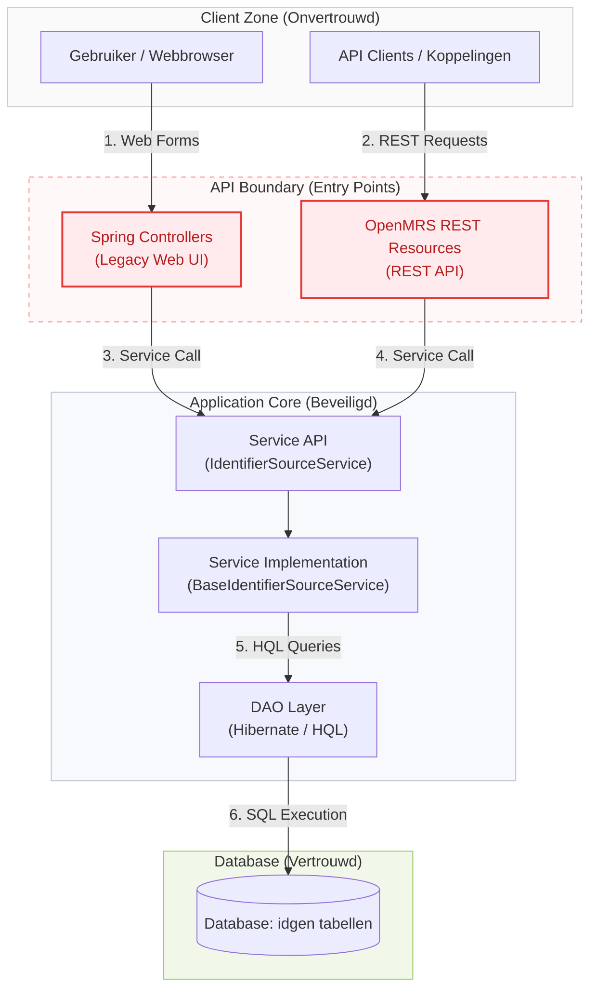

# Attack Surface Mapping: openmrs-module-idgen

**Module:** ID Generation (idgen)
**Status:** Definitief (Groep 6)
**Normering:** NEN-7510:2026 / ISO 27001:2022
**Maatregel:** A.8.25 (Beveiligen tijdens de ontwikkelcyclus)

---

## 1. Inleiding en Scope

Dit document beschrijft de **Attack Surface Mapping** van de `openmrs-module-idgen` (ID Generation) module, uitgevoerd volgens de richtlijnen van **NEN-7510:2026 beheersmaatregel A.8.25 (Beveiligen tijdens de ontwikkelcyclus)**. Het doel hiervan is het systematisch identificeren van alle HTTP-endpoints, data-invoerbronnen, vertrouwensgrenzen en beveiligingsrisico's (gaps) binnen de module om de integriteit en vertrouwelijkheid van patiëntidentificatiegegevens in de zorgketen te garanderen.

De module beheert patiëntidentificatiemethoden (zoals lokale sequentiële generatoren, pool-gebaseerde id-lijsten en externe REST/HTTP ID-generatoren). Vanwege de directe koppeling met patiëntendossiers (EPD/OpenMRS) is deze module geclassificeerd als een **hoog-risico component** onder NEN-7510.

---

## 2. Vertrouwensmodel & Systeemgrenzen (Trust Model)

Hieronder is het vertrouwensmodel weergegeven. De grenzen tonen de overgang van onvertrouwde netwerklagen naar de beveiligde applicatiekern en database. Hoge-risico entry points zijn expliciet gemarkeerd.



### Hoge-Risico Entry Points (Gemarkeerd in Rood):

1. **Spring Controllers (Web UI):** Vangen legacy formulierverzoeken af. Verschillende GET-endpoints voeren state-wijzigingen uit (zoals deleten en purgen), wat vatbaar is voor CSRF (Cross-Site Request Forgery).
2. **REST Resources:** Bieden programmatische toegang tot het genereren van patiënt-ID's en het beheren van configuraties. Onvoldoende inputvalidatie op dit niveau kan leiden tot Denial of Service (DoS) of resource-uitputting.

---

## 3. Externe Inputs Register

De module verwerkt de volgende externe inputs die als potentieel onveilig moeten worden beschouwd:

| Type Input                       | Naam Parameter / Veld       | Formaat / Verwacht Type | Doel                                                               | Risico / Validatiemechanisme                                                                       |
| :------------------------------- | :-------------------------- | :---------------------- | :----------------------------------------------------------------- | :------------------------------------------------------------------------------------------------- |
| **HTTP Request Param**     | `sourceType`              | String (Class name)     | Dynamische klasse-instantiatie bij het aanmaken van een generator. | **Zeer Hoog**: Kan leiden tot Arbitrary Class Instantiation indien niet strikt gewhitelist.. |
| **HTTP Request Param**     | `skipValidation`          | Boolean                 | Bypass voor de validator-keten bij opslaan.                        | **Zeer Hoog**: Staat gebruikers toe om invoerchecks volledig te omzeilen.                    |
| **HTTP Request Param**     | `username` / `password` | String                  | Authenticatie-overrides bij ID-export.                             | **Hoog**: Inloggegevens worden als query-parameters meegezonden en gelogd.                   |
| **HTTP Request Param**     | `sourceName`              | String                  | Vrij tekstveld voor zoeken naar bronnen.                           | **Hoog**: Wordt direct in HQL-query samengevoegd (HQL Injectie).                             |
| **Multi-part File Upload** | `inputFile`               | JSON of Plain Text      | Batch ID's importeren in een pool of reserveringslijst.            | **Medium**: Bestandsgrootte-uitputting, ontbreken van formaatcontrole op ID-strings.         |
| **JSON Payload (REST)**    | `comment`                 | String                  | Metadata voor de gegenereerde batch ID's.                          | **Laag**: XSS-risico indien ontsmetting in de UI ontbreekt.                                  |

---

## 4. Endpoint Inventory & Security Mapping

Hieronder worden alle endpoints in kaart gebracht, inclusief HTTP-methode, vereiste privileges, inputvalidatiestatus, autorisatiecontroles en bijbehorende gaps.

### 4.1. Legacy Web UI Controllers (`/module/idgen/`)

| Pad (endpoint)                                                      | Methode  | Vereist Privilege                  | Inputvalidatie                        | Autorisatiecontrole                                       | Gaps & NEN-7510 Impact                                                                                           |
| :--------------------------------------------------------------------------------------------- | :------- | :--------------------------------- | :------------------------------------ | :-------------------------------------------------------- | :--------------------------------------------------------------------------------------------------------------- |
| `/module/idgen/editAutoGenerationOption.form`                                                | GET/POST | Geen (isAuthenticated)             | Geen                                  | Controller-level check:`Context.isAuthenticated()`      | **Gap 1**: Geen fijnmazig privilege vereist.                                                               |
| `/module/idgen/manageAutoGenerationOptions.form`                                             | GET/POST | Geen (isAuthenticated)             | Geen                                  | Controller-level check:`Context.isAuthenticated()`      | **Gap 1**: Geen fijnmazig privilege vereist.                                                               |
| `/module/idgen/saveAutoGenerationOption.form`                                                | GET/POST | `Manage Auto Generation Options` | **Geen**                        | Enkel via service-layer interceptor (`@Authorized`)     | **Gap 2**: Geen invoervalidatie (TODO in code).                                                            |
| `/module/idgen/deleteAutoGenerationOption.form`                                              | GET/POST | `Manage Auto Generation Options` | Geen                                  | Enkel via service-layer interceptor                       | **Gap 3**: Staatwijziging via HTTP GET (CSRF-gevoelig).                                                    |
| `/module/idgen/editIdentifierSource.form`                                                    | GET/POST | Geen (isAuthenticated)             | Geen                                  | Controller-level check:`Context.isAuthenticated()`      | **Gap 4**: Dynamische klasse-instantiatie via `sourceType` parameter zonder whitelist.                   |
| `/module/idgen/manageIdentifierSources.form`                                                 | GET/POST | Geen (isAuthenticated)             | Geen                                  | Controller-level check:`Context.isAuthenticated()`      | **Gap 1**: Geen fijnmazig privilege vereist.                                                               |
| `/module/idgen/deleteIdentifierSource.form`                                                  | GET/POST | `Manage Identifier Sources`      | Geen                                  | Enkel via service-layer interceptor                       | **Gap 3**: Staatwijziging via HTTP GET (CSRF-gevoelig).                                                    |
| `/module/idgen/saveIdentifierSource.form`                                                    | GET/POST | `Manage Identifier Sources`      | Conditioneel via `Validator` klasse | Enkel via service-layer interceptor                       | **Gap 5**: Invoercontrole omzeilbaar met `skipValidation=true`.                                          |
| `/module/idgen/viewIdentifierSource.form`                                                    | GET/POST | Geen                               | Geen                                  | Geen check op controller-level                            | **Gap 1**: Iedereen kan configuratie inzien.                                                               |
| `/module/idgen/generateIdentifier.form`                                                      | GET/POST | `Edit Patient Identifiers`       | Geen                                  | Enkel via service-layer interceptor                       | Roept export functionaliteit aan.                                                                                |
| `/module/idgen/exportIdentifiers.form`                                                       | GET/POST | `Generate Batch of Identifiers`  | Geen                                  | Service-layer interceptor en in-line basic authentication | **Gap 6**: Credentials in query-parameters. **Gap 10**: Risico op DoS door onbegrensde batchgrootte. |
| `/module/idgen/addIdentifiersFromFile.form`                                                  | GET/POST | `Upload Batch of Identifiers`    | Jackson parser structuurcontrole      | Enkel via service-layer interceptor                       | **Gap 7**: Geen syntactische controle op geïmporteerde ID's.                                              |
| `/module/idgen/addIdentifiersFromSource.form`                                                | GET/POST | `Upload Batch of Identifiers`    | Geen                                  | Enkel via service-layer interceptor                       | **Gap 10**: Risico op DoS door onbegrensde batchgrootte.                                                   |
| `/module/idgen/reserveIdentifiersFromFile.form`                                              | GET/POST | `Manage Identifier Sources`      | Geen                                  | Enkel via service-layer interceptor (indirect)            | **Gap 7**: Geen syntactische controle op gereserveerde ID's.                                               |
| `/module/idgen/exportReservedIdentifiers.form`                                               | GET/POST | **Geen**                     | Geen                                  | **Geen**                                            | **Gap 8**: Geen enkele autorisatiecontrole op exporteren van gereserveerde ID's.                           |
| `/module/idgen/editPatientIdentifiers.form`                                                  | GET/POST | Geen                               | Geen                                  | Geen                                                      | **Gap 1**: Ontbreken van authenticatie/autorisatie checks.                                                 |
| `/module/idgen/viewLogEntries.form`                                                          | GET/POST | Geen (isAuthenticated)             | Geen                                  | Controller-level check:`Context.isAuthenticated()`      | **Gap 1**: Logs inzien zonder audit-privilege.                                                             |

---

### 4.2. REST Web Services API (`/rest/v1/idgen/`)

| Pad (Endpoint)                                | HTTP-methode | Vereist Privilege                  | Inputvalidatie                     | Autorisatiecontrole                 | Gaps & NEN-7510 Impact                                   |
| :-------------------------------------------- | :----------- | :--------------------------------- | :--------------------------------- | :---------------------------------- | :------------------------------------------------------- |
| `/autogenerationoption`                     | GET          | Geen                               | Geen                               | Geen                                | Lijst alle opties op.                                    |
| `/autogenerationoption/{uuid}`              | GET          | Geen                               | Geen                               | Geen                                | Haalt specifieke optie op.                               |
| `/autogenerationoption`                     | POST         | `Manage Auto Generation Options` | Handmatige check in resource       | Enkel via service-layer interceptor | Werpt `ValidationException` bij missende invoer.       |
| `/autogenerationoption/{uuid}`              | PUT/POST     | `Manage Auto Generation Options` | Handmatige check in resource       | Enkel via service-layer interceptor | Werpt uitzondering bij lege update.                      |
| `/autogenerationoption/{uuid}`              | DELETE       | `Manage Auto Generation Options` | Geen                               | Enkel via service-layer interceptor | Alleen purge ondersteund.                                |
| `/identifiersource`                         | GET          | Geen                               | Geen                               | Geen                                | Lijst alle bronnen op.                                   |
| `/identifiersource/{uuid}`                  | GET          | Geen                               | Geen                               | Geen                                | Haalt specifieke bron op.                                |
| `/identifiersource`                         | POST         | `Manage Identifier Sources`      | Type-specifieke checks in resource | Enkel via service-layer interceptor | **Gap 9**: ID-generatie gekoppeld aan broncreatie. |
| `/identifiersource/{uuid}`                  | PUT/POST     | `Manage Identifier Sources`      | Type-specifieke checks in resource | Enkel via service-layer interceptor | Pools uploaden via update-route.                         |
| `/identifiersource/{uuid}`                  | DELETE       | `Manage Identifier Sources`      | Geen                               | Enkel via service-layer interceptor | Ondersteunt retire en purge.                             |
| `/identifiersource/{parentUuid}/identifier` | POST         | `Edit Patient Identifiers`       | Geen                               | Enkel via service-layer interceptor | Genereert identifier uit bron.                           |
| `/logentry`                                 | GET          | Geen                               | Geen                               | Geen                                | **Gap 1**: Geen rollencontrole op log-inzage.      |
| `/nextIdentifier`                           | GET          | `Edit Patient Identifiers`       | Geen                               | Enkel via service-layer interceptor | **Gap 11**: State-changing GET verzoek.            |

---

### 4.3. Service-laag API's (Interne logica)

Hoewel de service-laag geen directe HTTP-endpoints blootstelt, vormt deze de kern van de module en kan deze door andere modules of interne mechanismen worden aangeroepen. Kwetsbaarheden hier beïnvloeden de totale attack surface indirect.

| Klasse & Methode | Type Actie | Vereist Privilege | Inputvalidatie | Autorisatiecontrole | Gaps & NEN-7510 Impact |
| :--- | :--- | :--- | :--- | :--- | :--- |
| `BaseIdentifierSourceService.searchIdentifierSources(sourceName)` | Interne HQL Zoekopdracht | `@Authorized` (Overgeërfd) | **Geen** | Geen fijnmazige controle | **Gap 12**: Kritieke HQL-injectie via ongezuiverde invoerconcatenatie. |

---

## 5. Beveiligingsanalyse (Gaps) & NEN-7510 8.25 Mapping

De geïdentificeerde kwetsbaarheden binnen de module worden hieronder gekoppeld aan de eisen van **NEN-7510 8.25 (Beveiligen tijdens de ontwikkelcyclus)**, met bijbehorende risicobeoordeling en mitigerende maatregelen.

### Gap 1: Ontbreken van fijnmazige privilegecontrole op controller-niveau

- **Beschrijving**: Verschillende endpoints in de controllers en REST resources (zoals `/editAutoGenerationOption.form`, `/viewLogEntries.form` en `/logentry`) controleren enkel of de gebruiker geauthenticeerd is via `Context.isAuthenticated()`. Er wordt geen fijnmazig privilege gecontroleerd (bijv. `Manage Auto Generation Options` of een specifiek audit-privilege), waardoor ongeautoriseerde ingelogde gebruikers configuraties en audit logs kunnen inzien.
- **Risico-classificatie**: **Medium**
- **NEN-7510 8.25 Koppeling**: Autorisatiecontroles moeten consistent en volgens het *Least Privilege* principe op alle ingangen van de applicatie worden afgedwongen.
- **Aanbevolen Remediatie**: Voeg expliciete privilegecontroles (`@Authorized`) toe aan alle controller-endpoints.

---

### Gap 2: Ontbreken van invoervalidatie bij opslaan van autogeneratie-opties

- **Beschrijving**: In `AutoGenerationOptionController.java` bevat `/saveAutoGenerationOption.form` de commentaar `// TODO: Implement validation here`. Er vindt geen enkele invoervalidatie plaats op het binnengekomen `AutoGenerationOption` model, wat kan leiden tot corrupte database-states en onverwacht applicatiegedrag.
- **Risico-classificatie**: **Hoog**
- **NEN-7510 8.25 Koppeling**: Alle externe data die de applicatie binnenkomen moeten syntactisch en semantisch worden gevalideerd om invoervervuiling te voorkomen.
- **Aanbevolen Remediatie**: Implementeer een specifieke validator-klasse en roep deze aan bij het opslaan van opties.

---

### Gap 3: State-wijziging via HTTP GET (CSRF-gevoeligheid)

- **Beschrijving**: Endpoints zoals `/deleteAutoGenerationOption.form` en `/deleteIdentifierSource.form` reageren op HTTP GET-verzoeken om objecten te verwijderen of te wijzigen in de database. Dit stelt aanvallers in staat om via Cross-Site Request Forgery (CSRF) ongewenste mutaties uit te voeren.
- **Risico-classificatie**: **Medium**
- **NEN-7510 8.25 Koppeling**: Wijzigingen in de systeemstatus moeten uitsluitend via stateful HTTP-methoden (POST/PUT/DELETE) worden uitgevoerd en zijn voorzien van unieke CSRF-tokens.
- **Aanbevolen Remediatie**: Dwing het gebruik van POST af op deze endpoints en implementeer anti-CSRF tokens.

---

### Gap 4: Dynamische klasse-instantiatie zonder whitelist

- **Beschrijving**: In `editIdentifierSource.form` wordt de klasse van een nieuwe identificatiebron dynamisch geladen en geïnstantieerd op basis van de door de gebruiker geleverde `sourceType` parameter:
  ```java
  Class<?> idSourceType = Context.loadClass(sourceType);
  source = (IdentifierSource)idSourceType.newInstance();
  ```

  Zonder whitelist stelt dit een aanvaller in staat om willekeurige klassen op het classpath te triggeren om te laden.
- **Risico-classificatie**: **Hoog**
- **NEN-7510 8.25 Koppeling**: Veilige systeemontwerpen vereisen dat reflectie en dynamische instantiatie strikt worden beperkt via een whitelist van geautoriseerde typen.
- **Aanbevolen Remediatie**: Valideer `sourceType` tegen een harde whitelist alvorens deze te laden via de ClassLoader.

---

### Gap 5: Validatie-bypass via client-gestuurde parameter (`skipValidation`)

- **Beschrijving**: Binnen `/saveIdentifierSource.form` staat de parameter `skipValidation=true` de client toe om de validator-keten volledig te passeren bij het opslaan van een identificatiebron.
- **Risico-classificatie**: **Hoog**
- **NEN-7510 8.25 Koppeling**: Invoercontroles moeten consistent en onomzeilbaar aan de serverzijde worden afgedwongen. Het toestaan van een bypass-parameter via de client schendt het principe van *Defense in Depth*.
- **Aanbevolen Remediatie**: Verwijder de parameter `skipValidation` volledig uit de controller en dwing validatie altijd af bij mutaties.

---

### Gap 6: Credentials in Query-parameters

- **Beschrijving**: Het endpoint `/module/idgen/exportIdentifiers.form` accepteert credentials (`username` en `password`) direct als URL-queryparameters om batch-exports te autoriseren. URL's worden gelogd door webservers, proxies en browsergeschiedenis, wat leidt tot credential leakage.
- **Risico-classificatie**: **Hoog**
- **NEN-7510 8.25 Koppeling**: Gevoelige gegevens zoals wachtwoorden mogen nooit via de URL worden getransporteerd.
- **Aanbevolen Remediatie**: Gebruik de standaard OpenMRS API authenticatie-headers en verwijder de parameters `username` en `password` uit de request mapping.

---

### Gap 7: Ontbreken van formaatcontrole op geïmporteerde ID's

- **Beschrijving**: De endpoints `/addIdentifiersFromFile.form` en `/reserveIdentifiersFromFile.form` lezen bestanden in en voegen ID's toe zonder controle of deze voldoen aan het vereiste formaat of de ingestelde lengte- en karakterbeperkingen van de bron.
- **Risico-classificatie**: **Medium**
- **NEN-7510 8.25 Koppeling**: Gegevensintegriteit moet bij invoer worden gewaarborgd door syntactische checks.
- **Aanbevolen Remediatie**: Valideer elke geïmporteerde identifier tegen de reguliere expressie (regex) en karaktersetbeperkingen van de doelbron.

---

### Gap 8: Ontbrekende autorisatiecontrole op Export Reserved Identifiers

- **Beschrijving**: `/module/idgen/exportReservedIdentifiers.form` controleert op geen enkele wijze of de gebruiker het privilege `Manage Identifier Sources` bezit. Elke ingelogde gebruiker kan alle gereserveerde patiënten-ID's downloaden.
- **Risico-classificatie**: **Hoog**
- **NEN-7510 8.25 Koppeling**: Toegang tot gevoelige systeemdata moet expliciet worden gecontroleerd op basis van het principe van minimale privileges (*Least Privilege*).
- **Aanbevolen Remediatie**: Voeg `@Authorized(IdgenConstants.PRIV_MANAGE_IDENTIFIER_SOURCES)` toe aan dit endpoint.

---

### Gap 9: REST API: Koppeling van ID-generatie aan broncreatie

- **Beschrijving**: In `IdentifierSourceResource.java` staat het POST endpoint `/identifiersource` toe om tegelijkertijd een bron aan te maken en identifiers te genereren via de parameter `generateIdentifiers`. Dit schendt de scheiding van taken (creatie vs. operatie).
- **Risico-classificatie**: **Medium**
- **NEN-7510 8.25 Koppeling**: API-ontwerpen moeten voorspelbaar, modulair en beveiligd zijn per type actie.
- **Aanbevolen Remediatie**: Scheid broncreatie (POST op `/identifiersource`) strikt van identifier-generatie (POST op `/identifiersource/{uuid}/identifier`).

---

### Gap 10: Risico op Denial of Service (DoS) door onbegrensde batch-groottes

- **Beschrijving**: Bij bulk-operaties zoals `/exportIdentifiers.form` en `/addIdentifiersFromSource.form` kan de parameter `numberToGenerate` of `batchSize` willekeurig groot worden opgegeven door de client, wat leidt tot geheugenuitputting (Out of Memory) en database-overbelasting.
- **Risico-classificatie**: **Medium**
- **NEN-7510 8.25 Koppeling**: Systemen moeten veerkrachtig zijn en beschermd tegen DoS-aanvallen of overmatige resource-consumptie.
- **Aanbevolen Remediatie**: Introduceer een harde limiet (bijv. maximaal 10.000 ID's per batch) aan de serverzijde.

---

### Gap 11: REST API: State-changing GET verzoeken (`/nextIdentifier`)

- **Beschrijving**: Het GET endpoint `/rest/v1/idgen/nextIdentifier` genereert bij aanroep een nieuwe identifier en schrijft een logregel naar de database. Dit schendt het basisprincipe van HTTP GET (veiligheid en idempotentie), wat misbruikt kan worden voor ID-uitputting door web crawlers of browser-prefetching.
- **Risico-classificatie**: **Medium**
- **NEN-7510 8.25 Koppeling**: HTTP-methoden moeten correct en veilig worden toegepast conform hun RFC-specificaties.
- **Aanbevolen Remediatie**: Wijzig de HTTP-methode van dit endpoint naar POST.

---

### Gap 12: HQL Injectie via `searchIdentifierSources`

- **Beschrijving**: In `BaseIdentifierSourceService.java` (regel 487-491) wordt de parameter `sourceName` direct in een HQL query-string geconcateneerd, wat SQL/HQL-injectie mogelijk maakt:
  ```java
  String hql = "from IdentifierSource where name like '%" + sourceName + "%' and retired = false";
  return dao.executeHqlQuery(hql);
  ```
- **Risico-classificatie**: **Kritiek**
- **NEN-7510 8.25 Koppeling**: Invoergegevens moeten altijd via geparametriseerde queries (prepared statements) worden verwerkt om SQL-injecties te voorkomen.
- **Aanbevolen Remediatie**: Herschrijf de query naar een geparametriseerde query: `where name like :name` en bind de parameter aan de sessie.

---

## 6. Conclusie en Aanbevelingen

De `openmrs-module-idgen` module bevat diverse fundamentele beveiligingskwetsbaarheden die in strijd zijn met de **NEN-7510 8.25** norm voor veilige softwareontwikkeling. Met name de aanwezigheid van een **HQL-injectie** (Gap 12) in de service-laag en het bewust kunnen omzeilen van invoervalidatie via de client (Gap 5) vormen acute risico's voor de integriteit van de zorgapplicatie.

### Actiepunten voor het Ontwikkelteam:

1. **Sanitatie**: Implementeer onmiddellijk geparametriseerde query's voor alle database-interacties om HQL-injectie (Gap 12) uit te sluiten.
2. **Hardening**: Verwijder bypass-mechanismen (Gap 5) en dwing fijnmazige autorisatie af op alle controllers (Gap 1, Gap 8).
3. **Transport Security**: Ban inloggegevens uit URL-parameters (Gap 6) en dwing veilige HTTP-methoden af voor destructieve of state-changing acties (Gap 3, Gap 11).
