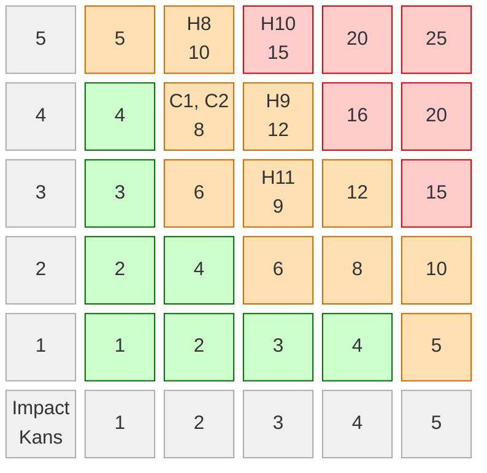
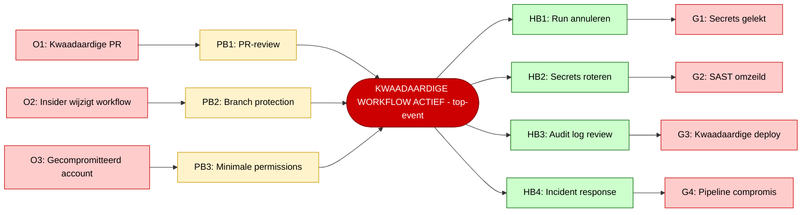

# Risico evaluatie CI/CD pipeline

**Groep: C6**

| Naam: | Nummer: |
|---|---|
| Raf van Hooijdonk | 2230382 |
| Rowen Albers | 2227982 |
| Simon Eulenpesch | 2226731 |
| Sinan Sagir | 2235816 |

---

## Bronnen

- [NEN-7510:2026 (informatiebeveiliging in de zorg)](https://www.nen.nl/nen-7510)
- [OWASP Top 10 CI/CD Security Risks (CICD-SEC)](https://owasp.org/www-project-top-10-ci-cd-security-risks/)
- [OWASP Top 10 (2021)](https://owasp.org/Top10/)
- [CWE-506: Embedded Malicious Code](https://cwe.mitre.org/data/definitions/506.html)
- [CWE-532: Insertion of Sensitive Information into Log File](https://cwe.mitre.org/data/definitions/532.html)
- [CWE-829: Inclusion of Functionality from Untrusted Control Sphere](https://cwe.mitre.org/data/definitions/829.html)
- [CWE-1035: OWASP Top Ten 2017 Category A9: Using Components with Known Vulnerabilities](https://cwe.mitre.org/data/definitions/1035.html)
- [GitHub Actions: Security hardening](https://docs.github.com/en/actions/security-guides/security-hardening-for-github-actions)
- [NCSC Cybersecuritybeeld Nederland (CSBN) 2024](https://www.ncsc.nl/actueel/nieuws/2024/juni/18/cybersecuritybeeld-nederland-2024)
- [Verizon Data Breach Investigations Report (DBIR) 2024](https://www.verizon.com/business/resources/reports/dbir/)
- [Groep_6_Asset-Identificatie.md](Groep_6_Asset-Identificatie.md) (hazard-definities H8-H11, scoreschaal en risk appetite)
- [Groep_6_Bow-Tie.md](Groep_6_Bow-Tie.md) (bow-tie analyse H10)

---

## 1. Scope

Dit document bevat de risico evaluatie voor de CI/CD pipeline van het OpenMRS module project, gebaseerd op de pipeline-inrichting uit Opdracht 1.

Binnen scope:
- GitHub Actions workflows: `ci.yml`, `codeql.yml`, `dependency-review.yml`, `sbom.yml`
- GitHub Environments: production (1 protection rule, 1 secret), test (1 secret)
- Secrets en toegangscontrole in de pipeline
- Dependencies beheerd via Maven en Dependabot

Buiten scope: de OpenMRS module zelf (assets A1-A3, A7-A8 uit de asset-identificatie), de OpenMRS core en de databaseserver.

---

## 2. Methodiek

De risico-identificatie is gebaseerd op:
1. Hazards H8-H11 uit `Groep_6_Asset-Identificatie.md` die direct betrekking hebben op de CI/CD pipeline (assets A5 en A6).
2. Aanvullende CI/CD-specifieke risico's op basis van de OWASP Top 10 CI/CD Security Risks en de concrete pipeline-inrichting uit Opdracht 1.

Scores (kans x impact) volgen de schalen en grenswaarden uit `Groep_6_Asset-Identificatie.md` sectie 3:
- Groen (1-4): acceptabel, jaarlijkse herbeoordeling
- Oranje (5-12): mitigatie verplicht binnen 3 maanden
- Rood (13-25): onmiddellijke actie verplicht

De bow-tie analyse voor het hoogste CI/CD-specifieke risico (H8: Workflow poisoning) staat in sectie 6.

---

## 3. Pipeline overzicht

De CI/CD pipeline bestaat uit de volgende componenten (Opdracht 1):

| Component | Bestand of instelling | Functie |
|---|---|---|
| Build en test | ci.yml | Maven build en JUnit-tests op elke push en PR |
| SAST | codeql.yml | CodeQL statische analyse op Java-code |
| Dependency check | dependency-review.yml | Blokkeert HIGH/CRITICAL dependencies bij PRs naar main |
| SBOM-generatie | sbom.yml | CycloneDX JSON-artifact bij elke push naar main |
| Environments | Settings: Environments | production (1 protection rule) en test (1 secret) |
| Branch protection | Settings: Branches | main-branch protection (geconfigureerd, niet afdwingbaar op Free plan) |

---

## 4. Risico-identificatie

### 4.1 Risicotabel

| Risk ID | Risico | Asset | STRIDE | CWE of OWASP | Kans | Impact | Score | Kleur |
|---|---|---|---|---|---|---|---|---|
| H10 | Hardcoded secret in broncode | A6: Secrets | I, S | CWE-321, CICD-SEC-6 | 3 | 5 | 15 | Rood |
| H9 | Secrets exfiltratie via workflow-logs | A5: CI/CD, A6: Secrets | I | CWE-532, CICD-SEC-6 | 3 | 4 | 12 | Oranje |
| H8 | Workflow poisoning via kwaadaardige PR | A5: CI/CD | T, E | CWE-506, CICD-SEC-4 | 2 | 5 | 10 | Oranje |
| H11 | Kwetsbare dependency niet gesignaleerd | A7: SBOM | I | CWE-1035, A06:2021 | 3 | 3 | 9 | Oranje |
| C1 | Onveilige third-party Actions (geen SHA-pinning) | A5: CI/CD | T, E | CWE-829, CICD-SEC-3 | 2 | 4 | 8 | Oranje |
| C2 | Ontbrekende approval gate productie-deployment | A5: CI/CD | E | NEN-7510 Ctrl 8.9 | 2 | 4 | 8 | Oranje |

Kans- en impactonderbouwing per risico staat in sectie 4.2.

### 4.2 Toelichting per risico

**H10: Hardcoded secret in broncode (score 15, rood)**

Een developer commit per ongeluk een wachtwoord, API-sleutel of deployment token naar de repository. Zonder GitHub Secret Scanning (niet beschikbaar op Free plan) blijft dit ongedetecteerd tot iemand het handmatig ontdekt. Het secret blijft permanent aanwezig in de git history, ook na verwijdering van de commit.

Kans: 3. DBIR 2024 registreert dat 68% van datalekken een menselijk element heeft. Hardcoded credentials staan consistent in de OWASP CI/CD Security Risks top 6.

Impact: 5. Directe toegang tot productiedatabase en patiëntdata. AVG Art. 33 meldplicht actief. Zie `Groep_6_Bow-Tie.md` voor de volledige analyse.

**H9: Secrets exfiltratie via workflow-logs (score 12, oranje)**

Een developer voegt een debug-stap toe aan een workflow die een secret naar de logs schrijft (bv. via `echo`, `env`, of een foutmelding die de waarde bevat). GitHub maskeert geregistreerde secrets automatisch, maar deze masking kan worden omzeild door encoding of splitsing van de waarde.

Kans: 3. Menselijke fout is frequent; debug-stappen worden vergeten te verwijderen. DBIR 2024: menselijk element in meerderheid van lekken.

Impact: 4. Secret zichtbaar in workflow-logs voor iedereen met leestoegang tot de repository. Directe credential exposure.

**H8: Workflow poisoning via kwaadaardige PR (score 10, oranje)**

Een aanvaller of kwaadaardige insider opent een PR met een aangepaste workflow-YAML die SAST-checks omzeilt, secrets naar een externe server stuurt, of kwaadaardige code injecteert in het build-artifact. Dit is OWASP CICD-SEC-4 (Poisoned Pipeline Execution).

Kans: 2. Vereist write-toegang tot de repository via een fork of een gecompromitteerd account. PR-reviews zijn een barrière maar zijn niet volledig afdwingbaar op het Free plan.

Impact: 5. Pipeline volledig gecompromitteerd: secrets gelekt, SAST omzeild, kwaadaardige deployments naar productie mogelijk.

**H11: Kwetsbare dependency niet gesignaleerd (score 9, oranje)**

SBOM-generatie faalt of de CVE-koppeling ontbreekt voor een gebruikte versie, waardoor een exploitable library in productie blijft zonder patchadvies.

Kans: 3. De SBOM draait momenteel op een stub pom.xml met minimale dependencies (tijdelijk compliant). Bij de echte module neemt het aantal dependencies en daarmee de kans op een gemiste CVE toe.

Impact: 3. Kwetsbare dependency in productie, maar exploiteerbaar alleen via een specifieke CVE. Impact afhankelijk van de ernst van de CVE.

**C1: Onveilige third-party Actions (geen SHA-pinning) (score 8, oranje)**

De huidige workflows verwijzen naar third-party actions via een versie-tag (bv. `actions/checkout@v4`). Als de tag door de publisher wordt overschreven met kwaadaardige code, wordt die automatisch uitgevoerd in de pipeline-context met toegang tot secrets. Dit is OWASP CICD-SEC-3.

Kans: 2. Vereist compromittering van de action-publisher. Zeldzaam maar met hoge impact: XZ Utils (CVE-2024-3094) en Log4Shell (CVE-2021-44228) toonden aan dat supply chain aanvallen reeel zijn.

Impact: 4. Kwaadaardige code uitgevoerd in de pipeline, toegang tot GitHub-secrets mogelijk.

**C2: Ontbrekende approval gate voor productie-deployment (score 8, oranje)**

De production environment heeft 1 protection rule, maar branch protection op main is niet volledig afdwingbaar op GitHub Free. Een repo-eigenaar kan direct naar main pushen en een deployment naar productie triggeren zonder review. Dit is een structurele beperking van het Free plan, gedocumenteerd in checklist eis #1.

Kans: 2. Vereist repo-ownership of een gecompromitteerd admin-account.

Impact: 4. Ongeteste of kwaadaardige code bereikt productie zonder controle.

---

## 5. Risicomatrix (visueel)

De matrix toont impact (verticaal, 1-5) versus kans (horizontaal, 1-5). Kleuren conform grenswaarden in `Groep_6_Asset-Identificatie.md` sectie 3.4.

| Kleur | Score | Actie |
|---|---|---|
| Groen | 1-4 | Acceptabel, jaarlijkse herbeoordeling |
| Oranje | 5-12 | Mitigatie verplicht binnen 3 maanden |
| Rood | 13-25 | Onmiddellijke actie verplicht |

Geen enkel CI/CD-risico scoort groen. H10 is het enige rode risico (score 15).

---

## 6. Prioritering

| Prioriteit | Risk ID | Score | Verplichte actie |
|---|---|---|---|
| 1 | H10 | 15 (Rood) | Onmiddellijke actie. Pre-commit hook (detect-secrets) configureren. Secret Scanning upgraden zodra plan het toelaat. Zie Groep_6_Bow-Tie.md. |
| 2 | H9 | 12 (Oranje) | Mitigatie binnen 3 maanden. Expliciete `permissions: read-all` als default in alle workflows. Geen secrets in `echo`-statements. |
| 3 | H8 | 10 (Oranje) | Mitigatie binnen 3 maanden. SHA-pinning voor alle third-party actions. Expliciete permissions per workflow-job. Bow-tie uitgewerkt in sectie 7. |
| 4 | H11 | 9 (Oranje) | Mitigatie bij toevoeging echte module. SBOM-analyse volledig activeren (Opdracht 4). Momenteel tijdelijk compliant vanwege stub pom.xml. |
| 5 | C1 | 8 (Oranje) | Mitigatie binnen 3 maanden. SHA-pinning is een eenvoudige directe fix. |
| 6 | C2 | 8 (Oranje) | Structurele beperking Free plan. GitHub Team plan overwegen voor volledige branch protection. |

---

## 7. Bow-tie analyse: H8 Workflow poisoning via kwaadaardige PR

H8 is geselecteerd voor de CI/CD-specifieke bow-tie omdat het de hoogste impact heeft (5) van alle CI/CD-risico's na H10, en omdat het een gerichte aanval op de pipeline-integriteit zelf betreft. H10 heeft een hogere totaalscore maar is een ontwikkelaarsfout; H8 is een opzettelijke aanval op de CI/CD-infrastructuur.

### 7.1 Hazard en top-event

| Veld | Waarde |
|---|---|
| Hazard ID | H8 |
| Hazard | Workflow poisoning via kwaadaardige PR |
| Asset | A5: CI/CD pipeline configuratie |
| STRIDE | T (Tampering), E (Elevation of Privilege) |
| CWE | CWE-506 (Embedded Malicious Code) |
| OWASP | CICD-SEC-4 (Poisoned Pipeline Execution) |
| NEN-7510 | Ctrl 8.8, 8.9, 8.15, 6.8 |
| Risicoscore | 10 (Oranje) |

**Top-event:** Een kwaadaardige workflow-YAML wordt uitgevoerd in de pipeline-context met toegang tot secrets en deployment-rechten.

### 7.2 Bow-tie diagram

### 7.3 Oorzaken

| ID | Oorzaak | Threat Actor | Toelichting |
|---|---|---|---|
| O1 | Aanvaller opent een PR met kwaadaardige workflow-YAML | TA1 (externe aanvaller) | Workflow-bestanden in `.github/workflows/` zijn aanpasbaar via een PR van iedereen met fork-rechten. |
| O2 | Insider past een bestaande workflow aan | TA2 (insider met kwade opzet) | Medewerker met repo-toegang voegt een debug-stap toe die secrets logt of exfiltreert naar een externe URL. |
| O3 | Gecompromitteerd teamlid-account gebruikt voor commit | TA1 | Gestolen credentials (bv. via phishing) geven aanvaller toegang om een kwaadaardige workflow te committen. |

### 7.4 Preventieve barrières

| ID | Barrière | Werking | NEN-7510 | Huidig actief? |
|---|---|---|---|---|
| PB1 | Verplichte PR-review voor wijzigingen in `.github/workflows/` | Tweede persoon controleert workflow-wijzigingen voor merge. | Ctrl 5.36 | Geconfigureerd maar niet volledig afdwingbaar (Free plan) |
| PB2 | Branch protection op main | Verhindert directe pushes naar main zonder PR. | Ctrl 8.9 | Geconfigureerd maar niet volledig afdwingbaar (Free plan) |
| PB3 | Minimale GITHUB_TOKEN permissies per workflow-job | Beperkt wat een kwaadaardige workflow kan doen. Een workflow zonder expliciete `permissions` erft brede write-rechten op de repo. | Ctrl 8.9 | Niet geconfigureerd: geen expliciete permissions in huidige workflows |

### 7.5 Escalation factors (preventief)

| ID | Escalation factor | Betrokken barrière | Impact |
|---|---|---|---|
| EF1 | Branch protection niet volledig afdwingbaar op Free plan | PB1, PB2 | Repo-eigenaar kan PB1 en PB2 omzeilen door direct naar main te pushen. |
| EF2 | Geen expliciete workflow-permissions geconfigureerd | PB3 | GITHUB_TOKEN heeft standaard write-rechten op repo-inhoud. Een kwaadaardige workflow kan daarmee code aanpassen, artifacts overschrijven, of secrets inzien. |
| EF3 | Third-party actions niet SHA-gepind (risico C1) | PB1 | Een kwaadaardige versie van een third-party action heeft dezelfde rechten als de workflow zelf. PR-review controleert de action-inhoud niet. |

### 7.6 Gevolgen

| ID | Gevolg | Ernst | Toelichting |
|---|---|---|---|
| G1 | Secrets exfiltreert naar externe server | Kritiek | Workflow logt het GitHub secret of stuurt het via een HTTP-call naar een externe server. Deployment tokens en database-credentials zijn daarna gecompromitteerd. |
| G2 | SAST-checks omzeild, kwaadaardige code in build-artifact | Kritiek | Workflow verwijdert of omzeilt de CodeQL-stap. Een kwaadaardige binary bereikt productie zonder detectie. |
| G3 | Kwaadaardige deployment naar production environment | Kritiek | Via het deployment-token wordt een gemanipuleerde versie van de module gedeployed naar productie. Patiëntdata direct bereikbaar voor de aanvaller. |
| G4 | Volledige pipeline-compromittering | Hoog | Aanvaller heeft controle over de build- en deploymentinfrastructuur. Alle toekomstige builds zijn potentieel besmettelijk totdat de pipeline wordt hersteld. |

### 7.7 Herstelbarrières

| ID | Barrière | Werking | NEN-7510 | Huidig actief? |
|---|---|---|---|---|
| HB1 | Workflow-run annuleren en kwaadaardige workflow verwijderen | Actieve run stoppen via GitHub Actions UI. Kwaadaardige workflow-commit revertten via een nieuwe PR. | Ctrl 8.8 | Handmatig mogelijk |
| HB2 | Alle secrets intrekken en roteren | Deployment tokens en database-credentials onmiddellijk intrekken in GitHub Environments en vervangen door nieuwe waarden. | Ctrl 8.24, 5.17 | Handmatig mogelijk via GitHub Settings |
| HB3 | Audit log review: GitHub Actions logs controleren | Bepalen welke stappen zijn uitgevoerd, of secrets zijn geleaked en of productie geraakt is. | Ctrl 8.15 | Actief: GitHub Actions logs beschikbaar (90 dagen retentie) |
| HB4 | Incident response: beoordelen of productie geraakt is | Deploymenthistorie controleren. Bij bevestiging: rollback naar vorige versie, AVG Art. 33 beoordelen als patiëntdata bereikbaar was. | Ctrl 6.8 | Procedure beschreven in SECURITY.md |

### 7.8 Escalation factors (correctief)

| ID | Escalation factor | Betrokken barrière | Impact |
|---|---|---|---|
| EF4 | 90 dagen log-retentie op Free plan | HB3 | Een laat ontdekt incident verliest zijn bewijsmateriaal. Forensisch onderzoek is dan niet meer mogelijk via GitHub Actions logs. |
| EF5 | Geen realtime alerting bij afwijkende workflow-activiteit | HB3, HB4 | GitHub notificeert niet automatisch bij verdachte workflow-uitvoering. Detectie is reactief en afhankelijk van handmatige controle. |
| EF6 | Geen automatische rollback geconfigureerd | HB4 | Herstel van een kwaadaardige productie-deployment vereist handmatige interventie en veroorzaakt downtime. |

---

## 8. NEN-7510:2026 control-koppeling (totaaloverzicht)

| Control | Omschrijving | Betrokken risico's |
|---|---|---|
| Ctrl 5.17 | Authenticatiegeheimen: beheer van wachtwoorden en tokens | H9, H10 |
| Ctrl 5.36 | Beveiligde ontwikkelprocessen | H8, C1 |
| Ctrl 6.8 | Rapportage van informatiebeveiligingsgebeurtenissen | H8, H10 |
| Ctrl 8.8 | Beheer van technische kwetsbaarheden | H8, H9, H10, H11, C1 |
| Ctrl 8.9 | Beheer van systeemconfiguratie en pipeline | H8, C2 |
| Ctrl 8.15 | Logging van informatiebeveiligingsgebeurtenissen | H8, H9 |
| Ctrl 8.24 | Gebruik van cryptografie en sleutelbeheer | H9, H10 |

---

## 9. Conclusie

Alle zes geidentificeerde CI/CD-risico's scoren oranje of rood. Er zijn geen groene risico's in de pipeline. De belangrijkste bevindingen:

1. H10 (hardcoded secret, rood) vereist onmiddellijke actie. De bow-tie staat in `Groep_6_Bow-Tie.md`.
2. H8 (workflow poisoning) heeft de hoogste impact van alle CI/CD-risico's. De kans is laag, maar het effect is catastrofaal. Mitigatie via expliciete workflow-permissions en SHA-pinning is relatief eenvoudig te implementeren.
3. H9 en C1 zijn snel te mitigeren via kleine wijzigingen in de workflow-YAML.
4. C2 is een structurele beperking van het GitHub Free plan en is niet oplosbaar zonder een plan-upgrade.

Het residuele risico na alle haalbare mitigaties: C2 blijft open. Dit is gedocumenteerd in `docs/checklist.md` eis #1.

---

## 10. Koppeling naar andere deliverables

| Deliverable | Koppeling |
|---|---|
| Groep_6_Asset-Identificatie.md | Hazards H8-H11 met scorering, onderbouwing en STRIDE-koppeling zijn hier vastgelegd |
| Groep_6_Bow-Tie.md | Bow-tie voor H10 (hardcoded secret) is het zusterdocument van deze risicomatrix |
| Opdracht 1: ci.yml, codeql.yml, sbom.yml | Pipeline-componenten die worden geëvalueerd in sectie 3 |
| Opdracht 4: Security backlog | H8, H9, H10, H11 leveren bevindingen in de security backlog met CWE en CVSS |
| Opdracht 6: Auditrapport | Risicomatrix en CI/CD bow-tie zijn bijlagen in het auditrapport (Deliverable 3, eis 7) |
