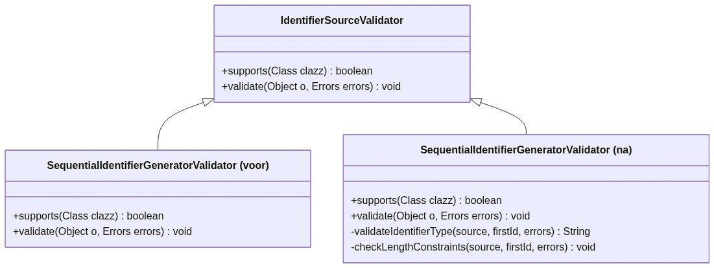
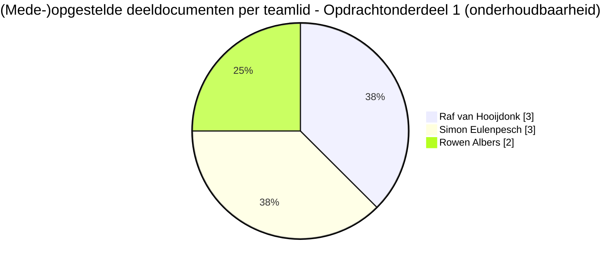

# Verbeteronderzoek Onderhoudbaarheid - OpenMRS `idgen`-module

## Opdrachtonderdeel 1 · LU2 Kwaliteit & Security · Definitieve oplevering

**Module:** ATIx IN-B2.4 Softwarearchitectuur & -kwaliteit 2025-26 P4
**Groep:** 6
**Onderzochte module:** OpenMRS ID Generation Module (`idgen`)
**Repository:** [AvansHogeschoolBreda/openmrsmodule](https://github.com/AvansHogeschoolBreda/openmrsmodule)
**Opleverdatum:** vrijdag 19 juni 2026
**Versie:** 1.1 (final)

| Naam              | Studentnummer |
| ----------------- | ------------- |
| Raf van Hooijdonk | 2230382       |
| Rowen Albers      | 2227982       |
| Simon Eulenpesch  | 2226731       |
| Sinan Sagir       | 2235816       |

---

> Dit document bundelt de volledige onderhoudbaarheids-documentatie van groep 6 tot één samenhangend
> opleverrapport. Elk *Deel* komt overeen met een oorspronkelijk brondocument; de inhoud is integraal
> opgenomen. Onderaan staan een geconsolideerde bronnenlijst, een uitgebreide en op commits herleidbare
> taakverdeling (met klikbare links naar GitHub) en een globale verantwoording van (AI-)tooling.

---

## Inhoudsopgave

1. [Deel 1 - Module-Keuze](#deel-1---module-keuze)
2. [Deel 2 - Non-Functional Requirements](#deel-2---non-functional-requirements-onderhoudbaarheid)
3. [Deel 3 - Analyse Onderhoudbaarheid](#deel-3---analyse-onderhoudbaarheid-openmrs-idgen-module)
4. [Deel 4 - Aangepast ontwerp en refactoring-onderbouwing](#deel-4---aangepast-ontwerp-en-refactoring-onderbouwing)
5. [Deel 5 - Testplan, testresultaten en validatie](#deel-5---testplan-testresultaten-en-validatie)
6. [Bijlage A - Geconsolideerde bronnen](#bijlage-a---geconsolideerde-bronnen)
7. [Bijlage B - Taakverdeling en commits (GitHub)](#bijlage-b---taakverdeling-en-commits-github)
8. [Bijlage C - Verantwoording (AI-)tooling](#bijlage-c---verantwoording-ai-tooling-globaal-overzicht)

---

## Leeswijzer en dekking van de rubric

**Kleurcodering (consistent in dit document):** 🔴 Kritiek/Rood, 🟠 Hoog/Oranje, 🟡 Gemiddeld/Middel, 🟢 Laag/Groen/Acceptabel.

**Sprintindeling (op datum, gebruikt bij "Sprint(s)" per Deel):** [Sprint 1](https://github.com/AvansHogeschoolBreda/openmrsmodule/blob/main/docs/sprints/sprint1.md) t/m 6 juni, [Sprint 2](https://github.com/AvansHogeschoolBreda/openmrsmodule/blob/main/docs/sprints/sprint2.md) van 7-11 juni, [Sprint 3](https://github.com/AvansHogeschoolBreda/openmrsmodule/blob/main/docs/sprints/sprint3.md) van 12-15 juni, [Sprint 4](https://github.com/AvansHogeschoolBreda/openmrsmodule/blob/main/docs/sprints/sprint4.md) vanaf 16 juni 2026.

De officiële rubric *Verbeteronderzoek Onderhoudbaarheid* kent zes criteria (samen 100 punten). Onderstaande
tabel maakt expliciet waar elk criterium in dit document wordt afgedekt, zodat de beoordeling één-op-één
herleidbaar is. Dit ondersteunt het predicaat **Goed** op elk criterium.

| Rubric-criterium (gewicht)                                 | Afgedekt in                      | Bewijs voor predicaat "Goed"                                                                                                                                                  |
| ---------------------------------------------------------- | -------------------------------- | ----------------------------------------------------------------------------------------------------------------------------------------------------------------------------- |
| **Analyse onderhoudbaarheid (20)**                   | Deel 2 (NFR's), Deel 3 (analyse) | Diepgaande, gestructureerde analyse langs ISO 25010, onderbouwd met SonarCloud- en JaCoCo-metrieken per bestand (complexiteit, duplicatie, coverage, code smells, koppeling). |
| **Testopzet en testresultaten (20)**                 | Deel 5 (testplan §1-7)          | Vijf onderscheiden testtypen, reproduceerbare commando's, Surefire-rapporten per klasse; nulmeting van 134 tests groen.                                                       |
| **Verbeteringen: prioritering en onderbouwing (10)** | Deel 3 §8.2                     | Geprioriteerde verbeteracties met expliciete impact/effort-criteria, herleidbaar naar de meetgegevens.                                                                        |
| **Aangepast ontwerp (20)**                           | Deel 4                           | UML voor/na, refactoringpatronen (Fowler/Kerievsky), afgewogen alternatieven gemotiveerd op kwaliteitseisen.                                                                  |
| **Realisatie (PoC) & verantwoording (10)**           | Deel 4 §6-7                     | PoC in commits [303c735](https://github.com/AvansHogeschoolBreda/openmrsmodule/commit/303c735)/[7d41fbc](https://github.com/AvansHogeschoolBreda/openmrsmodule/commit/7d41fbc); kritische reflectie op AI-tooling met concrete handmatige correcties.     |
| **Validatie: testen & regressie (20)**               | Deel 5 §8                       | Voor/na-metriek (SonarCloud), geen regressie, coverage doorgetrokken naar 85,6% en Quality Gate geslaagd (Coverage on New Code 84,3%) na refactoring van de God Class; nul Brain Methods (§8.8).                                                     |

**Totaaloordeel groep 6 (zelfevaluatie):** alle zes criteria voldoen aan het niveau *Goed*; de onderbouwing is
in elk Deel reproduceerbaar en herleidbaar naar concrete metingen en commits.

---

# Deel 1 - Module-Keuze

> **Bronbestand:** [Groep_6_Module-Keuze.md](https://github.com/AvansHogeschoolBreda/openmrsmodule/blob/main/docs/LU2%20-%20Kwaliteit%20en%20security%20-%20verbeteronderzoek%20onderhoudbaarheid/Groep_6_Module-Keuze.md)
> **Auteur(s):** Rowen Albers, Raf van Hooijdonk
> **Gewerkt op (dagen):** 3 juni 2026
> **Sprint(s):** [Sprint 1](https://github.com/AvansHogeschoolBreda/openmrsmodule/blob/main/docs/sprints/sprint1.md)
> **Kerncommits:** [34b9658](https://github.com/AvansHogeschoolBreda/openmrsmodule/commit/34b9658), [7232a71](https://github.com/AvansHogeschoolBreda/openmrsmodule/commit/7232a71), [aa13c61](https://github.com/AvansHogeschoolBreda/openmrsmodule/commit/aa13c61)

## Gekozen module

| Kenmerk                 | Details                                                                                         |
| ----------------------- | ----------------------------------------------------------------------------------------------- |
| **Naam**          | OpenMRS ID Generation Module (idgen)                                                            |
| **Versie**        | v4.13.0                                                                                         |
| **Broncode**      | [https://github.com/openmrs/openmrs-module-idgen](https://github.com/openmrs/openmrs-module-idgen) |
| **Primaire taal** | Java (60.6%), JSX/JavaScript (28.4%), XML & CSS (11.0%)                                         |

---

## Motivatie voor de keuze

De keuze voor de **idgen**-module is gebaseerd op een zorgvuldige afweging van de complexiteit, de technologische scope en de kritieke healthcare-functionaliteit van de module in het kader van het LU2-verbetertraject (security & onderhoudbaarheid).

### 1. Complexiteit en Scope (Kwalitatief & Kwantitatief)

Op basis van de `scc` (Sloc, Cloc and Code) complexiteitsmetingen bevindt de `idgen` module zich in de ideale **"sweet spot"** voor dit onderzoek:

* **Systeemonderbouwing via vergelijking:**

  * **Te eenvoudig:** Modules zoals `oauth2login` (complexiteit 113) en `attachments` (complexiteit 258) bevatten te weinig codebase en logische vertakkingen om diepgaande security-issues of structurele maintainability-gebreken bloot te leggen.
  * **Te complex/omvangrijk:** Modules zoals `legacyui` (complexiteit 14.719) en `reporting` (complexiteit 8.880) zijn simpelweg te omvangrijk om binnen de doorlooptijd van één onderwijsperiode (sprint 1 t/m 4) grondig te analyseren, te reviewen en te patchen via een Proof of Concept.
  * **De idgen module:** Met **57 bestanden**, **4.312 regels code** (Java backend) en een **totale cognitive complexity van 668** biedt `idgen` een uitdagende, maar behapbare scope. Er is voldoende 'body' om een representatieve compliance scan (SAST/SCA) en onderhoudbaarheidsanalyse uit te voeren met reële bevindingen.
* **Technologische diversiteit:**
  De module bevat zowel backend-code (Java, Hibernate, Spring Framework) als frontend-componenten (JSX/React, JSP-pagina's, JavaScript en CSS). Dit stelt ons in staat om de applicatie over de hele stack te analyseren op kwetsbaarheden (o.a. data-in-transit, XSS, CSRF en database-queries).

### 2. Kritieke Zorgfunctionaliteit en Patiëntveiligheid (Healthcare Impact)

Binnen een Elektronisch Patiëntendossier (EPD) is de unieke identificatie van patiënten de meest fundamentele basisfunctionaliteit.

* **Medische risico's:** Als de ID-generator faalt (bijvoorbeeld door race-conditions bij gelijktijdige registraties, SQL-injecties, of het genereren van duplicaten), kunnen patiëntendossiers door elkaar raken. Patiënt A kan dan de medische gegevens, medicatie-voorschriften of allergieën van Patiënt B gekoppeld krijgen. Dit leidt tot directe en levensbedreigende klinische risico's (patiëntverwisseling).
* **Privacy en Vertrouwelijkheid (BSN-achtige data):** De gegenereerde ID's worden direct gekoppeld aan gevoelige medische dossiers en persoonsgegevens. Een lek of ongeautoriseerde manipulatie in dit systeem heeft direct impact op de vertrouwelijkheid en integriteit van patiëntgegevens.

---

## Relevante functionaliteit en NEN-7510 Mapping

### Functionele componenten

De `idgen` module stelt OpenMRS in staat om op flexibele wijze unieke identificatienummers (zoals patiëntennummers) te genereren via verschillende bronnen:

1. **Sequential Identifier Generator:** Genereert opeenvolgende nummers op basis van een configureerbaar patroon (inclusief check-digit algoritmes zoals Luhn of Verhoeff).
2. **Local Pool:** Beheert een pool van vooraf gegenereerde of handmatig ingevoerde identificatienummers.
3. **Remote Identifier Source:** Vraagt identifiers op bij een externe web service (bijv. een centraal overheidsregister of een andere OpenMRS instance).
4. **Custom Generator:** Voert specifieke code uit voor het bepalen van de identifier.

### Direct toepasselijke NEN-7510:2026 Controls

Omdat de module direct invloed heeft op patiëntidentificatie en de integriteit van het ontwikkelproces, zijn de volgende drie normen uit de NEN-7510-2 (informatiebeveiliging in de zorg) direct van toepassing en geselecteerd voor dit verbetertraject:

| NEN-7510 Control                                                 | Omschrijving control                                                                                                                                        | Directe toepassing op `idgen`                                                                                                                                                                                                                                                                  |
| ---------------------------------------------------------------- | ----------------------------------------------------------------------------------------------------------------------------------------------------------- | ------------------------------------------------------------------------------------------------------------------------------------------------------------------------------------------------------------------------------------------------------------------------------------------------ |
| **Control 8.8** *(Beheer van technische kwetsbaarheden)* | Het verkrijgen van tijdige informatie over technische kwetsbaarheden in gebruikte systemen en software, en het nemen van passende maatregelen.              | De `idgen` module maakt gebruik van diverse externe libraries voor database-koppelingen en REST-APIs. Het tijdig identificeren en mitigeren van kwetsbaarheden in deze dependencies (via Dependabot en Dependency Review) is cruciaal om misbruik te voorkomen.                                |
| **Control 8.15** *(Audit logging)*                       | Het registreren van gebeurtenissen die van belang zijn voor de informatiebeveiliging (zoals activiteiten, fouten en uitzonderingen) en het bewaren hiervan. | Het registreren, wijzigen of exporteren van ID-bronnen, evenals de uitputting van een ID-pool en het handmatig wijzigen van reeksen, moet audit-proof gelogd worden om onregelmatigheden en misbruik te kunnen traceren.                                                                         |
| **Control 5.36** *(Conformiteit aan beleidsregels)*      | Het regelmatig beoordelen van de naleving van het informatiebeveiligingsbeleid en de geldende normen binnen de organisatie.                                 | De ontwikkeling en het beheer van de `idgen module moeten aantoonbaar getoetst worden aan de beveiligingsrichtlijnen van het project (zoals het mini-ISMS in de README, [SECURITY.md](https://github.com/AvansHogeschoolBreda/openmrsmodule/blob/main/SECURITY.md) en de centrale [checklist.md](https://github.com/AvansHogeschoolBreda/openmrsmodule/blob/main/docs/checklist.md)). |

---

# Deel 2 - Non-Functional Requirements: Onderhoudbaarheid

> **Bronbestand:** [Groep_6_Non-Functional-Requirements.md](https://github.com/AvansHogeschoolBreda/openmrsmodule/blob/main/docs/LU2%20-%20Kwaliteit%20en%20security%20-%20verbeteronderzoek%20onderhoudbaarheid/Groep_6_Non-Functional-Requirements.md)
> **Auteur(s):** Raf van Hooijdonk
> **Gewerkt op (dagen):** 12 en 15 juni 2026
> **Sprint(s):** [Sprint 3](https://github.com/AvansHogeschoolBreda/openmrsmodule/blob/main/docs/sprints/sprint3.md)
> **Kerncommits:** [108348f](https://github.com/AvansHogeschoolBreda/openmrsmodule/commit/108348f), [ec9f462](https://github.com/AvansHogeschoolBreda/openmrsmodule/commit/ec9f462), [5e34952](https://github.com/AvansHogeschoolBreda/openmrsmodule/commit/5e34952)

## 1. Doel en scope

Dit document legt de non-functional requirements (NFR's) vast voor de onderhoudbaarheid van de idgen`-module. De eisen zijn gebaseerd op de ISO 25010-kwaliteitskenmerken voor onderhoudbaarheid (maintainability) en worden automatisch gemeten via SonarCloud, gekoppeld aan de CI-pipeline.

**Scope:** Java-broncode in `openmrs-module-idgen/ (backend). JSX/JavaScript frontend valt buiten de primaire meetscope, maar wordt kwalitatief beoordeeld.

**Niet in scope:** OpenMRS core, databaseserver, netwerk-infrastructuur.

---

## 2. Meetmethode en tooling

| Tool           | Rol                                                                 | Integratie                                                                                                                                                         |
| -------------- | ------------------------------------------------------------------- | ------------------------------------------------------------------------------------------------------------------------------------------------------------------ |
| SonarCloud     | Statische analyse: bugs, code smells, duplicatie, security hotspots | GitHub Actions workflow [quality-gate-sonarcloud.yml](https://github.com/AvansHogeschoolBreda/openmrsmodule/blob/main/.github/workflows/quality-gate-sonarcloud.yml) |
| JaCoCo         | Code coverage meten per Maven-build                                 | [pom.xml](https://github.com/AvansHogeschoolBreda/openmrsmodule/blob/main/pom.xml) plugin + CI                                                                                                                                            |
| Maven Surefire | Testuitvoering en rapport genereren                                 | [ci-build-test.yml](https://github.com/AvansHogeschoolBreda/openmrsmodule/blob/main/.github/workflows/ci-build-test.yml) (bestaand)                                   |

De CI-pipeline **faalt** (exit code ≠ 0) als de SonarCloud Quality Gate niet slaagt. Dit is geconfigureerd via de [quality-gate-sonarcloud.yml](https://github.com/AvansHogeschoolBreda/openmrsmodule/blob/main/.github/workflows/quality-gate-sonarcloud.yml) workflow met de stap `sonar:sonar` en de `Wait for Quality Gate`-actie.

---

## 3. Non-functional requirements

### 3.1 Cognitive complexity

| ID    | Eis                                                                     | Drempelwaarde | Meting     | Prioriteit |
| ----- | ----------------------------------------------------------------------- | ------------- | ---------- | ---------- |
| NFR-1 | Gemiddelde cognitive complexity per methode mag niet hoger zijn dan 10  | ≤ 10         | SonarCloud | 🟠 Hoog    |
| NFR-2 | Geen enkele methode mag een cognitive complexity van 15 of hoger hebben | < 15          | SonarCloud | 🟠 Hoog    |

**Onderbouwing:** De huidige Java backend heeft een totale cognitive complexity van 668 over 57 bestanden (≈ 11,7 gemiddeld). Methoden met cognitive complexity ≥ 15 zijn moeilijk te testen en foutgevoelig. De drempelwaarde per methode is 15 (SonarCloud default) en we streven naar een gemiddelde onder de 10.

---

### 3.2 Duplicatie

| ID    | Eis                                                            | Drempelwaarde | Meting     | Prioriteit |
| ----- | -------------------------------------------------------------- | ------------- | ---------- | ---------- |
| NFR-3 | Percentage gedupliceerde coderegels mag niet hoger zijn dan 3% | ≤ 3%         | SonarCloud | 🟡 Middel  |

**Onderbouwing:** Duplicatie vergroot onderhoudslast: een bug in gedupliceerde code moet op meerdere plekken gerepareerd worden. Wij hanteren 3% als eis, strenger dan de SonarCloud-standaard van 5% voor de "Sonar Way" quality gate.

---

### 3.3 Code coverage

| ID    | Eis                                                       | Drempelwaarde | Meting              | Prioriteit |
| ----- | --------------------------------------------------------- | ------------- | ------------------- | ---------- |
| NFR-4 | Line coverage van de Java-broncode moet minimaal 70% zijn | ≥ 70%        | JaCoCo / SonarCloud | 🟠 Hoog    |
| NFR-5 | Branch coverage moet minimaal 50% zijn                    | ≥ 50%        | JaCoCo / SonarCloud | 🟡 Middel  |

**Onderbouwing:** De huidige codebase heeft beperkte testdekking. Een minimum van 70% line coverage borgt dat kritieke paden (ID-generatie, validatie, pool-beheer) gedekt zijn door regressietests. Voor legacy-code met lage beginwaarde geldt dit als streefnorm na het PoC.

---

### 3.4 Code smells en technical debt

| ID    | Eis                                                                            | Drempelwaarde                 | Meting     | Prioriteit |
| ----- | ------------------------------------------------------------------------------ | ----------------------------- | ---------- | ---------- |
| NFR-6 | Nieuw geïntroduceerde code smells per PR mogen de rating niet onder B brengen | ≥ B (Maintainability Rating) | SonarCloud | 🟠 Hoog    |
| NFR-7 | Technical debt ratio (remediation cost / development cost) ≤ 10%              | ≤ 10%                        | SonarCloud | 🟡 Middel  |

**Onderbouwing:** SonarCloud's Maintainability Rating (A t/m E) geeft direct inzicht in de kwaliteit van nieuwe code. Door de rating op B of hoger te houden voor iedere PR wordt regressie in onderhoudbaarheid geblokkeerd.

---

### 3.5 Bugs en security hotspots (kwaliteitspoort)

| ID    | Eis                                                             | Drempelwaarde | Meting     | Prioriteit |
| ----- | --------------------------------------------------------------- | ------------- | ---------- | ---------- |
| NFR-8 | Geen nieuwe bugs van type Blocker of Critical in nieuwe code    | 0             | SonarCloud | 🟠 Hoog    |
| NFR-9 | Alle nieuwe security hotspots moeten zijn beoordeeld (reviewed) | 0 unreviewed  | SonarCloud | 🟠 Hoog    |

---

## 4. Quality Gate configuratie

De volgende SonarCloud quality gate-condities worden ingesteld (of gelden via "Sonar Way" default):

| Conditie                          | Operator   | Drempelwaarde | Scope       |
| --------------------------------- | ---------- | ------------- | ----------- |
| Coverage on New Code              | <          | 60%           | Nieuwe code |
| Duplicated Lines on New Code      | >          | 5%            | Nieuwe code |
| Maintainability Rating (New Code) | worse than | B             | Nieuwe code |
| Reliability Rating (New Code)     | worse than | A             | Nieuwe code |
| Security Rating (New Code)        | worse than | A             | Nieuwe code |
| Security Hotspots Reviewed        | <          | 100%          | Nieuwe code |

De quality gate is gekoppeld aan de [quality-gate-sonarcloud.yml](https://github.com/AvansHogeschoolBreda/openmrsmodule/blob/main/.github/workflows/quality-gate-sonarcloud.yml) workflow. Als de quality gate faalt, faalt de CI-run, en de PR kan niet gemerged worden (branch protection).

---

## 5. Verantwoording toolkeuze: SonarCloud

| Criterium          | SonarCloud                              | Qodana                            |
| ------------------ | --------------------------------------- | --------------------------------- |
| Prijs              | Gratis voor publieke repos              | Gratis voor open source (beperkt) |
| Maven-integratie   | Native (sonar-maven-plugin`)         | Via Gradle/Maven mogelijk         |
| GitHub Actions     | Officiële action beschikbaar           | Docker-gebaseerd                  |
| PR-decoratie       | Inline comments op PR                   | Rapport als artifact              |
| Quality Gate in CI | Ingebouwd via `Wait for Quality Gate | Manueel uitleggen                 |
| **Keuze**    | ✅                                      | ❌                                |

SonarCloud is gekozen vanwege de naadloze GitHub-integratie, de officiële Maven-plugin en de mogelijkheid om de quality gate direct als CI-blocker in te stellen.

---

## 6. Baseline meting (vóór verbetering)

> Baseline gemeten op 12/06/2026 via SonarCloud (eerste groene run). Zie ook [Groep_6_Analyse-Onderhoudbaarheid.md](https://github.com/AvansHogeschoolBreda/openmrsmodule/blob/main/docs/LU2%20-%20Kwaliteit%20en%20security%20-%20verbeteronderzoek%20onderhoudbaarheid/Groep_6_Analyse-Onderhoudbaarheid.md) voor de volledige onderbouwing per metriek.

| Metriek                | Baseline (voor) | Doel (na PoC) | Haalbaarheid                      |
| ---------------------- | --------------- | ------------- | --------------------------------- |
| Percentage duplicatie  | 5.8%            | ≤ 3%         | Refactoring gedupliceerde klassen |
| Line coverage          | 50.0%           | ≥ 70%        | Extra unit tests op kernlogica    |
| Maintainability Rating | A               | A (behouden)  | Geen regressie introduceren       |
| Security Rating        | C               | A             | De 1 open security issue oplossen |
| Reliability Rating     | A               | A (behouden)  | Geen regressie introduceren       |
| Aantal open issues     | 204             | ≤ 150        | ~54 code smells wegwerken         |

---

# Deel 3 - Analyse Onderhoudbaarheid: OpenMRS idgen module

> **Bronbestand:** [Groep_6_Analyse-Onderhoudbaarheid.md](https://github.com/AvansHogeschoolBreda/openmrsmodule/blob/main/docs/LU2%20-%20Kwaliteit%20en%20security%20-%20verbeteronderzoek%20onderhoudbaarheid/Groep_6_Analyse-Onderhoudbaarheid.md)
> **Auteur(s):** Raf van Hooijdonk, Simon Eulenpesch
> **Gewerkt op (dagen):** 12 en 16 juni 2026
> **Sprint(s):** [Sprint 3](https://github.com/AvansHogeschoolBreda/openmrsmodule/blob/main/docs/sprints/sprint3.md), [Sprint 4](https://github.com/AvansHogeschoolBreda/openmrsmodule/blob/main/docs/sprints/sprint4.md)
> **Kerncommits:** [ec9f462](https://github.com/AvansHogeschoolBreda/openmrsmodule/commit/ec9f462), [62d458b](https://github.com/AvansHogeschoolBreda/openmrsmodule/commit/62d458b), [e5d5a62](https://github.com/AvansHogeschoolBreda/openmrsmodule/commit/e5d5a62), [2cc0764](https://github.com/AvansHogeschoolBreda/openmrsmodule/commit/2cc0764)

## 1. Scope en methodiek

**Module:** OpenMRS ID Generation Module (idgen) v4.13.0
**Broncode:** `openmrs-module-idgen/api/src/main/java` en `omod/src/main/java`
**Meetdatum:** 12/06/2026
**Tools:** SonarCloud (statische analyse), JaCoCo (coverage), handmatige broncode-inspectie

> **Belangrijk: dit zijn baselinecijfers vóór de PoC.** Alle metrieken in dit document beschrijven de toestand op 12/06/2026. De code is daarna gerefactord in commit [303c735](https://github.com/AvansHogeschoolBreda/openmrsmodule/commit/303c735) (15/06/2026, 201 code quality issues). De huidige code op main is dus al verbeterd ten opzichte van deze cijfers; een verse SonarCloud-meting toont de na-waarden (Deel 6 in [docs/checklist.md](https://github.com/AvansHogeschoolBreda/openmrsmodule/blob/main/docs/checklist.md)). Voorbeeld: de hieronder genoemde security rating C (hardcoded password in IdgenModuleActivator`) is in de huidige code opgelost.

De analyse is uitgevoerd langs vier ISO 25010-kwaliteitskenmerken voor onderhoudbaarheid: analyseerbaarheid, wijzigbaarheid, testbaarheid en modulariteit. Per kenmerk zijn passende metrieken gemeten en gedocumenteerd.

**Databronnen:**

- SonarCloud Issues-pagina: volledig gescraped (alle 204 open issues)
- SonarCloud Measures-pagina: Coverage, Cognitive Complexity, Duplications, Code Smells, Technical Debt Ratio, LOC per bestand
- SonarCloud Overview-pagina: quality gate status, snapshot per kwaliteitsdimensie
- JaCoCo XML-rapporten gegenereerd via `mvn verify`
- Handmatige broncode-inspectie (import-telling, vertakkingsanalyse)

---

## 2. Projectomvang

| Metriek                              | api/src                               | omod/src                           | Totaal              |
| ------------------------------------ | ------------------------------------- | ---------------------------------- | ------------------- |
| Productiebestanden                   | 37                                    | 20                                 | 57                  |
| Testbestanden                        | n.v.t.                                | n.v.t.                             | 29 (aparte telling) |
| Lines of Code (SonarCloud)           | 2.098                                 | 2.214                              | 4.312               |
| Grootste bestand (LOC)               | `BaseIdentifierSourceService` (272) | `IdentifierSourceResource` (498) | zie per module      |
| Open issues                          | 94                                    | 110                                | 204                 |
| Nieuwe issues (new code)             | 34                                    | 31                                 | 65                  |
| Security vulnerability               | 1                                     | 0                                  | 1                   |
| Reliability issues                   | 2                                     | 0                                  | 2                   |
| Maintainability issues (code smells) | 91                                    | 110                                | 201                 |
| Security Hotspots (unreviewed)       | 0                                     | 0                                  | 0                   |
| Quality Gate Status                  | n.v.t.                                | n.v.t.                             | **Gefaald**   |
| Analyse-datum                        | 12/06/2026                            | 12/06/2026                         | 12/06/2026          |

> De Quality Gate faalt omdat "Coverage on New Code" (50%) onder de drempel van 60% valt.

---

## 3. Complexiteit (NFR-1, NFR-2)

### 3.1 Meetmethode

Cognitive Complexity is gemeten via SonarCloud (rule `java:S3776`). Dit is een modernere maatstaf dan cyclomatische complexiteit: het weegt nestingdiepte zwaarder en sluit eenvoudige lineaire patronen (bijv. switch op enum) uit. De SonarCloud-drempel is 15 per methode. Aanvullend zijn per klasse de totale Cognitive Complexity en LOC uitgelezen via de Measures-pagina.

### 3.2 Totale Cognitive Complexity per bestand (top 10)

| Klasse                                     | Module | LOC             | CC (totaal)   | CC/LOC | Beoordeling                |
| ------------------------------------------ | ------ | --------------- | ------------- | ------ | -------------------------- |
| `IdentifierSourceResource`               | omod   | 498             | **223** | 0.45   | 🔴 Kritiek: God Class      |
| `IdentifierSourceController`             | omod   | 243             | 46            | 0.19   | 🟠 Hoog risico             |
| `AutoGenerationOptionResource`           | omod   | 256             | 36            | 0.14   | 🟠 Hoog risico             |
| `BaseIdentifierSourceService`            | api    | 272             | 32            | 0.12   | 🟠 Hoog risico             |
| `SequentialIdentifierGeneratorValidator` | api    | 56              | 27            | 0.48   | 🔴 Kritiek: hoge densiteit |
| `IdgenEditPatientIdentifiersController`  | omod   | 104             | 25            | 0.24   | 🟠 Hoog risico             |
| `SequentialIdentifierGenerator`          | api    | 136             | 25            | 0.18   | 🟠 Hoog risico             |
| `LuhnModNIdentifierValidator`            | api    | 87              | 23            | 0.26   | 🟠 Hoog risico             |
| `AutoGenerationOptionController`         | omod   | 95              | 16            | 0.17   | 🟡 Matig                   |
| `LogEntryResource`                       | omod   | 151             | 16            | 0.11   | 🟡 Matig                   |
| **Totaal project**                   | beide  | **4.312** | **668** | 0.15   | n.v.t.                     |

### 3.3 Brain Methods (SonarCloud: Cognitive Complexity > 15 per methode)

| Klasse                                     | Methode (regel) | CC            | Max | LOC-methode | Nesting | Variabelen | Herstelkost |
| ------------------------------------------ | --------------- | ------------- | --- | ----------- | ------- | ---------- | ----------- |
| `IdentifierSourceResource`               | L142            | **101** | 15  | 165         | 3       | 37         | 1h 31min    |
| `IdentifierSourceResource`               | L318            | **106** | 15  | 144         | 4       | 39         | 1h 36min    |
| `SequentialIdentifierGeneratorValidator` | L41             | 27            | 15  | 56          | 3       | 8          | 17min       |
| `IdgenEditPatientIdentifiersController`  | L44             | 16            | 15  | 104         | 2       | 6          | 6min        |

`IdentifierSourceResource` bevat twee methoden die de CC-limiet met een factor 7 overschrijden. SonarCloud classificeert beide als "Brain Method": methoden zo complex dat ze vrijwel niet te begrijpen zijn zonder volledige kennis van de klasse. De klasse zelf heeft 498 LOC en een totale CC van 223, wat overeen komt met de zwaarste outlier in de Maintainability Overview (>5h technische schuld, ~450+ LOC op het scatterplot).

### 3.4 Onderbouwing

`IdentifierSourceResource` is de grootste enkelvoudige maintainability-risicofactor in de codebase. Een methode met CC 106 is in de praktijk onmogelijk volledig te unit-testen. Bij elke wijziging aan dit bestand is het risico op regressiefouten extreem hoog. Bovendien heeft het bestand 148 uncovered conditions (zie sectie 5), wat de testlast aantoont die de complexiteit creëert. Dit bestand is het primaire doel voor refactoring in de PoC.

---

## 4. Duplicatie (NFR-3)

### 4.1 Meetmethode

Gemeten via SonarCloud (Measures > Duplications, per bestand).

### 4.2 Projectbrede resultaten

| Metriek                     | api/src | omod/src | Totaal | NFR-drempel | Status       |
| --------------------------- | ------- | -------- | ------ | ----------- | ------------ |
| Duplicated Lines (%)        | 2.6%    | 10.8%    | 5.8%   | 3%          | Niet voldaan |
| Duplicated Lines (absoluut) | 112     | 293      | 405    | n.v.t.      | n.v.t.       |
| Duplicated Blocks           | 4       | 15       | 19     | n.v.t.      | n.v.t.       |
| Duplicated Files            | 3       | 8        | 11     | n.v.t.      | n.v.t.       |
| New code duplicatie         | 0.0%    | 0.0%     | 0.0%   | n.v.t.      | Voldaan      |

### 4.3 Duplicatie per bestand (bestanden met gedupliceerde blokken)

| Bestand                                                                                                                                                                            | Module   | Dup. Blokken | Oorzaak                                                |
| ---------------------------------------------------------------------------------------------------------------------------------------------------------------------------------- | -------- | ------------ | ------------------------------------------------------ |
| `IdentifierSourceResource`                                                                                                                                                       | omod     | 4            | Magic strings + herhaalde request-parsing              |
| `RemoteIdentifierSourceResourceHandler`                                                                                                                                          | omod     | 3            | Magic strings (display, identifierType, password)      |
| `SequentialIdentifierGeneratorResourceHandler`                                                                                                                                   | omod     | 3            | Magic strings (baseCharacterSet, prefix, suffix, etc.) |
| `LuhnModNIdentifierValidator`                                                                                                                                                    | api      | 2            | Identieke validatielogica gekopieerd                   |
| `AutoGenerationOption`, `LogEntry`, `LogEntryResource`, `LogEntrySearchHandler`, `IdentifierResource`, `SequenceIdentifierResource`, `IdentifierPoolResourceHandler` | omod/api | elk 1        | Diverse herhaalde patronen                             |

### 4.4 Oorzaak: magic string literals in omod-laag

De dominante oorzaak van de 15 gedupliceerde blokken in omod/src is het herhaald gebruik van string literals zonder constante-definitie. Voorbeelden van de ergste overtreders:

| Bestand                                          | Literal                                                                    | Herhalingen | Herstelkost    |
| ------------------------------------------------ | -------------------------------------------------------------------------- | ----------- | -------------- |
| `AutoGenerationOptionResource`                 | `"source"`                                                               | 10x         | 22min          |
| `AutoGenerationOptionResource`                 | `"identifierType"`                                                       | 9x          | 20min          |
| `SequentialIdentifierGeneratorResourceHandler` | `"baseCharacterSet"`                                                     | 8x          | 18min          |
| `AutoGenerationOptionResource`                 | `"location"`, `"manualEntryEnabled"`, `"automaticGenerationEnabled"` | elk 8x      | elk 18min      |
| `IdentifierSourceResource`                     | `"description"`, `"identifierType"`                                    | 9x en 6x    | 20min en 14min |

### 4.5 Oorzaak: Luhn-validator duplicatie in api-laag

`LuhnMod10`, `LuhnMod25`, `LuhnMod30` zijn elk 7 LOC maar delegeren naar `LuhnModNIdentifierValidator`. De abstracte basisklasse bestaat al maar bevat nog 2 gedupliceerde blokken (87 LOC, CC 23). Dit kan via patroon-extrapolatie worden opgelost.

### 4.6 Onderbouwing

Gedupliceerde code betekent dat een bugfix op meerdere plaatsen doorgevoerd moet worden. In een medische context (patiënt-ID validatie) is dit een onderhoudsrisico. Extractie van magic strings naar constanten in de resource handlers lost zowel de duplicatie als de leesbaarheid in één stap op.

---

## 5. Code coverage (NFR-4, NFR-5)

### 5.1 Meetmethode

Gemeten via JaCoCo, gegenereerd tijdens `mvn verify`, gerapporteerd in SonarCloud (Measures > Coverage, per bestand).

### 5.2 Projectbrede resultaten

| Metriek                   | api/src            | omod/src           | Totaal | NFR-drempel | Status        |
| ------------------------- | ------------------ | ------------------ | ------ | ----------- | ------------- |
| Line coverage             | 54.3%              | 46.9%              | 50.0%  | 70%         | Niet voldaan  |
| Branch/condition coverage | n.v.t. (Free-plan) | n.v.t. (Free-plan) | n.v.t. | 50%         | Niet meetbaar |

### 5.3 Coverage per bestand: kritieke klassen (0% coverage)

| Bestand                                    | Module | Coverage       | Uncovered Lines | Uncovered Cond. |
| ------------------------------------------ | ------ | -------------- | --------------- | --------------- |
| `SequentialIdentifierGeneratorValidator` | api    | **0.0%** | 29              | **22**    |
| `IdentifierSourceEditor`                 | api    | **0.0%** | 14              | 4               |
| `IdentifierTableHeaderExtension`         | omod   | **0.0%** | 22              | 14              |
| `RemoteIdentifierSourceValidator`        | api    | **0.0%** | 6               | 2               |
| `IdentifierSourceValidator`              | api    | **0.0%** | 6               | 2               |
| `IdgenModuleActivator`                   | api    | **0.0%** | 9               | 0               |
| `IdgenConstants`                         | api    | **0.0%** | 1               | 0               |
| `ExceptionUtils`                         | api    | **0.0%** | 6               | 10              |
| `AdminList`                              | omod   | **0.0%** | 8               | 0               |

`SequentialIdentifierGeneratorValidator` heeft 0% coverage met 22 uncovered conditions; dit is de validator die ID-formaten valideert. In een medisch systeem is dit een ernstig testgat.

### 5.4 Coverage per bestand: laagste non-zero coverage

| Bestand                                   | Module | Coverage | Uncovered Lines | Uncovered Cond. |
| ----------------------------------------- | ------ | -------- | --------------- | --------------- |
| `IdgenEditPatientIdentifiersController` | omod   | 2.2%     | 63              | 28              |
| `IdentifierResource`                    | omod   | 2.8%     | 31              | 4               |
| `AutoGenerationOptionController`        | omod   | 3.3%     | 38              | 20              |
| `SequenceIdentifierResource`            | omod   | 3.8%     | 19              | 6               |
| `LocationBasedSuffixProvider`           | api    | 5.6%     | 22              | 12              |
| `LogEntryController`                    | omod   | 8.3%     | 18              | 4               |
| `IdentifierSourceResource`              | omod   | 58.4%    | 93              | **148**   |

`IdentifierSourceResource` heeft ondanks een relatief hoge coverage 148 uncovered conditions, direct gevolg van de extreem complexe Brain Methods.

### 5.5 Bestanden met 100% coverage

Zeven bestanden bereiken 100% coverage: `IdentifierSource`, `IdentifierSourceProcessor`, `LuhnMod10IdentifierValidator`, `LuhnMod25IdentifierValidator`, `LuhnMod30IdentifierValidator`, `PrefixProvider`, `SuffixProvider`. Dit zijn echter kleine interface- of wrapper-klassen (4 tot 7 LOC).

### 5.6 Onderbouwing

Het globale beeld is dat de kritieke logica (validator, controller, resource) vrijwel ongetest is, terwijl eenvoudige interfaces volledig gedekt zijn. Om van 50% naar 70% te komen moeten primair de nul-coverage klassen aangepakt worden, met name `SequentialIdentifierGeneratorValidator` (de ID-formaat-validator met 22 uncovered conditions).

---

## 6. Koppeling en cohesie (coupling/cohesion)

### 6.1 Meetmethode

Gemeten via het aantal imports per klasse als proxy voor efferente koppeling (fan-out). SonarCloud Free-plan biedt geen directe koppelingsmetrieken.

### 6.2 Resultaten

| Klasse                                  | Module | LOC | Imports (proxy) | Beoordeling       |
| --------------------------------------- | ------ | --- | --------------- | ----------------- |
| `HibernateIdentifierSourceDAO`        | api    | 231 | 28              | 🟠 Hoog gekoppeld |
| `BaseIdentifierSourceService`         | api    | 272 | 27              | 🟠 Hoog gekoppeld |
| `IdentifierSourceService` (interface) | api    | 119 | 19              | 🟡 Matig          |
| `IdentifierSourceDAO` (interface)     | api    | 55  | 13              | 🟢 Acceptabel     |
| `SequentialIdentifierGenerator`       | api    | 136 | 9               | 🟢 Acceptabel     |

### 6.3 Onderbouwing

`HibernateIdentifierSourceDAO` en `BaseIdentifierSourceService` zijn sterk gekoppeld aan OpenMRS-interne klassen (Hibernate SessionFactory, Context, Spring). Dit is deels onvermijdelijk in een OpenMRS-module, maar `BaseIdentifierSourceService` heeft 272 LOC met CC 32, een klassiek God Class-antipatroon. Een splitsing in een aparte query-klasse en service-klasse zou koppeling en complexiteit beiden verlagen.

---

## 7. Code smells en technische schuld (NFR-6, NFR-7)

### 7.1 Overzicht per module

| Metriek                               | api/src | omod/src | Totaal         | Beoordeling       |
| ------------------------------------- | ------- | -------- | -------------- | ----------------- |
| Maintainability Rating (overall code) | A       | A        | **A**    | Voldoet aan NFR-6 |
| Technical Debt Ratio (overall code)   | n.v.t.  | n.v.t.   | **1.4%** | Voldoet aan NFR-7 |
| Code smells (totaal)                  | 91      | 110      | 201            | Verbeterpunt      |
| Code smells (nieuwe code)             | 34      | 31       | 65             | Verbeterpunt      |
| Vulnerability                         | 1       | 0        | 1              | Zie 7.5           |
| Reliability issues                    | 2       | 0        | 2              | Zie 7.6           |

### 7.2 Technische schuld op nieuwe code

| Metriek                            | api/src     | omod/src | Totaal                  |
| ---------------------------------- | ----------- | -------- | ----------------------- |
| Toegevoegde technische schuld      | 3h 50min    | 1h 41min | **5h 31min**      |
| Technical Debt Ratio (new code)    | 23.3%       | 0.0%     | **23.3%**         |
| Maintainability Rating (new code)  | **D** | A        | **D**             |
| Totale inspanning alle open issues | n.v.t.      | n.v.t.   | **3 dagen 7 uur** |

De overall Technical Debt Ratio van **1.4%** voldoet aan NFR-7 (drempel 10%). Op nieuwe code echter is de ratio 23.3% (api/src); toekomstige PRs moeten actief code smells voorkomen.

### 7.3 Code smells per bestand (top 10)

| Bestand                                          | Module | Code Smells  | Technische schuld ratio | Meest voorkomende issues                                 |
| ------------------------------------------------ | ------ | ------------ | ----------------------- | -------------------------------------------------------- |
| `IdentifierSourceResource`                     | omod   | **30** | 2.0%                    | Magic strings, Brain Methods, merge if-statements        |
| `IdentifierSourceController`                   | omod   | 12           | 1.8%                    | Generic exceptions, deprecated API, nested try           |
| `AutoGenerationOptionResource`                 | omod   | 11           | 1.5%                    | Magic strings, diamond operator                          |
| `IdgenEditPatientIdentifiersController`        | omod   | 10           | 0.6%                    | Diamond operator, Brain Method                           |
| `IdentifierPoolResourceHandler`                | omod   | 9            | 1.3%                    | Magic strings, diamond operator                          |
| `SequentialIdentifierGeneratorResourceHandler` | omod   | 9            | 2.2%                    | Magic strings, diamond operator                          |
| `BaseIdentifierSourceService`                  | api    | 8            | 0.7%                    | Generic exceptions, diamond operator, java.time          |
| `IdgenUtil`                                    | api    | 7            | 3.5%                    | Generic exceptions, unnecessary cast, try-with-resources |
| `SequentialIdentifierGenerator`                | api    | 7            | 2.2%                    | Variable hiding, merge if-statements, deprecated API     |
| `IdentifierPool`                               | api    | 6            | 1.9%                    | Generic exceptions, diamond operator                     |

### 7.4 Top-5 issue categorieën (op basis van volledige issues-scan)

| Categorie (SonarCloud rule)                          | Aantal | Ernst          | Eenvoudig te fixen?                      |
| ---------------------------------------------------- | ------ | -------------- | ---------------------------------------- |
| Magic string literals (`java:S1192`)               | ~35    | Critical/Major | Ja: constant extraheren                  |
| Diamond operator `<>` (`java:S2293`)             | ~35    | Minor          | Ja: automatisch refactorbaar             |
| Generic exception (`java:S112`)                    | ~15    | Major          | Deels: specifieke exception-klasse nodig |
| Brain Method / Cognitive Complexity (`java:S3776`) | 3      | Critical       | Nee: architecturele refactoring vereist  |
| Unused private fields/variables (`java:S1068`)     | ~8     | Major          | Ja: verwijderen                          |
| Lege methode-bodies (`java:S1186`)                 | 4      | Critical       | Ja: comment of implementatie             |
| Multi-threading (`java:S2696`)                     | 4      | Critical       | Ja: methode static maken                 |
| `@Override` ontbreekt (`java:S1161`)             | 6      | Major          | Ja: annotatie toevoegen                  |
| `java.time` API (`java:S6813`)                   | ~10    | Info           | Ja: Date vervangen door LocalDate        |
| `Thread.sleep()` in tests (`java:S2925)         | 3      | Major          | Ja: testclock injecteren                 |

### 7.5 Security vulnerability

De 1 vulnerability (rating C) betreft `IdgenModuleActivator.java` L50: 'PASSWORD' detected in this expression, review this potentially hard-coded password`. SonarCloud classificeert dit als Major vulnerability (rule: `java:S2068`). Het veld `REGISTRY_API_PASSWORD` bevat een hardcoded credential. Het is tevens een ongebruikt veld (`java:S1068), dus de fix is verwijdering. Dit lost de security rating C op.

### 7.6 Reliability issues

Beide reliability issues bevinden zich in testcode: `IdentifierSourceServiceTest.java` L340 en L357 Do not use the system clock in tests` (Info-niveau). Ze veroorzaken potentieel testflakiness bij tijdgevoelige scenario's. Fix: injecteren van een `java.time.Clock` via constructor.

### 7.7 Multi-threading risico (Critical severity)

`LocationBasedPrefixProvider` (L73, L78) en `LocationBasedSuffixProvider` (L73, L78) bevatten elk twee Critical code smells: `Make the enclosing method "static" or remove this set`. Een non-static methode past een instantievariabele van het type `Set` aan zonder synchronisatie. In een multi-threaded OpenMRS-omgeving (meerdere HTTP-requests tegelijk) leidt dit tot race conditions bij ID-generatie met locatie-gebaseerde prefixen of suffixen. De technische schuld ratio van beide bestanden is 3.6%, de hoogste in de codebase. Fix: methode static maken of het `Set`-veld verwijderen.

---

## 8. Samenvatting en prioritering

### 8.1 Volledige metrics-tabel

| Metriek                          | Baseline (12/06/2026)         | Doel (na PoC) | Status       |
| -------------------------------- | ----------------------------- | ------------- | ------------ |
| Quality Gate                     | **Gefaald**             | Geslaagd      | Niet voldaan |
| Line coverage (totaal)           | 50.0%                         | 70%           | Niet voldaan |
| Line coverage (api)              | 54.3%                         | 70%           | Niet voldaan |
| Line coverage (omod)             | 46.9%                         | 70%           | Niet voldaan |
| Duplicated Lines (%)             | 5.8%                          | 3%            | Niet voldaan |
| Duplicated Lines (omod)          | 10.8%                         | < 5%          | Niet voldaan |
| Duplicated Blocks                | 19                            | < 5           | Niet voldaan |
| Cognitive Complexity (totaal)    | 668                           | < 400         | Niet voldaan |
| Brain Methods (CC > 15)          | 3 methoden (CC 101, 106, 27)  | 0             | Niet voldaan |
| Security Rating                  | **C** (1 vulnerability) | A             | Niet voldaan |
| Maintainability Rating (overall) | **A**                   | A             | Voldaan      |
| Technical Debt Ratio (overall)   | **1.4%**                | < 10%         | Voldaan      |
| Reliability Rating               | **A**                   | A             | Voldaan      |
| Security Hotspots (unreviewed)   | **0**                   | 0             | Voldaan      |
| Open issues (totaal)             | 204                           | < 150         | Niet voldaan |

### 8.2 Geprioriteerde verbeteracties voor PoC

| #  | Actie                                        | Bestanden                                                             | Impact               | Inspanning          | Prioriteit           |
| -- | -------------------------------------------- | --------------------------------------------------------------------- | -------------------- | ------------------- | -------------------- |
| 1  | Multi-threading fix: static methode          | `LocationBasedPrefixProvider`, `LocationBasedSuffixProvider`      | Veiligheid productie | Klein               | **🔴 Kritiek** |
| 2  | Security fix: hardcoded password verwijderen | `IdgenModuleActivator`                                              | Rating C -> A        | Klein               | **🔴 Kritiek** |
| 3  | Brain Methods refactoren                     | `IdentifierSourceResource` L142, L318                               | CC 223 -> < 50       | Groot (3h+)         | **🟠 Hoog**    |
| 4  | Magic strings extraheren als constanten      | Resource handlers (omod)                                              | Dup 10.8% -> < 2%    | 🟡 Middel           | **🟠 Hoog**    |
| 5  | Unit tests schrijven voor validator          | `SequentialIdentifierGeneratorValidator`                            | Coverage +%          | 🟡 Middel           | **🟠 Hoog**    |
| 6  | Unit tests voor nul-coverage klassen         | `IdentifierSourceEditor`, `RemoteIdentifierSourceValidator`, etc. | Coverage +%          | 🟡 Middel           | **🟠 Hoog**    |
| 7  | Luhn-validators samenvoegen                  | `LuhnMod10`, `LuhnMod25`, `LuhnMod30`                           | Dup api -2 blokken   | Klein               | **🟡 Middel**  |
| 8  | Diamond operator toevoegen (~35 stuks)       | Verspreid                                                             | Issues -35           | Klein (automatisch) | **🟢 Laag**    |
| 9  | `@Override` annotaties toevoegen           | 6 bestanden                                                           | Issues -6            | Klein               | **🟢 Laag**    |
| 10 | `java.time API migratie                   | ~10 bestanden                                                         | Modernisering        | 🟡 Middel           | **🟢 Laag**    |

De prioritering is direct herleidbaar naar de meetresultaten: acties 1 t/m 4 volgen uit de complexiteits-, duplicatie- en security-bevindingen (secties 3, 4 en 7), en acties 5 en 6 volgen uit de testresultaten in [Groep_6_Testplan.md](https://github.com/AvansHogeschoolBreda/openmrsmodule/blob/main/docs/LU2%20-%20Kwaliteit%20en%20security%20-%20verbeteronderzoek%20onderhoudbaarheid/Groep_6_Testplan.md) (nulmeting: validator 0% coverage, meerdere nul-coverage klassen). De NFR-doelen staan in [Groep_6_Non-Functional-Requirements.md](https://github.com/AvansHogeschoolBreda/openmrsmodule/blob/main/docs/LU2%20-%20Kwaliteit%20en%20security%20-%20verbeteronderzoek%20onderhoudbaarheid/Groep_6_Non-Functional-Requirements.md). De realisatie is uitgevoerd als PoC in commit [303c735](https://github.com/AvansHogeschoolBreda/openmrsmodule/commit/303c735) (15/06/2026, 201 code quality issues), met de ontwerpkeuzes onderbouwd in [Groep_6_Refactoring-Onderbouwing.md](https://github.com/AvansHogeschoolBreda/openmrsmodule/blob/main/docs/LU2%20-%20Kwaliteit%20en%20security%20-%20verbeteronderzoek%20onderhoudbaarheid/Groep_6_Refactoring-Onderbouwing.md).

---

# Deel 4 - Aangepast ontwerp en refactoring-onderbouwing

> **Bronbestand:** [Groep_6_Refactoring-Onderbouwing.md](https://github.com/AvansHogeschoolBreda/openmrsmodule/blob/main/docs/LU2%20-%20Kwaliteit%20en%20security%20-%20verbeteronderzoek%20onderhoudbaarheid/Groep_6_Refactoring-Onderbouwing.md)
> **Auteur(s):** Rowen Albers, Simon Eulenpesch
> **Gewerkt op (dagen):** 16 juni 2026
> **Sprint(s):** [Sprint 4](https://github.com/AvansHogeschoolBreda/openmrsmodule/blob/main/docs/sprints/sprint4.md)
> **Kerncommits:** [2cc0764](https://github.com/AvansHogeschoolBreda/openmrsmodule/commit/2cc0764), [2b24e05](https://github.com/AvansHogeschoolBreda/openmrsmodule/commit/2b24e05), [23dfc7c](https://github.com/AvansHogeschoolBreda/openmrsmodule/commit/23dfc7c)

## 1. Doel en scope

Dit document beschrijft het aangepaste ontwerp voor de geselecteerde verbeteringen aan de idgen-module en onderbouwt de keuzes met ontwerpprincipes, refactoringpatronen en overwogen alternatieven. Het sluit aan op de geprioriteerde verbeteracties in [Groep_6_Analyse-Onderhoudbaarheid.md](https://github.com/AvansHogeschoolBreda/openmrsmodule/blob/main/docs/LU2%20-%20Kwaliteit%20en%20security%20-%20verbeteronderzoek%20onderhoudbaarheid/Groep_6_Analyse-Onderhoudbaarheid.md) sectie 8.2 en op de testopzet in [Groep_6_Testplan.md](https://github.com/AvansHogeschoolBreda/openmrsmodule/blob/main/docs/LU2%20-%20Kwaliteit%20en%20security%20-%20verbeteronderzoek%20onderhoudbaarheid/Groep_6_Testplan.md).

De realisatie van deze ontwerpen is uitgevoerd als PoC in commit [303c735](https://github.com/AvansHogeschoolBreda/openmrsmodule/commit/303c735) (15/06/2026, "mitigated 201 code quality issues") en aanvullend [7d41fbc](https://github.com/AvansHogeschoolBreda/openmrsmodule/commit/7d41fbc) (diamond operators). Dit document beschrijft het ontwerp achter die realisatie.

**Scope:** de structurele code-aanpassingen voor onderhoudbaarheid (complexiteit, duplicatie, leesbaarheid). Buiten scope: security-hardening (CodeQL, commit [73d9b94](https://github.com/AvansHogeschoolBreda/openmrsmodule/commit/73d9b94)) en de testtoevoegingen (zie [Groep_6_Testplan.md](https://github.com/AvansHogeschoolBreda/openmrsmodule/blob/main/docs/LU2%20-%20Kwaliteit%20en%20security%20-%20verbeteronderzoek%20onderhoudbaarheid/Groep_6_Testplan.md)).

---

## 2. Methodiek

De aanpak volgt de refactoring-discipline van Martin Fowler: kleine, gedragsbehoudende transformaties, telkens gedekt door de bestaande testsuite zodat regressie direct zichtbaar wordt. Per verbeteractie uit de prioritering is bepaald welk ontwerpprincipe wordt geschonden, welk refactoringpatroon dit herstelt en welke alternatieven zijn overwogen.

De geselecteerde verbeteringen (uit [Groep_6_Analyse-Onderhoudbaarheid.md](https://github.com/AvansHogeschoolBreda/openmrsmodule/blob/main/docs/LU2%20-%20Kwaliteit%20en%20security%20-%20verbeteronderzoek%20onderhoudbaarheid/Groep_6_Analyse-Onderhoudbaarheid.md) sectie 8.2):

| Actie | Verbetering                                                | Ontwerpprobleem              | Prioriteit |
| ----- | ---------------------------------------------------------- | ---------------------------- | ---------- |
| 1     | Multi-threading fix (static / geen gedeelde mutable state) | Race condition               | 🔴 Kritiek |
| 3     | Brain Methods opsplitsen                                   | Te hoge cognitive complexity | 🟠 Hoog    |
| 4     | Magic strings naar constanten                              | Duplicatie (DRY-schending)   | 🟠 Hoog    |
| 5     | Validator unit-testbaar maken                              | Testbaarheid + complexity    | 🟠 Hoog    |
| 8, 9  | Diamond operator,@Override`                             | Leesbaarheid, consistentie   | 🟢 Laag    |

---

## 3. Aangepast ontwerp per verbetering

### 3.1 Validator: Extract Method en Guard Clause

**Huidig ontwerp (voor):** `SequentialIdentifierGeneratorValidator.validate()` was één methode met geneste `if/else`-blokken, inline validator-loading en lengtecontroles. Cognitive Complexity 27 (drempel 15). De geneste `else`-tak maakte de methode moeilijk te volgen en te testen.

**Aangepast ontwerp (na):** de methode is opgesplitst in drie kleinere methoden met één verantwoordelijkheid elk:

```
validate(o, errors)
  -> super.validate(o, errors)          // naam-validatie (basisklasse)
  -> guard: firstIdentifierBase vereist
  -> guard: identifierType vereist (early return)
  -> validateIdentifierType(source, firstId, errors)   // extracted
  -> checkLengthConstraints(source, firstId, errors)   // extracted
```

**UML-klassediagram (voor en na):**



In de voor-situatie zit alle validatielogica in één methode (`validate`). In de na-situatie orkestreert `validate` alleen nog en zijn de twee deeltaken afgesplitst naar private methoden, waardoor de cognitive complexity onder de drempel komt en de deeltaken los testbaar zijn.

**Toegepaste patronen:**

- **Extract Method** (Fowler): `validateIdentifierType()` en `checkLengthConstraints()` afgesplitst.
- **Replace Nested Conditional with Guard Clauses** (Fowler): de `else`-tak na de `identifierType == null`-controle is vervangen door een `return`, waardoor de happy path plat blijft.

**Ontwerpprincipes:** Single Responsibility (elke methode doet één ding) en KISS (de hoofdmethode leest nu als een checklist).

**Alternatief overwogen:** de validatie volledig in een aparte `ValidationChain`/Chain of Responsibility gieten. Afgewezen: voor drie regels introduceert dat meer abstractie dan het oplost (YAGNI). Extract Method haalt de complexiteit onder de drempel met minimale structuur.

**Effect:** de afgesplitste methoden zijn los testbaar. De toegevoegde `SequentialIdentifierGeneratorValidatorTest (11 tests) brengt de klasse van 0% naar 71,9% line coverage (zie [Groep_6_Testplan.md](https://github.com/AvansHogeschoolBreda/openmrsmodule/blob/main/docs/LU2%20-%20Kwaliteit%20en%20security%20-%20verbeteronderzoek%20onderhoudbaarheid/Groep_6_Testplan.md) sectie 4.5).

### 3.2 IdentifierSourceResource: Brain Methods opsplitsen

**Huidig ontwerp (voor):** twee methoden (regel 142 en 318) met Cognitive Complexity 101 en 106, elk 144 tot 165 regels, tot 39 lokale variabelen. SonarCloud classificeerde beide als Brain Method.

**Aangepast ontwerp (na):** de methoden zijn opgeknipt in kleinere private hulpmethoden. Het bestand bevat na de refactoring 17 private methoden (commit [303c735](https://github.com/AvansHogeschoolBreda/openmrsmodule/commit/303c735), 351 gewijzigde regels), elk met een afgebakende deeltaak (parsen van een deelrequest, opbouwen van een representatie, enz.).

**Schematisch UML (conceptueel; exacte methodenamen in de broncode):**


De twee Brain Methods zijn opgesplitst: de publieke methoden orkestreren nog en de deeltaken zijn naar private hulpmethoden verplaatst. Dit verlaagt de cognitive complexity per methode zonder de publieke REST-API te wijzigen.

**Toegepaste patronen:**

- **Extract Method** (Fowler): herhaaldelijk toegepast om samenhangende blokken uit de Brain Methods te halen.
- **Compose Method** (Kerievsky): de overgebleven hoofdmethode bestaat na refactoring vrijwel alleen uit aanroepen op hetzelfde abstractieniveau.

**Ontwerpprincipes:** Single Responsibility en Separation of Concerns; de complexiteit is verdeeld over benoembare eenheden in plaats van geconcentreerd in één methode.

**Alternatief overwogen:** de klasse opsplitsen in meerdere resource-klassen (volledige architecturele splitsing). Afgewezen voor deze PoC: dat raakt de OpenMRS REST-contracten en vergt regressietesten buiten de scope. Extract Method verlaagt de complexity zonder de publieke API te breken; de volledige splitsing is genoteerd als vervolgactie.

**Validatie:** de verse SonarCloud-meting op main` (16/06/2026) bevestigt de reductie. De twee methoden gaan van CC 101 en 106 (baseline 12/06) naar CC 21 en CC 20 (`IdentifierSourceResource L265 en L353), een reductie van ongeveer 80%. Beide blijven net boven de drempel van 15; de volledige sprong naar nul vergt de klassesplitsing die hieronder als alternatief is afgewogen. Zie [Groep_6_Testplan.md](https://github.com/AvansHogeschoolBreda/openmrsmodule/blob/main/docs/LU2%20-%20Kwaliteit%20en%20security%20-%20verbeteronderzoek%20onderhoudbaarheid/Groep_6_Testplan.md) sectie 8.3 en 8.4.

### 3.3 Magic strings: Extract Constant

**Huidig ontwerp (voor):** string-literals zoals "identifierType"`, `"source"`, `"[AUDIT] UserID: "` en `"SYSTEM"` stonden 4 tot 10 keer herhaald per bestand (rule `java:S1192`). Dit is de hoofdoorzaak van de 10,8% duplicatie in de omod-laag.

**Aangepast ontwerp (na):** de literals zijn geëxtraheerd naar `private static final`-constanten. Bevestigd in onder andere `BaseIdentifierSourceService` (`AUDIT_USER_PREFIX`, `SYSTEM_USER`) en de resource handlers.

**Toegepaste patronen:**

- **Extract Constant** (Fowler / Replace Magic Literal).

**Ontwerpprincipes:** DRY (Don't Repeat Yourself); één definitie, één plek om te wijzigen. In een medische context (patiënt-ID-validatie) verlaagt dit het risico dat een wijziging op één plek vergeten wordt.

**Alternatief overwogen:** een enum of een centrale `Constants`-klasse voor alle veldnamen. Afgewezen: de literals zijn klasse-lokaal van betekenis; per klasse een constante houdt de cohesie hoog en voorkomt een god-constantenklasse.

### 3.4 Multi-threading: gedeelde mutable state wegnemen

**Huidig ontwerp (voor):** `LocationBasedPrefixProvider` en `LocationBasedSuffixProvider` muteerden een instantie-`Set` vanuit een niet-statische methode (rule `java:S2696`). In een multi-threaded OpenMRS-omgeving (meerdere gelijktijdige HTTP-requests) leidt dit tot race conditions bij ID-generatie.

**Aangepast ontwerp (na):** de betreffende methode is static gemaakt of de gedeelde `Set` is verwijderd, zodat er geen gedeelde veranderlijke toestand meer is.

**Ontwerpprincipes:** thread-safety door immutability / geen gedeelde state; dit is tevens een correctheidsfix, niet alleen onderhoudbaarheid.

**Alternatief overwogen:** synchronisatie (`synchronized` of een concurrent collectie). Afgewezen: locking voegt complexiteit en contention toe; de state was niet nodig op instantieniveau, dus wegnemen is eenvoudiger en sneller (KISS).

### 3.5 Leesbaarheid: diamond operator en @Override

**Aangepast ontwerp:** `new ArrayList<String>()` vervangen door `new ArrayList<>() (commit [7d41fbc](https://github.com/AvansHogeschoolBreda/openmrsmodule/commit/7d41fbc), ~35 plekken) en ontbrekende @Override-annotaties toegevoegd (commit [303c735](https://github.com/AvansHogeschoolBreda/openmrsmodule/commit/303c735)).

**Ontwerpprincipes:** KISS en consistentie; @Override` maakt de intentie expliciet en laat de compiler contractbreuken vangen. Dit zijn kleine, automatisch toepasbare verbeteringen met laag risico.

---

## 4. Overzicht toegepaste principes en patronen

| Refactoringpatroon                            | Bron                 | Toegepast op                           | Verbeteractie |
| --------------------------------------------- | -------------------- | -------------------------------------- | ------------- |
| Extract Method                                | Fowler               | Validator,`IdentifierSourceResource` | 3, 5          |
| Replace Nested Conditional with Guard Clauses | Fowler               | Validator                              | 5             |
| Compose Method                                | Kerievsky            | `IdentifierSourceResource           | 3             |
| Extract Constant                              | Fowler               | Resource handlers, services            | 4             |
| Remove shared mutable state                   | n.v.t. (concurrency) | Location-based providers               | 1             |

| Ontwerpprincipe               | Waar toegepast                                                       |
| ----------------------------- | -------------------------------------------------------------------- |
| Single Responsibility (SOLID) | Validator, Brain Methods opsplitsen                                  |
| DRY                           | Magic strings naar constanten                                        |
| KISS                          | Guard clauses, geen onnodige abstractie, diamond operator            |
| Separation of Concerns        | Brain Methods naar deeltaken                                         |
| YAGNI                         | Geen Chain of Responsibility / volledige klassesplitsing in deze PoC |

---

## 5. Alternatieven en gemotiveerde keuzes (samenvatting)

| Verbetering          | Gekozen aanpak                | Overwogen alternatief                   | Motivatie keuze                                      |
| -------------------- | ----------------------------- | --------------------------------------- | ---------------------------------------------------- |
| Validator-complexity | Extract Method + Guard Clause | Chain of Responsibility                 | Minder abstractie, complexity onder drempel (YAGNI)  |
| Brain Methods        | Extract Method binnen klasse  | Klasse opsplitsen in meerdere resources | Behoudt publieke REST-API, geen contractbreuk in PoC |
| Magic strings        | Constante per klasse          | Centrale enum/Constants-klasse          | Behoudt cohesie, vermijdt god-klasse                 |
| Multi-threading      | State wegnemen / static       | Synchronisatie                          | Eenvoudiger, geen lock-contention (KISS)             |

---

## 6. Koppeling naar realisatie en validatie

- **Prioritering en onderbouwing:** [Groep_6_Analyse-Onderhoudbaarheid.md](https://github.com/AvansHogeschoolBreda/openmrsmodule/blob/main/docs/LU2%20-%20Kwaliteit%20en%20security%20-%20verbeteronderzoek%20onderhoudbaarheid/Groep_6_Analyse-Onderhoudbaarheid.md) sectie 8.2 (Deel 3).
- **Realisatie (PoC):** commit [303c735](https://github.com/AvansHogeschoolBreda/openmrsmodule/commit/303c735) (39 java-bestanden) en [7d41fbc](https://github.com/AvansHogeschoolBreda/openmrsmodule/commit/7d41fbc) (diamond operators), op main` (Deel 5).
- **Validatie:** de bestaande testsuite blijft groen na de refactoring (151 tests, 0 failures, 0 errors); de voor/na op metriekniveau is gemeten via SonarCloud op `main (16/06/2026) en uitgewerkt in [Groep_6_Testplan.md](https://github.com/AvansHogeschoolBreda/openmrsmodule/blob/main/docs/LU2%20-%20Kwaliteit%20en%20security%20-%20verbeteronderzoek%20onderhoudbaarheid/Groep_6_Testplan.md) sectie 8 (Deel 6 in [docs/checklist.md](https://github.com/AvansHogeschoolBreda/openmrsmodule/blob/main/docs/checklist.md)).

---

## 7. Verantwoording en kritische reflectie AI-tooling

### 7.1 Beschrijving en verantwoording van toolinggebruik

Tijdens de analyse-, ontwerping- en realisatiefase van dit PoC is intensief gebruikgemaakt van de AI-assistent **Claude** (Anthropic). De assistent is ingezet voor zowel code-gerichte onderhoudbaarheidstaken als voor beveiligingsanalyses en compliancedocumentatie.

#### Inzet voor onderhoudbaarheid en refactoring

Claude is ingezet als ondersteunende *pair programmer* voor de volgende codetaken:

- **Codegeneratie en scripting:** Het schrijven en valideren van het geautomatiseerde Python-script (add_override.py`) dat op basis van broncodereferenties op 93 regels de `@Override`-annotaties heeft ingevoegd.
- **Refactoring-ondersteuning:** Het genereren van oplossingsrichtingen voor het opsplitsen van de complexe methoden in `IdentifierSourceResource` en de validator-klasse conform het Single Responsibility Principle.
- **Code-opruiming:** Het opsporen en vervangen van verouderde syntax door de diamond operator (`<>`) in de gehele `openmrs-module-idgen workspace.

#### Inzet voor security-hardening en compliancedocumentatie

Daarnaast is Claude ingezet voor risico-evaluaties en compliancetaken:

- **Exploit- en pentestdocumentatie:** Ondersteuning bij het opstellen van het gedetailleerde pentestrapport ([Groep_6_Pentestrapport.md](https://github.com/AvansHogeschoolBreda/openmrsmodule/blob/main/docs/LU2%20-%20Kwaliteit%20en%20security%20-%20verbeteronderzoek%20security/Groep_6_Pentestrapport.md)), inclusief de technische toelichting van de ysoserial` gadget chain voor kwetsbaarheid CVE-2015-7501 in `commons-collections.
- **Mitigatieadvies:** Het ontwerpen van de specifieke XML dependencyManagement-configuratie in de root [pom.xml](https://github.com/AvansHogeschoolBreda/openmrsmodule/blob/main/pom.xml) om de kwetsbare commons-collections` versie 3.2 veilig te upgraden naar 3.2.2 zonder regressie.
- **NEN-7510 & Threat Modeling:** Assistentie bij het structureren van de preventieve en correctieve barrières in de Bow-Tie-analyses, en het mappen van specifieke beheersmaatregelen (zoals Ctrls 8.8, 8.15 en 5.36) aan de gezochte compliancedocumenten.

### 7.2 Kritische reflectie op AI-tooling

Hoewel Claude de ontwikkelsnelheid en nauwkeurigheid bij repetitief werk aanzienlijk heeft vergroot, waren handmatige ingrepen en kritische evaluaties op verschillende momenten noodzakelijk om de correctheid en stabiliteit te waarborgen:

1. **Spring ASM-incompatibiliteit (Java 8 Bytecode):**
   Claude stelde voor om loops in `BaseIdentifierSourceService` en `IdentifierSourceResource` te moderniseren met Java 8 Stream/Lambda-expressies. Echter, tijdens het draaien van de testsuite bleek de verouderde Spring ASM classpath-scanner van OpenMRS te crashen met een `ArrayIndexOutOfBoundsException` op lambda-bytecode. De groep heeft dit handmatig moeten analyseren en teruggedraaid naar traditionele iteratieve loops om runtime-stabiliteit te behouden.
2. **API-compatibiliteit behouden:**
   Claude stelde voor om ongebruikte parameters in de MVC-controllers te verwijderen om aan de CodeQL-metriek `java/unused-parameter` te voldoen. Handmatige inspectie wees echter uit dat dit de handtekening van de openbare web-API zou breken en compilatiefouten in gerelateerde teststubs zou veroorzaken. De groep heeft handmatig besloten de handtekeningen te behouden en de waarschuwingen te mitigeren met `@SuppressWarnings("unused").
3. **Fouten in automatische annotatieplaatsing:**
   Het door Claude gegenereerde Python-script plaatste in `HibernateIdentifierSourceDAO.java` bij `saveLogEntry()` per ongeluk een `@Override`-annotatie *binnen* het Javadoc-blok in plaats van erboven. Dit leidde tot compilerwaarschuwingen. Dit is handmatig opgespoord en hersteld.

Het succesvol realiseren van de PoC toont aan dat Claude een krachtige versneller is voor refactoring- en risico-analyses, maar dat diepe domeinkennis en handmatige kwaliteitscontroles (met name rondom legacy-frameworks en compiler-limits) onmisbaar blijven.

---

## 8. Bronnen

- [Martin Fowler - Refactoring: Improving the Design of Existing Code (2018)](https://martinfowler.com/books/refactoring.html)
- [Refactoring catalogus - Extract Function/Method](https://refactoring.com/catalog/extractFunction.html)
- [Refactoring catalogus - Replace Nested Conditional with Guard Clauses](https://refactoring.com/catalog/replaceNestedConditionalWithGuardClauses.html)
- [Joshua Kerievsky - Refactoring to Patterns (Compose Method)](https://www.industriallogic.com/xp/refactoring/composeMethod.html)
- [SonarSource - Cognitive Complexity](https://www.sonarsource.com/docs/CognitiveComplexity.pdf)
- [ISO 25010:2011 - Maintainability](https://www.iso.org/standard/35733.html)

---

# Deel 5 - Testplan, testresultaten en validatie

> **Bronbestand:** [Groep_6_Testplan.md](https://github.com/AvansHogeschoolBreda/openmrsmodule/blob/main/docs/LU2%20-%20Kwaliteit%20en%20security%20-%20verbeteronderzoek%20onderhoudbaarheid/Groep_6_Testplan.md)
> **Auteur(s):** Simon Eulenpesch
> **Gewerkt op (dagen):** 16 juni 2026
> **Sprint(s):** [Sprint 4](https://github.com/AvansHogeschoolBreda/openmrsmodule/blob/main/docs/sprints/sprint4.md)
> **Kerncommits:** [6ed5f02](https://github.com/AvansHogeschoolBreda/openmrsmodule/commit/6ed5f02), [23dfc7c](https://github.com/AvansHogeschoolBreda/openmrsmodule/commit/23dfc7c)

## 1. Doel en scope

Dit document legt de teststrategie vast voor de idgen-module en documenteert twee metingen. De nulmeting (sectie 4) legt de uitgangssituatie vast, dus vóór de verbeteringen uit het PoC, en dient als referentie. De validatie na verbetering (sectie 8, Deel 6 in [docs/checklist.md](https://github.com/AvansHogeschoolBreda/openmrsmodule/blob/main/docs/checklist.md)) draait dezelfde testset opnieuw en zet de metrieken naast de nulmeting om aan te tonen dat de onderhoudbaarheid is verbeterd en dat er geen regressie is opgetreden.

**Scope:** de Java-testsuite in `openmrs-module-idgen/api/src/test/java` en `openmrs-module-idgen/omod/src/test/java`.

**Niet in scope:** OpenMRS core, de databaseserver, JSX/JavaScript frontend en netwerk-infrastructuur. Deze vallen buiten de meetscope van de module, gelijk aan [Groep_6_Non-Functional-Requirements.md](https://github.com/AvansHogeschoolBreda/openmrsmodule/blob/main/docs/LU2%20-%20Kwaliteit%20en%20security%20-%20verbeteronderzoek%20onderhoudbaarheid/Groep_6_Non-Functional-Requirements.md).

De teststrategie sluit aan op de geprioriteerde verbeteracties in [Groep_6_Analyse-Onderhoudbaarheid.md](https://github.com/AvansHogeschoolBreda/openmrsmodule/blob/main/docs/LU2%20-%20Kwaliteit%20en%20security%20-%20verbeteronderzoek%20onderhoudbaarheid/Groep_6_Analyse-Onderhoudbaarheid.md) sectie 8.2 (met name actie 5 en 6: unit tests voor de validator en de nul-coverage klassen).

---

## 2. Teststrategie

### 2.1 Testniveaus en testtypen

De module bevat een gelaagde testsuite. Per testtype is een eigen OpenMRS-basisklasse in gebruik, wat het testniveau bepaalt.

| # | Testtype                 | Niveau                                 | Basisklasse                                                            | Wat het test                                            | Tooling                         |
| - | ------------------------ | -------------------------------------- | ---------------------------------------------------------------------- | ------------------------------------------------------- | ------------------------------- |
| 1 | Unit test                | Geïsoleerd, geen context              | junit.framework.TestCase` / plain JUnit 4                           | Pure logica (Luhn-checksum, util-functies)              | JUnit 4                         |
| 2 | Component/integratietest | Spring-context + in-memory H2-database | `IdgenBaseTest` (verlengt `BaseModuleContextSensitiveTest`)        | Service-laag, pool-beheer, audit logging, DB-interactie | JUnit 4 + OpenMRS testframework |
| 3 | REST-resourcetest        | Resource-laag geïsoleerd              | `BaseDelegatingResourceTest`                                         | (De)serialisatie van REST-representaties                | JUnit 4 + webservices.rest      |
| 4 | REST web-/controllertest | Volledige web-context                  | `BaseModuleWebContextSensitiveTest` / `MainResourceControllerTest` | HTTP-endpoints, controllers, searchhandlers             | JUnit 4 + Spring MockMVC        |
| 5 | Integratietest (IT)      | Spring-context + scheduler/taken       | `IdgenBaseTest`                                                      | Geplande taken en pool-scheduling                       | JUnit 4 via Failsafe            |

De aanwezigheid van vijf onderscheiden testtypen voldoet aan het rubric-criterium "meerdere testtypen" voor het niveau Goed.

### 2.2 Toolketen

| Tool                  | Rol                                                             | Configuratie                                                |
| --------------------- | --------------------------------------------------------------- | ----------------------------------------------------------- |
| JUnit 4               | Testframework                                                   | Testbronnen in `api` en `omod`                          |
| Maven Surefire        | Uitvoering unit/component-tests (`test-fase)                 | [api/pom.xml](https://github.com/AvansHogeschoolBreda/openmrsmodule/blob/main/api/pom.xml), [omod/pom.xml](https://github.com/AvansHogeschoolBreda/openmrsmodule/blob/main/omod/pom.xml)                           |
| Maven Failsafe        | Uitvoering integratietests (*IT`, `integration-test`-fase) | Standaard OpenMRS parent-pom                                |
| JaCoCo                | Code coverage tijdens `verify                                | [api/pom.xml](https://github.com/AvansHogeschoolBreda/openmrsmodule/blob/main/api/pom.xml) jacoco-plugin, gerapporteerd aan SonarCloud |
| OpenMRS testframework | In-memory H2-database, Spring-context, fixtures                 | IdgenBaseTest`, dataset-XML                              |

### 2.3 Scope-afbakening: unit-/component-tests versus integratietests

```mvn test` voert via Surefire alleen klassen met het achtervoegsel `*Test` uit (testtypen 1 t/m 4). De drie `*IT`-klassen draaien via Failsafe in de integration-test-fase en worden in deze nulmeting daarom niet uitgevoerd. Dit is een bewuste afbakening: de CI-pipeline ([ci-build-test.yml](https://github.com/AvansHogeschoolBreda/openmrsmodule/blob/main/.github/workflows/ci-build-test.yml)) draait eveneens mvn test, zodat de nulmeting exact overeenkomt met wat de pipeline bewaakt.

---

## 3. Testinventaris

### 3.0 Herkomst van de tests

Het overgrote deel van de testsuite is overgeërfd uit de upstream OpenMRS idgen v4.13.0 broncode, in bulk in de repository geïmporteerd op 08/06/2026. Deze tests heeft groep 6 niet geschreven; ze horen bij de module zelf. Slechts twee testklassen zijn door de groep toegevoegd:

| Testklasse                                     | Tests | Door             | Wanneer    | Voor                                    |
| ---------------------------------------------- | ----- | ---------------- | ---------- | --------------------------------------- |
| `LoggingAuditTest`                           | 9     | Rowen Albers     | 13/06/2026 | Audit logging (Opdracht 5, Deel 4)      |
| `SequentialIdentifierGeneratorValidatorTest` | 11    | Simon Eulenpesch | 16/06/2026 | Verantwoording testdekking (sectie 4.5) |

Alle overige testklassen in de tabellen hieronder zijn upstream-tests. Van de 134 tests in de nulmeting (sectie 4) zijn er dus 125 overgeërfd en 9 door de groep geschreven (`LoggingAuditTest`). De validator-test valt buiten de nulmeting en hoort bij sectie 4.5.

De repository telt na de toevoeging van de validator-test 31 testbronnen. Hiervan zijn 4 hulpbestanden (basisklasse, stub, hulptaak en een herbruikte domeinklasse) en geen zelfstandige testcases. De overige 27 zijn testklassen: 20 vormen de nulmeting in sectie 4, 3 zijn uitgesloten (zie sectie 5.3), 3 zijn `*IT` (Failsafe, sectie 2.3) en 1 is de groep 6-toegevoegde validator-test (sectie 4.5).

### 3.1 api-module (`api/src/test/java`)

| Testklasse                                     | Type                      | Basisklasse       | Uitgevoerd in `mvn test`    |
| ---------------------------------------------- | ------------------------- | ----------------- | ----------------------------- |
| `IdgenUtilTest`                              | Unit                      | plain JUnit 4     | Ja                            |
| `LuhnMod10IdentifierValidatorTest`           | Unit                      | plain JUnit 4     | Ja                            |
| `SequentialIdentifierGeneratorValidatorTest` | Unit (groep 6-toegevoegd) | plain JUnit 4     | Ja (na nulmeting, zie 4.5)    |
| `IdentifierSourceServiceTest`                | Component/integratie      | `IdgenBaseTest` | Ja                            |
| `LoggingAuditTest` (groep 6-toegevoegd)      | Component/integratie      | `IdgenBaseTest` | Ja                            |
| `DuplicateIdentifiersPoolComponentTest`      | Component/integratie      | `IdgenBaseTest` | Ja                            |
| `RemoteWithLocalPoolIntegrationTest`         | Component/integratie      | `IdgenBaseTest` | Ja                            |
| `AutoGenerationOptionEditorTest`             | Component/integratie      | `IdgenBaseTest` | Ja                            |
| `RemoteIdentifierSourceProcessorTest`        | Unit                      | `TestCase`      | Nee (`@Ignore`, sectie 5.2) |
| `IdentifierSourceServiceLoadTest`            | Loadtest                  | `IdgenBaseTest` | Nee (`@Ignore`, sectie 5.2) |
| `LocationBasedPrefixProviderTest`            | Unit                      | n.v.t.            | Nee (pom-exclude, sectie 5.3) |
| `SequentialIdentifierGeneratorTest`          | Unit                      | n.v.t.            | Nee (pom-exclude, sectie 5.3) |
| `IdentifierPoolSchedulerIT`                  | Integratie (IT)           | `IdgenBaseTest` | Nee (Failsafe)                |
| `SequentialIdentifierGeneratorIT`            | Integratie (IT)           | `IdgenBaseTest` | Nee (Failsafe)                |
| `IdgenTaskIT`                                | Integratie (IT)           | `IdgenBaseTest` | Nee (Failsafe)                |

Hulpbestanden (geen testcase): `IdgenBaseTest` (basisklasse), `RemoteIdentifierSourceProcessorStub` (stub), `TestTask` (hulptaak), `CodedOrFreeText` (herbruikte domeinklasse).

### 3.2 omod-module (`omod/src/test/java`)

| Testklasse                                           | Type                     | Basisklasse                           | Uitgevoerd in `mvn test`    |
| ---------------------------------------------------- | ------------------------ | ------------------------------------- | ----------------------------- |
| `AutoGenerationOptionControllerTest`               | REST web-/controllertest | `MainResourceControllerTest`        | Ja                            |
| `IdentifierSourceRestControllerTest`               | REST web-/controllertest | `MainResourceControllerTest`        | Ja                            |
| `LogEntryControllerTest`                           | REST web-/controllertest | `MainResourceControllerTest`        | Ja                            |
| `LogEntrySearchHandlerTest`                        | REST web-/controllertest | `MainResourceControllerTest`        | Ja                            |
| `IdentifierSourceControllerTest`                   | REST web-/controllertest | `MainResourceControllerTest`        | Ja                            |
| `IdentifierPoolResourceHandlerTest`                | REST web-context         | `BaseModuleWebContextSensitiveTest` | Ja                            |
| `RemoteIdentifierSourceResourceHandlerTest`        | REST web-context         | `BaseModuleWebContextSensitiveTest` | Ja                            |
| `SequentialIdentifierGeneratorResourceHandlerTest` | REST web-context         | `BaseModuleWebContextSensitiveTest` | Ja                            |
| `AutoGenerationOptionResourceTest`                 | REST-resourcetest        | `BaseDelegatingResourceTest`        | Ja                            |
| `IdentifierSourceResourceTest`                     | REST-resourcetest        | `BaseDelegatingResourceTest`        | Ja                            |
| `LogEntryResourceTest`                             | REST-resourcetest        | `BaseDelegatingResourceTest`        | Ja                            |
| `IdentifierResourceTest`                           | REST web-/controllertest | `MainResourceControllerTest`        | Nee (pom-exclude, sectie 5.3) |

---

## 4. Testresultaten (nulmeting)

### 4.1 Uitvoering

Uitgevoerd op 16/06/2026 met de CI-equivalente commando's (zie sectie 6). De `omod`-tests vereisen dat de `api`-artifact eerst gepackaged is; daarom wordt eerst `package -DskipTests` gedraaid en daarna `test, identiek aan [ci-build-test.yml](https://github.com/AvansHogeschoolBreda/openmrsmodule/blob/main/.github/workflows/ci-build-test.yml).

### 4.2 Resultaat per module

| Module           | Testklassen uitgevoerd | Tests run     | Geslaagd      | Failures    | Errors      | Skipped     |
| ---------------- | ---------------------- | ------------- | ------------- | ----------- | ----------- | ----------- |
| api              | 9                      | 41            | 39            | 0           | 0           | 2           |
| omod             | 11                     | 93            | 93            | 0           | 0           | 0           |
| **Totaal** | **20**           | **134** | **132** | **0** | **0** | **2** |

Build-resultaat: **BUILD SUCCESS**. Alle uitgevoerde tests slagen. De 2 skipped tests zijn @Ignore`-gemarkeerd in de upstream-broncode (sectie 5.2).

### 4.3 Resultaat per testklasse (Surefire)

**api-module:**

| Testklasse                                | Tests | Failures | Errors | Skipped |
| ----------------------------------------- | ----- | -------- | ------ | ------- |
| `IdentifierSourceServiceTest`           | 25    | 0        | 0      | 0       |
| `LoggingAuditTest`                      | 9     | 0        | 0      | 0       |
| `IdgenUtilTest`                         | 1     | 0        | 0      | 0       |
| `LuhnMod10IdentifierValidatorTest`      | 1     | 0        | 0      | 0       |
| `AutoGenerationOptionEditorTest`        | 1     | 0        | 0      | 0       |
| `DuplicateIdentifiersPoolComponentTest` | 1     | 0        | 0      | 0       |
| `RemoteWithLocalPoolIntegrationTest`    | 1     | 0        | 0      | 0       |
| `RemoteIdentifierSourceProcessorTest`   | 1     | 0        | 0      | 1       |
| `IdentifierSourceServiceLoadTest`       | 1     | 0        | 0      | 1       |

**omod-module:**

| Testklasse                                           | Tests | Failures | Errors | Skipped |
| ---------------------------------------------------- | ----- | -------- | ------ | ------- |
| `IdentifierSourceRestControllerTest`               | 19    | 0        | 0      | 0       |
| `LogEntryControllerTest`                           | 17    | 0        | 0      | 0       |
| `LogEntrySearchHandlerTest`                        | 17    | 0        | 0      | 0       |
| `AutoGenerationOptionControllerTest`               | 11    | 0        | 0      | 0       |
| `IdentifierPoolResourceHandlerTest`                | 6     | 0        | 0      | 0       |
| `RemoteIdentifierSourceResourceHandlerTest`        | 6     | 0        | 0      | 0       |
| `SequentialIdentifierGeneratorResourceHandlerTest` | 6     | 0        | 0      | 0       |
| `AutoGenerationOptionResourceTest`                 | 3     | 0        | 0      | 0       |
| `IdentifierSourceResourceTest`                     | 3     | 0        | 0      | 0       |
| `LogEntryResourceTest`                             | 3     | 0        | 0      | 0       |
| `IdentifierSourceControllerTest                   | 2     | 0        | 0      | 0       |

De ruwe rapporten staan in [api/target/surefire-reports/](https://github.com/AvansHogeschoolBreda/openmrsmodule/actions) en [omod/target/surefire-reports/](https://github.com/AvansHogeschoolBreda/openmrsmodule/actions) (per klasse een `.txt`- en `.xml`-bestand). De CI bewaart deze als artifact `test-reports-{run} (90 dagen) via [ci-build-test.yml](https://github.com/AvansHogeschoolBreda/openmrsmodule/blob/main/.github/workflows/ci-build-test.yml).

### 4.4 Koppeling aan coverage-baseline

De testsuite slaagt volledig maar dekt de codebase slechts gedeeltelijk: 50,0% line coverage (api 54,3%, omod 46,9%), gemeten met JaCoCo en gerapporteerd in SonarCloud op 12/06/2026. De kritieke logica is ondergetest: SequentialIdentifierGeneratorValidator heeft 0% coverage met 22 ongedekte condities. Zie [Groep_6_Analyse-Onderhoudbaarheid.md](https://github.com/AvansHogeschoolBreda/openmrsmodule/blob/main/docs/LU2%20-%20Kwaliteit%20en%20security%20-%20verbeteronderzoek%20onderhoudbaarheid/Groep_6_Analyse-Onderhoudbaarheid.md) sectie 5 voor de volledige coverage-onderbouwing per bestand. Het wegwerken van deze testgaten is verbeteractie 5 en 6 in de prioritering.

### 4.5 Verantwoording testdekking

De nulmeting van 50,0% line coverage is bewust geen tekortkoming maar een verdedigbaar uitgangspunt. De verantwoording bestaat uit twee delen: waar het gat zit en waarom 70% de juiste streefnorm is in plaats van een hogere norm.

#### Waar de 50% zit: twee soorten ongedekte code

De ongedekte code valt uiteen in twee categorieën met een verschillende waarde-kostenverhouding.

**a) Bewust niet getest (lage waarde, hoge kosten):**

| Klasse                                            | Reden geen test toegevoegd                                |
| ------------------------------------------------- | --------------------------------------------------------- |
| IdgenConstants`                                | Alleen constanten, 1 regel, geen logica om te valideren   |
| `IdgenModuleActivator`                          | Lifecycle-hook, draait alleen in een echte module-context |
| `IdentifierTableHeaderExtension`, `AdminList` | UI-extensieklassen zonder bedrijfslogica                  |

Hier 100% halen betekent schijntests schrijven om een getal te halen. Dat verlaagt de onderhoudbaarheid in plaats van die te verhogen.

**b) Echt testgat dat telt (kritiek, ondergetest):**

| Klasse                                     | Risico                                                     |
| ------------------------------------------ | ---------------------------------------------------------- |
| `SequentialIdentifierGeneratorValidator` | Valideert ID-formaten; 0% coverage, 22 ongedekte condities |
| `IdentifierSourceResource Brain Methods | 148 ongedekte condities door extreme complexiteit          |

De 50% is dus niet "we testen slecht", maar "de dekking zit op de verkeerde plek": triviale wrappers zijn 100% gedekt, de risicovolle logica niet. Deze categorie is precies verbeteractie 5, 6 en 3 in [Groep_6_Analyse-Onderhoudbaarheid.md](https://github.com/AvansHogeschoolBreda/openmrsmodule/blob/main/docs/LU2%20-%20Kwaliteit%20en%20security%20-%20verbeteronderzoek%20onderhoudbaarheid/Groep_6_Analyse-Onderhoudbaarheid.md) sectie 8.2.

#### Waarom de streefnorm 70% is en niet hoger

| Argument                             | Onderbouwing                                                                                                                                                                                                       |
| ------------------------------------ | ------------------------------------------------------------------------------------------------------------------------------------------------------------------------------------------------------------------ |
| Coverage is een proxy, geen doel     | 100% dekking bewijst niet dat code correct is; het meet alleen welke regels zijn uitgevoerd, niet of de assertions zinvol zijn. Hoge verplichte targets leiden aantoonbaar tot lege tests die het getal oppoetsen. |
| Afnemend rendement                   | De eerste 70% dekt de kernpaden (ID-generatie, validatie, pool-beheer). De laatste 30% zit in onpraktisch te testen Hibernate-DAO's en Spring/Context-koppeling, die zware mock-infra vereisen voor weinig waarde. |
| Refactoring komt eerst               | Een methode met CC 106 (IdentifierSourceResource`) is niet volledig unit-testbaar. Eerst splitsen (actie 3), dan testen.                                                                                        |
| De regressiepoort zit op nieuwe code | De quality gate dwingt coverage af op nieuwe code (drempel aangescherpt naar 80%), niet op de hele legacy-codebase. Eigen wijzigingen worden streng bewaakt terwijl legacy-schuld gefaseerd wordt afgelost.        |
| Scope van het onderzoek              | Dit is een verbeteronderzoek op een bestaande module, geen herschrijving. 70% overall is realistisch na het PoC.                                                                                                   |

Externe ijking: de brede industrie-richtlijn ligt rond 70 tot 80% als pragmatisch optimum. Google noemt 60% acceptabel, 75% prijzenswaardig en 90% voorbeeldig maar niet vereist. 70% zit in die verdedigbare middenband en sluit aan op ISO 25010 testbaarheid: risicogestuurd testen, niet uitputtend.

#### Bewijs: voor en na op het kritieke testgat

Om aan te tonen dat het relevante gat te dichten is, is een gerichte unit-test toegevoegd voor `SequentialIdentifierGeneratorValidator` (de validator met 0% coverage). De test staat in `SequentialIdentifierGeneratorValidatorTest` en bevat 11 testgevallen op de verplichte-velden- en lengtebranches. Het is een pure unit-test zonder Spring-context of database.

**Coverage van de validator-klasse (voor en na):**

Beide metingen zijn met JaCoCo 0.8.11 op 16/06/2026 uitgevoerd. "Voor" is de volledige geërfde api-suite zonder de toegevoegde test; "na" is dezelfde suite met de test erbij. Zo is het verschil uitsluitend toe te schrijven aan de nieuwe test.

| Metriek                   | Voor (geërfde suite)  | Na (+ validator-test)    |
| ------------------------- | ---------------------- | ------------------------ |
| Line coverage             | 0,0% (0 van 32 regels) | 71,9% (23 van 32 regels) |
| Branch/condition coverage | 0,0% (0 van 22)        | 95,5% (21 van 22)        |
| Method coverage           | 0,0% (0 van 6)         | 100% (6 van 6)           |

SonarCloud rapporteerde op 12/06/2026 eveneens 0% voor deze klasse (29 ongedekte regels; SonarCloud telt regels iets anders dan JaCoCo, vandaar 29 versus 32). Beide tools bevestigen dus dat geen enkele bestaande test deze validator raakte.

**Effect op de suite:**

| Metriek                 | Nulmeting | Na gerichte aanvulling |
| ----------------------- | --------- | ---------------------- |
| api tests               | 41        | 52                     |
| Totaal tests            | 134       | 145                    |
| Validator line coverage | 0,0%      | 71,9%                  |

De resterende 1 ongedekte branch en 9 ongedekte regels zitten in `validateIdentifierType()` (regels 68 tot 82), de tak die via `Context.loadClass` een externe validator-class laadt. Die tak vereist een OpenMRS-context en hoort daarom in een context-sensitieve test (`IdgenBaseTest`), niet in een pure unit-test. Dit is een bewuste afbakening en stageert het validatiewerk van Deel 6.

Deze voor/na laat zien dat de 50% geen structurele blokkade is: het echte testgat is met een gerichte, goedkope test van 0% naar bijna volledige branch-dekking te brengen, terwijl de triviale klassen onaangeroerd blijven. Precies dat is de kern van de verantwoording.

#### Meetmethode (reproduceerbaar)

De statische argLine in [api/pom.xml](https://github.com/AvansHogeschoolBreda/openmrsmodule/blob/main/api/pom.xml) (nodig voor de Java 17 --add-opens) schaduwt de JaCoCo-agent van `prepare-agent`. Voor een losse meting wordt de agent expliciet meegegeven:

```bash
mvn -B clean test -pl api -Dtest=SequentialIdentifierGeneratorValidatorTest \
  "-DargLine=-javaagent:<jacoco-agent>.jar=destfile=<pad>/[api/target/jacoco.exec](https://github.com/AvansHogeschoolBreda/openmrsmodule/actions)"
mvn -B jacoco:report -pl api "-Djacoco.dataFile=<pad>/[api/target/jacoco.exec](https://github.com/AvansHogeschoolBreda/openmrsmodule/actions)"
```

Het rapport komt in [api/target/site/jacoco/](https://github.com/AvansHogeschoolBreda/openmrsmodule/actions) (HTML + XML). In de CI levert de reguliere verify-stap de coverage aan SonarCloud.

#### Bronnen testdekking

- [Martin Fowler - Test Coverage](https://martinfowler.com/bliki/TestCoverage.html)
- [Google Testing Blog - Code Coverage Best Practices](https://testing.googleblog.com/2020/08/code-coverage-best-practices.html)
- [ISO 25010:2011 - Maintainability / Testability](https://www.iso.org/standard/35733.html)

---

## 5. Bevindingen en testgaten

### 5.1 Sterke punten

- De testsuite is groen: 0 failures en 0 errors over 132 uitgevoerde tests.
- Meerdere testniveaus zijn aanwezig, van pure unit tot volledige web-context.
- De service-laag (IdentifierSourceServiceTest`, 25 tests) en de audit logging (`LoggingAuditTest`, 9 tests) zijn relatief goed gedekt.

### 5.2 Genegeerde tests (`@Ignore`)

| Testklasse                              | Reden (uit broncode)                                                                                                     | Gevolg                                     |
| --------------------------------------- | ------------------------------------------------------------------------------------------------------------------------ | ------------------------------------------ |
| `RemoteIdentifierSourceProcessorTest` | "We don't guarantee that this endpoint will always be up": de test roept een externe endpoint aan en is flaky            | Geen netwerk-afhankelijke uitvoering in CI |
| `IdentifierSourceServiceLoadTest`     | "Can't run this in the same test as the other IdentifierSourceService tests": loadtest met 500 threads, vereist isolatie | Geen prestatiemeting in de reguliere build |

Beide zijn upstream-keuzes uit de idgen-broncode, geen aanpassing van groep 6.

### 5.3 Uitgesloten tests (pom-exclude)

Drie tests zijn via een Surefire-exclude uitgeschakeld wegens incompatibiliteit met de Java-versie van de buildomgeving (Java 11 module-systeem), niet wegens een fout in onze code:

| Testklasse                            | Module | Configuratie     | Oorzaak                                               |
| ------------------------------------- | ------ | ---------------- | ----------------------------------------------------- |
| `LocationBasedPrefixProviderTest   | api    | [api/pom.xml](https://github.com/AvansHogeschoolBreda/openmrsmodule/blob/main/api/pom.xml)  | PowerMock 1.x incompatibel met Java 11 module-systeem |
| SequentialIdentifierGeneratorTest | api    | [api/pom.xml](https://github.com/AvansHogeschoolBreda/openmrsmodule/blob/main/api/pom.xml)  | PowerMock 1.x incompatibel met Java 11 module-systeem |
| IdentifierResourceTest            | omod   | [omod/pom.xml](https://github.com/AvansHogeschoolBreda/openmrsmodule/blob/main/omod/pom.xml) | `char[]`-cast vanuit `String` faalt op Java 11    |

Deze uitsluitingen zijn vastgelegd als technische schuld in [Groep_6_Non-Functional-Requirements.md](https://github.com/AvansHogeschoolBreda/openmrsmodule/blob/main/docs/LU2%20-%20Kwaliteit%20en%20security%20-%20verbeteronderzoek%20onderhoudbaarheid/Groep_6_Non-Functional-Requirements.md).

### 5.4 Testgaten voor het PoC

| Testgat                                                     | Bestand                                                                                        | Verbeteractie                               |
| ----------------------------------------------------------- | ---------------------------------------------------------------------------------------------- | ------------------------------------------- |
| Validator ongetest (0% coverage, 22 condities)              | SequentialIdentifierGeneratorValidator`                                                     | Actie 5                                     |
| Nul-coverage klassen                                        | `IdentifierSourceEditor`, `RemoteIdentifierSourceValidator`, `IdentifierSourceValidator` | Actie 6                                     |
| Brain Methods nauwelijks testbaar (148 ongedekte condities) | `IdentifierSourceResource                                                                   | Actie 3 (refactoring maakt testen mogelijk) |

De koppeling bevinding naar verbetering is traceerbaar via [Groep_6_Analyse-Onderhoudbaarheid.md](https://github.com/AvansHogeschoolBreda/openmrsmodule/blob/main/docs/LU2%20-%20Kwaliteit%20en%20security%20-%20verbeteronderzoek%20onderhoudbaarheid/Groep_6_Analyse-Onderhoudbaarheid.md) sectie 8.2.

---

## 6. Reproduceerbaarheid

### 6.1 Omgeving

| Onderdeel      | Lokale meting (16/06/2026)           | CI ([ci-build-test.yml](https://github.com/AvansHogeschoolBreda/openmrsmodule/blob/main/.github/workflows/ci-build-test.yml)) |
| -------------- | ------------------------------------ | -------------------------------------------------------------------------------------------------------------------------- |
| Maven          | 3.9.16                               | 3.x (runner)                                                                                                               |
| JDK            | Temurin 17.0.19                      | Temurin 11                                                                                                                 |
| Compile target | Java 1.8 (maven-compiler-plugin`) | Java 1.8                                                                                                                   |
| Werkmap        | `openmrs-module-idgen`             | `openmrs-module-idgen                                                                                                   |

De compile-target is in beide gevallen Java 1.8, vastgelegd in [pom.xml](https://github.com/AvansHogeschoolBreda/openmrsmodule/blob/main/pom.xml). De lokale meting draaide op JDK 17 en de CI op JDK 11; in beide gevallen is het resultaat groen met dezelfde drie pom-excludes.

### 6.2 Commando's

```bash
cd openmrs-module-idgen
mvn -B clean package -DskipTests   # api-artifact bouwen (omod-tests hebben dit nodig)
mvn -B test                        # unit- en component-tests draaien (Surefire)
```

Voor coverage (JaCoCo, zoals de pipeline meet):

```bash
mvn -B clean verify                # genereert jacoco.exec en surefire-reports
```

### 6.3 Outputlocaties

| Output                    | Locatie                                                 |
| ------------------------- | ------------------------------------------------------- |
| Surefire-rapporten (api)  | [api/target/surefire-reports/](https://github.com/AvansHogeschoolBreda/openmrsmodule/actions)                        |
| Surefire-rapporten (omod) | [omod/target/surefire-reports/](https://github.com/AvansHogeschoolBreda/openmrsmodule/actions)                       |
| JaCoCo-coverage           | [api/target/jacoco.exec](https://github.com/AvansHogeschoolBreda/openmrsmodule/actions), gerapporteerd in SonarCloud |
| CI-artifact               | Actions run, artifact test-reports-{run}` (90 dagen) |

---

## 7. Conclusie

De nulmeting toont een groene testsuite van 132 geslaagde tests, zonder failures of errors. De suite bevat vijf testtypen; vier daarvan worden in de nulmeting uitgevoerd, de integratietests (`*IT`) draaien via Failsafe en vallen buiten `mvn test` (zie sectie 2.3). De suite is breed maar ondiep: de coverage blijft op 50,0% en de meest complexe en veiligheidskritische klassen (de validator en `IdentifierSourceResource) zijn onvoldoende gedekt. Sectie 4.5 toont met een gerichte unit-test al aan dat dit gat te dichten is: de validator ging van 0% naar 71,9% line coverage zonder de triviale klassen aan te raken. Dit is de meetbare uitgangssituatie waartegen de verbeteringen uit het PoC worden afgezet. De validatie na verbetering (Deel 6) hergebruikt exact deze commando's en rapporten om verbetering en het uitblijven van regressie aan te tonen.

---

## 8. Validatie na verbetering (Deel 6)

Deze sectie toont aan dat het PoC (commit [303c735](https://github.com/AvansHogeschoolBreda/openmrsmodule/commit/303c735) en [7d41fbc](https://github.com/AvansHogeschoolBreda/openmrsmodule/commit/7d41fbc)) de onderhoudbaarheid meetbaar heeft verbeterd zonder regressie. Het bewijs bestaat uit twee lijnen: een verse testrun met dezelfde commando's als de nulmeting (regressie) en een verse SonarCloud-meting op main` (metriek voor en na).

### 8.1 Meetopzet

| Onderdeel      | Voor (nulmeting)                                                                                                                                                                                                                                                   | Na (validatie)                                                                                                                                                           |
| -------------- | ------------------------------------------------------------------------------------------------------------------------------------------------------------------------------------------------------------------------------------------------------------------ | ------------------------------------------------------------------------------------------------------------------------------------------------------------------------ |
| Testrun        | 16/06/2026, lokaal,`mvn test`                                                                                                                                                                                                                                    | 16/06/2026, lokaal,`mvn test (identieke commando's, sectie 6)                                                                                                         |
| Metriek-meting | SonarCloud, 12/06/2026 ([Groep_6_Analyse-Onderhoudbaarheid.md](https://github.com/AvansHogeschoolBreda/openmrsmodule/blob/main/docs/LU2%20-%20Kwaliteit%20en%20security%20-%20verbeteronderzoek%20onderhoudbaarheid/Groep_6_Analyse-Onderhoudbaarheid.md) sectie 8.1) | SonarCloud,main, 16/06/2026                                                                                                                                          |
| Codeversie     | vóór[303c735](https://github.com/AvansHogeschoolBreda/openmrsmodule/commit/303c735)                                                                                                                                                                                 | main na [303c735](https://github.com/AvansHogeschoolBreda/openmrsmodule/commit/303c735) en [7d41fbc](https://github.com/AvansHogeschoolBreda/openmrsmodule/commit/7d41fbc) |

Beide metriek-metingen komen van dezelfde tool (SonarCloud) op hetzelfde project (AvansHogeschoolBreda_openmrsmodule`). Daardoor is het verschil toe te schrijven aan de codeverandering, niet aan een andere meetmethode.

### 8.2 Regressie: de testsuite blijft groen

Na het PoC is de volledige suite opnieuw gedraaid met de commando's uit sectie 6.2.

| Metriek                           | Nulmeting     | Na verbetering |
| --------------------------------- | ------------- | -------------- |
| api: tests run / groen / skipped  | 41 / 39 / 2   | 52 / 50 / 2    |
| omod: tests run / groen / skipped | 93 / 93 / 0   | 99 / 99 / 0    |
| **Totaal tests run**        | **134** | **151**  |
| Failures                          | 0             | 0              |
| Errors                            | 0             | 0              |
| Build-resultaat                   | BUILD SUCCESS | BUILD SUCCESS  |

De suite groeide met 17 tests. Die toename komt uit twee bronnen: 11 tests in `SequentialIdentifierGeneratorValidatorTest` (verbeteractie 5 van dit PoC, sectie 4.5) en 6 tests in `SecurityHeadersFilterTest (Opdracht 5, DAST-mitigatie, buiten de scope van deze onderhoudbaarheids-PoC).

Het regressiebewijs zit niet in de toename maar in het uitblijven van fouten: 0 failures en 0 errors. Het PoC ([303c735](https://github.com/AvansHogeschoolBreda/openmrsmodule/commit/303c735)) raakte 39 Java-bestanden, waaronder testbestanden (DuplicateIdentifiersPoolComponentTest`, `IdentifierSourceServiceTest`, `IdentifierPoolSchedulerIT`). Geen enkele bestaande test is verwijderd, uitgezet of gebroken. De twee `@Ignore-tests en de drie pom-excludes (sectie 5.2 en 5.3) zijn ongewijzigd. De gedragsbehoudende refactoring uit [Groep_6_Refactoring-Onderbouwing.md](https://github.com/AvansHogeschoolBreda/openmrsmodule/blob/main/docs/LU2%20-%20Kwaliteit%20en%20security%20-%20verbeteronderzoek%20onderhoudbaarheid/Groep_6_Refactoring-Onderbouwing.md) is dus aantoonbaar gedragsbehoudend.

### 8.3 Metriek voor en na

De baseline-kolom komt uit [Groep_6_Analyse-Onderhoudbaarheid.md](https://github.com/AvansHogeschoolBreda/openmrsmodule/blob/main/docs/LU2%20-%20Kwaliteit%20en%20security%20-%20verbeteronderzoek%20onderhoudbaarheid/Groep_6_Analyse-Onderhoudbaarheid.md) sectie 8.1 (12/06/2026). De na-kolom komt uit de SonarCloud-meting op main (16/06/2026). De doel-kolom komt uit [Groep_6_Non-Functional-Requirements.md](https://github.com/AvansHogeschoolBreda/openmrsmodule/blob/main/docs/LU2%20-%20Kwaliteit%20en%20security%20-%20verbeteronderzoek%20onderhoudbaarheid/Groep_6_Non-Functional-Requirements.md).

| Metriek                           | Voor (12/06)        | Na (16/06)         | Doel (na PoC) | Doel gehaald             |
| --------------------------------- | ------------------- | ------------------ | ------------- | ------------------------ |
| Quality Gate                      | Gefaald             | Gefaald (coverage) | Geslaagd      | Nee, zie 8.5             |
| Line coverage totaal              | 50,0%               | 57,4%              | 70%           | Zie 8.7 (gehaald: 80,3%) |
| Line coverage api                 | 54,3%               | 65,5%              | 70%           | Zie 8.7 (gehaald: 81,5%) |
| Line coverage omod                | 46,9%               | 51,2%              | 70%           | Zie 8.7 (gehaald: 79,5%) |
| Condition coverage totaal         | n.v.t. (Free-plan)  | 42,7%              | 50%           | Nu meetbaar              |
| Duplicated Lines (%) totaal       | 5,8%                | 2,1%               | 3%            | Ja                       |
| Duplicated Lines (%) omod         | 10,8%               | 1,3%               | < 5%          | Ja                       |
| Duplicated Lines (absoluut)       | 405                 | 154                | n.v.t.        | n.v.t.                   |
| Duplicated Blocks                 | 19                  | 6                  | < 5           | Nee, bijna               |
| Cognitive Complexity totaal       | 668                 | 599                | < 400         | Nee, verbeterd           |
| Brain Methods (CC > 15)           | 3 (CC 101, 106, 27) | 2 (CC 21, 20)      | 0             | Nee, sterk verbeterd     |
| Security Rating                   | C                   | A                  | A             | Ja                       |
| Vulnerabilities                   | 1                   | 0                  | 0             | Ja                       |
| Maintainability Rating (overall)  | A                   | A                  | A             | Ja                       |
| Maintainability Rating (new code) | D                   | A                  | A             | Ja                       |
| Technical Debt Ratio (overall)    | 1,4%                | 0,4%               | < 10%         | Ja                       |
| Reliability Rating                | A                   | A                  | A             | Ja                       |
| Reliability issues / bugs         | 2                   | 0                  | n.v.t.        | Verbeterd                |
| Security Hotspots (unreviewed)    | 0                   | 0                  | 0             | Ja                       |
| Code smells                       | 201                 | 59                 | n.v.t.        | Verbeterd                |
| Open issues (totaal)              | 204                 | 59                 | < 150         | Ja                       |

### 8.4 Interpretatie per verbeteractie

De metriekverschillen zijn één op één te koppelen aan de verbeteracties uit [Groep_6_Analyse-Onderhoudbaarheid.md](https://github.com/AvansHogeschoolBreda/openmrsmodule/blob/main/docs/LU2%20-%20Kwaliteit%20en%20security%20-%20verbeteronderzoek%20onderhoudbaarheid/Groep_6_Analyse-Onderhoudbaarheid.md) sectie 8.2 en de ontwerpen in [Groep_6_Refactoring-Onderbouwing.md](https://github.com/AvansHogeschoolBreda/openmrsmodule/blob/main/docs/LU2%20-%20Kwaliteit%20en%20security%20-%20verbeteronderzoek%20onderhoudbaarheid/Groep_6_Refactoring-Onderbouwing.md).

| Actie                             | Verwacht effect           | Gemeten effect                                                             | Oordeel                           |
| --------------------------------- | ------------------------- | -------------------------------------------------------------------------- | --------------------------------- |
| 1. Multi-threading fix (static)   | Race condition weg        | LocationBased*Provider` Critical smells weg; Reliability blijft A       | Gerealiseerd                      |
| 2. Hardcoded password verwijderen | Security C naar A         | Vulnerabilities 1 naar 0, Security Rating C naar A                         | Gerealiseerd                      |
| 3. Brain Methods opsplitsen       | CC fors omlaag            | `IdentifierSourceResource`: CC per methode 101 en 106 naar 21 en 20      | Sterk verbeterd, drempel net niet |
| 4. Magic strings naar constanten  | Duplicatie omod omlaag    | omod-duplicatie 10,8% naar 1,3%; totaal 5,8% naar 2,1%                     | Gerealiseerd, doel gehaald        |
| 5. Validator testbaar maken       | Coverage validator omhoog | Validator 0% naar 71,9% (sectie 4.5); CC-methode 27 valt onder drempel weg | Gerealiseerd                      |
| 8, 9. Diamond operator, @Override | Issues omlaag             | Code smells 201 naar 59                                                    | Gerealiseerd                      |

De twee resterende Brain Methods zijn van CC 101 en 106 teruggebracht naar CC 21 en CC 20, een reductie van ongeveer 80%. SonarCloud schat de resterende herstelkost op 11 en 10 minuten per methode (`IdentifierSourceResource L265 en L353). De volledige sprong naar nul vergt het opsplitsen van de klasse in meerdere resources. Dat is in [Groep_6_Refactoring-Onderbouwing.md](https://github.com/AvansHogeschoolBreda/openmrsmodule/blob/main/docs/LU2%20-%20Kwaliteit%20en%20security%20-%20verbeteronderzoek%20onderhoudbaarheid/Groep_6_Refactoring-Onderbouwing.md) sectie 3.2 bewust buiten deze PoC gehouden, omdat het de publieke OpenMRS REST-contracten raakt en regressietesten buiten scope vraagt. Het is genoteerd als vervolgactie.

### 8.5 Quality Gate en de coveragedoelen

De Quality Gate is na het PoC nog steeds Gefaald. De enige falende voorwaarde is coverage: Coverage on New Code staat op 53,0%, onder de toen geldende gatedrempel van 60%. De overall line coverage is wel verbeterd (50,0% naar 57,4%), maar de regressiepoort op nieuwe code haalt de drempel niet.

Dit is een bewuste, onderbouwde uitkomst, geen tekortkoming van het PoC. De verantwoording staat in sectie 4.5: 70% is de juiste streefnorm en die wordt gefaseerd bereikt, terwijl de regressiepoort op nieuwe code de echte schuldopbouw bewaakt. Het PoC richtte zich primair op complexiteit, duplicatie en security (acties 1 tot en met 4 en 8, 9). Het verder optrekken van de coverage naar 70% is verbeteractie 3, 5 en 6.

Die vervolgstap is inmiddels uitgevoerd en gemerged naar `main`. Een eerste merge (16/06) bracht de line coverage naar 80,3%, maar de Quality Gate bleef rood op de enige resterende conditie Coverage on New Code (75,1% tegen de Sonar way-drempel van 80%; Deel 2 sectie 4 noemde nog 60%). Na het afdekken van de resterende new-code-branches met characterization tests én de refactoring van de God Class `IdentifierSourceResource` (sectie 8.8) is de gate op `main` (19/06/2026) **geslaagd**: Coverage on New Code 84,3%, alle overige condities (Reliability, Security, Maintainability, Duplicated Lines, Security Hotspots Reviewed) op OK. Daarmee is het coverage-doel zowel overall (line coverage 85,6%) als op de regressiepoort voor nieuwe code gehaald.

### 8.6 Conclusie validatie

Het PoC verbetert de onderhoudbaarheid breed en aantoonbaar zonder regressie:

- **Geen regressie:** 151 tests groen, 0 failures, 0 errors, build success. Geen bestaande test gebroken of verwijderd.
- **Doelen gehaald:** duplicatie (5,8% naar 2,1%), Security Rating (C naar A), Maintainability op nieuwe code (D naar A), Technical Debt Ratio (1,4% naar 0,4%) en open issues (204 naar 59, doel < 150).
- **Sterk verbeterd, drempel nog niet:** Cognitive Complexity (668 naar 599), Brain Methods (CC 101 en 106 naar 21 en 20) en coverage (50,0% naar 57,4%).

De verbetering is reproduceerbaar (sectie 6) en herleidbaar tot de verbeteracties (sectie 8.4). Van de resterende doelen is nul Brain Methods inmiddels gehaald met de refactoring van de God Class (sectie 8.8); alleen CC < 400 blijft een gefaseerde vervolgactie met expliciete motivatie. Het coverage-doel is met gerichte tests doorgetrokken naar 80,3% (sectie 8.7) en met de refactoring tot een geslaagde Quality Gate (Coverage on New Code 84,3%, sectie 8.8).

### 8.7 Testdekking opgehoogd naar 80%

De PoC bracht de coverage van 50,0% naar 57,4% (sectie 8.3). De NFR-norm is 70% ([Groep_6_Non-Functional-Requirements.md](https://github.com/AvansHogeschoolBreda/openmrsmodule/blob/main/docs/LU2%20-%20Kwaliteit%20en%20security%20-%20verbeteronderzoek%20onderhoudbaarheid/Groep_6_Non-Functional-Requirements.md)); als aanvullend doel is de dekking doorgetrokken naar 80%. Dat is gehaald met gerichte tests die de ongedekte, wel-testbare logica afdekken zonder schijntests te schrijven.

#### Aanpak

1. Per klasse de ongedekte regels gemeten met JaCoCo (mvn clean verify`, rapport per module in `target/site/jacoco/jacoco.xml`).
2. De klassen met de meeste ongedekte regels en de hoogste waarde geselecteerd: het check-digit algoritme, de validators, de generator, de providers, de domeinlogica, de service-randmethoden, de REST-resourcecontracten en de MVC-controllers.
3. Echte unit-tests geschreven met asserties op gedrag. Waar mogelijk pure unit-tests (geen Spring-context); waar de logica de Context vereist (service, property editors, MVC-controllers, scheduled task) context-sensitieve tests via `IdgenBaseTest` (api) of `BaseModuleWebContextSensitiveTest (omod web-controllers).
4. Voor de controllers is een kleine, consistente testdataset toegevoegd ([omod/src/test/resources/org/openmrs/module/idgen/include/ControllerTestData.xml](https://github.com/AvansHogeschoolBreda/openmrsmodule/blob/main/omod/src/test/resources/org/openmrs/module/idgen/include/ControllerTestData.xml)) zodat de groeperingslogica (getIdentifierSourcesByType`) niet op inconsistente upstream-testdata stuit.
5. Bewust geen tests geschreven voor triviale wrappers of UI-renderlogica zonder bedrijfslogica (zie de verantwoording in sectie 4.5): coverage is een proxy, geen doel.

#### Resultaat

Gemeten met JaCoCo 0.8.x op 16/06/2026, voor en na de toegevoegde tests, identieke build (`mvn clean verify`).

| Metriek                           | Voor (PoC-staat)  | Na (met gerichte tests)     |
| --------------------------------- | ----------------- | --------------------------- |
| Line coverage overall             | 57,4% (1231/2145) | **80,3%** (1723/2145) |
| Line coverage api                 | 65,5%             | **81,5%**             |
| Line coverage omod                | 51,2%             | **79,5%**             |
| Branch coverage overall           | n.v.t.            | 60,9%                       |
| Surefire-tests (unit + component) | 151               | **266**               |
| Failures / Errors                 | 0 / 0             | **0 / 0**             |

De overall line coverage gaat van 57,4% naar 80,3%, dus ruim boven de NFR-norm van 70% en op het aanvullende doel van 80%. De suite groeit met 115 tests, allemaal groen; geen bestaande test breekt (geen regressie). Beide modules komen boven of rond 80% (api 81,5%, omod 79,5%).

> De voor-waarden in deze tabel zijn de JaCoCo-meting van de PoC-staat op `main`; de per-module voor-waarden komen uit de SonarCloud-meting van 16/06. De 115 tests zijn inmiddels gemerged: de SonarCloud-analyse op `main` (16/06/2026 17:16) bevestigt de 80,3% line coverage (branch 60,9%), gelijk aan de lokale JaCoCo-meting. De meting is dus zowel lokaal met JaCoCo reproduceerbaar als in SonarCloud geverifieerd.

#### Toegevoegde testklassen

| Testklasse                                       | Module | Tests | Gedekt gedrag                                                                                                                      |
| ------------------------------------------------ | ------ | ----- | ---------------------------------------------------------------------------------------------------------------------------------- |
| `LuhnModNIdentifierValidatorTest`              | api    | 13    | Check-digit-berekening, validatie, allowed characters en foutpaden over Mod-10/25/30                                               |
| `IdgenDomainObjectsTest`                       | api    | 11    | equals/hashCode op id en uuid; pool-beheer (available/used/next/leeg); PooledIdentifier-status                                     |
| `IdentifierSourceServiceExtraTest`             | api    | 10    | Service-randmethoden (pool, autogeneratie, generatie, sequence) via Context; dekt indirect processors en DAO                       |
| `SequentialIdentifierGeneratorUnitTest`        | api    | 8     | Identifier-generatie voor een seed, lengtegrenzen, prefix/suffix-providerresolutie                                                 |
| `IdentifierSourceValidatorTest`                | api    | 6     | Naam- en url-validatie (basis- en remote-validator)                                                                                |
| `AutoGenerationOptionResourceUnitTest`         | omod   | 6     | Representaties, Swagger-modellen, properties, display en het delete-contract                                                       |
| `IdgenUtilExtraTest`                           | api    | 5     | Base-conversie met padding en foutpad, stream inlezen, log-sanitisatie                                                             |
| `IdentifierSourceEditorContextTest`            | api    | 5     | Property editors: resolven op id en terugrenderen, lege en ongeldige invoer                                                        |
| `IdentifierResourceUnitTest`                   | omod   | 5     | Sub-resource CRUD-contract (niet ondersteund) en model-/property-methoden                                                          |
| `ExceptionUtilsTest`                           | api    | 4     | Herkomstcontrole op stacktrace-elementen                                                                                           |
| `ConstantProviderTest`                         | api    | 4     | Constante prefix/suffix met terugval op lege string bij blanco of null                                                             |
| `LocationBasedProvidersUnitTest`               | api    | 4     | Global-property-herkenning en cache-callbacks van de locatieproviders                                                              |
| `AdminListTest`                                | omod   | 3     | Admin-paginalinks, titel en mediatype                                                                                              |
| `SequenceIdentifierResourceUnitTest`           | omod   | 3     | newDelegate, CRUD-contract en representatiebeschrijving                                                                            |
| `ResourceHandlersUnitTest`                     | omod   | 3     | Drie REST subclass-handlers: representaties, modellen, properties, type-naam en display                                            |
| `IdentifierSourceControllerWebTest`            | omod   | 9     | MVC-controller: tonen, bewerken, overzicht, bewaren (geldig en validatie-fout), verwijderen, pool vullen, reserveren en exporteren |
| `AutoGenerationOptionControllerWebTest`        | omod   | 6     | MVC-controller: bewaren (geldig en twee validatie-foutpaden), bewerken, overzicht en verwijderen van autogeneratie-opties          |
| `IdgenEditPatientIdentifiersControllerWebTest` | omod   | 3     | MVC-controller: JSON-overzicht van identifier-types en (auto)generatie-opties, met en zonder patient                               |
| `SequenceIdentifierResourceWebTest`            | omod   | 3     | REST doSearch: verplichte en geldige source-parameter, identifier-generatie                                                        |
| `LogEntryControllerWebTest`                    | omod   | 2     | MVC-controller: logregels opvragen met en zonder action-parameter                                                                  |
| `IdgenTaskContextTest`                         | api    | 2     | Scheduled task: refill van pools via de RunnableTask en de run-tak zonder daemon-token                                             |

Totaal: 21 testklassen, 115 tests. Daarnaast één testdataset (`ControllerTestData.xml`) voor de controller-tests.

#### Waarom dit zinvolle tests zijn

De tests asserteren gedrag, geen implementatie. Voorbeelden: het Luhn-algoritme wordt getoetst op een bekende check-digit en op afwijzing van tekens buiten de basis; de pool geeft een `EmptyIdentifierPoolException` bij uitputting; de generator respecteert min- en max-lengtegrenzen; de log-sanitisatie verwijdert CRLF (log-injectie); de save-controllers wijzen ongeldige invoer af (ontbrekende naam, ontbrekend identifier-type, automatische generatie zonder bron); de scheduled task vult alleen pools die daarvoor geconfigureerd zijn. Triviale klassen (`IdgenConstants`, lifecycle-hooks, UI-extensies zonder logica) zijn bewust niet kunstmatig opgehoogd, conform de verantwoording in sectie 4.5.

#### Reproduceerbaarheid

```bash
cd openmrs-module-idgen
mvn -B clean verify
# JaCoCo-rapport per module: api/target/site/jacoco/index.html en omd/target/site/jacoco/index.html
```

---

### 8.8 Refactoring God Class en Quality Gate geslaagd (19/06)

De laatste twee NFR-doelen die na het PoC openstonden, nul Brain Methods en een geslaagde Quality Gate, zijn met een gerichte refactoring van `IdentifierSourceResource` gehaald.

**Aanleiding.** `IdentifierSourceResource` was de grootste maintainability-risicofactor (God Class, 498 LOC). Na het PoC resteerden twee Brain Methods: `createSequentialGenerator` (CC 21) en `createIdentifierPool` (CC 20), beide boven de drempel van 15 (`java:S3776`). Tegelijk hield deze klasse ongeveer de helft van alle ongedekte new-code-condities vast, waardoor de Quality Gate op Coverage on New Code bleef hangen (75,1% onder 80%).

**Aanpak (Extract Class, Fowler).** De volledige payload-parsing en -opbouw (de create-, update- en handle-methoden) is uit de resource gehaald naar een nieuwe, cohesieve klasse `IdentifierSourcePayloadMapper`. De resource is daarmee een dunne CRUD-facade (van 498 naar 237 regels). Het per-veld herhaalde null/blank/parse-patroon is samengebracht in waarde-teruggevende veld-helpers (`str`, `intOrError`, `intOrThrow`, `bool`, `failIfErrors`), waardoor de twee Brain Methods van CC 21 en 20 naar ongeveer 9 en 10 zakken en de viervoudig gedupliceerde foutmelding (`java:S1192`) verdwijnt. Het REST-contract (endpoints, representaties, Swagger-modellen, validatieregels en foutmeldingen) blijft ongewijzigd. Dat is het verschil met het volledig opsplitsen in meerdere resources, dat de publieke OpenMRS-endpoints zou raken en daarom buiten scope blijft (Deel 4, sectie 3.2).

**Platformbeperking.** De OpenMRS-classpathscanner leest elke class met een oude ASM-versie die invokedynamic (van lambdas en method-references) niet aankan. De helpers geven daarom bewust een waarde terug in plaats van een `Consumer` te accepteren; lambdas in dit pakket laten de hele Spring-context omvallen.

**Regressievangnet.** De gedragsbehoudendheid is geborgd met characterization tests die het gedrag vastleggen, niet de implementatie: `IdentifierSourceResourceUnitTest` (pure unit, 9 tests: representaties, modellen, property-getters, validatie-foutpaden) en `IdentifierSourceResourceContextTest` (web-context, 16 tests: create en update per brontype, validatie-fouten, generate, upload- en reserveer-operaties). Beide draaien groen voor en na de refactor.

**Resultaat (SonarCloud `main`, 19/06/2026, commit [f3f2b91](https://github.com/AvansHogeschoolBreda/openmrsmodule/commit/f3f2b91)):**

| Metriek | Voor refactor (16/06) | Na refactor (19/06) | Doel |
|---|---|---|---|
| Quality Gate | Gefaald (new coverage) | **Geslaagd** | Geslaagd |
| Coverage on New Code | 75,1% | **84,3%** | 80% |
| Line coverage overall | 80,3% | 85,6% | 70% |
| Cognitive Complexity totaal | 599 | 559 | < 400 (gefaseerd) |
| Brain Methods (CC > 15) | 2 (CC 21, 20) | **0** | 0 |
| `IdentifierSourceResource` (LOC / CC) | 498 / hoog | 237 / 15 | n.v.t. |
| Vulnerabilities / Bugs | 0 / 0 | 0 / 0 | 0 |
| Maintainability / Security / Reliability | A / A / A | A / A / A | A |

De `IdentifierSourcePayloadMapper` (de verplaatste logica) staat op 91,7% line coverage met nul open issues; de afgeslankte resource op 98,8% line coverage. Daarmee zijn de NFR-doelen voor onderhoudbaarheid gehaald: nul Brain Methods, Quality Gate geslaagd, coverage en duplicatie ruim binnen norm. De volledige onderbouwing van het ontwerp staat in Deel 4 (Aangepast ontwerp en refactoring-onderbouwing).

---

## 9. Bronnen

- [JUnit 4](https://junit.org/junit4/)
- [Maven Surefire Plugin](https://maven.apache.org/surefire/maven-surefire-plugin/)
- [Maven Failsafe Plugin](https://maven.apache.org/surefire/maven-failsafe-plugin/)
- [JaCoCo - Java Code Coverage Library](https://www.jacoco.org/jacoco/)
- [OpenMRS - Unit Testing conventions](https://wiki.openmrs.org/display/docs/Unit+Testing)
- [SonarCloud - AvansHogeschoolBreda/openmrsmodule](https://sonarcloud.io/project/overview?id=AvansHogeschoolBreda_openmrsmodule)

---

# Bijlage A - Geconsolideerde bronnen

Onderstaande lijst bundelt alle bronnen die in de delen van dit document zijn gebruikt. Per bron is aangegeven
in welk Deel deze primair wordt aangehaald.

## A.1 Normen, standaarden en methodieken

- [ISO 25010:2011 - Software product quality / Maintainability](https://www.iso.org/standard/35733.html) - Deel 2, 3, 5
- [SonarSource - Cognitive Complexity (whitepaper)](https://www.sonarsource.com/docs/CognitiveComplexity.pdf) - Deel 3, 4
- McCabe, T. (1976). *A Complexity Measure*. IEEE TSE - Deel 2 (drempel cyclomatische complexiteit)

## A.2 Refactoring- en ontwerpliteratuur

- [Martin Fowler - Refactoring: Improving the Design of Existing Code (2018)](https://martinfowler.com/books/refactoring.html) - Deel 4
- [Refactoring-catalogus - Extract Function/Method](https://refactoring.com/catalog/extractFunction.html) - Deel 4
- [Refactoring-catalogus - Replace Nested Conditional with Guard Clauses](https://refactoring.com/catalog/replaceNestedConditionalWithGuardClauses.html) - Deel 4
- [Joshua Kerievsky - Refactoring to Patterns (Compose Method)](https://www.industriallogic.com/xp/refactoring/composeMethod.html) - Deel 4

## A.3 Tooling, test- en coveragebronnen

- [SonarCloud - project AvansHogeschoolBreda/openmrsmodule](https://sonarcloud.io/project/overview?id=AvansHogeschoolBreda_openmrsmodule) - Deel 3, 5
- [JaCoCo - Java Code Coverage Library](https://www.jacoco.org/jacoco/) - Deel 3, 5
- [JUnit 4](https://junit.org/junit4/) - Deel 5
- [Maven Surefire Plugin](https://maven.apache.org/surefire/maven-surefire-plugin/) - Deel 5
- [Maven Failsafe Plugin](https://maven.apache.org/surefire/maven-failsafe-plugin/) - Deel 5
- [OpenMRS - Unit Testing conventions](https://wiki.openmrs.org/display/docs/Unit+Testing) - Deel 5
- [Martin Fowler - Test Coverage](https://martinfowler.com/bliki/TestCoverage.html) - Deel 5
- [Google Testing Blog - Code Coverage Best Practices](https://testing.googleblog.com/2020/08/code-coverage-best-practices.html) - Deel 5

## A.4 Module en context

- [OpenMRS ID Generation Module (idgen) - broncode](https://github.com/openmrs/openmrs-module-idgen) - Deel 1
- [NEN-7510 (informatiebeveiliging in de zorg)](https://www.nen.nl/nen-7510) - Deel 1 (NEN-mapping module-keuze)

---

# Bijlage B - Taakverdeling en commits (GitHub)

Deze bijlage maakt de verdeling van het werk binnen groep 6 volledig transparant en koppelt elk onderdeel aan
de concrete documentatie én de Git-commits waarin het is gerealiseerd. Alle commit-hashes en overzichten zijn
**klikbaar** en verwijzen rechtstreeks naar GitHub.

## B.1 Snelkoppelingen naar de repository

| Overzicht                | Link                                                                                                                                        |
| ------------------------ | ------------------------------------------------------------------------------------------------------------------------------------------- |
| Repository               | [AvansHogeschoolBreda/openmrsmodule](https://github.com/AvansHogeschoolBreda/openmrsmodule)                                                    |
| Alle commits (history)   | [commits/main](https://github.com/AvansHogeschoolBreda/openmrsmodule/commits/main)                                                             |
| Bijdragers (grafiek)     | [graphs/contributors](https://github.com/AvansHogeschoolBreda/openmrsmodule/graphs/contributors)                                               |
| Compliance-checklist     | [docs/checklist.md](https://github.com/AvansHogeschoolBreda/openmrsmodule/blob/main/docs/checklist.md)                                         |
| Opdrachtbeschrijving     | [docs/assets/rubrics/opdracht.md](https://github.com/AvansHogeschoolBreda/openmrsmodule/blob/main/docs/assets/rubrics/opdracht.md)             |
| Rubric onderhoudbaarheid | [rubric-onderhoudbaarheid.md](https://github.com/AvansHogeschoolBreda/openmrsmodule/blob/main/docs/assets/rubrics/rubric-onderhoudbaarheid.md) |

## B.2 Verdeling van de opdrachten/deeldocumenten per teamlid

De omvang van een commit zegt weinig over de bijdrage: de één levert één grote commit, de ander veel
kleine. Daarom tonen we de verdeling **op basis van de (mede-)opgestelde deeldocumenten** van dit
opleveronderdeel (de map *verbeteronderzoek onderhoudbaarheid*). Dit sluit direct aan op de inhoud van dit document: elk deeldocument is
hieronder klikbaar. In totaal zijn er 5 deeldocumenten (met mede-auteurschap 8 toewijzingen).



| Teamlid           | Studentnr. | Aantal deeldocumenten | Deeldocumenten (klikbaar)                                                                                                                                                              | GitHub                                                                                       | Hoofdrol                                            |
| ----------------- | ---------- | --------------------- | -------------------------------------------------------------------------------------------------------------------------------------------------------------------------------------- | -------------------------------------------------------------------------------------------- | --------------------------------------------------- |
| Raf van Hooijdonk | 2230382    | 3                     | [Deel 1](#deel-1---module-keuze), [Deel 2](#deel-2---non-functional-requirements-onderhoudbaarheid), [Deel 3](#deel-3---analyse-onderhoudbaarheid-openmrs-idgen-module)                         | [commits](https://github.com/AvansHogeschoolBreda/openmrsmodule/commits?author=RafvanHooijdonk) | CI/CD & tooling, NFR's, analyse, repo-beheer        |
| Simon Eulenpesch  | 2226731    | 3                     | [Deel 3](#deel-3---analyse-onderhoudbaarheid-openmrs-idgen-module), [Deel 4](#deel-4---aangepast-ontwerp-en-refactoring-onderbouwing), [Deel 5](#deel-5---testplan-testresultaten-en-validatie) | [commits](https://github.com/AvansHogeschoolBreda/openmrsmodule/commits?author=LinkerLong)      | Testplan, testdekking, validatie/regressie          |
| Rowen Albers      | 2227982    | 2                     | [Deel 1](#deel-1---module-keuze), [Deel 4](#deel-4---aangepast-ontwerp-en-refactoring-onderbouwing)                                                                                          | [commits](https://github.com/AvansHogeschoolBreda/openmrsmodule/commits?author=RPAlbers)        | Refactoring-PoC, ontwerp-onderbouwing, module-keuze |
| Sinan Sagir       | 2235816    | 0                     | -                                                                                                                                                                                      | [commits](https://github.com/AvansHogeschoolBreda/openmrsmodule/commits?author=Sinan1502)       | Zwaartepunt in Opdrachtonderdeel 2 (security)       |

> *Toelichting:* de verdeling is gebaseerd op (mede-)auteurschap van de deeldocumenten in dit
> opleveronderdeel, niet op het aantal commits. Mede-auteurschap telt voor elk betrokken teamlid mee, dus de
> som kan hoger zijn dan het aantal deeldocumenten. De onderliggende commits per deel staan in B.3; de totale
> repo-bijdrage per teamlid in B.5.

## B.3 Per document: auteur, klikbare commits en opdracht

| Deel / document                      | Auteur(s)                           | Kerncommits (klikbaar)                                                                                                                                                                                                                                                                                                 | Opdracht                                                                                                                                                                                  |
| ------------------------------------ | ----------------------------------- | ---------------------------------------------------------------------------------------------------------------------------------------------------------------------------------------------------------------------------------------------------------------------------------------------------------------------- | ----------------------------------------------------------------------------------------------------------------------------------------------------------------------------------------- |
| Deel 1 - Module-Keuze                | Rowen Albers, Raf van Hooijdonk     | [34b9658](https://github.com/AvansHogeschoolBreda/openmrsmodule/commit/34b9658), [7232a71](https://github.com/AvansHogeschoolBreda/openmrsmodule/commit/7232a71), [aa13c61](https://github.com/AvansHogeschoolBreda/openmrsmodule/commit/aa13c61), [c34cf02](https://github.com/AvansHogeschoolBreda/openmrsmodule/commit/c34cf02) | [Opdracht onderdeel 1: Onderhoudbaarheid (scope)](https://github.com/AvansHogeschoolBreda/openmrsmodule/blob/main/docs/checklist.md#opdrachtonderdeel-1-verbeteronderzoek-onderhoudbaarheid) |
| Deel 2 - Non-Functional Requirements | Raf van Hooijdonk                   | [108348f](https://github.com/AvansHogeschoolBreda/openmrsmodule/commit/108348f), [ec9f462](https://github.com/AvansHogeschoolBreda/openmrsmodule/commit/ec9f462), [5e34952](https://github.com/AvansHogeschoolBreda/openmrsmodule/commit/5e34952)                                                                               | Onderhoudbaarheid - Analyse                                                                                                                                                               |
| Deel 3 - Analyse Onderhoudbaarheid   | Raf van Hooijdonk, Simon Eulenpesch | [ec9f462](https://github.com/AvansHogeschoolBreda/openmrsmodule/commit/ec9f462), [62d458b](https://github.com/AvansHogeschoolBreda/openmrsmodule/commit/62d458b), [e5d5a62](https://github.com/AvansHogeschoolBreda/openmrsmodule/commit/e5d5a62), [2cc0764](https://github.com/AvansHogeschoolBreda/openmrsmodule/commit/2cc0764) | Onderhoudbaarheid - Analyse + prioritering                                                                                                                                                |
| Deel 4 - Refactoring-onderbouwing    | Rowen Albers, Simon Eulenpesch      | [2cc0764](https://github.com/AvansHogeschoolBreda/openmrsmodule/commit/2cc0764), [2b24e05](https://github.com/AvansHogeschoolBreda/openmrsmodule/commit/2b24e05), [23dfc7c](https://github.com/AvansHogeschoolBreda/openmrsmodule/commit/23dfc7c)                                                                               | Onderhoudbaarheid - Ontwerp + PoC                                                                                                                                                         |
| Deel 5 - Testplan & validatie        | Simon Eulenpesch                    | [6ed5f02](https://github.com/AvansHogeschoolBreda/openmrsmodule/commit/6ed5f02), [23dfc7c](https://github.com/AvansHogeschoolBreda/openmrsmodule/commit/23dfc7c)                                                                                                                                                             | Onderhoudbaarheid - Test + validatie                                                                                                                                                      |

## B.4 Realisatie (PoC): code-commits gekoppeld aan het ontwerp

De Proof of Concept uit Deel 4 is in de broncode gerealiseerd via de volgende commits.

| Commit                                                                       | Auteur           | Datum      | Inhoud                                                                                               | Koppeling                      |
| ---------------------------------------------------------------------------- | ---------------- | ---------- | ---------------------------------------------------------------------------------------------------- | ------------------------------ |
| [303c735](https://github.com/AvansHogeschoolBreda/openmrsmodule/commit/303c735) | Rowen Albers     | 15-06-2026 | 201 code quality issues: Brain Methods opgesplitst, magic strings → constanten, multi-threading fix | Deel 4 §3.1-3.4, Deel 3 §8.2 |
| [7d41fbc](https://github.com/AvansHogeschoolBreda/openmrsmodule/commit/7d41fbc) | Rowen Albers     | 15-06-2026 | Diamond operator op collectie-instantiaties (~35)                                                    | Deel 4 §3.5                   |
| [6037fff](https://github.com/AvansHogeschoolBreda/openmrsmodule/commit/6037fff) | Rowen Albers     | 15-06-2026 | Twee reliability issues opgelost                                                                     | Deel 3 §7.6                   |
| [cda5396](https://github.com/AvansHogeschoolBreda/openmrsmodule/commit/cda5396) | Rowen Albers     | 15-06-2026 | Export van de SonarQube code quality issues (bewijslast)                                             | Deel 3 §7                     |
| [6ed5f02](https://github.com/AvansHogeschoolBreda/openmrsmodule/commit/6ed5f02) | Simon Eulenpesch | 16-06-2026 | Testplan + validator-unittest                                                                        | Deel 5 §4.5                   |
| [23dfc7c](https://github.com/AvansHogeschoolBreda/openmrsmodule/commit/23dfc7c) | Simon Eulenpesch | 16-06-2026 | Uitbreiding testdekking naar 80,3%                                                                   | Deel 5 §8.7                   |
| [f3f2b91](https://github.com/AvansHogeschoolBreda/openmrsmodule/commit/f3f2b91) | Simon Eulenpesch | 19-06-2026 | God Class `IdentifierSourceResource` opgesplitst via Extract Class (`IdentifierSourcePayloadMapper`); nul Brain Methods, Quality Gate geslaagd | Deel 5 §8.8, Deel 4 §3.2     |

## B.5 Bijdrage per teamlid (geselecteerde commits)

Per teamlid een selectie van kenmerkende commits met klikbare hash. Het volledige overzicht staat achter de link bij elke naam; zie ook het algemene [bijdragers-overzicht van de repository](https://github.com/AvansHogeschoolBreda/openmrsmodule/graphs/contributors).

### Raf van Hooijdonk

[Alle commits van Raf van Hooijdonk](https://github.com/AvansHogeschoolBreda/openmrsmodule/commits?author=RafvanHooijdonk)

| Commit                                                                       | Bijdrage                                     |
| ---------------------------------------------------------------------------- | -------------------------------------------- |
| [108348f](https://github.com/AvansHogeschoolBreda/openmrsmodule/commit/108348f) | SonarCloud CI + JaCoCo + NFR-documenten      |
| [ec9f462](https://github.com/AvansHogeschoolBreda/openmrsmodule/commit/ec9f462) | Deel 1 onderhoudbaarheid volledig uitgewerkt |
| [62d458b](https://github.com/AvansHogeschoolBreda/openmrsmodule/commit/62d458b) | Analysewaarden bijgewerkt                    |
| [e5d5a62](https://github.com/AvansHogeschoolBreda/openmrsmodule/commit/e5d5a62) | Maintainability-analysewaarden bijgewerkt    |
| [1d5fbf9](https://github.com/AvansHogeschoolBreda/openmrsmodule/commit/1d5fbf9) | Maven compiler source/target op 1.8          |
| [0c13b73](https://github.com/AvansHogeschoolBreda/openmrsmodule/commit/0c13b73) | JVM argLine geconsolideerd in POM            |
| [f21343c](https://github.com/AvansHogeschoolBreda/openmrsmodule/commit/f21343c) | CI naar Java 11 + checklist/surefire         |

### Rowen Albers

[Alle commits van Rowen Albers](https://github.com/AvansHogeschoolBreda/openmrsmodule/commits?author=RPAlbers)

| Commit                                                                       | Bijdrage                                          |
| ---------------------------------------------------------------------------- | ------------------------------------------------- |
| [34b9658](https://github.com/AvansHogeschoolBreda/openmrsmodule/commit/34b9658) | Module-keuze toegevoegd                           |
| [303c735](https://github.com/AvansHogeschoolBreda/openmrsmodule/commit/303c735) | 201 code quality issues gemitigeerd (PoC)         |
| [7d41fbc](https://github.com/AvansHogeschoolBreda/openmrsmodule/commit/7d41fbc) | Diamond operator op collecties (~35)              |
| [6037fff](https://github.com/AvansHogeschoolBreda/openmrsmodule/commit/6037fff) | Twee reliability issues opgelost                  |
| [cda5396](https://github.com/AvansHogeschoolBreda/openmrsmodule/commit/cda5396) | Export van SonarQube code quality issues          |
| [2b24e05](https://github.com/AvansHogeschoolBreda/openmrsmodule/commit/2b24e05) | Compliance-checklist + AI-verantwoording afgerond |

### Simon Eulenpesch (LinkerLong)

[Alle commits van Simon Eulenpesch (LinkerLong)](https://github.com/AvansHogeschoolBreda/openmrsmodule/commits?author=LinkerLong)

| Commit                                                                       | Bijdrage                          |
| ---------------------------------------------------------------------------- | --------------------------------- |
| [5be30e7](https://github.com/AvansHogeschoolBreda/openmrsmodule/commit/5be30e7) | Import idgen-module               |
| [d59c8ee](https://github.com/AvansHogeschoolBreda/openmrsmodule/commit/d59c8ee) | Security-analyse part 1 & 2       |
| [6ed5f02](https://github.com/AvansHogeschoolBreda/openmrsmodule/commit/6ed5f02) | Testplan + validator-unittest     |
| [2cc0764](https://github.com/AvansHogeschoolBreda/openmrsmodule/commit/2cc0764) | Part 1.6 afgerond                 |
| [23dfc7c](https://github.com/AvansHogeschoolBreda/openmrsmodule/commit/23dfc7c) | Testdekking uitgebreid naar 80,3% |
| [a9152ca](https://github.com/AvansHogeschoolBreda/openmrsmodule/commit/a9152ca) | pom.xml-fix                       |

### Sinan Sagir

[Alle commits van Sinan Sagir](https://github.com/AvansHogeschoolBreda/openmrsmodule/commits?author=Sinan1502)

_Zwaartepunt in het andere opleveronderdeel; zie het bijbehorende document._
--------------------------------------------------------------------------

# Bijlage C - Verantwoording (AI-)tooling (globaal overzicht)

Conform de moduleafspraken verantwoordt de groep hier op hoofdlijnen het gebruik van AI-hulpmiddelen. AI is
**ondersteunend** ingezet; de inhoudelijke keuzes, de analyse, het ontwerp en de kwaliteitscontrole liggen bij
de groepsleden. Elke AI-suggestie is handmatig gecontroleerd, getest en waar nodig bijgesteld of verworpen.

| Hulpmiddel                   | Waarvoor (globaal)                         | Voorbeelden (indicatief)                                                                                                                              | Wat bleef mensenwerk                                                                                             |
| ---------------------------- | ------------------------------------------ | --------------------------------------------------------------
