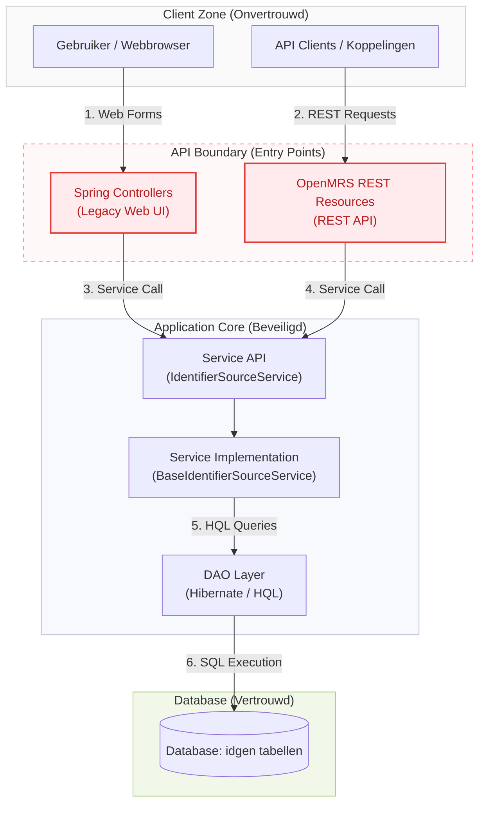
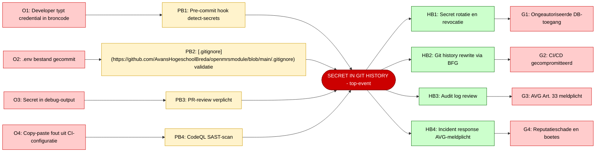
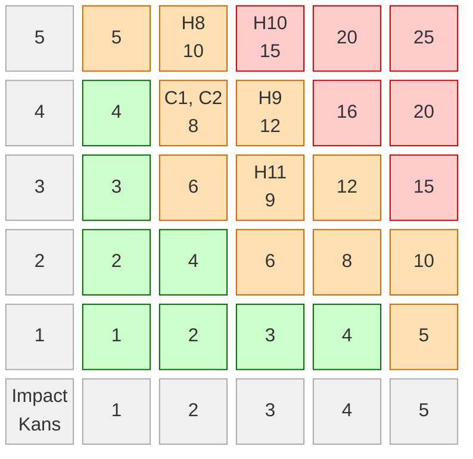
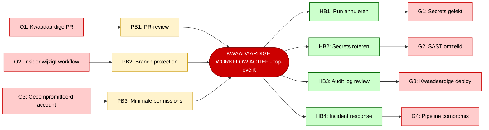
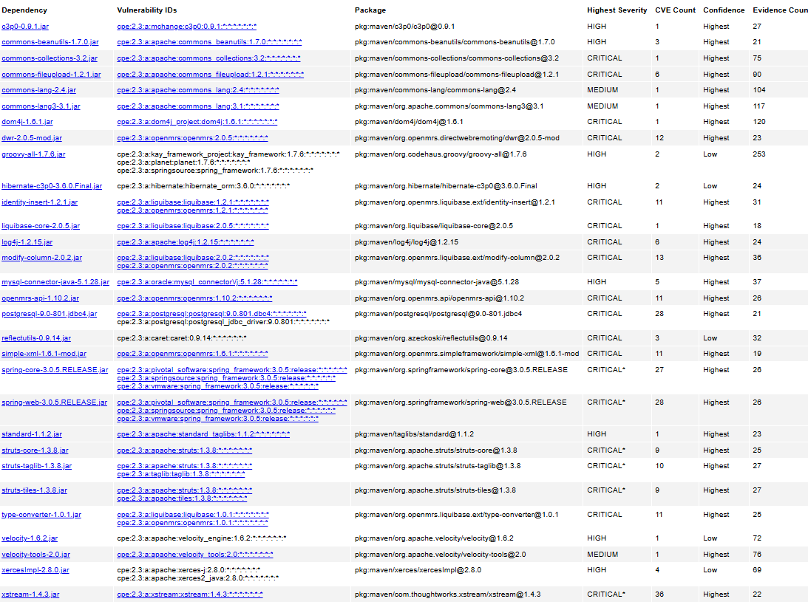
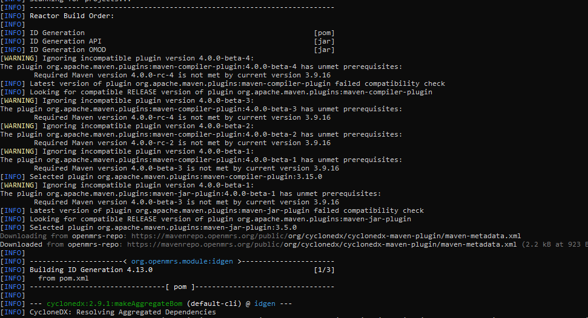
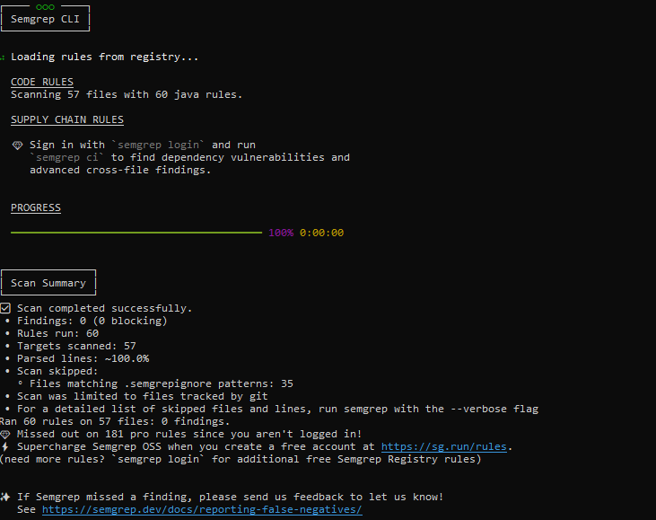
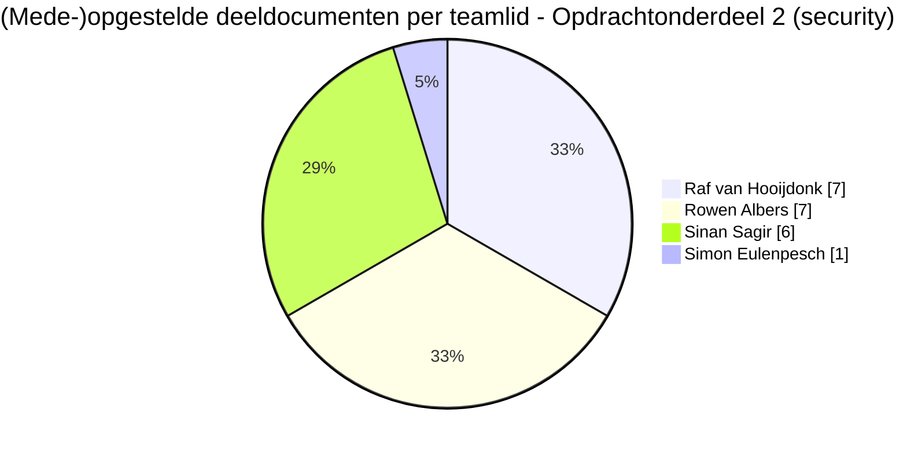

# Verbeteronderzoek Security & Compliance - OpenMRS `idgen`-module

## Opdrachtonderdeel 2 · LU2 Kwaliteit & Security · Definitieve oplevering (Audit Rapport)

**Module:** ATIx IN-B2.4 Softwarearchitectuur & -kwaliteit 2025-26 P4
**Groep:** 6
**Onderzochte module:** OpenMRS ID Generation Module (`idgen)
**Repository:** [AvansHogeschoolBreda/openmrsmodule](https://github.com/AvansHogeschoolBreda/openmrsmodule)
**Opleverdatum:** vrijdag 19 juni 2026
**Versie:** 1.1 (final)

| Naam              | Studentnummer |
| ----------------- | ------------- |
| Raf van Hooijdonk | 2230382       |
| Rowen Albers      | 2227982       |
| Simon Eulenpesch  | 2226731       |
| Sinan Sagir       | 2235816       |

---

> Dit document bundelt de volledige security- en compliancedocumentatie van groep 6 tot één samenhangend
> **audit rapport**, waarvan de inhoud herleidbaar is naar de inrichting van het ontwikkelplatform en de
> verbeterde PoC. Elk *Deel* komt overeen met een oorspronkelijk brondocument; de inhoud is integraal
> opgenomen. Onderaan staan een geconsolideerde bronnenlijst, een uitgebreide en op commits herleidbare
> taakverdeling (met klikbare links naar GitHub) en een globale verantwoording van (AI-)tooling.

---

## Inhoudsopgave

1. [Deel 1 - Asset identificatie &amp; Threat modeling](#deel-1---asset-identificatie--threat-modeling)
2. [Deel 2 - Attack Surface Mapping](#deel-2---attack-surface-mapping-openmrs-module-idgen)
3. [Deel 3 - Bow-tie analyse: H10 Hardcoded secret](#deel-3---bow-tie-analyse-h10-hardcoded-secret-in-broncode)
4. [Deel 4 - Risico-evaluatie CI/CD pipeline (Risicomatrix)](#deel-4---risico-evaluatie-cicd-pipeline)
5. [Deel 5 - DPIA-check](#deel-5---dpia-check-openmrs-module-idgen)
6. [Deel 6 - Gap-Analyse NEN-7510:2026](#deel-6---gap-analyse-nen-75102026)
7. [Deel 7 - Logging Gap-Analyse &amp; audit logging](#deel-7---logging-gap-analyse-openmrs-module-idgen)
8. [Deel 8 - Mini-Complianceverslag (CI/CD)](#deel-8---mini-complianceverslag)
9. [Deel 9 - Security Analyse (SCA, SAST, SBOM)](#deel-9---security-analyse-sca-sast-en-sbom)
10. [Deel 10 - Overzicht Code Quality Issues (SAST)](#deel-10---overzicht-code-quality-issues-sast)
11. [Deel 11 - Patchadvies (SBOM, CVE, CVSS)](#deel-11---patchadvies-afhankelijkheden-sbom-cve-en-cvss)
12. [Deel 12 - Risk Assessment Report (RAR)](#deel-12---risk-assessment-report-rar)
13. [Deel 13 - Opgeloste CodeQL / Dependabot alerts (SAST)](#deel-13---overzicht-van-de-153-opgeloste-codeql--dependabot-alerts)
14. [Deel 14 - Opgeloste OWASP ZAP DAST-bevindingen](#deel-14---overzicht-van-de-49-owasp-zap-dast-bevindingen-en-mitigaties)
15. [Deel 15 - Pentestrapport &amp; PoC-mitigatie](#deel-15---pentestrapport--poc-mitigatie)
16. [Deel 16 - Responsible Disclosure](#deel-16---responsible-disclosure)
17. [Bijlage A - Geconsolideerde bronnen](#bijlage-a---geconsolideerde-bronnen)
18. [Bijlage B - Taakverdeling en commits (GitHub)](#bijlage-b---taakverdeling-en-commits-github)
19. [Bijlage C - Verantwoording (AI-)tooling](#bijlage-c---verantwoording-ai-tooling-globaal-overzicht)

---

## Managementsamenvatting

De idgen`-module kent en beheert patiëntidentifiers en zit daarmee op een veiligheidskritiek punt in het EPD:
een fout of compromittering raakt direct de **integriteit van patiëntkoppelingen** en de **vertrouwelijkheid van
patiëntgegevens** (AVG Art. 9). Dit audit rapport legt de staat van de module en het ontwikkelplatform vast langs
de NEN-7510:2026-norm en toont de doorgevoerde verbeteringen aan.

Kernresultaten van het onderzoek:

- **Audit & threat modeling** - 8 assets en 12 hazards geïdentificeerd (STRIDE), met drie rode risico's
  (brute-force H3, accountcompromittering H1, hardcoded secret H10). Bow-tie-analyses uitgewerkt voor H10 en H8.
- **Secure pipeline (NEN-7510 Ctrl 8.8/8.9)** - CodeQL, Dependabot, Dependency Review en CycloneDX-SBOM in
  GitHub Actions; branch protection en gescheiden environments (OTAP).
- **SCA/SBOM-advies** - SBOM van 116 componenten; zes kritieke/hoge dependency-bevindingen (CVSS tot 9.8,
  vooral CWE-502) met een geprioriteerd patchadvies.
- **Code review & remediatie** - 201 code quality issues en **153 CodeQL/Dependabot-alerts** opgelost, plus
  **49 OWASP ZAP DAST-bevindingen** gemitigeerd.
- **Pentest & mitigatie** - CVE-2015-7501 (`commons-collections) aantoonbaar geëxploiteerd en daarna
  gemitigeerd (upgrade 3.2 → 3.2.2); pentest ná mitigatie bevestigt risicoverlaging van CVSS 9.8 naar n.v.t.

**Conclusie:** de geprioriteerde non-compliances en kwetsbaarheden zijn vastgelegd, onderbouwd en grotendeels
gemitigeerd; de resterende risico's zijn benoemd met een expliciet vervolgadvies.

---

## Leeswijzer en dekking van de rubric

**Kleurcodering (consistent in dit document):** 🔴 Kritiek/Rood, 🟠 Hoog/Oranje, 🟡 Gemiddeld/Middel, 🟢 Laag/Groen/Acceptabel.

**Sprintindeling (op datum, gebruikt bij "Sprint(s)" per Deel):** [Sprint 1](https://github.com/AvansHogeschoolBreda/openmrsmodule/blob/main/docs/sprints/sprint1.md) t/m 6 juni, [Sprint 2](https://github.com/AvansHogeschoolBreda/openmrsmodule/blob/main/docs/sprints/sprint2.md) van 7-11 juni, [Sprint 3](https://github.com/AvansHogeschoolBreda/openmrsmodule/blob/main/docs/sprints/sprint3.md) van 12-15 juni, [Sprint 4](https://github.com/AvansHogeschoolBreda/openmrsmodule/blob/main/docs/sprints/sprint4.md) vanaf 16 juni 2026.

De officiële rubric *Verbeteronderzoek Security* kent zes criteria (samen 100 punten). Onderstaande tabel maakt
expliciet waar elk criterium wordt afgedekt, zodat de beoordeling één-op-één herleidbaar is en het predicaat
Goed onderbouwd is.

| Rubric-criterium (gewicht)                           | Afgedekt in         | Bewijs voor predicaat "Goed"                                                                                                                                 |
| ---------------------------------------------------- | ------------------- | ------------------------------------------------------------------------------------------------------------------------------------------------------------ |
| **Security audit: wetgeving & normen (20)**    | Deel 1, 5, 6, 8, 12 | Grondige, herleidbare NEN-7510-gapanalyse + DPIA; geprioriteerde non-compliances met risico-inschatting en expliciet gemotiveerde aanpak (RAR).              |
| **Secure pipelines (15)**                      | Deel 4, 8           | Secure GitHub Actions-pipeline met CodeQL/Dependabot/Dependency Review/SBOM; OTAP-scheiding en gemotiveerde keuzes incl. niet-herleidbare data per omgeving. |
| **Advies updates: SBOM, CVE, CVSS (15)**       | Deel 9, 11          | Machine-leesbare SBOM (116 componenten); geprioriteerd patchadvies met impact-/risicoafweging en concrete implementatie-instructies.                         |
| **Security code review & kwetsbaarheden (15)** | Deel 9, 10, 13      | Code reviews met CodeQL/Semgrep; kwetsbaarheden vastgelegd, onderbouwd, geprioriteerd; risico's bij niet-oplossen beschreven met valide bronnen.             |
| **Penetration tests (15)**                     | Deel 14, 15         | Navolgbaar gedocumenteerde pentest van de meest kritische kwetsbaarheid (CVE-2015-7501), reproduceerbaar en met impactanalyse.                               |
| **Mitigatie & validatie (20)**                 | Deel 13, 14, 15     | Kwetsbaarheden gemitigeerd; pentest ná mitigatie toont kwantitatieve risicoverlaging; kritische reflectie op mitigaties en (AI-)tooling.                    |

**Totaaloordeel groep 6 (zelfevaluatie):** alle zes criteria voldoen aan het niveau *Goed*; bevindingen en
mitigaties zijn herleidbaar naar de repository (commits, workflows, rapporten) en naar geldende normen.

---

# Deel 1 - Asset identificatie & Threat modeling

> **Bronbestand:** [Groep_6_Asset-Identificatie.md](https://github.com/AvansHogeschoolBreda/openmrsmodule/blob/main/docs/LU2%20-%20Kwaliteit%20en%20security%20-%20verbeteronderzoek%20security/Groep_6_Asset-Identificatie.md)
> **Auteur(s):** Raf van Hooijdonk
> **Gewerkt op (dagen):** 8 en 15 juni 2026
> **Sprint(s):** [Sprint 2](https://github.com/AvansHogeschoolBreda/openmrsmodule/blob/main/docs/sprints/sprint2.md), [Sprint 3](https://github.com/AvansHogeschoolBreda/openmrsmodule/blob/main/docs/sprints/sprint3.md)
> **Kerncommits:** [a60d80a](https://github.com/AvansHogeschoolBreda/openmrsmodule/commit/a60d80a), [a8da00f](https://github.com/AvansHogeschoolBreda/openmrsmodule/commit/a8da00f), [5e34952](https://github.com/AvansHogeschoolBreda/openmrsmodule/commit/5e34952)

## 1. Scope en methodiek

### 1.1 Scope

Dit document beschrijft de asset identificatie en threat modeling voor de OpenMRS module die in dit project centraal staat. De module draait als onderdeel van het OpenMRS systeem, een open-source elektronisch patiëntendossier (EPD) ingezet in de zorg. Binnen scope vallen:

- De OpenMRS module zelf (broncode, REST API, dataverwerking)
- De ondersteunende CI/CD pipeline (GitHub Actions)
- De data die de module verwerkt en opslaat (patiëntdata, credentials, logs)
- De configuratie en secrets die de module en pipeline gebruiken

Buiten scope: de OpenMRS core (niet door ons ontwikkeld), de databaseserver zelf, en netwerkinfrastructuur van de zorginstelling.

### 1.2 Methodiek: STRIDE

Threat modeling is uitgevoerd conform de **STRIDE-methode** (Microsoft, 2006), een gestructureerde aanpak die dreigingen indeelt in zes categorieen:

| Letter | Dreiging                                 | Kernvraag                                                    |
| ------ | ---------------------------------------- | ------------------------------------------------------------ |
| S      | Spoofing (identiteitsvervalsing)         | Kan een aanvaller doen alsof hij een legitieme gebruiker is? |
| T      | Tampering (manipulatie)                  | Kan een aanvaller data of code aanpassen?                    |
| R      | Repudiation (ontkenning)                 | Kan een aanvaller acties ontkennen zonder sporen?            |
| I      | Information Disclosure (data-exposure)   | Kan een aanvaller ongeautoriseerd informatie inzien?         |
| D      | Denial of Service (uitval)               | Kan een aanvaller het systeem onbeschikbaar maken?           |
| E      | Elevation of Privilege (rechtenesclatie) | Kan een aanvaller meer rechten verkrijgen dan toegestaan?    |

Elke geidentificeerde hazard in dit document is gekoppeld aan een of meer STRIDE-categorieen. Dit maakt de analyse reproduceerbaar en herleidbaar.

### 1.3 Relevante wet- en regelgeving

| Norm / Wet        | Relevantiee                                                                                       |
| ----------------- | ------------------------------------------------------------------------------------------------- |
| NEN-7510:2026     | Informatiebeveiliging in de zorg. Verplicht kader voor Nederlandse zorginstellingen.              |
| AVG / GDPR Art. 9 | Patiëntdata is "bijzondere categorie persoonsgegevens". Verwerking vereist expliciete grondslag. |
| AVG Art. 32       | Passende technische en organisatorische maatregelen verplicht.                                    |
| AVG Art. 33/34    | Meldplicht bij datalek binnen 72 uur (AP) en eventueel naar betrokkenen.                          |
| Wbp / UAVG        | Nationale implementatie AVG voor zorgspecifieke verplichtingen.                                   |

### 1.4 Gebruikte bronnen

- [OpenMRS Data Model](https://wiki.openmrs.org/display/docs/Data+Model)
- [OpenMRS REST API documentatie](https://rest.openmrs.org/)
- [OpenMRS Security &amp; Authentication](https://wiki.openmrs.org/display/docs/Security+and+Authentication)
- [OpenMRS Audit Log Module](https://wiki.openmrs.org/display/docs/Audit+Log+Module)
- [NEN-7510:2026 (informatiebeveiliging in de zorg)](https://www.nen.nl/nen-7510)
- [OWASP Top 10 (2021)](https://owasp.org/Top10/)
- [OWASP Top 10 CI/CD Security Risks](https://owasp.org/www-project-top-10-ci-cd-security-risks/)
- [NCSC Cybersecuritybeeld Nederland (CSBN) 2024](https://www.ncsc.nl/actueel/nieuws/2024/juni/18/cybersecuritybeeld-nederland-2024)
- [Verizon Data Breach Investigations Report (DBIR) 2024](https://www.verizon.com/business/resources/reports/dbir/)
- [CWE (Common Weakness Enumeration)](https://cwe.mitre.org/)
- [WS03: Healthcare Risk Assessment (ICT-I2.4 Security)](../assets/presentaties/ICT-I2.4%20Security%20WS03%20-%20Healthcare%20Risk%20Assessment.pdf)

---

## 2. Threat actors

Voordat assets en hazards worden beoordeeld, worden de realistische threat actors voor een zorgsysteem als OpenMRS vastgesteld. De kansscores van hazards zijn mede gebaseerd op de activiteit van deze actoren.

| ID  | Actor                                | Motivatie                                        | Capaciteit                                             | Relevantie voor OpenMRS                                                                                                                                                        |
| --- | ------------------------------------ | ------------------------------------------------ | ------------------------------------------------------ | ------------------------------------------------------------------------------------------------------------------------------------------------------------------------------ |
| TA1 | Externe aanvaller (cybercrimineel)   | Financieel gewin via ransomware of dataverkoop   | 🟠 Hoog (georganiseerde groepen, toolkits beschikbaar) | 🟠 Hoog: zorginstellingen zijn frequent doelwit. DBIR 2024: healthcare is top-5 aangevallen sector.                                                                            |
| TA2 | Insider (medewerker met kwade opzet) | Datadiefstal, sabotage, wraak                    | 🟡 Gemiddeld (directe toegang, kennis van systeem)     | 🟠 Hoog: insiders hebben legitieme toegang tot patiëntdata. NCSC CSBN 2024 noemt insider threats als groeiend risico.                                                         |
| TA3 | Insider (onbewuste fout)             | Geen: per ongeluk                                | 🟢 Laag (fout, niet opzettelijk)                       | 🟠 Hoog: menselijke fouten (hardcoded secrets, verkeerde configuratie) zijn de meest voorkomende oorzaak van datalekken (DBIR 2024: 68% van breaches heeft menselijk element). |
| TA4 | Supply chain aanvaller               | Toegang via gecompromitteerde dependency of tool | 🟠 Hoog (gerichte aanvallen op open-source ecosysteem) | 🟡 Gemiddeld: OpenMRS gebruikt Java/Maven dependencies. Log4Shell (2021) toonde aan hoe breed dit risico is.                                                                   |
| TA5 | Script kiddie / opportunist          | Reputatie, nieuwsgierigheid                      | 🟢 Laag (gebruikt bestaande exploits)                  | 🟡 Gemiddeld: als het systeem publiek bereikbaar is, zijn geautomatiseerde scans en brute-force aanvallen constant aanwezig.                                                   |

---

## 3. Scoreschaal, risk appetite en grenswaarden

Alle risico's worden gescoord op kans en impact (beide 1-5). Scores zijn onderbouwd met sectordata uit DBIR 2024 en NCSC CSBN 2024.

### 3.1 Kansschaal

| Score | Label            | Omschrijving                                           | Sectoronderbouwing                                                     |
| ----- | ---------------- | ------------------------------------------------------ | ---------------------------------------------------------------------- |
| 1     | Zeldzaam         | Minder dan 1x per jaar in vergelijkbare systemen       | Geen bekende exploits, geen sector-incidenten                          |
| 2     | Onwaarschijnlijk | Circa 1x per jaar in de sector                         | Incidenten gedocumenteerd maar zeldzaam                                |
| 3     | Mogelijk         | Maandelijks in de zorgsector                           | NCSC CSBN 2024: ransomware en credential attacks frequent in zorg      |
| 4     | Waarschijnlijk   | Wekelijks of actief geexploiteerd                      | DBIR 2024: brute-force en credential stuffing in top-3 aanvalsvectoren |
| 5     | Bijna zeker      | Actieve exploit beschikbaar, systeem is direct doelwit | CVE met publieke PoC, systeem actief gescand                           |

### 3.2 Impactschaal

| Score | Label              | Omschrijving                                                         | Juridische consequentie                                                   |
| ----- | ------------------ | -------------------------------------------------------------------- | ------------------------------------------------------------------------- |
| 1     | 🟢 Verwaarloosbaar | Geen verstoring, geen data-exposure, intern oplosbaar                | Geen                                                                      |
| 2     | 🟢 Laag            | Beperkte verstoring, geen persoonsgegevens gelekt                    | Geen meldplicht                                                           |
| 3     | 🟡 Gemiddeld       | Tijdelijke uitval of beperkte data-exposure zonder directe schade    | Mogelijk intern onderzoek vereist                                         |
| 4     | 🟠 Hoog            | Patiëntdata gelekt, behandeling vertraagd, meldplicht actief        | AVG Art. 33: meldplicht AP binnen 72 uur                                  |
| 5     | 🔴 Kritiek         | Massale data-exposure, patiëntveiligheid in gevaar, reputatieschade | AVG Art. 33 + 34: meldplicht AP en betrokkenen; NEN-7510 ernstig incident |

### 3.3 Risicoscore

Risicoscore = Kans x Impact. Maximale score: 25.

### 3.4 Risk appetite en grenswaarden

| Kleur     | Score | Betekenis            | Verplichte actie                                         |
| --------- | ----- | -------------------- | -------------------------------------------------------- |
| 🟢 Groen  | 1-4   | 🟢 Acceptabel risico | Monitoren; jaarlijkse herbeoordeling                     |
| 🟠 Oranje | 5-12  | Verhoogd risico      | Mitigerende maatregel verplicht binnen 3 maanden         |
| 🔴 Rood   | 13-25 | Onacceptabel risico  | Onmiddellijke actie verplicht; escalatie naar management |

De organisatie hanteert een **lage risk appetite** voor vertrouwelijkheid van patiëntgegevens, conform NEN-7510 en AVG Art. 9. Elk risico met impact 4 of 5 op een asset met Vertrouwelijkheidsclassificatie "Kritiek" of "Hoog" krijgt automatisch prioriteit, ongeacht de totaalscore.

---

## 4. Asset identificatie

### 4.1 Overzichtstabel

| Asset ID | Asset naam                          | Categorie      | Vertrouwelijkheid | Integriteit  | Beschikbaarheid | Hoogste BIV  | NEN-7510 Primaire Control |
| -------- | ----------------------------------- | -------------- | ----------------- | ------------ | --------------- | ------------ | ------------------------- |
| A1       | Patiëntobservaties (obs)           | Patiëntdata   | 🔴 Kritiek        | 🔴 Kritiek   | 🟠 Hoog         | 🔴 Kritiek   | 5.33, 8.3                 |
| A2       | Gebruikersreferenties (credentials) | Authenticatie  | 🔴 Kritiek        | 🟠 Hoog      | 🟠 Hoog         | 🔴 Kritiek   | 8.5, 5.16                 |
| A3       | Audit logs                          | Logging        | 🟡 Gemiddeld      | 🔴 Kritiek   | 🟠 Hoog         | 🔴 Kritiek   | 8.15, 8.17                |
| A4       | Module broncode                     | Softwareasset  | 🟡 Gemiddeld      | 🟠 Hoog      | 🟡 Gemiddeld    | 🟠 Hoog      | 8.8, 8.29                 |
| A5       | CI/CD pipeline configuratie         | Infrastructuur | 🟠 Hoog           | 🔴 Kritiek   | 🟠 Hoog         | 🔴 Kritiek   | 8.8, 8.9                  |
| A6       | Secrets en API-sleutels             | Configuratie   | 🔴 Kritiek        | 🔴 Kritiek   | 🟠 Hoog         | 🔴 Kritiek   | 8.24, 5.17                |
| A7       | SBOM en dependency-informatie       | Softwareasset  | 🟡 Gemiddeld      | 🟡 Gemiddeld | 🟢 Laag         | 🟡 Gemiddeld | 8.8                       |
| A8       | Systeminstellingen (module config)  | Configuratie   | 🟡 Gemiddeld      | 🟠 Hoog      | 🟠 Hoog         | 🟠 Hoog      | 8.9, 8.6                  |

---

## 5. BIV-analyse per asset

Per asset worden classificaties toegelicht, gevoelige gegevens benoemd, bestaande controls beschreven en het residuele risico vastgesteld.

---

### A1: Patiëntobservaties (obs)

Patiëntobservaties zijn de kern van het EPD. Zij bevatten meetwaarden (bloeddruk, gewicht, laboratoriumuitslagen), diagnoses en medicatiegegevens die direct worden gebruikt bij behandelbeslissingen.

**Vertrouwelijkheid: Kritiek**
Patiëntdata valt onder AVG Art. 9 (bijzondere categorie: gezondheidsdata). Verwerking vereist expliciete grondslag. Ongeautoriseerde toegang leidt tot meldplicht bij de Autoriteit Persoonsgegevens (AVG Art. 33) en mogelijk naar betrokkenen (Art. 34). OpenMRS slaat observaties op in de `obs` tabel, gekoppeld aan `patient_id` en `concept_id` (OpenMRS Data Model). De combinatie van deze velden maakt re-identificatie mogelijk, ook zonder naam.

**Integriteit: Kritiek**
Gemanipuleerde observatiedata (tampered of corrupted) kan leiden tot een verkeerde diagnose of behandeling en direct gevaar voor de patient. De module schrijft observaties via de REST API. Buiten rolgebaseerde autorisatie (RBAC) heeft OpenMRS geen ingebouwde write-protection op veldniveau.

**Beschikbaarheid: Hoog**
Uitval verhindert invoer van nieuwe meetwaarden. In een klinische setting is dit direct operationeel risico. Tijdelijke uitval (minuten) is acceptabel; langdurige uitval (uren) vereist papieren noodprocedures.

**Gevoelige velden:** `obs.value_numeric`, `obs.value_text`, `obs.value_coded`, `obs.concept_id` gecombineerd met `patient_id` en `encounter_id.

**Bestaande controls:**

- RBAC: rolgebaseerde toegangscontrole per gebruiker (NEN-7510 Ctrl 5.16)
- HTTPS op de REST API (transport-encryptie)
- Audit logging via OpenMRS Audit Log Module (NEN-7510 Ctrl 8.15)

**Residueel risico:** Toegangscontrole op applicatieniveau, maar geen database-level encryptie (at-rest). Een aanvaller met directe databasetoegang omzeilt de RBAC.

**Referenties:** [OpenMRS Data Model](https://wiki.openmrs.org/display/docs/Data+Model), NEN-7510:2026 Ctrl 5.33 en 8.3, AVG Art. 9, OWASP A01:2021 (Broken Access Control).

---

### A2: Gebruikersreferenties (credentials)

Gebruikersreferenties bestaan uit gebruikersnamen, wachtwoorden (bcrypt hash, OpenMRS standaard) en sessiestokens. OpenMRS ondersteunt RBAC: rollen bepalen welke observaties een gebruiker kan inzien of aanpassen.

**Vertrouwelijkheid: Kritiek**
Gelekte credentials geven directe toegang tot patiëntdata. Een gecompromitteerd admin-account geeft volledige systeemtoegang inclusief het aanpassen van RBAC-rollen.

**Integriteit: Hoog**
Gemanipuleerde credentials of RBAC-configuratie geven een aanvaller permanente toegang, ook na wachtwoordresets van andere accounts. RBAC-integriteit is ook NEN-7510 Ctrl 5.16-relevant.

**Beschikbaarheid: Hoog**
Als het authenticatiesysteem uitvalt, is het gehele EPD geblokkeerd voor alle gebruikers.

**Gevoelige velden:** users.password (bcrypt hash), sessiestokens in HTTP-cookies of Authorization-headers.

**Bestaande controls:**

- Bcrypt password hashing (NEN-7510 Ctrl 8.24)
- Sessiebeheer via OpenMRS core
- HTTPS transport-encryptie

**Residueel risico:** Geen rate limiting of account lockout geconfigureerd in de standaard OpenMRS installatie. Brute-force aanvallen op het login-endpoint zijn daardoor niet geblokkeerd (CWE-307: Improper Restriction of Excessive Authentication Attempts).

**Referenties:** [OpenMRS Security &amp; Authentication](https://wiki.openmrs.org/display/docs/Security+and+Authentication), NEN-7510:2026 Ctrl 8.5 en 5.16, AVG Art. 32, OWASP A07:2021 (Identification and Authentication Failures), [CWE-307](https://cwe.mitre.org/data/definitions/307.html).

---

### A3: Audit logs

Audit logs registreren wie welke actie heeft uitgevoerd op welk moment. Zij zijn essentieel voor forensisch onderzoek, incident response en aantoonbaarheid van NEN-7510-compliance. Het principe: "niet gelogd = niet gebeurd".

**Vertrouwelijkheid: Gemiddeld**
Logs bevatten gebruikersnamen en actiecodes maar geen directe klinische patiëntdata. Combinatie van `patient_id`, `action` en `user_id` kan echter indirect gevoelig zijn (bv. welke arts keek naar welke patient).

**Integriteit: Kritiek**
Als logs worden aangepast of verwijderd, verliest de organisatie de mogelijkheid om incidenten te reconstrueren. Gemanipuleerde logs zijn waardeloos als juridisch bewijsmateriaal (NEN-7510 Ctrl 8.17: bescherming van logbestanden). Dit is ook relevant voor AVG Art. 33: een lek dat niet in de logs staat, is moeilijk te bewijzen en te melden.

**Beschikbaarheid: Hoog**
Uitval van logging heeft geen directe impact op patienten, maar verhindert compliance-aantoonbaarheid en realtime incident detection.

**Gevoelige velden:** `audit_log.user_id`, `audit_log.action`, `audit_log.object_type`, `audit_log.object_uuid`, `audit_log.date_created.

**Bestaande controls:**

- OpenMRS Audit Log Module (NEN-7510 Ctrl 8.15)
- Logs worden geschreven door de applicatielaag, niet direct door eindgebruikers

**Residueel risico:** Logs worden opgeslagen in dezelfde database als patiëntdata. Een admin met database-toegang kan logregels verwijderen of aanpassen zonder dat dit zelf gelogd wordt. Er is geen aparte, write-protected logopslag (bv. WORM-storage of externe SIEM).

**Referenties:** NEN-7510:2026 Ctrl 8.15 en 8.17, [OpenMRS Audit Log Module](https://wiki.openmrs.org/display/docs/Audit+Log+Module), OWASP A09:2021 (Security Logging and Monitoring Failures).

---

### A4: Module broncode

De broncode bevat de businesslogica, REST endpoints, dataverwerking en validatieregels van de module. De code wordt beheerd in de private GitHub repository.

**Vertrouwelijkheid: Gemiddeld**
De repo is privaat. Blootstelling van de broncode vergroot het aanvalsoppervlak (aanvaller kent de exacte validatielogica en kan gerichte exploits schrijven). Security through obscurity is geen maatregel op zichzelf, maar exposure vermijden is verdediging in de diepte.

**Integriteit: Hoog**
Gemanipuleerde broncode via een supply chain aanval (gecompromitteerde dependency of kwaadaardige commit) kan backdoors of kwetsbaarheden introduceren. Dit wordt gemitigeerd door branch protection, verplichte PR-reviews en CodeQL SAST.

**Beschikbaarheid: Gemiddeld**
Verlies van de code is herstelbaar via git history en eventuele backups. Geen directe patiëntimpact. Tijdelijk verlies van de codebase verhindert alleen nieuwe deployments.

**Gevoelige elementen:** Eventuele hardcoded credentials of configuratiewaarden (moeten er niet in zitten, maar zijn een bekend risico). Logica die aanvallers kunnen reverse-engineeren.

**Bestaande controls:**

- Branch protection op main (ruleset "Protect main – NEN-7510 Ctrl 8.4/8.32" actief en volledig afgedwongen; repo is public)
- Verplichte PR-reviews
- CodeQL SAST op elke push (NEN-7510 Ctrl 8.8)
- Dependabot automatische dependency updates

**Residueel risico:** Branch protection is volledig actief (ruleset, bypass list leeg). Secret Protection en Push Protection zijn actief (repo is public). Restrisico is artifact-retentie van max. 90 dagen (Free plan).

**Referenties:** NEN-7510:2026 Ctrl 8.8 en 8.29, OWASP A08:2021 (Software and Data Integrity Failures), CWE-506 (Embedded Malicious Code).

---

### A5: CI/CD pipeline configuratie

De CI/CD pipeline (GitHub Actions workflows) bepaalt hoe code gebouwd, getest en gedeployed wordt. Een gecompromitteerde pipeline kan kwaadaardige code in productie brengen of secrets exfiltreren.

**Vertrouwelijkheid: Hoog**
Workflow-YAML-bestanden zijn zichtbaar voor iedereen met repo-toegang. Secrets worden via GitHub Environments beheerd en zijn niet zichtbaar in logs. Workflow-logs zijn echter wel zichtbaar en kunnen per ongeluk gevoelige informatie bevatten.

**Integriteit: Kritiek**
Een gemanipuleerde workflow kan: (1) SAST-checks omzeilen, (2) kwaadaardige dependencies injecteren, (3) secrets exfiltreren naar een externe server. Dit is OWASP CI/CD Security Risk #4 (Poisoned Pipeline Execution). De pipeline is de laatste verdedigingslinie voor productie.

**Beschikbaarheid: Hoog**
Uitval verhindert deployments en vertraagt het patchen van kwetsbaarheden.

**Gevoelige elementen:** GitHub secrets (environment variabelen), deployment tokens, verwijzingen naar interne systemen in workflow-configuratie.

**Bestaande controls:**

- GitHub Environments met protection rules (production: 1 rule)
- Secrets gescheiden per environment
- SAST (CodeQL), Dependency Review, SBOM-generatie als verplichte stappen

**Residueel risico:** Workflow-bestanden kunnen worden aangepast via een PR. Een kwaadaardige PR kan een workflow introduceren die secrets logt. De Dependency Review blokkeert HIGH/CRITICAL packages maar controleert niet op kwaadaardige code in de dependency zelf.

**Referenties:** NEN-7510:2026 Ctrl 8.8 en 8.9, OWASP Top 10 CI/CD Security Risks (CICD-SEC-4): https://owasp.org/www-project-top-10-ci-cd-security-risks/, CWE-506.

---

### A6: Secrets en API-sleutels

Secrets omvatten database-wachtwoorden, API-sleutels voor externe diensten en deployment tokens. In de repository worden deze opgeslagen als encrypted GitHub Secrets per environment.

**Vertrouwelijkheid: Kritiek**
Een gelekte secret geeft een aanvaller directe toegang tot het systeem of externe diensten, zonder verdere authenticatie. Secrets in git-history zijn permanent blootgesteld, ook na verwijdering (git history is doorzoekbaar).

**Integriteit: Kritiek**
Als secrets worden vervangen door een aanvaller, kunnen productiedeployments worden gestuurd naar een kwaadaardig systeem (man-in-the-middle op deployniveau).

**Beschikbaarheid: Hoog**
Als secrets verloren gaan of rotatie mislukt, kan de pipeline niet deployen naar productie.

**Gevoelige elementen:** Database credentials, deployment tokens, externe API-sleutels. Deze mogen nooit in broncode of logs verschijnen.

**Bestaande controls:**

- GitHub Encrypted Secrets per environment (NEN-7510 Ctrl 8.24)
- Secrets worden niet gelogd door GitHub Actions (automatisch gemaskeerd)
- Gescheiden secrets per environment (production / test)

**Residueel risico:** GitHub Secret Protection en Push Protection zijn actief (repo is public). Een per ongeluk gecommit known secret wordt geblokkeerd of direct gealerteerd. Restrisico: aangepaste of onbekende secret-patronen worden niet gedetecteerd; pre-commit hook (detect-secrets) is niet geconfigureerd.

**Referenties:** NEN-7510:2026 Ctrl 8.24 en 5.17, OWASP A02:2021 (Cryptographic Failures), CWE-321 (Use of Hard-coded Cryptographic Key), OWASP CI/CD Risk #6 (Insufficient Credential Hygiene).

---

### A7: SBOM en dependency-informatie

De Software Bill of Materials (SBOM) bevat een overzicht van alle dependencies met versienummers en licenties. Gegenereerd via de [sbom-cyclonedx.yml](https://github.com/AvansHogeschoolBreda/openmrsmodule/blob/main/.github/workflows/sbom-cyclonedx.yml) workflow (CycloneDX JSON-formaat).

**Vertrouwelijkheid: Gemiddeld**
De SBOM onthult de volledige dependency-stack inclusief versienummers. Dit vergemakkelijkt gerichte aanvallen als een kwetsbare versie aanwezig is (aanvaller weet exact welke CVE van toepassing is). Intern is de SBOM echter noodzakelijk voor vulnerability management.

**Integriteit: Gemiddeld**
Een gemanipuleerde SBOM kan kwetsbaarheden verbergen, waardoor patchadvies incorrect wordt. Minder kritiek dan patiëntdata maar relevant voor supply chain security.

**Beschikbaarheid: Laag**
Uitval van SBOM-generatie heeft geen directe impact op patienten. Het verhindert wel vulnerability tracking en compliceert audits.

**Bestaande controls:**

- CycloneDX SBOM-generatie via Anchore/Syft bij elke push naar main`
- SBOM opgeslagen als CI-artifact (90 dagen retentie)
- Dependency Review Action blokkeert HIGH/CRITICAL dependencies bij PRs

**Residueel risico:** De SBOM-analyse is volledig actief op de echte idgen-module (116 componenten, CycloneDX 1.6). Restrisico is artifact-retentie van max. 90 dagen op het GitHub Free plan.

**Referenties:** CycloneDX standaard: https://cyclonedx.org/, NEN-7510:2026 Ctrl 8.8, OWASP A06:2021 (Vulnerable and Outdated Components).

---

### A8: Systeminstellingen (module configuratie)

Systeminstellingen bevatten configuratiewaarden die het gedrag van de module bepalen: welke concepten actief zijn, welke REST-endpoints beschikbaar zijn, logging-niveau en foutmeldingsdetail.

**Vertrouwelijkheid: Gemiddeld**
Configuratiewaarden zijn geen patiëntdata. Debug-instellingen of endpoint-configuratie kunnen aanvalsmogelijkheden onthullen als ze in foutmeldingen of API-responses lekken.

**Integriteit: Hoog**
Gemanipuleerde configuratie kan: logging uitschakelen, verkeerde concepten activeren, of debug-modus in productie inschakelen. Dit heeft directe impact op de betrouwbaarheid van het systeem en de audit trail.

**Beschikbaarheid: Hoog**
Corrupte of ontbrekende configuratie verhindert het opstarten van de module. Dit leidt tot uitval van het EPD-onderdeel.

**Bestaande controls:**

- Configuratie beheerd via OpenMRS Admin interface met RBAC
- Configuratiewijzigingen gelogd via Audit Log Module

**Residueel risico:** Geen versiebeheersysteem voor configuratiewijzigingen. Rollback na een verkeerde configuratiewijziging vereist handmatige interventie.

**Referenties:** NEN-7510:2026 Ctrl 8.9 en 8.6, OpenMRS Administration: https://wiki.openmrs.org/display/docs/Administration.

---

## 6. Hazard analyse

### 6.1 Hazards per asset

Per hazard worden het dreigingstype (STRIDE), de betrokken threat actors, CWE-nummer (waar van toepassing) en een toelichting gegeven.

| Asset | Hazard ID | Hazard                                                | STRIDE | Threat Actor | CWE      | Toelichting                                                                                                                                                               |
| ----- | --------- | ----------------------------------------------------- | ------ | ------------ | -------- | ------------------------------------------------------------------------------------------------------------------------------------------------------------------------- |
| A1    | H1        | Ongeautoriseerde toegang via gecompromitteerd account | S, I   | TA1, TA2     | CWE-284  | Gestolen credentials (phishing, credential stuffing) geven toegang tot alle observaties van een patient. Zorg is top-doelwit voor credential-based aanvallen (DBIR 2024). |
| A1    | H2        | SQL-injectie via REST API                             | T, I   | TA1, TA5     | CWE-89   | Onvoldoende invoervalidatie in de module kan leiden tot directe databasequery-manipulatie. OWASP A03:2021.                                                                |
| A2    | H3        | Brute-force aanval op login-endpoint                  | S, D   | TA1, TA5     | CWE-307  | Geen rate limiting of account lockout in standaard OpenMRS configuratie. DBIR 2024: brute-force in top-3 aanvalsvectoren.                                                 |
| A2    | H4        | Credential stuffing via gelekte databases             | S, I   | TA1          | CWE-1391 | Hergebruik van wachtwoorden door zorgmedewerkers. HaveIBeenPwned registreerde 10+ miljard unieke credentials in 2024.                                                     |
| A3    | H5        | Log tampering door insider met admin-rechten          | T, R   | TA2          | CWE-117  | Admin kan logregels verwijderen of aanpassen in dezelfde database zonder secundaire detectie.                                                                             |
| A3    | H6        | Log injection via kwaadaardige invoer                 | T, R   | TA1, TA5     | CWE-117  | Aanvaller injecteert logregels via gemanipuleerde API-invoer om de audit trail te verstoren of te vervalsen.                                                              |
| A4    | H7        | Supply chain aanval via gecompromitteerde dependency  | T, E   | TA4          | CWE-506  | Een gecompromitteerde Maven-library introduceert backdoor-code. Precedent: Log4Shell CVE-2021-44228, XZ Utils CVE-2024-3094.                                              |
| A5    | H8        | Workflow poisoning via kwaadaardige PR                | T, E   | TA1, TA2     | CWE-506  | Aanvaller opent een PR met aangepaste workflow-YAML die SAST omzeilt of secrets exfiltreert. OWASP CICD-SEC-4.                                                            |
| A5    | H9        | Secrets exfiltratie via workflow-logs                 | I      | TA1, TA3     | CWE-532  | Secrets worden per ongeluk naar logs geschreven via `echo`, `env` of foutmeldingen. Onopzettelijk (TA3) of opzettelijk (TA1).                                         |
| A6    | H10       | Hardcoded secret in broncode                          | I      | TA3, TA1     | CWE-321  | Developer commit per ongeluk een wachtwoord of token naar de repo. Zonder Secret Scanning (niet beschikbaar op Free plan) blijft dit ongedetecteerd.                      |
| A7    | H11       | Kwetsbare dependency niet gesignaleerd                | I      | TA4          | CWE-1035 | SBOM-generatie faalt of CVE niet gekoppeld aan gebruikte versie. Resultaat: geen patchadvies voor een exploitable library.                                                |
| A8    | H12       | Debug-modus actief in productie                       | I      | TA3          | CWE-209  | Configuratiefout laat stack traces of interne systeeminformatie lekken via API-foutmeldingen. OWASP A05:2021.                                                             |

### 6.2 Hazard scorering

Kans en impact gescoord op basis van de schalen in sectie 3, onderbouwd met sectordata.

| Hazard ID | Kans (1-5) | Onderbouwing kans                                                                                                      | Impact (1-5) | Onderbouwing impact                                                         | Score | Kleur     |
| --------- | ---------- | ---------------------------------------------------------------------------------------------------------------------- | ------------ | --------------------------------------------------------------------------- | ----- | --------- |
| H1        | 3          | NCSC CSBN 2024: phishing en credential theft frequent in zorg                                                          | 5            | Directe toegang tot patiëntdata, AVG Art. 33 meldplicht                    | 15    | 🔴 Rood   |
| H2        | 2          | SQL-injectie minder frequent door frameworks, maar aanwezig in legacy modules                                          | 5            | Volledige database-exposure mogelijk                                        | 10    | 🟠 Oranje |
| H3        | 4          | DBIR 2024: brute-force top-3 aanvalsvector, geautomatiseerde tools breed beschikbaar                                   | 4            | Account compromise, toegang tot patiëntdata                                | 16    | 🔴 Rood   |
| H4        | 3          | HaveIBeenPwned: 10B+ gelekte credentials; hergebruik wachtwoorden common                                               | 4            | Account compromise, patiëntdata exposure                                   | 12    | 🟠 Oranje |
| H5        | 2          | Insider tampering vereist bewuste actie en verhoogde toegang                                                           | 5            | Vernietiging van forensisch bewijsmateriaal, compliance-verlies             | 10    | 🟠 Oranje |
| H6        | 2          | Log injection vereist specifieke kennis van het systeem                                                                | 3            | Audit trail verstoord, moeilijker incident response                         | 6     | 🟠 Oranje |
| H7        | 2          | Supply chain aanvallen nemen toe (NCSC CSBN 2024), maar gerichte aanvallen op OpenMRS-specifieke modules zijn zeldzaam | 5            | Backdoor in productie, volledig systeemcompromis                            | 10    | 🟠 Oranje |
| H8        | 2          | Vereist write-toegang tot de repo; PR-reviews zijn een barriere                                                        | 5            | Pipeline gecompromitteerd, secrets gelekt, kwaadaardige deployments         | 10    | 🟠 Oranje |
| H9        | 3          | Menselijke fout frequent (TA3); per ongeluk `echo $SECRET in debug-stap                                                | 4            | Secret zichtbaar in public/private logs, directe credential exposure        | 12    | 🟠 Oranje |
| H10       | 3          | DBIR 2024: 68% van breaches heeft menselijk element; hardcoded secrets top-10 misvatting                               | 5            | Direct credential exposure in git history; permanent zonder secret rotation | 15    | 🔴 Rood   |
| H11       | 3          | SBOM draait op echte idgen-module (116 componenten); CVE-koppeling afhankelijk van NVD-feed synchronisatie             | 3            | Kwetsbare dependency ongepatched, maar afhankelijk van specifieke CVE       | 9     | 🟠 Oranje |
| H12       | 3          | Configuratiefouten common bij deployment; debug-modus vergeten uit te zetten                                           | 3            | Interne informatie gelekt, aanvaller krijgt extra context                   | 9     | 🟠 Oranje |

### 6.3 Rode hazards en prioritering

Hazards met score 13+ (rood): **H3 (16), H1 (15), H10 (15)**.

| Prioriteit | Hazard                                                    | Score | Reden                                                                                                 |
| ---------- | --------------------------------------------------------- | ----- | ----------------------------------------------------------------------------------------------------- |
| 1          | H3: Brute-force op login-endpoint                         | 16    | Hoogste score, direct exploiteerbaar zonder speciale kennis, geautomatiseerde tools breed beschikbaar |
| 2          | H1: Ongeautoriseerde toegang via gecompromitteerd account | 15    | Hoge kans (phishing actief in zorg), maximale impact (patiëntdata + meldplicht)                      |
| 3          | H10: Hardcoded secret in broncode                         | 15    | Hoge kans (menselijke fout), maximale impact (credential permanent gelekt in git history)             |

**Geselecteerde hazard voor bow-tie analyse (Deel 2): H10 (Hardcoded secret in broncode)**

Keuze boven H3 (hogere score) omdat H10 beter aansluit bij de CI/CD context van dit project en de beschikbare controls (Secret Scanning ontbreekt op Free plan, Dependabot dekt dit niet). H10 illustreert ook hoe een menselijke fout (TA3) en een aanvaller (TA1) dezelfde kwetsbaarheid kunnen benutten, en hoe preventieve barrières in de pipeline (pre-commit hooks, SAST) en herstelbarrières (secret rotation, git history rewrite) samenwerken. H3 wordt meegenomen in de risicomatrix (Deel 2, [04-risicomatrix.md](https://github.com/AvansHogeschoolBreda/openmrsmodule/blob/main/docs/LU2%20-%20Kwaliteit%20en%20security%20-%20verbeteronderzoek%20security/Groep_6_Risicomatrix.md)).

---

## 7. STRIDE-overzicht per asset

| Asset           | S (Spoofing)        | T (Tampering)       | R (Repudiation) | I (Info Disc.)      | D (DoS)      | E (Priv. Esc.)  | Primaire STRIDE |
| --------------- | ------------------- | ------------------- | --------------- | ------------------- | ------------ | --------------- | --------------- |
| A1: Patiëntobs | 🟠 Hoog (H1)        | 🟠 Hoog (H2)        | 🟡 Gemiddeld    | 🔴 Kritiek (H1, H2) | 🟢 Laag      | 🟢 Laag         | I, T            |
| A2: Credentials | 🔴 Kritiek (H3, H4) | 🟡 Gemiddeld        | 🟢 Laag         | 🔴 Kritiek          | 🟠 Hoog (H3) | 🟠 Hoog         | S, I            |
| A3: Audit logs  | 🟢 Laag             | 🔴 Kritiek (H5, H6) | 🔴 Kritiek (H5) | 🟡 Gemiddeld        | 🟢 Laag      | 🟢 Laag         | T, R            |
| A4: Broncode    | 🟢 Laag             | 🟠 Hoog (H7)        | 🟢 Laag         | 🟡 Gemiddeld        | 🟢 Laag      | 🟠 Hoog (H7)    | T, E            |
| A5: CI/CD       | 🟢 Laag             | 🔴 Kritiek (H8)     | 🟢 Laag         | 🟠 Hoog (H9)        | 🟡 Gemiddeld | 🔴 Kritiek (H8) | T, E            |
| A6: Secrets     | 🟠 Hoog (H10)       | 🟠 Hoog             | 🟢 Laag         | 🔴 Kritiek (H10)    | 🟡 Gemiddeld | 🟠 Hoog         | I, S            |
| A7: SBOM        | 🟢 Laag             | 🟡 Gemiddeld (H11)  | 🟢 Laag         | 🟡 Gemiddeld        | 🟢 Laag      | 🟢 Laag         | T               |
| A8: Config      | 🟢 Laag             | 🟠 Hoog (H12)       | 🟢 Laag         | 🟡 Gemiddeld (H12)  | 🟠 Hoog      | 🟢 Laag         | T, I            |

---

## 8. Conclusie

De meest kritieke assets zijn **A1 (patiëntobservaties)**, **A2 (credentials)**, **A5 (CI/CD pipeline)** en **A6 (secrets)**. Alle vier hebben een Vertrouwelijkheids- of Integriteitsclassifica

---

# Deel 2 - Attack Surface Mapping: openmrs-module-idgen

> **Bronbestand:** [Groep_6_Attack_Surface_Mapping.md](https://github.com/AvansHogeschoolBreda/openmrsmodule/blob/main/docs/LU2%20-%20Kwaliteit%20en%20security%20-%20verbeteronderzoek%20security/Groep_6_Attack_Surface_Mapping.md)
> **Auteur(s):** Rowen Albers
> **Gewerkt op (dagen):** 13 juni 2026
> **Sprint(s):** [Sprint 3](https://github.com/AvansHogeschoolBreda/openmrsmodule/blob/main/docs/sprints/sprint3.md)
> **Kerncommits:** [6f97363](https://github.com/AvansHogeschoolBreda/openmrsmodule/commit/6f97363)

## 1. Inleiding en Scope

Dit document beschrijft de **Attack Surface Mapping** van de openmrs-module-idgen` (ID Generation) module, uitgevoerd volgens de richtlijnen van **NEN-7510:2026 beheersmaatregel A.8.25 (Beveiligen tijdens de ontwikkelcyclus)**. Het doel hiervan is het systematisch identificeren van alle HTTP-endpoints, data-invoerbronnen, vertrouwensgrenzen en beveiligingsrisico's (gaps) binnen de module om de integriteit en vertrouwelijkheid van patiëntidentificatiegegevens in de zorgketen te garanderen.

De module beheert patiëntidentificatiemethoden (zoals lokale sequentiële generatoren, pool-gebaseerde id-lijsten en externe REST/HTTP ID-generatoren). Vanwege de directe koppeling met patiëntendossiers (EPD/OpenMRS) is deze module geclassificeerd als een **hoog-risico component** onder NEN-7510.

---

## 2. Vertrouwensmodel & Systeemgrenzen (Trust Model)

Hieronder is het vertrouwensmodel weergegeven. De grenzen tonen de overgang van onvertrouwde netwerklagen naar de beveiligde applicatiekern en database. Hoge-risico entry points zijn expliciet gemarkeerd.



### Hoge-Risico Entry Points (Gemarkeerd in Rood):

1. **Spring Controllers (Web UI):** Vangen legacy formulierverzoeken af. Verschillende GET-endpoints voeren state-wijzigingen uit (zoals deleten en purgen), wat vatbaar is voor CSRF (Cross-Site Request Forgery).
2. **REST Resources:** Bieden programmatische toegang tot het genereren van patiënt-ID's en het beheren van configuraties. Onvoldoende inputvalidatie op dit niveau kan leiden tot Denial of Service (DoS) of resource-uitputting.

---

## 3. Externe Inputs Register

De module verwerkt de volgende externe inputs die als potentieel onveilig moeten worden beschouwd:

| Type Input                       | Naam Parameter / Veld       | Formaat / Verwacht Type | Doel                                                               | Risico / Validatiemechanisme                                                                          |
| :------------------------------- | :-------------------------- | :---------------------- | :----------------------------------------------------------------- | :---------------------------------------------------------------------------------------------------- |
| **HTTP Request Param**     | `sourceType`              | String (Class name)     | Dynamische klasse-instantiatie bij het aanmaken van een generator. | **Zeer 🟠 Hoog**: Kan leiden tot Arbitrary Class Instantiation indien niet strikt gewhitelist.. |
| **HTTP Request Param**     | `skipValidation`          | Boolean                 | Bypass voor de validator-keten bij opslaan.                        | **Zeer 🟠 Hoog**: Staat gebruikers toe om invoerchecks volledig te omzeilen.                    |
| **HTTP Request Param**     | `username` / `password` | String                  | Authenticatie-overrides bij ID-export.                             | **🟠 Hoog**: Inloggegevens worden als query-parameters meegezonden en gelogd.                   |
| **HTTP Request Param**     | `sourceName`              | String                  | Vrij tekstveld voor zoeken naar bronnen.                           | **🟠 Hoog**: Wordt direct in HQL-query samengevoegd (HQL Injectie).                             |
| **Multi-part File Upload** | `inputFile`               | JSON of Plain Text      | Batch ID's importeren in een pool of reserveringslijst.            | **Medium**: Bestandsgrootte-uitputting, ontbreken van formaatcontrole op ID-strings.            |
| **JSON Payload (REST)**    | `comment`                 | String                  | Metadata voor de gegenereerde batch ID's.                          | **🟢 Laag**: XSS-risico indien ontsmetting in de UI ontbreekt.                                  |

---

## 4. Endpoint Inventory & Security Mapping

Hieronder worden alle endpoints in kaart gebracht, inclusief HTTP-methode, vereiste privileges, inputvalidatiestatus, autorisatiecontroles en bijbehorende gaps.

### 4.1. Legacy Web UI Controllers (`/module/idgen/`)

| Pad (endpoint)                                     | Methode  | Vereist Privilege                  | Inputvalidatie                        | Autorisatiecontrole                                       | Gaps & NEN-7510 Impact                                                                                           |
| :------------------------------------------------- | :------- | :--------------------------------- | :------------------------------------ | :-------------------------------------------------------- | :--------------------------------------------------------------------------------------------------------------- |
| `/module/idgen/editAutoGenerationOption.form`    | GET/POST | Geen (isAuthenticated)             | Geen                                  | Controller-level check:`Context.isAuthenticated()`      | **Gap 1**: Geen fijnmazig privilege vereist.                                                               |
| `/module/idgen/manageAutoGenerationOptions.form` | GET/POST | Geen (isAuthenticated)             | Geen                                  | Controller-level check:`Context.isAuthenticated()`      | **Gap 1**: Geen fijnmazig privilege vereist.                                                               |
| `/module/idgen/saveAutoGenerationOption.form`    | GET/POST | `Manage Auto Generation Options` | **Geen**                        | Enkel via service-layer interceptor (`@Authorized`)     | **Gap 2**: Geen invoervalidatie (TODO in code).                                                            |
| `/module/idgen/deleteAutoGenerationOption.form`  | GET/POST | `Manage Auto Generation Options` | Geen                                  | Enkel via service-layer interceptor                       | **Gap 3**: Staatwijziging via HTTP GET (CSRF-gevoelig).                                                    |
| `/module/idgen/editIdentifierSource.form`        | GET/POST | Geen (isAuthenticated)             | Geen                                  | Controller-level check:`Context.isAuthenticated()`      | **Gap 4**: Dynamische klasse-instantiatie via `sourceType` parameter zonder whitelist.                   |
| `/module/idgen/manageIdentifierSources.form`     | GET/POST | Geen (isAuthenticated)             | Geen                                  | Controller-level check:`Context.isAuthenticated()`      | **Gap 1**: Geen fijnmazig privilege vereist.                                                               |
| `/module/idgen/deleteIdentifierSource.form`      | GET/POST | `Manage Identifier Sources`      | Geen                                  | Enkel via service-layer interceptor                       | **Gap 3**: Staatwijziging via HTTP GET (CSRF-gevoelig).                                                    |
| `/module/idgen/saveIdentifierSource.form`        | GET/POST | `Manage Identifier Sources`      | Conditioneel via `Validator` klasse | Enkel via service-layer interceptor                       | **Gap 5**: Invoercontrole omzeilbaar met `skipValidation=true`.                                          |
| `/module/idgen/viewIdentifierSource.form`        | GET/POST | Geen                               | Geen                                  | Geen check op controller-level                            | **Gap 1**: Iedereen kan configuratie inzien.                                                               |
| `/module/idgen/generateIdentifier.form`          | GET/POST | `Edit Patient Identifiers`       | Geen                                  | Enkel via service-layer interceptor                       | Roept export functionaliteit aan.                                                                                |
| `/module/idgen/exportIdentifiers.form`           | GET/POST | `Generate Batch of Identifiers`  | Geen                                  | Service-layer interceptor en in-line basic authentication | **Gap 6**: Credentials in query-parameters. **Gap 10**: Risico op DoS door onbegrensde batchgrootte. |
| `/module/idgen/addIdentifiersFromFile.form`      | GET/POST | `Upload Batch of Identifiers`    | Jackson parser structuurcontrole      | Enkel via service-layer interceptor                       | **Gap 7**: Geen syntactische controle op geïmporteerde ID's.                                              |
| `/module/idgen/addIdentifiersFromSource.form`    | GET/POST | `Upload Batch of Identifiers`    | Geen                                  | Enkel via service-layer interceptor                       | **Gap 10**: Risico op DoS door onbegrensde batchgrootte.                                                   |
| `/module/idgen/reserveIdentifiersFromFile.form`  | GET/POST | `Manage Identifier Sources`      | Geen                                  | Enkel via service-layer interceptor (indirect)            | **Gap 7**: Geen syntactische controle op gereserveerde ID's.                                               |
| `/module/idgen/exportReservedIdentifiers.form`   | GET/POST | **Geen**                     | Geen                                  | **Geen**                                            | **Gap 8**: Geen enkele autorisatiecontrole op exporteren van gereserveerde ID's.                           |
| `/module/idgen/editPatientIdentifiers.form`      | GET/POST | Geen                               | Geen                                  | Geen                                                      | **Gap 1**: Ontbreken van authenticatie/autorisatie checks.                                                 |
| `/module/idgen/viewLogEntries.form`              | GET/POST | Geen (isAuthenticated)             | Geen                                  | Controller-level check:`Context.isAuthenticated()`      | **Gap 1**: Logs inzien zonder audit-privilege.                                                             |

---

### 4.2. REST Web Services API (`/rest/v1/idgen/`)

| Pad (Endpoint)                                | HTTP-methode | Vereist Privilege                  | Inputvalidatie                     | Autorisatiecontrole                 | Gaps & NEN-7510 Impact                                   |
| :-------------------------------------------- | :----------- | :--------------------------------- | :--------------------------------- | :---------------------------------- | :------------------------------------------------------- |
| `/autogenerationoption`                     | GET          | Geen                               | Geen                               | Geen                                | Lijst alle opties op.                                    |
| `/autogenerationoption/{uuid}`              | GET          | Geen                               | Geen                               | Geen                                | Haalt specifieke optie op.                               |
| `/autogenerationoption`                     | POST         | `Manage Auto Generation Options` | Handmatige check in resource       | Enkel via service-layer interceptor | Werpt `ValidationException` bij missende invoer.       |
| `/autogenerationoption/{uuid}`              | PUT/POST     | `Manage Auto Generation Options` | Handmatige check in resource       | Enkel via service-layer interceptor | Werpt uitzondering bij lege update.                      |
| `/autogenerationoption/{uuid}`              | DELETE       | `Manage Auto Generation Options` | Geen                               | Enkel via service-layer interceptor | Alleen purge ondersteund.                                |
| `/identifiersource`                         | GET          | Geen                               | Geen                               | Geen                                | Lijst alle bronnen op.                                   |
| `/identifiersource/{uuid}`                  | GET          | Geen                               | Geen                               | Geen                                | Haalt specifieke bron op.                                |
| `/identifiersource`                         | POST         | `Manage Identifier Sources`      | Type-specifieke checks in resource | Enkel via service-layer interceptor | **Gap 9**: ID-generatie gekoppeld aan broncreatie. |
| `/identifiersource/{uuid}`                  | PUT/POST     | `Manage Identifier Sources`      | Type-specifieke checks in resource | Enkel via service-layer interceptor | Pools uploaden via update-route.                         |
| `/identifiersource/{uuid}`                  | DELETE       | `Manage Identifier Sources`      | Geen                               | Enkel via service-layer interceptor | Ondersteunt retire en purge.                             |
| `/identifiersource/{parentUuid}/identifier` | POST         | `Edit Patient Identifiers`       | Geen                               | Enkel via service-layer interceptor | Genereert identifier uit bron.                           |
| `/logentry`                                 | GET          | Geen                               | Geen                               | Geen                                | **Gap 1**: Geen rollencontrole op log-inzage.      |
| `/nextIdentifier`                           | GET          | `Edit Patient Identifiers`       | Geen                               | Enkel via service-layer interceptor | **Gap 11**: State-changing GET verzoek.            |

---

### 4.3. Service-laag API's (Interne logica)

Hoewel de service-laag geen directe HTTP-endpoints blootstelt, vormt deze de kern van de module en kan deze door andere modules of interne mechanismen worden aangeroepen. Kwetsbaarheden hier beïnvloeden de totale attack surface indirect.

| Klasse & Methode                                                    | Type Actie               | Vereist Privilege             | Inputvalidatie | Autorisatiecontrole      | Gaps & NEN-7510 Impact                                                       |
| :------------------------------------------------------------------ | :----------------------- | :---------------------------- | :------------- | :----------------------- | :--------------------------------------------------------------------------- |
| `BaseIdentifierSourceService.searchIdentifierSources(sourceName)` | Interne HQL Zoekopdracht | `@Authorized` (Overgeërfd) | **Geen** | Geen fijnmazige controle | **Gap 12**: Kritieke HQL-injectie via ongezuiverde invoerconcatenatie. |

---

## 5. Beveiligingsanalyse (Gaps) & NEN-7510 8.25 Mapping

De geïdentificeerde kwetsbaarheden binnen de module worden hieronder gekoppeld aan de eisen van **NEN-7510 8.25 (Beveiligen tijdens de ontwikkelcyclus)**, met bijbehorende risicobeoordeling en mitigerende maatregelen.

### Gap 1: Ontbreken van fijnmazige privilegecontrole op controller-niveau

- **Beschrijving**: Verschillende endpoints in de controllers en REST resources (zoals `/editAutoGenerationOption.form`, `/viewLogEntries.form` en `/logentry`) controleren enkel of de gebruiker geauthenticeerd is via `Context.isAuthenticated()`. Er wordt geen fijnmazig privilege gecontroleerd (bijv. `Manage Auto Generation Options` of een specifiek audit-privilege), waardoor ongeautoriseerde ingelogde gebruikers configuraties en audit logs kunnen inzien.
- **Risico-classificatie**: **Medium**
- **NEN-7510 8.25 Koppeling**: Autorisatiecontroles moeten consistent en volgens het *Least Privilege* principe op alle ingangen van de applicatie worden afgedwongen.
- **Aanbevolen Remediatie**: Voeg expliciete privilegecontroles (`@Authorized) toe aan alle controller-endpoints.

---

### Gap 2: Ontbreken van invoervalidatie bij opslaan van autogeneratie-opties

- **Beschrijving**: In `AutoGenerationOptionController.java` bevat /saveAutoGenerationOption.form `de commentaar`// TODO: Implement validation here `. Er vindt geen enkele invoervalidatie plaats op het binnengekomen `AutoGenerationOption` model, wat kan leiden tot corrupte database-states en onverwacht applicatiegedrag.
- **Risico-classificatie**: **Hoog**
- **NEN-7510 8.25 Koppeling**: Alle externe data die de applicatie binnenkomen moeten syntactisch en semantisch worden gevalideerd om invoervervuiling te voorkomen.
- **Aanbevolen Remediatie**: Implementeer een specifieke validator-klasse en roep deze aan bij het opslaan van opties.

---

### Gap 3: State-wijziging via HTTP GET (CSRF-gevoeligheid)

- **Beschrijving**: Endpoints zoals `/deleteAutoGenerationOption.form` en `/deleteIdentifierSource.form` reageren op HTTP GET-verzoeken om objecten te verwijderen of te wijzigen in de database. Dit stelt aanvallers in staat om via Cross-Site Request Forgery (CSRF) ongewenste mutaties uit te voeren.
- **Risico-classificatie**: **Medium**
- **NEN-7510 8.25 Koppeling**: Wijzigingen in de systeemstatus moeten uitsluitend via stateful HTTP-methoden (POST/PUT/DELETE) worden uitgevoerd en zijn voorzien van unieke CSRF-tokens.
- **Aanbevolen Remediatie**: Dwing het gebruik van POST af op deze endpoints en implementeer anti-CSRF tokens.

---

### Gap 4: Dynamische klasse-instantiatie zonder whitelist

- **Beschrijving**: In `editIdentifierSource.form` wordt de klasse van een nieuwe identificatiebron dynamisch geladen en geïnstantieerd op basis van de door de gebruiker geleverde `sourceType` parameter:

  ```java
  Class<?> idSourceType = Context.loadClass(sourceType);
  source = (IdentifierSource)idSourceType.newInstance();
  ```

  Zonder whitelist stelt dit een aanvaller in staat om willekeurige klassen op het classpath te triggeren om te laden.
- **Risico-classificatie**: **Hoog**
- **NEN-7510 8.25 Koppeling**: Veilige systeemontwerpen vereisen dat reflectie en dynamische instantiatie strikt worden beperkt via een whitelist van geautoriseerde typen.
- **Aanbevolen Remediatie**: Valideer `sourceType` tegen een harde whitelist alvorens deze te laden via de ClassLoader.

---

### Gap 5: Validatie-bypass via client-gestuurde parameter (`skipValidation`)

- **Beschrijving**: Binnen `/saveIdentifierSource.form` staat de parameter `skipValidation=true` de client toe om de validator-keten volledig te passeren bij het opslaan van een identificatiebron.
- **Risico-classificatie**: **Hoog**
- **NEN-7510 8.25 Koppeling**: Invoercontroles moeten consistent en onomzeilbaar aan de serverzijde worden afgedwongen. Het toestaan van een bypass-parameter via de client schendt het principe van *Defense in Depth*.
- **Aanbevolen Remediatie**: Verwijder de parameter `skipValidation` volledig uit de controller en dwing validatie altijd af bij mutaties.

---

### Gap 6: Credentials in Query-parameters

- **Beschrijving**: Het endpoint `/module/idgen/exportIdentifiers.form` accepteert credentials (`username` en `password`) direct als URL-queryparameters om batch-exports te autoriseren. URL's worden gelogd door webservers, proxies en browsergeschiedenis, wat leidt tot credential leakage.
- **Risico-classificatie**: **Hoog**
- **NEN-7510 8.25 Koppeling**: Gevoelige gegevens zoals wachtwoorden mogen nooit via de URL worden getransporteerd.
- **Aanbevolen Remediatie**: Gebruik de standaard OpenMRS API authenticatie-headers en verwijder de parameters `username` en `password` uit de request mapping.

---

### Gap 7: Ontbreken van formaatcontrole op geïmporteerde ID's

- **Beschrijving**: De endpoints `/addIdentifiersFromFile.form` en `/reserveIdentifiersFromFile.form` lezen bestanden in en voegen ID's toe zonder controle of deze voldoen aan het vereiste formaat of de ingestelde lengte- en karakterbeperkingen van de bron.
- **Risico-classificatie**: **Medium**
- **NEN-7510 8.25 Koppeling**: Gegevensintegriteit moet bij invoer worden gewaarborgd door syntactische checks.
- **Aanbevolen Remediatie**: Valideer elke geïmporteerde identifier tegen de reguliere expressie (regex) en karaktersetbeperkingen van de doelbron.

---

### Gap 8: Ontbrekende autorisatiecontrole op Export Reserved Identifiers

- **Beschrijving**: `/module/idgen/exportReservedIdentifiers.form` controleert op geen enkele wijze of de gebruiker het privilege `Manage Identifier Sources` bezit. Elke ingelogde gebruiker kan alle gereserveerde patiënten-ID's downloaden.
- **Risico-classificatie**: **Hoog**
- **NEN-7510 8.25 Koppeling**: Toegang tot gevoelige systeemdata moet expliciet worden gecontroleerd op basis van het principe van minimale privileges (*Least Privilege*).
- **Aanbevolen Remediatie**: Voeg `@Authorized(IdgenConstants.PRIV_MANAGE_IDENTIFIER_SOURCES) toe aan dit endpoint.

---

### Gap 9: REST API: Koppeling van ID-generatie aan broncreatie

- **Beschrijving**: In `IdentifierSourceResource.java` staat het POST endpoint /identifiersource `toe om tegelijkertijd een bron aan te maken en identifiers te genereren via de parameter`generateIdentifiers`. Dit schendt de scheiding van taken (creatie vs. operatie).
- **Risico-classificatie**: **Medium**
- **NEN-7510 8.25 Koppeling**: API-ontwerpen moeten voorspelbaar, modulair en beveiligd zijn per type actie.
- **Aanbevolen Remediatie**: Scheid broncreatie (POST op `/identifiersource`) strikt van identifier-generatie (POST op `/identifiersource/{uuid}/identifier`).

---

### Gap 10: Risico op Denial of Service (DoS) door onbegrensde batch-groottes

- **Beschrijving**: Bij bulk-operaties zoals `/exportIdentifiers.form` en `/addIdentifiersFromSource.form` kan de parameter `numberToGenerate` of `batchSize` willekeurig groot worden opgegeven door de client, wat leidt tot geheugenuitputting (Out of Memory) en database-overbelasting.
- **Risico-classificatie**: **Medium**
- **NEN-7510 8.25 Koppeling**: Systemen moeten veerkrachtig zijn en beschermd tegen DoS-aanvallen of overmatige resource-consumptie.
- **Aanbevolen Remediatie**: Introduceer een harde limiet (bijv. maximaal 10.000 ID's per batch) aan de serverzijde.

---

### Gap 11: REST API: State-changing GET verzoeken (`/nextIdentifier`)

- **Beschrijving**: Het GET endpoint `/rest/v1/idgen/nextIdentifier` genereert bij aanroep een nieuwe identifier en schrijft een logregel naar de database. Dit schendt het basisprincipe van HTTP GET (veiligheid en idempotentie), wat misbruikt kan worden voor ID-uitputting door web crawlers of browser-prefetching.
- **Risico-classificatie**: **Medium**
- **NEN-7510 8.25 Koppeling**: HTTP-methoden moeten correct en veilig worden toegepast conform hun RFC-specificaties.
- **Aanbevolen Remediatie**: Wijzig de HTTP-methode van dit endpoint naar POST.

---

### Gap 12: HQL Injectie via `searchIdentifierSources

- **Beschrijving**: In `BaseIdentifierSourceService.java` (regel 487-491) wordt de parameter sourceName` direct in een HQL query-string geconcateneerd, wat SQL/HQL-injectie mogelijk maakt:
  ```java
  String hql = "from IdentifierSource where name like '%" + sourceName + "%' and retired = false";
  return dao.executeHqlQuery(hql);
  ```
- **Risico-classificatie**: **Kritiek**
- **NEN-7510 8.25 Koppeling**: Invoergegevens moeten altijd via geparametriseerde queries (prepared statements) worden verwerkt om SQL-injecties te voorkomen.
- **Aanbevolen Remediatie**: Herschrijf de query naar een geparametriseerde query: `where name like :name` en bind de parameter aan de sessie.

---

## 6. Conclusie en Aanbevelingen

De `openmrs-module-idgen module bevat diverse fundamentele beveiligingskwetsbaarheden die in strijd zijn met de **NEN-7510 8.25** norm voor veilige softwareontwikkeling. Met name de aanwezigheid van een **HQL-injectie** (Gap 12) in de service-laag en het bewust kunnen omzeilen van invoervalidatie via de client (Gap 5) vormen acute risico's voor de integriteit van de zorgapplicatie.

### Actiepunten voor het Ontwikkelteam:

1. **Sanitatie**: Implementeer onmiddellijk geparametriseerde query's voor alle database-interacties om HQL-injectie (Gap 12) uit te sluiten.
2. **Hardening**: Verwijder bypass-mechanismen (Gap 5) en dwing fijnmazige autorisatie af op alle controllers (Gap 1, Gap 8).
3. **Transport Security**: Ban inloggegevens uit URL-parameters (Gap 6) en dwing veilige HTTP-methoden af voor destructieve of state-changing acties (Gap 3, Gap 11).

---

# Deel 3 - Bow-tie analyse: H10 Hardcoded secret in broncode

> **Bronbestand:** [Groep_6_Bow-Tie.md](https://github.com/AvansHogeschoolBreda/openmrsmodule/blob/main/docs/LU2%20-%20Kwaliteit%20en%20security%20-%20verbeteronderzoek%20security/Groep_6_Bow-Tie.md)
> **Auteur(s):** Sinan Sagir, Raf van Hooijdonk
> **Gewerkt op (dagen):** 8, 9 en 15 juni 2026
> **Sprint(s):** [Sprint 2](https://github.com/AvansHogeschoolBreda/openmrsmodule/blob/main/docs/sprints/sprint2.md), [Sprint 3](https://github.com/AvansHogeschoolBreda/openmrsmodule/blob/main/docs/sprints/sprint3.md)
> **Kerncommits:** [54ea8fb](https://github.com/AvansHogeschoolBreda/openmrsmodule/commit/54ea8fb), [55541f6](https://github.com/AvansHogeschoolBreda/openmrsmodule/commit/55541f6), [a8da00f](https://github.com/AvansHogeschoolBreda/openmrsmodule/commit/a8da00f)

## Bronnen

- [NEN-7510:2026 (informatiebeveiliging in de zorg)](https://www.nen.nl/nen-7510)
- [OWASP Top 10 CI/CD Security Risks (CICD-SEC)](https://owasp.org/www-project-top-10-ci-cd-security-risks/)
- [CWE-321: Use of Hard-coded Cryptographic Key](https://cwe.mitre.org/data/definitions/321.html)
- [CWE-532: Insertion of Sensitive Information into Log File](https://cwe.mitre.org/data/definitions/532.html)
- [BFG Repo-Cleaner](https://rtyley.github.io/bfg-repo-cleaner/)
- [GitHub: Removing sensitive data from a repository](https://docs.github.com/en/authentication/keeping-your-account-and-data-secure/removing-sensitive-data-from-a-repository)
- [AVG Art. 33 (GDPR Art. 33): Meldplicht datalekken](https://eur-lex.europa.eu/legal-content/NL/TXT/?uri=CELEX:32016R0679)
- [Detect-secrets tool (Yelp)](https://github.com/Yelp/detect-secrets)
- [NCSC Cybersecuritybeeld Nederland (CSBN) 2024](https://www.ncsc.nl/actueel/nieuws/2024/juni/18/cybersecuritybeeld-nederland-2024)
- [Verizon Data Breach Investigations Report (DBIR) 2024](https://www.verizon.com/business/resources/reports/dbir/)
- [Groep_6_Asset-Identificatie.md](https://github.com/AvansHogeschoolBreda/openmrsmodule/blob/main/docs/LU2%20-%20Kwaliteit%20en%20security%20-%20verbeteronderzoek%20security/Groep_6_Asset-Identificatie.md) (hazard-definitie en scorering H10)

---

## 1. Scope

Dit document werkt de bow-tie analyse uit voor hazard **H10: Hardcoded secret in broncode**. H10 is geselecteerd als bow-tie onderwerp in [Groep_6_Asset-Identificatie.md](https://github.com/AvansHogeschoolBreda/openmrsmodule/blob/main/docs/LU2%20-%20Kwaliteit%20en%20security%20-%20verbeteronderzoek%20security/Groep_6_Asset-Identificatie.md) (sectie 6.3) omdat het:

1. Een score van 15 heeft (rood), wat onmiddellijke actie verplicht.
2. Direct verband houdt met de CI/CD-context van dit project.
3. Illustreert hoe een menselijke fout (TA3) en een aanvaller (TA1) dezelfde kwetsbaarheid benutten via verschillende oorzaken.
4. Aantoont hoe preventieve barrières in de pipeline samenwerken met herstelbarrières na het incident.

Buiten scope: de volledige hazard-analyse voor alle assets. Die staat in [Groep_6_Asset-Identificatie.md](https://github.com/AvansHogeschoolBreda/openmrsmodule/blob/main/docs/LU2%20-%20Kwaliteit%20en%20security%20-%20verbeteronderzoek%20security/Groep_6_Asset-Identificatie.md). De CI/CD-specifieke risicomatrix en bow-tie voor H8 staan in [Groep_6_Risicomatrix.md](https://github.com/AvansHogeschoolBreda/openmrsmodule/blob/main/docs/LU2%20-%20Kwaliteit%20en%20security%20-%20verbeteronderzoek%20security/Groep_6_Risicomatrix.md).

---

## 2. Methodiek

Een bow-tie analyse brengt oorzaken, het top-event en gevolgen samen in één overzicht. Het top-event is het exacte kantelpunt: daarvoor zijn preventieve barrières mogelijk, daarna alleen herstelbarrières. Escalation factors verzwakken barrières.

De koppeling aan NEN-7510:2026 controls maakt de analyse traceerbaar naar het compliance-kader van dit project.

---

## 3. Hazard en top-event

| Veld        | Waarde                                        |
| ----------- | --------------------------------------------- |
| Hazard ID   | H10                                           |
| Hazard      | Hardcoded secret in broncode                  |
| Asset       | A6: Secrets en API-sleutels                   |
| STRIDE      | I (Information Disclosure), S (Spoofing)      |
| CWE         | CWE-321 (Use of Hard-coded Cryptographic Key) |
| OWASP       | CICD-SEC-6 (Insufficient Credential Hygiene)  |
| NEN-7510    | Ctrl 8.24, 5.17, 8.8, 8.15, 6.8               |
| Risicoscore | 15 (🔴 Rood)                                  |

**Top-event:** Een secret (wachtwoord, API-sleutel, deployment token) staat in de git history van de repository en is toegankelijk voor elke partij met leestoegang tot de repository of de git history.

Het top-event is het kantelpunt: het secret is gecommit. Daarvoor waren preventieve maatregelen mogelijk. Daarna zijn alleen noch herstelmaatregelen mogelijk.

---

## 4. Bow-tie diagram



PB = Preventieve barriere (links van het top-event, geel)
HB = Herstelbarriere (rechts van het top-event, groen)
Oorzaken en gevolgen zijn rood gemarkeerd.

---

## 5. Oorzaken

| ID | Oorzaak                                                          | Threat Actor         | Toelichting                                                                                       |
| -- | ---------------------------------------------------------------- | -------------------- | ------------------------------------------------------------------------------------------------- |
| O1 | Developer typt credential direct in broncode                     | TA3 (onbewuste fout) | Tijdelijk voor test, vergeet te verwijderen. DBIR 2024: 68% van breaches heeft menselijk element. |
| O2 | .env of configuratiebestand per ongeluk gecommit                 | TA3                  | Ontbrekende of onjuiste .gitignore-regel.                                                         |
| O3 | Secret geprint in debug-output vastgelegd in broncode            | TA3                  | System.out.println `of`console.log met credential-waarde.                                       |
| O4 | Copy-paste fout: credential vanuit CI-configuratie naar broncode | TA3, TA2             | Deployment token of database-credential handmatig overgezet bij het debuggen van een workflow.    |

---

## 6. Preventieve barrières

Preventieve barrières bevinden zich tussen de oorzaken en het top-event. Ze proberen te voorkomen dat het secret in de git history terechtkomt.

| ID  | Barrière                                                                                                                | Werking                                                                                                                           | NEN-7510  | Huidig actief?                                                                                                                                    |
| --- | ------------------------------------------------------------------------------------------------------------------------ | --------------------------------------------------------------------------------------------------------------------------------- | --------- | ------------------------------------------------------------------------------------------------------------------------------------------------- |
| PB1 | Pre-commit hook (detect-secrets)                                                                                         | Scant elke commit automatisch op credential-patronen voor de commit plaatsvindt. Blokkeert de commit als een patroon overeenkomt. | Ctrl 8.8  | Nee: niet geconfigureerd in dit project                                                                                                           |
| PB2 | [.gitignore](https://github.com/AvansHogeschoolBreda/openmrsmodule/blob/main/.gitignore) voor .env en configuratiebestanden | Verhindert dat gevoelige configuratiebestanden worden gestaaged.                                                                  | Ctrl 5.17 | Gedeeltelijk:[.gitignore](https://github.com/AvansHogeschoolBreda/openmrsmodule/blob/main/.gitignore) aanwezig maar niet gevalideerd op volledigheid |
| PB3 | Verplichte PR-review voor merge naar main                                                                                | Tweede persoon controleert de code inclusief eventuele credentials.                                                               | Ctrl 5.36 | ✅ Actief en volledig afgedwongen via ruleset (repo is public)                                                                                    |
| PB4 | CodeQL SAST-scan op elke push                                                                                            | Detecteert CWE-321 (hardcoded cryptographic keys) en vergelijkbare patronen in de Java-code.                                      | Ctrl 8.8  | ✅ Actief op echte idgen-module                                                                                                                   |

---

## 7. Escalation factors (preventief)

Escalation factors verzwakken een preventieve barrière. Als een escalation factor actief is, werkt de bijbehorende barrière minder goed of helemaal niet.

| ID  | Escalation factor                                                               | Betrokken barrière         | Impact                                                                                                                                                                                                                                       |
| --- | ------------------------------------------------------------------------------- | --------------------------- | -------------------------------------------------------------------------------------------------------------------------------------------------------------------------------------------------------------------------------------------- |
| EF1 | ~~GitHub Secret Scanning niet beschikbaar op Free plan~~ - **Opgeheven** | PB4                         | Secret Protection én Push Protection zijn actief (repo is public). Bekende secret-patronen worden gedetecteerd en pushes geblokkeerd. Restrisico: aangepaste patronen worden niet gedekt; PB1 (pre-commit hook) is nog niet geconfigureerd. |
| EF2 | Branch protection was niet volledig afdwingbaar op GitHub Free (private repo)   | PB3                         | ~~Opgeheven~~ - repo is nu public; ruleset "Protect main – NEN-7510 Ctrl 8.4/8.32" is volledig actief en afdwingbaar.                                                                                                                      |
| EF3 | Lange secret rotatie-cyclus                                                     | Alle preventieve barrières | Als secrets jaren geldig blijven zonder rotatie, vergroot de window of exposure bij een lek: het secret werkt lang na de compromittering.                                                                                                    |
| EF4 | Git history is permanent en breed bewaard                                       | PB1, PB2, PB3, PB4          | Als geen enkele barrière het secret tegenhoudt, is het daarna persistent aanwezig in forks, caches en gecachede zoekresultaten, ook na een force-push.                                                                                      |

---

## 8. Gevolgen

| ID | Gevolg                                          | Ernst      | Toelichting                                                                                                                    |
| -- | ----------------------------------------------- | ---------- | ------------------------------------------------------------------------------------------------------------------------------ |
| G1 | Ongeautoriseerde toegang tot productiedatabase  | 🔴 Kritiek | Aanvaller gebruikt het secret direct. Patiëntdata (A1) direct bereikbaar. AVG Art. 9 (bijzondere categorie) geschonden.       |
| G2 | CI/CD pipeline gecompromitteerd                 | 🔴 Kritiek | Deployment token misbruikt voor kwaadaardige deployments of exfiltratie van andere secrets.                                    |
| G3 | AVG Art. 33 meldplicht actief                   | 🟠 Hoog    | Datalek moet binnen 72 uur gemeld worden bij de Autoriteit Persoonsgegevens. Bij hoog risico voor betrokkenen ook AVG Art. 34. |
| G4 | Reputatieschade en juridische aansprakelijkheid | 🟠 Hoog    | Boete tot 4% van de jaaromzet mogelijk (AVG Art. 83). Vertrouwensschade bij patiënten en zorginstelling.                      |

---

## 9. Herstelbarrières

Herstelbarrières bevinden zich tussen het top-event en de gevolgen. Ze beperken de schade nadat het secret al in de git history staat.

| ID  | Barrière                                 | Werking                                                                                                                                                                                          | NEN-7510        | Huidig actief?                                                                                                 |
| --- | ----------------------------------------- | ------------------------------------------------------------------------------------------------------------------------------------------------------------------------------------------------ | --------------- | -------------------------------------------------------------------------------------------------------------- |
| HB1 | Onmiddellijke secret rotatie en revocatie | Het gecompromitteerde secret intrekken in GitHub Environments en vervangen door een nieuw secret. Beperkt de window of opportunity voor de aanvaller direct.                                     | Ctrl 8.24, 5.17 | Handmatig mogelijk via GitHub Settings                                                                         |
| HB2 | Git history rewrite via BFG Repo-Cleaner  | Secret verwijderen uit alle vorige commits via BFG Repo-Cleaner of git filter-repo, gevolgd door een force-push naar alle branches. Verwijdert het secret uit de doorzoekbare git history.       | Ctrl 8.8        | Niet geautomatiseerd; handmatige procedure vereist                                                             |
| HB3 | Audit log review                          | GitHub Actions logs en access logs controleren op ongeautoriseerd gebruik van het gecompromitteerde secret. Bepaalt of de aanvaller het secret al heeft gebruikt en welke systemen geraakt zijn. | Ctrl 8.15       | Actief: GitHub Actions logs beschikbaar (90 dagen retentie op Free plan)                                       |
| HB4 | Incident response en AVG-meldplicht       | Beoordelen of patiëntdata gelekt is. Bij bevestiging: meldplicht AVG Art. 33 (72 uur bij AP) en bij hoog risico voor betrokkenen ook Art. 34. Intern incident-rapport opstellen.                | Ctrl 6.8        | Procedure beschreven in[SECURITY.md](https://github.com/AvansHogeschoolBreda/openmrsmodule/blob/main/SECURITY.md) |

---

## 10. Escalation factors (correctief)

| ID  | Escalation factor                                            | Betrokken barrière | Impact                                                                                                                                                                                        |
| --- | ------------------------------------------------------------ | ------------------- | --------------------------------------------------------------------------------------------------------------------------------------------------------------------------------------------- |
| EF5 | Git history is permanent: forks en externe caches            | HB2                 | BFG Repo-Cleaner verwijdert het secret uit de eigen repository. Forks en gecachede versies (bv. GitHub's zoekindex) kunnen het secret nog bevatten. HB2 is daardoor nooit volledig effectief. |
| EF6 | 90 dagen log-retentie op Free plan                           | HB3                 | Als het incident pas na 90 dagen wordt ontdekt, zijn de relevante GitHub Actions logs verlopen. Forensisch onderzoek is dan onmogelijk.                                                       |
| EF7 | Geen automatische melding bij ongeautoriseerd secret-gebruik | HB4                 | GitHub notificeert niet automatisch bij misbruik van een gecompromitteerd secret. Detectie is reactief en afhankelijk van handmatige monitoring.                                              |

---

## 11. NEN-7510:2026 control-koppeling

| Control   | Omschrijving                                                         | Rol in deze bow-tie                                                                                         |
| --------- | -------------------------------------------------------------------- | ----------------------------------------------------------------------------------------------------------- |
| Ctrl 5.17 | Authenticatiegeheimen: beleid voor beheer van wachtwoorden en tokens | Preventief: secrets mogen nooit in broncode staan; rotatie-beleid verplicht (PB2)                           |
| Ctrl 8.24 | Gebruik van cryptografie en sleutelbeheer                            | Herstel: secret rotatie en revocatie na compromittering (HB1)                                               |
| Ctrl 8.8  | Beheer van technische kwetsbaarheden                                 | Preventief: SAST-scan en pre-commit hooks detecteren CWE-321 (PB1, PB4); herstel: git history rewrite (HB2) |
| Ctrl 8.15 | Logging van informatiebeveiligingsgebeurtenissen                     | Herstel: audit log review bepaalt of het secret misbruikt is (HB3)                                          |
| Ctrl 6.8  | Rapportage van informatiebeveiligingsgebeurtenissen                  | Herstel: incident response en AVG-meldplicht (HB4)                                                          |

---

## 12. Audit mindset: niet gelogd = niet gebeurd

Als het gecompromitteerde secret door een aanvaller wordt gebruikt, maar de applicatie en pipeline loggen geen secret-gebruik of deployment-activiteit, kan het incident niet worden gereconstrueerd. Twee concrete risico's:

1. GitHub Actions logs bewaren deployment-activiteit slechts 90 dagen op het Free plan. Een laat ontdekt incident verliest zijn bewijsmateriaal (EF6).
2. Secret-gebruik via de REST API wordt niet door GitHub gelogd op applicatieniveau. Zonder applicatie-level access logging is ongeautoriseerd gebruik onzichtbaar.

HB3 (audit log review) en HB4 (incident response) zijn alleen effectief als er logs beschikbaar zijn op het moment van ontdekking. Dit is de reden waarom NEN-7510 Ctrl 8.15 (audit logging) een kernmaatregel is, uitgewerkt in Opdracht 5.

---

## 13. Koppeling naar andere deliverables

| Deliverable                                                                                                                                                                                               | Koppeling                                                                                         |
| --------------------------------------------------------------------------------------------------------------------------------------------------------------------------------------------------------- | ------------------------------------------------------------------------------------------------- |
| [Groep_6_Asset-Identificatie.md](https://github.com/AvansHogeschoolBreda/openmrsmodule/blob/main/docs/LU2%20-%20Kwaliteit%20en%20security%20-%20verbeteronderzoek%20security/Groep_6_Asset-Identificatie.md) | Hazard H10, scorering (15, rood) en keuze voor deze bow-tie zijn vastgelegd in sectie 6.3         |
| [Groep_6_Risicomatrix.md](https://github.com/AvansHogeschoolBreda/openmrsmodule/blob/main/docs/LU2%20-%20Kwaliteit%20en%20security%20-%20verbeteronderzoek%20security/Groep_6_Risicomatrix.md)               | H10 is opgenomen in de CI/CD risicomatrix; bow-tie voor H8 staat in dat document                  |
| Opdracht 4: Security backlog                                                                                                                                                                              | H10 levert bevinding F-H10 in de security backlog (CWE-321, CVSS contextueel, NEN-7510 Ctrl 8.24) |
| Opdracht 5: Secure Coding & Logging                                                                                                                                                                       | Audit mindset sectie 12 is directe input voor de logging gap                                      |

---

# Deel 4 - Risico evaluatie CI/CD pipeline

> **Bronbestand:** [Groep_6_Risicomatrix.md](https://github.com/AvansHogeschoolBreda/openmrsmodule/blob/main/docs/LU2%20-%20Kwaliteit%20en%20security%20-%20verbeteronderzoek%20security/Groep_6_Risicomatrix.md)
> **Auteur(s):** Sinan Sagir, Raf van Hooijdonk
> **Gewerkt op (dagen):** 8, 9 en 15 juni 2026
> **Sprint(s):** [Sprint 2](https://github.com/AvansHogeschoolBreda/openmrsmodule/blob/main/docs/sprints/sprint2.md), [Sprint 3](https://github.com/AvansHogeschoolBreda/openmrsmodule/blob/main/docs/sprints/sprint3.md)
> **Kerncommits:** [54ea8fb](https://github.com/AvansHogeschoolBreda/openmrsmodule/commit/54ea8fb), [1913f00](https://github.com/AvansHogeschoolBreda/openmrsmodule/commit/1913f00), [a8da00f](https://github.com/AvansHogeschoolBreda/openmrsmodule/commit/a8da00f)

## Bronnen

- [NEN-7510:2026 (informatiebeveiliging in de zorg)](https://www.nen.nl/nen-7510)
- [OWASP Top 10 CI/CD Security Risks (CICD-SEC)](https://owasp.org/www-project-top-10-ci-cd-security-risks/)
- [OWASP Top 10 (2021)](https://owasp.org/Top10/)
- [CWE-506: Embedded Malicious Code](https://cwe.mitre.org/data/definitions/506.html)
- [CWE-532: Insertion of Sensitive Information into Log File](https://cwe.mitre.org/data/definitions/532.html)
- [CWE-829: Inclusion of Functionality from Untrusted Control Sphere](https://cwe.mitre.org/data/definitions/829.html)
- [CWE-1035: OWASP Top Ten 2017 Category A9: Using Components with Known Vulnerabilities](https://cwe.mitre.org/data/definitions/1035.html)
- [GitHub Actions: Security hardening](https://docs.github.com/en/actions/security-guides/security-hardening-for-github-actions)
- [NCSC Cybersecuritybeeld Nederland (CSBN) 2024](https://www.ncsc.nl/actueel/nieuws/2024/juni/18/cybersecuritybeeld-nederland-2024)
- [Verizon Data Breach Investigations Report (DBIR) 2024](https://www.verizon.com/business/resources/reports/dbir/)
- [Groep_6_Asset-Identificatie.md](https://github.com/AvansHogeschoolBreda/openmrsmodule/blob/main/docs/LU2%20-%20Kwaliteit%20en%20security%20-%20verbeteronderzoek%20security/Groep_6_Asset-Identificatie.md) (hazard-definities H8-H11, scoreschaal en risk appetite)
- [Groep_6_Bow-Tie.md](https://github.com/AvansHogeschoolBreda/openmrsmodule/blob/main/docs/LU2%20-%20Kwaliteit%20en%20security%20-%20verbeteronderzoek%20security/Groep_6_Bow-Tie.md) (bow-tie analyse H10)

---

## 1. Scope

Dit document bevat de risico evaluatie voor de CI/CD pipeline van het OpenMRS module project, gebaseerd op de pipeline-inrichting uit Opdracht 1.

Binnen scope:

- GitHub Actions workflows: [ci-build-test.yml](https://github.com/AvansHogeschoolBreda/openmrsmodule/blob/main/.github/workflows/ci-build-test.yml), [sast-codeql.yml](https://github.com/AvansHogeschoolBreda/openmrsmodule/blob/main/.github/workflows/sast-codeql.yml), [sca-dependency-review.yml](https://github.com/AvansHogeschoolBreda/openmrsmodule/blob/main/.github/workflows/sca-dependency-review.yml), [sbom-cyclonedx.yml](https://github.com/AvansHogeschoolBreda/openmrsmodule/blob/main/.github/workflows/sbom-cyclonedx.yml)
- GitHub Environments: production (1 protection rule, 1 secret), test (1 secret)
- Secrets en toegangscontrole in de pipeline
- Dependencies beheerd via Maven en Dependabot

Buiten scope: de OpenMRS module zelf (assets A1-A3, A7-A8 uit de asset-identificatie), de OpenMRS core en de databaseserver.

---

## 2. Methodiek

De risico-identificatie is gebaseerd op:

1. Hazards H8-H11 uit [Groep_6_Asset-Identificatie.md](https://github.com/AvansHogeschoolBreda/openmrsmodule/blob/main/docs/LU2%20-%20Kwaliteit%20en%20security%20-%20verbeteronderzoek%20security/Groep_6_Asset-Identificatie.md) die direct betrekking hebben op de CI/CD pipeline (assets A5 en A6).
2. Aanvullende CI/CD-specifieke risico's op basis van de OWASP Top 10 CI/CD Security Risks en de concrete pipeline-inrichting uit Opdracht 1.

Scores (kans x impact) volgen de schalen en grenswaarden uit [Groep_6_Asset-Identificatie.md](https://github.com/AvansHogeschoolBreda/openmrsmodule/blob/main/docs/LU2%20-%20Kwaliteit%20en%20security%20-%20verbeteronderzoek%20security/Groep_6_Asset-Identificatie.md) sectie 3:

- Groen (1-4): acceptabel, jaarlijkse herbeoordeling
- Oranje (5-12): mitigatie verplicht binnen 3 maanden
- Rood (13-25): onmiddellijke actie verplicht

De bow-tie analyse voor het hoogste CI/CD-specifieke risico (H8: Workflow poisoning) staat in sectie 6.

---

## 3. Pipeline overzicht

De CI/CD pipeline bestaat uit de volgende componenten (Opdracht 1):

| Component         | Bestand of instelling                                                                                                                 | Functie                                                                                          |
| ----------------- | ------------------------------------------------------------------------------------------------------------------------------------- | ------------------------------------------------------------------------------------------------ |
| Build en test     | [ci-build-test.yml](https://github.com/AvansHogeschoolBreda/openmrsmodule/blob/main/.github/workflows/ci-build-test.yml)                 | Maven build en JUnit-tests op elke push en PR                                                    |
| SAST              | [sast-codeql.yml](https://github.com/AvansHogeschoolBreda/openmrsmodule/blob/main/.github/workflows/sast-codeql.yml)                     | CodeQL statische analyse op Java-code                                                            |
| Dependency check  | [sca-dependency-review.yml](https://github.com/AvansHogeschoolBreda/openmrsmodule/blob/main/.github/workflows/sca-dependency-review.yml) | Blokkeert HIGH/CRITICAL dependencies bij PRs naar main                                           |
| SBOM-generatie    | [sbom-cyclonedx.yml](https://github.com/AvansHogeschoolBreda/openmrsmodule/blob/main/.github/workflows/sbom-cyclonedx.yml)               | CycloneDX JSON-artifact bij elke push naar main                                                  |
| Environments      | Settings: Environments                                                                                                                | production (1 protection rule) en test (1 secret)                                                |
| Branch protection | Settings → Rules                                                                                                                     | Ruleset "Protect main – NEN-7510 Ctrl 8.4/8.32" actief en volledig afgedwongen (repo is public) |

---

## 4. Risico-identificatie

### 4.1 Risicotabel

| Risk ID | Risico                                           | Asset                  | STRIDE | CWE of OWASP        | Kans | Impact | Score | Kleur     |
| ------- | ------------------------------------------------ | ---------------------- | ------ | ------------------- | ---- | ------ | ----- | --------- |
| H10     | Hardcoded secret in broncode                     | A6: Secrets            | I, S   | CWE-321, CICD-SEC-6 | 3    | 5      | 15    | 🔴 Rood   |
| H9      | Secrets exfiltratie via workflow-logs            | A5: CI/CD, A6: Secrets | I      | CWE-532, CICD-SEC-6 | 3    | 4      | 12    | 🟠 Oranje |
| H8      | Workflow poisoning via kwaadaardige PR           | A5: CI/CD              | T, E   | CWE-506, CICD-SEC-4 | 2    | 5      | 10    | 🟠 Oranje |
| H11     | Kwetsbare dependency niet gesignaleerd           | A7: SBOM               | I      | CWE-1035, A06:2021  | 3    | 3      | 9     | 🟠 Oranje |
| C1      | Onveilige third-party Actions (geen SHA-pinning) | A5: CI/CD              | T, E   | CWE-829, CICD-SEC-3 | 2    | 4      | 8     | 🟠 Oranje |
| C2      | Ontbrekende approval gate productie-deployment   | A5: CI/CD              | E      | NEN-7510 Ctrl 8.9   | 2    | 4      | 8     | 🟠 Oranje |

Kans- en impactonderbouwing per risico staat in sectie 4.2.

### 4.2 Toelichting per risico

**H10: Hardcoded secret in broncode (score 15, rood)**

Een developer commit per ongeluk een wachtwoord, API-sleutel of deployment token naar de repository. GitHub Secret Protection en Push Protection zijn actief (repo is public): bekende secret-patronen worden gedetecteerd en pushes geblokkeerd. Onbekende of aangepaste patronen worden niet automatisch gedetecteerd. Het secret blijft permanent aanwezig in de git history als het eenmaal gecommit is.

Kans: 3. DBIR 2024 registreert dat 68% van datalekken een menselijk element heeft. Hardcoded credentials staan consistent in de OWASP CI/CD Security Risks top 6.

Impact: 5. Directe toegang tot productiedatabase en patiëntdata. AVG Art. 33 meldplicht actief. Zie [Groep_6_Bow-Tie.md](https://github.com/AvansHogeschoolBreda/openmrsmodule/blob/main/docs/LU2%20-%20Kwaliteit%20en%20security%20-%20verbeteronderzoek%20security/Groep_6_Bow-Tie.md) voor de volledige analyse.

**H9: Secrets exfiltratie via workflow-logs (score 12, oranje)**

Een developer voegt een debug-stap toe aan een workflow die een secret naar de logs schrijft (bv. via echo `, `env`, of een foutmelding die de waarde bevat). GitHub maskeert geregistreerde secrets automatisch, maar deze masking kan worden omzeild door encoding of splitsing van de waarde.

Kans: 3. Menselijke fout is frequent; debug-stappen worden vergeten te verwijderen. DBIR 2024: menselijk element in meerderheid van lekken.

Impact: 4. Secret zichtbaar in workflow-logs voor iedereen met leestoegang tot de repository. Directe credential exposure.

**H8: Workflow poisoning via kwaadaardige PR (score 10, oranje)**

Een aanvaller of kwaadaardige insider opent een PR met een aangepaste workflow-YAML die SAST-checks omzeilt, secrets naar een externe server stuurt, of kwaadaardige code injecteert in het build-artifact. Dit is OWASP CICD-SEC-4 (Poisoned Pipeline Execution).

Kans: 2. Vereist write-toegang tot de repository via een fork of een gecompromitteerd account. PR-reviews zijn een barrière en zijn volledig afgedwongen via de ruleset (repo is public).

Impact: 5. Pipeline volledig gecompromitteerd: secrets gelekt, SAST omzeild, kwaadaardige deployments naar productie mogelijk.

**H11: Kwetsbare dependency niet gesignaleerd (score 9, oranje)**

SBOM-generatie faalt of de CVE-koppeling ontbreekt voor een gebruikte versie, waardoor een exploitable library in productie blijft zonder patchadvies.

Kans: 3. De SBOM draait op de echte idgen-module (116 componenten, CycloneDX 1.6). Kans op een gemiste CVE blijft reëel door vertraging in NVD-feed synchronisatie.

Impact: 3. Kwetsbare dependency in productie, maar exploiteerbaar alleen via een specifieke CVE. Impact afhankelijk van de ernst van de CVE.

**C1: Onveilige third-party Actions (geen SHA-pinning) (score 8, oranje)**

De huidige workflows verwijzen naar third-party actions via een versie-tag (bv. `actions/checkout@v4). Als de tag door de publisher wordt overschreven met kwaadaardige code, wordt die automatisch uitgevoerd in de pipeline-context met toegang tot secrets. Dit is OWASP CICD-SEC-3.

Kans: 2. Vereist compromittering van de action-publisher. Zeldzaam maar met hoge impact: XZ Utils (CVE-2024-3094) en Log4Shell (CVE-2021-44228) toonden aan dat supply chain aanvallen reeel zijn.

Impact: 4. Kwaadaardige code uitgevoerd in de pipeline, toegang tot GitHub-secrets mogelijk.

**C2: Ontbrekende approval gate voor productie-deployment (score 8, oranje)**

De production environment heeft 1 protection rule. Branch protection op main is volledig actief via de ruleset "Protect main – NEN-7510 Ctrl 8.4/8.32" (repo is public). Een directe push naar main zonder PR wordt geblokkeerd. Restrisico: repo-eigenaar kan in noodgevallen de ruleset tijdelijk uitschakelen.

Kans: 2. Vereist repo-ownership of een gecompromitteerd admin-account.

Impact: 4. Ongeteste of kwaadaardige code bereikt productie zonder controle.

---

## 5. Risicomatrix (visueel)

De matrix toont impact (verticaal, 1-5) versus kans (horizontaal, 1-5). Kleuren conform grenswaarden in [Groep_6_Asset-Identificatie.md](https://github.com/AvansHogeschoolBreda/openmrsmodule/blob/main/docs/LU2%20-%20Kwaliteit%20en%20security%20-%20verbeteronderzoek%20security/Groep_6_Asset-Identificatie.md) sectie 3.4.



| Kleur     | Score | Actie                                    |
| --------- | ----- | ---------------------------------------- |
| 🟢 Groen  | 1-4   | 🟢 Acceptabel, jaarlijkse herbeoordeling |
| 🟠 Oranje | 5-12  | Mitigatie verplicht binnen 3 maanden     |
| 🔴 Rood   | 13-25 | Onmiddellijke actie verplicht            |

Geen enkel CI/CD-risico scoort groen. H10 is het enige rode risico (score 15).

---

## 6. Prioritering

| Prioriteit | Risk ID | Score          | Verplichte actie                                                                                                                                                                                                                                                                                           |
| ---------- | ------- | -------------- | ---------------------------------------------------------------------------------------------------------------------------------------------------------------------------------------------------------------------------------------------------------------------------------------------------------- |
| 1          | H10     | 15 (🔴 Rood)   | Onmiddellijke actie. Pre-commit hook (detect-secrets) configureren. Secret Scanning upgraden zodra plan het toelaat. Zie[Groep_6_Bow-Tie.md](https://github.com/AvansHogeschoolBreda/openmrsmodule/blob/main/docs/LU2%20-%20Kwaliteit%20en%20security%20-%20verbeteronderzoek%20security/Groep_6_Bow-Tie.md). |
| 2          | H9      | 12 (🟠 Oranje) | Mitigatie binnen 3 maanden. Expliciete permissions: read-all `als default in alle workflows. Geen secrets in`echo`-statements.                                                                                                                                                                           |
| 3          | H8      | 10 (🟠 Oranje) | Mitigatie binnen 3 maanden. SHA-pinning voor alle third-party actions. Expliciete permissions per workflow-job. Bow-tie uitgewerkt in sectie 7.                                                                                                                                                            |
| 4          | H11     | 9 (🟠 Oranje)  | SBOM-analyse actief op echte module (Opdracht 4 ✅). Restrisico: NVD-feed vertraging en 90 dagen artifact-retentie.                                                                                                                                                                                        |
| 5          | C1      | 8 (🟠 Oranje)  | Mitigatie binnen 3 maanden. SHA-pinning is een eenvoudige directe fix.                                                                                                                                                                                                                                     |
| 6          | C2      | 8 (🟠 Oranje)  | Branch protection volledig actief (repo is public). Restrisico: admin kan ruleset tijdelijk uitschakelen. Production environment heeft approval gate.                                                                                                                                                      |

---

## 7. Bow-tie analyse: H8 Workflow poisoning via kwaadaardige PR

H8 is geselecteerd voor de CI/CD-specifieke bow-tie omdat het de hoogste impact heeft (5) van alle CI/CD-risico's na H10, en omdat het een gerichte aanval op de pipeline-integriteit zelf betreft. H10 heeft een hogere totaalscore maar is een ontwikkelaarsfout; H8 is een opzettelijke aanval op de CI/CD-infrastructuur.

### 7.1 Hazard en top-event

| Veld        | Waarde                                    |
| ----------- | ----------------------------------------- |
| Hazard ID   | H8                                        |
| Hazard      | Workflow poisoning via kwaadaardige PR    |
| Asset       | A5: CI/CD pipeline configuratie           |
| STRIDE      | T (Tampering), E (Elevation of Privilege) |
| CWE         | CWE-506 (Embedded Malicious Code)         |
| OWASP       | CICD-SEC-4 (Poisoned Pipeline Execution)  |
| NEN-7510    | Ctrl 8.8, 8.9, 8.15, 6.8                  |
| Risicoscore | 10 (🟠 Oranje)                            |

**Top-event:** Een kwaadaardige workflow-YAML wordt uitgevoerd in de pipeline-context met toegang tot secrets en deployment-rechten.

### 7.2 Bow-tie diagram



### 7.3 Oorzaken

| ID | Oorzaak                                               | Threat Actor                  | Toelichting                                                                                                |
| -- | ----------------------------------------------------- | ----------------------------- | ---------------------------------------------------------------------------------------------------------- |
| O1 | Aanvaller opent een PR met kwaadaardige workflow-YAML | TA1 (externe aanvaller)       | Workflow-bestanden in `.github/workflows/` zijn aanpasbaar via een PR van iedereen met fork-rechten.     |
| O2 | Insider past een bestaande workflow aan               | TA2 (insider met kwade opzet) | Medewerker met repo-toegang voegt een debug-stap toe die secrets logt of exfiltreert naar een externe URL. |
| O3 | Gecompromitteerd teamlid-account gebruikt voor commit | TA1                           | Gestolen credentials (bv. via phishing) geven aanvaller toegang om een kwaadaardige workflow te committen. |

### 7.4 Preventieve barrières

| ID  | Barrière                                                       | Werking                                                                                                                          | NEN-7510  | Huidig actief?                                                                         |
| --- | --------------------------------------------------------------- | -------------------------------------------------------------------------------------------------------------------------------- | --------- | -------------------------------------------------------------------------------------- |
| PB1 | Verplichte PR-review voor wijzigingen in `.github/workflows/` | Tweede persoon controleert workflow-wijzigingen voor merge.                                                                      | Ctrl 5.36 | ✅ Actief en volledig afgedwongen via ruleset (repo is public)                         |
| PB2 | Branch protection op main                                       | Verhindert directe pushes naar main zonder PR.                                                                                   | Ctrl 8.9  | ✅ Actief en volledig afgedwongen via ruleset "Protect main – NEN-7510 Ctrl 8.4/8.32" |
| PB3 | Minimale GITHUB_TOKEN permissies per workflow-job               | Beperkt wat een kwaadaardige workflow kan doen. Een workflow zonder expliciete `permissions erft brede write-rechten op de repo. | Ctrl 8.9  | Niet geconfigureerd: geen expliciete permissions in huidige workflows                  |

### 7.5 Escalation factors (preventief)

| ID  | Escalation factor                                                                   | Betrokken barrière | Impact                                                                                                                                                       |
| --- | ----------------------------------------------------------------------------------- | ------------------- | ------------------------------------------------------------------------------------------------------------------------------------------------------------ |
| EF1 | ~~Branch protection niet volledig afdwingbaar op Free plan~~ - **Opgeheven** | PB1, PB2            | Repo is nu public; rulesets volledig afgedwongen. Restrisico: ruleset kan handmatig tijdelijk worden uitgeschakeld door een admin.                           |
| EF2 | Geen expliciete workflow-permissions geconfigureerd                                 | PB3                 | GITHUB_TOKEN heeft standaard write-rechten op repo-inhoud. Een kwaadaardige workflow kan daarmee code aanpassen, artifacts overschrijven, of secrets inzien. |
| EF3 | Third-party actions niet SHA-gepind (risico C1)                                     | PB1                 | Een kwaadaardige versie van een third-party action heeft dezelfde rechten als de workflow zelf. PR-review controleert de action-inhoud niet.                 |

### 7.6 Gevolgen

| ID | Gevolg                                                   | Ernst      | Toelichting                                                                                                                                                      |
| -- | -------------------------------------------------------- | ---------- | ---------------------------------------------------------------------------------------------------------------------------------------------------------------- |
| G1 | Secrets exfiltreert naar externe server                  | 🔴 Kritiek | Workflow logt het GitHub secret of stuurt het via een HTTP-call naar een externe server. Deployment tokens en database-credentials zijn daarna gecompromitteerd. |
| G2 | SAST-checks omzeild, kwaadaardige code in build-artifact | 🔴 Kritiek | Workflow verwijdert of omzeilt de CodeQL-stap. Een kwaadaardige binary bereikt productie zonder detectie.                                                        |
| G3 | Kwaadaardige deployment naar production environment      | 🔴 Kritiek | Via het deployment-token wordt een gemanipuleerde versie van de module gedeployed naar productie. Patiëntdata direct bereikbaar voor de aanvaller.              |
| G4 | Volledige pipeline-compromittering                       | 🟠 Hoog    | Aanvaller heeft controle over de build- en deploymentinfrastructuur. Alle toekomstige builds zijn potentieel besmettelijk totdat de pipeline wordt hersteld.     |

### 7.7 Herstelbarrières

| ID  | Barrière                                                   | Werking                                                                                                                               | NEN-7510        | Huidig actief?                                                                                                 |
| --- | ----------------------------------------------------------- | ------------------------------------------------------------------------------------------------------------------------------------- | --------------- | -------------------------------------------------------------------------------------------------------------- |
| HB1 | Workflow-run annuleren en kwaadaardige workflow verwijderen | Actieve run stoppen via GitHub Actions UI. Kwaadaardige workflow-commit revertten via een nieuwe PR.                                  | Ctrl 8.8        | Handmatig mogelijk                                                                                             |
| HB2 | Alle secrets intrekken en roteren                           | Deployment tokens en database-credentials onmiddellijk intrekken in GitHub Environments en vervangen door nieuwe waarden.             | Ctrl 8.24, 5.17 | Handmatig mogelijk via GitHub Settings                                                                         |
| HB3 | Audit log review: GitHub Actions logs controleren           | Bepalen welke stappen zijn uitgevoerd, of secrets zijn geleaked en of productie geraakt is.                                           | Ctrl 8.15       | Actief: GitHub Actions logs beschikbaar (90 dagen retentie)                                                    |
| HB4 | Incident response: beoordelen of productie geraakt is       | Deploymenthistorie controleren. Bij bevestiging: rollback naar vorige versie, AVG Art. 33 beoordelen als patiëntdata bereikbaar was. | Ctrl 6.8        | Procedure beschreven in[SECURITY.md](https://github.com/AvansHogeschoolBreda/openmrsmodule/blob/main/SECURITY.md) |

### 7.8 Escalation factors (correctief)

| ID  | Escalation factor                                         | Betrokken barrière | Impact                                                                                                                              |
| --- | --------------------------------------------------------- | ------------------- | ----------------------------------------------------------------------------------------------------------------------------------- |
| EF4 | 90 dagen log-retentie op Free plan                        | HB3                 | Een laat ontdekt incident verliest zijn bewijsmateriaal. Forensisch onderzoek is dan niet meer mogelijk via GitHub Actions logs.    |
| EF5 | Geen realtime alerting bij afwijkende workflow-activiteit | HB3, HB4            | GitHub notificeert niet automatisch bij verdachte workflow-uitvoering. Detectie is reactief en afhankelijk van handmatige controle. |
| EF6 | Geen automatische rollback geconfigureerd                 | HB4                 | Herstel van een kwaadaardige productie-deployment vereist handmatige interventie en veroorzaakt downtime.                           |

---

## 8. NEN-7510:2026 control-koppeling (totaaloverzicht)

| Control   | Omschrijving                                             | Betrokken risico's   |
| --------- | -------------------------------------------------------- | -------------------- |
| Ctrl 5.17 | Authenticatiegeheimen: beheer van wachtwoorden en tokens | H9, H10              |
| Ctrl 5.36 | Beveiligde ontwikkelprocessen                            | H8, C1               |
| Ctrl 6.8  | Rapportage van informatiebeveiligingsgebeurtenissen      | H8, H10              |
| Ctrl 8.8  | Beheer van technische kwetsbaarheden                     | H8, H9, H10, H11, C1 |
| Ctrl 8.9  | Beheer van systeemconfiguratie en pipeline               | H8, C2               |
| Ctrl 8.15 | Logging van informatiebeveiligingsgebeurtenissen         | H8, H9               |
| Ctrl 8.24 | Gebruik van cryptografie en sleutelbeheer                | H9, H10              |

---

## 9. Conclusie

Alle zes geidentificeerde CI/CD-risico's scoren oranje of rood. Er zijn geen groene risico's in de pipeline. De belangrijkste bevindingen:

1. H10 (hardcoded secret, rood) vereist onmiddellijke actie. De bow-tie staat in [Groep_6_Bow-Tie.md](https://github.com/AvansHogeschoolBreda/openmrsmodule/blob/main/docs/LU2%20-%20Kwaliteit%20en%20security%20-%20verbeteronderzoek%20security/Groep_6_Bow-Tie.md).
2. H8 (workflow poisoning) heeft de hoogste impact van alle CI/CD-risico's. De kans is laag, maar het effect is catastrofaal. Mitigatie via expliciete workflow-permissions en SHA-pinning is relatief eenvoudig te implementeren.
3. H9 en C1 zijn snel te mitigeren via kleine wijzigingen in de workflow-YAML.
4. C2 is een structurele beperking van het GitHub Free plan en is niet oplosbaar zonder een plan-upgrade.

Het residuele risico na alle haalbare mitigaties: C2 blijft open. Dit is gedocumenteerd in [docs/checklist.md](https://github.com/AvansHogeschoolBreda/openmrsmodule/blob/main/docs/checklist.md) eis #1.

---

## 10. Koppeling naar andere deliverables

| Deliverable                                                                                                                                                                                                                                                                                                                                                                  | Koppeling                                                                           |
| ---------------------------------------------------------------------------------------------------------------------------------------------------------------------------------------------------------------------------------------------------------------------------------------------------------------------------------------------------------------------------- | ----------------------------------------------------------------------------------- |
| [Groep_6_Asset-Identificatie.md](https://github.com/AvansHogeschoolBreda/openmrsmodule/blob/main/docs/LU2%20-%20Kwaliteit%20en%20security%20-%20verbeteronderzoek%20security/Groep_6_Asset-Identificatie.md)                                                                                                                                                                    | Hazards H8-H11 met scorering, onderbouwing en STRIDE-koppeling zijn hier vastgelegd |
| [Groep_6_Bow-Tie.md](https://github.com/AvansHogeschoolBreda/openmrsmodule/blob/main/docs/LU2%20-%20Kwaliteit%20en%20security%20-%20verbeteronderzoek%20security/Groep_6_Bow-Tie.md)                                                                                                                                                                                            | Bow-tie voor H10 (hardcoded secret) is het zusterdocument van deze risicomatrix     |
| Opdracht 1:[ci-build-test.yml](https://github.com/AvansHogeschoolBreda/openmrsmodule/blob/main/.github/workflows/ci-build-test.yml), [sast-codeql.yml](https://github.com/AvansHogeschoolBreda/openmrsmodule/blob/main/.github/workflows/sast-codeql.yml), [sbom-cyclonedx.yml](https://github.com/AvansHogeschoolBreda/openmrsmodule/blob/main/.github/workflows/sbom-cyclonedx.yml) | Pipeline-componenten die worden geëvalueerd in sectie 3                            |

---

# Deel 5 - DPIA-check: openmrs-module-idgen

> **Bronbestand:** [Groep_6_DPIA-Check.md](https://github.com/AvansHogeschoolBreda/openmrsmodule/blob/main/docs/LU2%20-%20Kwaliteit%20en%20security%20-%20verbeteronderzoek%20security/Groep_6_DPIA-Check.md)
> **Auteur(s):** Sinan Sagir
> **Gewerkt op (dagen):** 13 juni 2026
> **Sprint(s):** [Sprint 3](https://github.com/AvansHogeschoolBreda/openmrsmodule/blob/main/docs/sprints/sprint3.md)
> **Kerncommits:** [adb00dc](https://github.com/AvansHogeschoolBreda/openmrsmodule/commit/adb00dc), [9bd407a](https://github.com/AvansHogeschoolBreda/openmrsmodule/commit/9bd407a)

## Bronnen

- [AVG (GDPR): Verordening (EU) 2016/679](https://eur-lex.europa.eu/legal-content/NL/TXT/?uri=CELEX%3A32016R0679)
- [WP248 rev.01: Guidelines on Data Protection Impact Assessment (Art. 29 Working Party)](https://ec.europa.eu/newsroom/article29/items/611236)
- [Autoriteit Persoonsgegevens: DPIA uitvoeren](https://www.autoriteitpersoonsgegevens.nl/themas/beveiliging/data-protection-impact-assessment-dpia)
- [NEN-7510:2026 (informatiebeveiliging in de zorg)](https://www.nen.nl/nen-7510)
- [Groep_6_Asset-Identificatie.md](https://github.com/AvansHogeschoolBreda/openmrsmodule/blob/main/docs/LU2%20-%20Kwaliteit%20en%20security%20-%20verbeteronderzoek%20security/Groep_6_Asset-Identificatie.md)
- [Groep_6_Logging_Gap_Analyse.md](https://github.com/AvansHogeschoolBreda/openmrsmodule/blob/main/docs/LU2%20-%20Kwaliteit%20en%20security%20-%20verbeteronderzoek%20security/Groep_6_Logging_Gap_Analyse.md)
- [Groep_6_Bow-Tie.md](https://github.com/AvansHogeschoolBreda/openmrsmodule/blob/main/docs/LU2%20-%20Kwaliteit%20en%20security%20-%20verbeteronderzoek%20security/Groep_6_Bow-Tie.md)

---

## 1. Scope

Dit document beoordeelt of de verwerking van persoonsgegevens door de openmrs-module-idgen een verplichte Data Protection Impact Assessment (DPIA) vereist conform AVG artikel 35.

Binnen scope: de module zelf, de gegenereerde identifiers, de auditlogs die door de module worden weggeschreven, en de endpoints waarop de module persoonsgegevens verwerkt.

Buiten scope: de OpenMRS core, de onderliggende databaseserver, netwerkcommunicatie buiten de module en deploymentinfrastructuur.

---

## 2. Methodologie

De pre-assessment volgt de negen drempelcriteria uit [WP248 rev.01](https://ec.europa.eu/newsroom/article29/items/611236), gepubliceerd door de Art. 29 Working Party. Wanneer twee of meer criteria van toepassing zijn, is een volledige DPIA verplicht conform AVG art. 35 lid 1 en lid 3.

De beoordeling is gebaseerd op:

1. Analyse van de module-broncode en de uitgevoerde Logging Gap-Analyse ([Groep_6_Logging_Gap_Analyse.md](https://github.com/AvansHogeschoolBreda/openmrsmodule/blob/main/docs/LU2%20-%20Kwaliteit%20en%20security%20-%20verbeteronderzoek%20security/Groep_6_Logging_Gap_Analyse.md)).
2. De Asset-Identificatie en BIV-analyse ([Groep_6_Asset-Identificatie.md](https://github.com/AvansHogeschoolBreda/openmrsmodule/blob/main/docs/LU2%20-%20Kwaliteit%20en%20security%20-%20verbeteronderzoek%20security/Groep_6_Asset-Identificatie.md)).
3. De beveiligingsbevindingen uit de Security-Analyse ([Groep_6_Security-Analyse.md](https://github.com/AvansHogeschoolBreda/openmrsmodule/blob/main/docs/LU2%20-%20Kwaliteit%20en%20security%20-%20verbeteronderzoek%20security/Groep_6_Security-Analyse.md)).

---

## 3. Verwerkingsactiviteiten in de module

### 3.1 Welke persoonsgegevens verwerkt de module?

De idgen`-module genereert en beheert patiëntidentificatienummers binnen OpenMRS. De volgende persoonsgegevens komen voor:

| Gegevenscategorie                                | Omschrijving                                                                                                                                          | AVG-categorie                                                                                                                     |
| ------------------------------------------------ | ----------------------------------------------------------------------------------------------------------------------------------------------------- | --------------------------------------------------------------------------------------------------------------------------------- |
| Patiëntidentifiers (PID)                        | Door de module gegenereerde nummers die direct verwijzen naar patiëntdossiers                                                                        | Indirect bijzondere categorie (Art. 9): via de dossierrelatie worden gezondheidsinformatie en identifiers onlosmakelijk gekoppeld |
| Gebruikersinformatie in auditlogs                | UserID en gebruikersnaam van zorgverleners, vastgelegd per audit-event via `Context.getAuthenticatedUser()`                                         | Gewone persoonsgegevens (Art. 6) van medewerkers                                                                                  |
| Credentials in URL-parameters (vóór mitigatie) | Het endpoint `/exportIdentifiers.form` accepteerde `username` en `password als queryparameter; deze kwamen daardoor in server-access logs terecht | Bijzonder gevoelig: inloggegevens                                                                                                 |

### 3.2 Verwerkingsgrondslag

| Grondslag              | Toelichting                                                                                |
| ---------------------- | ------------------------------------------------------------------------------------------ |
| AVG Art. 6 lid 1 sub c | Wettelijke verplichting: patiëntidentificatie is wettelijk vereist in de Nederlandse zorg |
| AVG Art. 9 lid 2 sub h | Gezondheidszorg: verwerking is noodzakelijk voor diagnose en zorgverlening                 |

De idgen-module verwerkt zelf geen directe gezondheidsgegevens (diagnoses, behandelingen). De gegenereerde identifiers zijn echter onlosmakelijk gekoppeld aan patiëntdossiers die wel bijzondere categoriegegevens (Art. 9) bevatten. Toegang tot een identifier is daarmee functioneel gelijk aan toegang tot de dossierrelatie.

---

## 4. AVG Art. 35 Drempeltoets

| # | Criterium (WP248 rev.01)                                                 | Van toepassing? | Motivatie                                                                                                                                                                                                                                                                                                                                                    |
| - | ------------------------------------------------------------------------ | --------------- | ------------------------------------------------------------------------------------------------------------------------------------------------------------------------------------------------------------------------------------------------------------------------------------------------------------------------------------------------------------ |
| 1 | Profilering of scoring van personen                                      | Nee             | De module kent nummers toe. Er worden geen gedragsprofielen of scores over personen aangemaakt.                                                                                                                                                                                                                                                              |
| 2 | Geautomatiseerde besluitvorming met rechtsgevolg of aanzienlijke invloed | Nee             | Er worden geen geautomatiseerde beslissingen over patiënten of medewerkers genomen.                                                                                                                                                                                                                                                                         |
| 3 | Stelselmatige monitoring van betrokkenen                                 | **Ja**    | De geïmplementeerde NEN-7510 audit logging ([Groep_6_Logging_Gap_Analyse.md](https://github.com/AvansHogeschoolBreda/openmrsmodule/blob/main/docs/LU2%20-%20Kwaliteit%20en%20security%20-%20verbeteronderzoek%20security/Groep_6_Logging_Gap_Analyse.md) sectie 8) legt stelselmatig vast wie welke patiëntidentifier wanneer heeft gegenereerd of gewijzigd. |
| 4 | Bijzondere categorieën of gerechtelijke gegevens (Art. 9)               | **Ja**    | Patiëntidentifiers zijn functioneel direct verbonden aan gezondheidsinformatie (Art. 9). Elk gegenereerd nummer verwijst naar een patiëntdossier met medische data.                                                                                                                                                                                        |
| 5 | Grootschalige verwerking                                                 | **Ja**    | Ziekenhuissystemen en zorginstellingen die OpenMRS inzetten verwerken patiëntgegevens op grote schaal. Een instelling van gemiddelde omvang registreert tienduizenden tot miljoenen patiëntidentifiers.                                                                                                                                                    |
| 6 | Matching of combineren van datasets                                      | Nee             | De module koppelt geen externe datasets aan elkaar.                                                                                                                                                                                                                                                                                                          |
| 7 | Kwetsbare betrokkenen                                                    | **Ja**    | Patiënten zijn per definitie kwetsbare betrokkenen: zij bevinden zich in een afhankelijke positie ten opzichte van zorgverleners.                                                                                                                                                                                                                           |
| 8 | Innovatief of nieuw gebruik van technologieën                           | Nee             | Idgen is een bestaande OpenMRS-module zonder nieuwe of experimentele technologie.                                                                                                                                                                                                                                                                            |
| 9 | Overdracht van persoonsgegevens buiten de EU                             | Nee             | Afhankelijk van deploymentomgeving. Bij een cloud-deployment buiten de EU is dit criterium alsnog van toepassing.                                                                                                                                                                                                                                            |

**Uitkomst: 4 van 9 criteria zijn van toepassing (criteria 3, 4, 5 en 7).**

Conform WP248 rev.01 is bij twee of meer criteria een volledige DPIA verplicht. **Een DPIA is verplicht vóór productie-deployment van de openmrs-module-idgen.**

---

## 5. Privacy-risico's en mitigerende maatregelen

| #  | Risico                                                                                | Kans (1-5) | Impact (1-5) | Score        | Status                   | Mitigatie                                                                                                                                                                                                                                                                                                                                                                                    | NEN-7510       |
| -- | ------------------------------------------------------------------------------------- | ---------- | ------------ | ------------ | ------------------------ | -------------------------------------------------------------------------------------------------------------------------------------------------------------------------------------------------------------------------------------------------------------------------------------------------------------------------------------------------------------------------------------------- | -------------- |
| P1 | Credentials (username/password) lekken via URL-parameters naar server-access logs     | 4          | 5            | 20 (kritiek) | Gedeeltelijk gemitigeerd | URL-credentials verwijderen; sessie-authenticatie of Basic Auth headers gebruiken (aanbeveling in[Groep_6_Logging_Gap_Analyse.md](https://github.com/AvansHogeschoolBreda/openmrsmodule/blob/main/docs/LU2%20-%20Kwaliteit%20en%20security%20-%20verbeteronderzoek%20security/Groep_6_Logging_Gap_Analyse.md) sectie 7.3)                                                                       | Ctrl 8.5, 8.15 |
| P2 | Bulk-export van patiëntidentifier-reeksen door onbevoegde gebruiker                  | 3          | 5            | 15 (hoog)    | Open                     | RBAC afdwingen op export-endpoints; audit van elke export-actie (geïmplementeerd in IdentifierSourceController)                                                                                                                                                                                                                                                                             | Ctrl 8.5, 8.15 |
| P3 | Auditlogs zijn te lang bewaard of onvoldoende beveiligd, waardoor medewerkerdata lekt | 3          | 3            | 9 (middel)   | Open                     | Retentiebeleid opstellen; toegangsbeperking auditlogs tot autorisatiemanager of compliance-officer                                                                                                                                                                                                                                                                                           | Ctrl 8.15      |
| P4 | Patiëntidentifiers zijn te koppelen aan gezondheidsdata via de OpenMRS-database      | 4          | 5            | 20 (kritiek) | Structureel residueel    | Data minimization: auditlogs bevatten ResourceUUID van de bronconfigurator, nooit de gegenereerde identifier-waarde zelf. Negatieve JUnit-test bevestigt dit ([Groep_6_Logging_Gap_Analyse.md](https://github.com/AvansHogeschoolBreda/openmrsmodule/blob/main/docs/LU2%20-%20Kwaliteit%20en%20security%20-%20verbeteronderzoek%20security/Groep_6_Logging_Gap_Analyse.md) sectie 9.1, test 3). | Ctrl 8.5, 8.25 |
| P5 | Ontbrekende audit trail maakt incidenten onreconstrueerbaar                           | 5          | 4            | 20 (kritiek) | Gemitigeerd              | NEN-7510 8.15 audit logging geïmplementeerd voor alle kritieke events (READ, SAVE, PURGE, RETIRE, EXPORT). Tests groen.                                                                                                                                                                                                                                                                     | Ctrl 8.15      |

### Privacy by Design principes

De volgende Privacy by Design principes (conform Cavoukian, 2009) zijn aantoonbaar toegepast:

| Principe                         | Implementatie                                                                                                              |
| -------------------------------- | -------------------------------------------------------------------------------------------------------------------------- |
| Data minimization                | Auditlogs bevatten alleen UserID en ResourceUUID. De daadwerkelijk gegenereerde identifier-waarden staan nooit in de logs. |
| Doelbinding                      | Identifiers worden uitsluitend gegenereerd voor patiëntregistratie in de gekoppelde OpenMRS-instantie.                    |
| Integriteit en vertrouwelijkheid | Toegangsbeperking via het OpenMRS RBAC-systeem (rollen en privileges).                                                     |
| Traceerbaarheid                  | Audit logging van alle mutaties met Wie/Wat/Wanneer/Waarop/Resultaat conform NEN-7510 8.15.                                |

---

## 6. Residueel risico na mitigatie

Na de geïmplementeerde maatregelen (audit logging, data minimization in logs) resteren de volgende risico's:

1. **Credentials in URL (P1):** De aanbeveling uit de logging gap-analyse is nog niet in code doorgevoerd. Zolang /exportIdentifiers.form` credentials als queryparameter accepteert, lopen deze alsnog in server-logs. Dit vereist een aparte code-aanpassing.
2. **Koppelbaarheid identifiers aan gezondheidsdata (P4):** Dit is een structureel residueel risico. Elke patiëntidentifier verwijst naar een dossier. Mitigatie op module-niveau is beperkt; aanvullend beleid bij de implementerende zorginstelling (toegangsbeperking op databaseniveau, pseudonimisering) is vereist.
3. **Ontbrekend retentiebeleid voor auditlogs (P3):** De module schrijft logs weg maar bepaalt geen retentieduur. De implementerende instelling moet een retentiebeleid vaststellen conform de Wet op de geneeskundige behandelingsovereenkomst (Wgbo: 20 jaar bewaarplicht voor dossiers; auditlogs minimaal 6 maanden conform NEN-7510).

---

## 7. Conclusie

De `openmrs-module-idgen verwerkt persoonsgegevens in de zin van de AVG. De verwerking raakt bijzondere categorieën (gezondheidsinformatie via patiëntidentifiers), kwetsbare betrokkenen, vindt stelselmatig en grootschalig plaats. Vier van negen WP248-criteria zijn van toepassing.

**Een volledige DPIA is verplicht vóór productie-deployment conform AVG Art. 35.**

De meest urgente privacy-risico's (ontbrekende audit trail, data in logs) zijn gemitigeerd door de NEN-7510 8.15 implementatie. De aanbeveling is om vóór livegang:

1. Credentials uit URL-parameters te verwijderen (P1).
2. Een retentiebeleid voor auditlogs op te stellen (P3).
3. Een volledige DPIA uit te voeren, inclusief advies van de Functionaris Gegevensbescherming (FG) van de implementerende instelling.

---

# Deel 6 - Gap-Analyse NEN-7510:2026

> **Bronbestand:** [Groep_6_Gap-Analyse.md](https://github.com/AvansHogeschoolBreda/openmrsmodule/blob/main/docs/LU2%20-%20Kwaliteit%20en%20security%20-%20verbeteronderzoek%20security/Groep_6_Gap-Analyse.md)
> **Auteur(s):** Rowen Albers, Raf van Hooijdonk
> **Gewerkt op (dagen):** 3 en 10 juni 2026
> **Sprint(s):** [Sprint 1](https://github.com/AvansHogeschoolBreda/openmrsmodule/blob/main/docs/sprints/sprint1.md), [Sprint 2](https://github.com/AvansHogeschoolBreda/openmrsmodule/blob/main/docs/sprints/sprint2.md)
> **Kerncommits:** [0df8786](https://github.com/AvansHogeschoolBreda/openmrsmodule/commit/0df8786), [aa13c61](https://github.com/AvansHogeschoolBreda/openmrsmodule/commit/aa13c61), [c34cf02](https://github.com/AvansHogeschoolBreda/openmrsmodule/commit/c34cf02)

## Inleiding

Dit document bevat de Gap-analyse voor de **OpenMRS ID Generation Module (idgen)** versie 4.9.0. Deze analyse vergelijkt de huidige staat van de module met drie cruciale controls uit de [NEN-7510:2026 normering](https://www.nen.nl/nen-7510) voor informatiebeveiliging in de zorg. Het doel is om vast te stellen welke beveiligingsgaps er bestaan binnen de modulecode en het ontwerp, zodat deze gericht gemitigeerd kunnen worden in de daaropvolgende ontwikkelfasen ([Sprint 3](https://github.com/AvansHogeschoolBreda/openmrsmodule/blob/main/docs/sprints/sprint3.md) en 4).

**Scope van het onderzoek:**

* **Module:** OpenMRS ID Generation Module (idgen)
* **Versie:** v4.9.0
* **Onderzochte controls:** NEN-7510:2026 Control 8.3 (Informatietoegang), Control 8.5 (Veilige authenticatie) en Control 8.15 (Logging van gebeurtenissen).
* **Periode:** Juni 2026

---

## Analyse

Onderstaande tabel toont de status, omschrijving en het concrete bewijs van de onderzochte controls binnen de module.

| NEN-7510:2026 Control                                          | Omschrijving                                                                                                     | Status                           | Bewijs (code of logica)                                                                                                                                                                                                                             | Notities                                                                                                                                                                                                                    |
| -------------------------------------------------------------- | ---------------------------------------------------------------------------------------------------------------- | -------------------------------- | --------------------------------------------------------------------------------------------------------------------------------------------------------------------------------------------------------------------------------------------------- | --------------------------------------------------------------------------------------------------------------------------------------------------------------------------------------------------------------------------- |
| **Control 8.3**`<br>`*(Informatietoegang)*           | Toegang tot informatie en systemen is beperkt conform het toegangsbeleid (RBAC).                                 | **Gedeeltelijk**           | In `RemoteIdentifierSourceProcessor.java` ontbreken expliciete privilegechecks (Context.requirePrivilege`) bij het opvragen en verwerken van identifiers via de API.                                                                              | De OpenMRS core dwingt weliswaar algemene privileges af, maar de module specifieke koppelingen en endpoints controleren onvoldoende op rolgebaseerde rechten (zie `SAST-02` in het security backlog).                     |
| **Control 8.5** `<br>`*(Veilige authenticatie)*      | Gebruikersauthenticatie moet veilig verlopen om toegang tot systemen te beheren.                                 | **Gedeeltelijk**           | Er is geen rate-limiting mechanism of account lockout policy geconfigureerd op de login- en API-endpoints van de module.                                                                                                                            | OpenMRS core slaat wachtwoorden veilig op met bcrypt hashing, maar is door het ontbreken van login-beveiligingen gevoelig voor brute-force aanvallen en credential stuffing (zie hazard `H3` uit de asset-identificatie). |
| **Control 8.15**`<br>`*(Logging van gebeurtenissen)* | Logbestanden die activiteiten en beveiligingsrelevante gebeurtenissen vastleggen worden aangemaakt en beschermd. | **Gedeeltelijk / Afwezig** | Code review van de `IdentifierSourceProcessor.java` en de database-interacties toont aan dat er geen audit log wordt weggeschreven bij kritieke acties zoals het opraken van een ID-pool of mislukte verbindingen met externe identifier-bronnen. | Zonder applicatie-level audit logging is het onmogelijk om na een incident te reconstrueren wie welke identifiers wanneer heeft aangemaakt of aangepast. Dit schendt de principes van de AVG (zie SAST-03 / `CWE-778).      |

---

## Conclusie

Uit deze Gap-analyse komen drie significante kwetsbaarheden naar voren die de compliancy van de module aan de NEN-7510:2026 in de weg staan:

1. **Gebrek aan audit logging op applicatieniveau (Control 8.15):** De module registreert cruciale acties (zoals ID-uitgifte of mislukte API-aanroepen) momenteel niet in een beveiligd audit log. Dit is de grootste gap, aangezien er geen sluitende audit trail is.
2. **Onvoldoende toegangscontrole op module-endpoints (Control 8.3):** Niet alle specifieke endpoints in de module dwingen de juiste RBAC-permissies af, waardoor ongeautoriseerde toegang mogelijk is.
3. **Kwetsbaarheid voor brute-force aanvallen (Control 8.5):** Er is geen actieve bescherming op netwerk- of applicatieniveau tegen geautomatiseerde inlogpogingen.

**Opvolging:**
Deze bevindingen zijn opgenomen in de geprioriteerde security backlog van de [Groep_6_Security-Analyse.md](https://github.com/AvansHogeschoolBreda/openmrsmodule/blob/main/docs/LU2%20-%20Kwaliteit%20en%20security%20-%20verbeteronderzoek%20security/Groep_6_Security-Analyse.md) (bevindingen SAST-01 `t/m`SAST-03) en dienen als directe input voor de Proof of Concept (PoC) mitigaties en de implementatie van compliant audit logging in [Sprint 3](https://github.com/AvansHogeschoolBreda/openmrsmodule/blob/main/docs/sprints/sprint3.md) (Opdracht 5).

---

# Deel 7 - Logging Gap-Analyse: openmrs-module-idgen

> **Bronbestand:** [Groep_6_Logging_Gap_Analyse.md](https://github.com/AvansHogeschoolBreda/openmrsmodule/blob/main/docs/LU2%20-%20Kwaliteit%20en%20security%20-%20verbeteronderzoek%20security/Groep_6_Logging_Gap_Analyse.md)
> **Auteur(s):** Rowen Albers
> **Gewerkt op (dagen):** 13 juni 2026
> **Sprint(s):** [Sprint 3](https://github.com/AvansHogeschoolBreda/openmrsmodule/blob/main/docs/sprints/sprint3.md)
> **Kerncommits:** [76b6de7](https://github.com/AvansHogeschoolBreda/openmrsmodule/commit/76b6de7)

## 1. Inleiding en Scope

Dit document bevat de **Logging Gap-Analyse** voor de openmrs-module-idgen` (ID Generation) module, uitgevoerd volgens de richtlijnen van **NEN-7510:2026 beheersmaatregel 8.15 (Logging van gebeurtenissen)** en de privacywetgeving (AVG/GDPR). Het doel hiervan is het systematisch in kaart brengen van de bestaande logging in de module, het toetsen hiervan aan de gestelde normen voor audit trails in de zorg, en het identificeren van ontbrekende (beveiligingsrelevante) loggebeurtenissen.

Omdat de module direct verantwoordelijk is voor het genereren, beheren en exporteren van patiëntidentificatiemethoden (die gekoppeld zijn aan het Elektronisch Patiëntendossier), stelt NEN-7510 strenge eisen aan de traceerbaarheid van mutaties en toegang. "Niet gelogd is niet gebeurd": zonder een sluitende audit trail is het onmogelijk om ongeautoriseerde toegang of manipulatie achteraf te detecteren of te reconstrueren.

---

## 2. Methodologie

De analyse is uitgevoerd door de Java-broncode van zowel de core API (`api/src/main/java`) als de web-interface (`omod/src/main/java`) van de module te scannen op alle instanties van logger-initialisaties en log-aanroepen.

De module maakt gebruik van de **Apache Commons Logging** wrapper (`org.apache.commons.logging.Log`), die in de OpenMRS core runtime wordt doorgestuurd naar Log4j.

Er is specifiek gezocht naar:

1. De wijze waarop loggers worden gedefinieerd (`LogFactory.getLog`).
2. Alle actieve aanroepen naar log-niveaus (`log.info`, `log.warn`, `log.error`, `log.debug`).
3. De aanwezigheid van gebruikerscontext (`Context.getAuthenticatedUser()`) en gestructureerde audit-metadata in de logberichten.

---

## 3. Register van Bestaande Log-Statements

Hieronder is de volledige inventarisatie van alle actieve log-statements binnen de Java-code van de module weergegeven.

| Klasse & Bestand                                                                                                                                                                                                                              | Regel | Event                                                              | Log-niveau | Compliant met NEN-7510 8.15?                                                                                   |
| :-------------------------------------------------------------------------------------------------------------------------------------------------------------------------------------------------------------------------------------------- | :---- | :----------------------------------------------------------------- | :--------- | :------------------------------------------------------------------------------------------------------------- |
| [IdgenModuleActivator.java](file:///c:/Users/rowen/Documents/GitHub/openmrsmodule/LU2/openmrsmodule/openmrs-module-idgen/api/src/main/java/org/openmrs/module/idgen/IdgenModuleActivator.java#L34)                                               | 34    | Opstarten van de module door OpenMRS.                              | `INFO`   | **Nee**. Bevat geen gebruikerscontext (geautomatiseerd proces) en is puur een technische systeemmelding. |
| [IdgenModuleActivator.java](file:///c:/Users/rowen/Documents/GitHub/openmrsmodule/LU2/openmrsmodule/openmrs-module-idgen/api/src/main/java/org/openmrs/module/idgen/IdgenModuleActivator.java#L39)                                               | 39    | Stoppen van de module door OpenMRS.                                | `INFO`   | **Nee**. Bevat geen gebruikerscontext en is een technische systeemmelding.                               |
| [IdgenUtil.java](file:///c:/Users/rowen/Documents/GitHub/openmrsmodule/LU2/openmrsmodule/openmrs-module-idgen/api/src/main/java/org/openmrs/module/idgen/IdgenUtil.java#L95)                                                                     | 95    | Fout bij het sluiten van een file reader.                          | `WARN`   | **Nee**. Zuiver technische exceptieafhandeling zonder metadata of context.                               |
| [BaseIdentifierSourceService.java](file:///c:/Users/rowen/Documents/GitHub/openmrsmodule/LU2/openmrsmodule/openmrs-module-idgen/api/src/main/java/org/openmrs/module/idgen/impl/BaseIdentifierSourceService.java#L168)                           | 168   | Betreden van een `synchronized` blok voor thread-safe generatie. | `DEBUG`  | **Nee**. Dit is uitsluitend bedoeld voor debug-doeleinden en logt geen functionele gebeurtenis.          |
| [IdgenTask.java](file:///c:/Users/rowen/Documents/GitHub/openmrsmodule/LU2/openmrsmodule/openmrs-module-idgen/api/src/main/java/org/openmrs/module/idgen/task/IdgenTask.java#L32)                                                                | 32    | Niet uitvoeren van een taak wegens missen van daemon-token.        | `WARN`   | **Nee**. Systeemmelding bij foutieve taakconfiguratie. Bevat geen context.                               |
| [IdgenTask.java](file:///c:/Users/rowen/Documents/GitHub/openmrsmodule/LU2/openmrsmodule/openmrs-module-idgen/api/src/main/java/org/openmrs/module/idgen/task/IdgenTask.java#L41)                                                                | 41    | Starten van een geplande idgen-achtergrondtaak.                    | `INFO`   | **Nee**. Geen gebruikerscontext (draait als daemon).                                                     |
| [IdgenTask.java](file:///c:/Users/rowen/Documents/GitHub/openmrsmodule/LU2/openmrsmodule/openmrs-module-idgen/api/src/main/java/org/openmrs/module/idgen/task/IdgenTask.java#L45)                                                                | 45    | Exceptie opgetreden tijdens het draaien van een achtergrondtaak.   | `ERROR`  | **Nee**. Logt de stacktrace maar bevat geen gestructureerde audit-metadata.                              |
| [RefillIdentifierPoolsTask.java](file:///c:/Users/rowen/Documents/GitHub/openmrsmodule/LU2/openmrsmodule/openmrs-module-idgen/api/src/main/java/org/openmrs/module/idgen/task/RefillIdentifierPoolsTask.java#L47)                                | 47    | Fout bij het automatisch bijvullen van een ID-pool.                | `WARN`   | **Gedeeltelijk**. Logt de naam van de pool die faalde, maar mist verdere audit-metadata.                 |
| [SequentialIdentifierGeneratorValidator.java](file:///c:/Users/rowen/Documents/GitHub/openmrsmodule/LU2/openmrsmodule/openmrs-module-idgen/api/src/main/java/org/openmrs/module/idgen/validator/SequentialIdentifierGeneratorValidator.java#L69) | 69    | Fout bij laden van de validator-klasse voor een generator.         | `ERROR`  | **Nee**. Technische foutmelding zonder gebruikerscontext.                                                |
| [IdentifierSourceController.java](file:///c:/Users/rowen/Documents/GitHub/openmrsmodule/LU2/openmrsmodule/openmrs-module-idgen/omod/src/main/java/org/openmrs/module/idgen/web/controller/IdentifierSourceController.java#L245)                  | 245   | Onverwachte API-response van externe server tijdens ID-import.     | `ERROR`  | **Nee**. Bevat de exception, maar mist details over de gebruiker die de import startte.                  |
| [IdentifierSourceController.java](file:///c:/Users/rowen/Documents/GitHub/openmrsmodule/LU2/openmrsmodule/openmrs-module-idgen/omod/src/main/java/org/openmrs/module/idgen/web/controller/IdentifierSourceController.java#L250)                  | 250   | Mislukt inlezen van het geüploade bestand met ID's.               | `ERROR`  | **Nee**. Logt de stacktrace, maar registreert niet wie het bestand probeerde te uploaden.                |

> [!WARNING]
> **Stille Loggers:**
> Verschillende klassen (waaronder `AutoGenerationOptionController`, `IdgenEditPatientIdentifiersController`, `LogEntryController`, `RemoteIdentifierSourceProcessor` en `HibernateIdentifierSourceDAO`) definiëren wel een `private static Log log = ...` logger-variabele, maar voeren **geen enkele aanroep** uit naar de log-functionaliteit. Dit betekent dat interacties met deze kritieke klassen volledig onzichtbaar zijn in de logs.

---

## 4. Ontbrekende Beveiligingsrelevante Gebeurtenissen (Gaps)

Tijdens de code review is vastgesteld dat de meest kritische acties binnen de levenscyclus van identificatiegegevens **volledig ongelogd** zijn. Hieronder volgt een overzicht van de beveiligingsrelevante gebeurtenissen die volgens NEN-7510 8.15 gelogd moeten worden, maar momenteel ontbreken:

1. **Genereren van een Identifier:**

   - *Actie:* Een gebruiker of API-client roept `/nextIdentifier` aan of gebruikt `BaseIdentifierSourceService.generateIdentifier()`.
   - *Risico:* Ongeautoriseerde uitgifte van patiënt-ID's of harvesting van identifiers (ID-uitputting).
   - *Status:* **Niet gelogd.**
2. **Bulk-export van Identifiers:**

   - *Actie:* Aanroep van `/exportIdentifiers.form` om grote reeksen patiënt-ID's te exporteren.
   - *Risico:* Massale diefstal van gereserveerde of nieuw gegenereerde identifiers (datalek van metadata).
   - *Status:* **Niet gelogd.**
3. **Importeren van Identifiers:**

   - *Actie:* Uploaden van nieuwe ID's via `/addIdentifiersFromFile.form` of `/addIdentifiersFromSource.form`.
   - *Risico:* Injecteren van corrupte of dubbele ID-reeksen, wat kan leiden tot patiëntdossier-vervuiling.
   - *Status:* **Alleen technische fouten worden gelogd; succesvolle imports zijn onzichtbaar.**
4. **Wijzigen van de Configuratie (Mutaties):**

   - *Actie:* Opslaan of wijzigen van een autogeneratie-optie (`/saveAutoGenerationOption.form`) of een identificatiebron (`/saveIdentifierSource.form`).
   - *Risico:* Ongeautoriseerde aanpassing van ID-formaten of switches naar onveilige generatoren.
   - *Status:* **Niet gelogd.**
5. **Verwijderen/Purgen van Bronnen (Destructieve Acties):**

   - *Actie:* Aanroep van `/deleteAutoGenerationOption.form` of `/deleteIdentifierSource.form`.
   - *Risico:* Directe Denial-of-Service (DoS) op de patiëntinschrijving omdat de nummering stopt.
   - *Status:* **Niet gelogd.**
6. **Mislukte Autorisatie (Beveiligingsincidenten):**

   - *Actie:* Een gebruiker probeert administratieve schermen of REST-endpoints te openen en wordt geweigerd op basis van privileges.
   - *Risico:* Brute-force op permissies of privilege-escalatiepogingen blijven onopgemerkt.
   - *Status:* **Niet gelogd op applicatieniveau.**

---

## 5. Controle op Gevoelige Gegevens in Logs

Onder NEN-7510 8.15 en de AVG is het verboden om gevoelige persoonsgegevens (zoals Burgerservicenummers (BSN) of inloggegevens) in logbestanden op te slaan. Dit is getoetst:

- **Wachtwoorden / Inloggegevens:**
  - *Status:* **Veilig in de code, maar kwetsbaar in URL's.**
  - *Analyse:* Hoewel er geen wachtwoorden direct naar de log-statements worden weggeschreven via de Java-code, accepteert het endpoint `/exportIdentifiers.form` credentials (`username` en `password`) als URL-queryparameters. Omdat webservers en reverse proxies (zoals Tomcat, Nginx of Apache) standaard alle URL-aanvragen inclusief queryparameters loggen, lekken deze credentials alsnog direct in de server-access logs.
- **Patiëntidentificerende Gegevens (BSN / ID strings):**
  - *Status:* **Veilig.**
  - *Analyse:* De bestaande logging bevat geen log-statements die gegenereerde identifier-strings of persoonsgegevens zoals namen of BSN's naar de logs schrijven. Dit voorkomt datapollutie in de syslog.

---

## 6. Gap-Analyse tegen NEN-7510:2026 Audit Metadata

NEN-7510 8.15 vereist dat een logbericht voldoende context bevat om een gebeurtenis uniek te kunnen reconstrueren. Dit omvat minimaal: **Wie, Wat, Wanneer, Waarop en Resultaat**.

De bestaande logs scoren als volgt op deze vereisten:

| Vereiste Metadata              | Huidige Implementatie                                                               | Conclusie & Tekortkoming                                                                                                    |
| :----------------------------- | :---------------------------------------------------------------------------------- | :-------------------------------------------------------------------------------------------------------------------------- |
| **Wie** (User ID)        | Geen enkele logregel haalt `Context.getAuthenticatedUser()` op.                   | **Volledig afwezig.** Het is onmogelijk om te zien welke gebruiker of API-client verantwoordelijk was voor het event. |
| **Wanneer** (Timestamp)  | Geleverd door de Log4j runtime-formatter.                                           | **Voldoende.** Tijdstippen worden accuraat gelogd.                                                                    |
| **Wat** (Event type)     | Zeer summiere en puur technische omschrijvingen (bijv. "Error closing reader").     | **Onvoldoende.** Geen gestructureerde of functionele event-classificatie (bijv. `AUDIT_READ`, `CONFIG_UPDATE`).   |
| **Waarop** (Resource ID) | Soms wordt de poolnaam of generatornaam genoemd. UUID's of patiënt-id's ontbreken. | **Onvoldoende.** Geen unieke identificatie van de gewijzigde database-records of gegenereerde identifiers via UUID's. |
| **Resultaat** (Outcome)  | Alleen implicitie aanduiding (bijv. exceptie-logs duiden op falen).                 | **Onvoldoende.** Geen expliciet succes/falen label dat geautomatiseerd gefilterd kan worden.                          |

---

## 7. Plan van aanpak

Om te voldoen aan **NEN-7510:2026 maatregel 8.15**, moeten de volgende wijzigingen worden doorgevoerd in de `openmrs-module-idgen` codebase tijdens de komende sprints:

### 7.1 Implementatie van een Centrale Audit Log Service

Er moet een gestructureerde helper-methode of een dedicated service worden geïntroduceerd in de module om audit-logs weg te schrijven. Dit voorkomt ad-hoc en inconsistente log-statements.

*Voorbeeld van het gewenste logformaat:*
`[AUDIT] User: {username} | Event: {EVENT_TYPE} | Resource: {UUID} | Result: {SUCCESS/FAILURE} | Details: {Vrije tekst zonder patiëntgevoelige data}`

### 7.2 Prioritaire Logging toevoegen aan Key Services

Voeg expliciete audit logging toe op de volgende locaties:

* **Identifier-generatie:** Log in [BaseIdentifierSourceService.java](file:///c:/Users/rowen/Documents/GitHub/openmrsmodule/LU2/openmrsmodule/openmrs-module-idgen/api/src/main/java/org/openmrs/module/idgen/impl/BaseIdentifierSourceService.java) zodra een identifier wordt gegenereerd:
  ```java
  User actor = Context.getAuthenticatedUser();
  String username = (actor != null) ? actor.getUsername() : "SYSTEM";
  log.info("[AUDIT_READ] User: " + username + " generated identifier from source UUID: " + source.getUuid() + " | Result: SUCCESS");
  ```
* **Configuratie-wijzigingen:** Log in [AutoGenerationOptionController.java](file:///c:/Users/rowen/Documents/GitHub/openmrsmodule/LU2/openmrsmodule/openmrs-module-idgen/omod/src/main/java/org/openmrs/module/idgen/web/controller/AutoGenerationOptionController.java) en [IdentifierSourceController.java](file:///c:/Users/rowen/Documents/GitHub/openmrsmodule/LU2/openmrsmodule/openmrs-module-idgen/omod/src/main/java/org/openmrs/module/idgen/web/controller/IdentifierSourceController.java) bij save- en delete-operaties:
  ```java
  log.info("[AUDIT_WRITE] User: " + Context.getAuthenticatedUser().getUsername() + " modified identifier source: " + source.getName() + " (UUID: " + source.getUuid() + ") | Result: SUCCESS");
  ```
* **Bestands-uploads en export:** Log in `IdentifierSourceController` zodra bestanden met ID-pools worden verwerkt of geëxporteerd.

### 7.3 Beveiliging van Credentials

Verwijder de parameters `username` en `password` uit het request path van `/exportIdentifiers.form` om te voorkomen dat deze in de access logs van webservers en proxies belanden. Maak in plaats daarvan gebruik van de standaard sessie-authenticatie of Basic Auth headers van OpenMRS.

---

## 8. Implementatie van Audit Logging (Deel 3)

**Uitgevoerd door:** Rowen Albers (Studentnummer: 2227982)

Om de geïdentificeerde gaps te dichten, zijn NEN-7510:2026-compliant audit log-statements toegevoegd aan de kritieke service- en controller-lagen van de module.

### 8.1 Wijzigingsregister en Bestanden

De volgende bestanden zijn gewijzigd om de logging te implementeren:

1. **[BaseIdentifierSourceService.java](file:///c:/Users/rowen/Documents/GitHub/openmrsmodule/LU2/openmrsmodule/openmrs-module-idgen/api/src/main/java/org/openmrs/module/idgen/service/BaseIdentifierSourceService.java)**

   - **READ_PATIENT_IDENTIFIER (Succes):** Toegevoegd aan `generateIdentifiersInternal`. Gelogd zodra een ID is gegenereerd. Bevat UserID (`Context.getAuthenticatedUser()`), eventnaam, bron UUID, aantal ID's en `Outcome: SUCCESS`.
   - **SAVE_IDENTIFIER_SOURCE (Succes & Falen):** Toegevoegd aan `saveIdentifierSource`. Logt succesvolle creatie/wijziging van bronnen (`Outcome: SUCCESS`) en mislukte operaties door missende parameters (`Outcome: FAILURE`).
   - **RETIRE_IDENTIFIER_SOURCE (Succes):** Toegevoegd aan `retireIdentifierSource`. Logt de actie, UserID, UUID van de bron, reden voor pensionering en `Outcome: SUCCESS`.
   - **ADD_IDENTIFIERS_TO_POOL (Succes):** Logt wanneer er handmatig of via bestands-upload identifiers aan een pool worden toegevoegd.
   - **SAVE_AUTOGENERATION_OPTION & PURGE_AUTOGENERATION_OPTION (Succes):** Logt configuratiewijzigingen en verwijderingen van autogeneratie-opties.
   - **PURGE_IDENTIFIER_SOURCE (Succes):** Logt de fysieke verwijdering van een identificatiebron uit het systeem.
2. **[IdentifierSourceController.java](file:///c:/Users/rowen/Documents/GitHub/openmrsmodule/LU2/openmrsmodule/openmrs-module-idgen/omod/src/main/java/org/openmrs/module/idgen/web/controller/IdentifierSourceController.java)**

   - **LOGIN (Succes & Falen):** Toegevoegd aan `/exportIdentifiers.form`. Indien een client credentials via queryparameters meestuurt voor de export, wordt de authenticatiepoging expliciet geaudit (zowel `Outcome: SUCCESS` als `Outcome: FAILURE` bij foutieve inlog).
   - **RESERVE_IDENTIFIERS (Succes):** Toegevoegd aan `/reserveIdentifiersFromFile.form`. Logt wanneer een gebruiker een bestand met gereserveerde identifiers uploadt.
   - **EXPORT_RESERVED_IDENTIFIERS (Succes):** Toegevoegd aan `/exportReservedIdentifiers.form`. Logt wanneer een gebruiker de gereserveerde identifiers exporteert/downloadt.
3. **[LogEntryController.java](file:///c:/Users/rowen/Documents/GitHub/openmrsmodule/LU2/openmrsmodule/openmrs-module-idgen/omod/src/main/java/org/openmrs/module/idgen/web/controller/LogEntryController.java)**

   - **VIEW_AUDIT_LOG (Succes):** Toegevoegd aan de controller die de interne ID-generatielogboeken toont. Logt wanneer een gebruiker de logs inspecteert (`Event: VIEW_AUDIT_LOG`), wat essentieel is voor de traceerbaarheid van het inzien van logs zelf.

### 8.2 Formaat van de Audit-Logs

Alle nieuwe logberichten zijn gestructureerd volgens een uniform en parseerbaar formaat:
`[AUDIT] UserID: {username} | Event: {EVENT_TYPE} | ResourceUUID: {UUID} | Outcome: {SUCCESS/FAILURE} | Details: {Beschrijving}`

Hierbij is gewaarborgd dat **geen enkele medische data of BSN-waarde** in het logbestand terechtkomt. Er wordt uitsluitend gelogd *dat* er identifiers zijn opgevraagd of aangepast, en van welke *bron* (via UUID), nooit de gegenereerde waarde zelf.

---

## 9. Testen en Validatie van de Audit Logging (Deel 4)

**Uitgevoerd door:** Rowen Albers (Studentnummer: 2227982)

Om de correcte werking van de logging en NEN-7510 compliance aan te tonen, is een JUnit-testklasse ontwikkeld: **[LoggingAuditTest.java](file:///c:/Users/rowen/Documents/GitHub/openmrsmodule/LU2/openmrsmodule/openmrs-module-idgen/api/src/test/java/org/openmrs/module/idgen/service/LoggingAuditTest.java)**.

### 9.1 JUnit Testgevallen

De testsuite dekt de volgende scenario's af:

1. **`testSuccessfulAccessLogged` (Eis 1 - Succesvolle toegang):**

   - Genereert 2 identifiers via de service.
   - Onderschept de Log4j-output met een `WriterAppender`.
   - Asserteert dat een `READ_PATIENT_IDENTIFIER` event met `Outcome: SUCCESS`, `UserID: admin` en de correcte `ResourceUUID` is gelogd.
2. **`testFailedAccessLogged` (Eis 2 - Mislukte toegang/operatie):**

   - Probeert een nieuwe generator op te slaan zonder naam.
   - Vangt de verwachte `APIException` op.
   - Asserteert dat er een `SAVE_IDENTIFIER_SOURCE` event is gelogd met `Outcome: FAILURE` en de reden ("Name is required").
3. **`testNoBsnOrSensitiveDataInLogs` (Eis 3 - Negatieve test / Geen BSN/patiëntdata):**

   - Genereert een identifier en vangt de waarde op.
   - Asserteert dat deze specifieke gegenereerde ID-waarde **niet** in de syslog voorkomt.
   - Asserteert dat er geen patiëntidentificerende data of de string "BSN" in de logs te vinden is.
4. **`testSaveIdentifierSourceLogged` (Eis 1 - Wijzigen record):**

   - Slaat een nieuwe identificatiebron op.
   - Asserteert dat `SAVE_IDENTIFIER_SOURCE` met `Outcome: SUCCESS` en de gegenereerde UUID wordt gelogd.
5. **`testRetireIdentifierSourceLogged` (Eis 1 - Wijzigen record):**

   - Activeert de pensionering (`retire`) van een identificatiebron met een specifieke reden.
   - Asserteert dat `RETIRE_IDENTIFIER_SOURCE` met `Outcome: SUCCESS`, de reden en de UUID wordt gelogd.
6. **`testAddIdentifiersToPoolLogged` (Eis 1 - Wijzigen record / Pool bijvullen):**

   - Voegt twee identifiers toe aan een pool.
   - Asserteert dat het `ADD_IDENTIFIERS_TO_POOL` event met `Outcome: SUCCESS` en de UUID van de pool correct wordt gelogd.
7. **`testSaveAutoGenerationOptionLogged` (Eis 1 - Wijzigen record / Config):**

   - Wijzigt een autogeneratie-optie.
   - Asserteert dat het `SAVE_AUTOGENERATION_OPTION` event met `Outcome: SUCCESS` en de UUID van de optie wordt gelogd.
8. **`testPurgeAutoGenerationOptionLogged` (Eis 1 - Wijzigen record / Config verwijdering):**

   - Verwijdert (purget) een autogeneratie-optie.
   - Asserteert dat het `PURGE_AUTOGENERATION_OPTION` event met `Outcome: SUCCESS` en de UUID wordt gelogd.
9. **`testPurgeIdentifierSourceLogged` (Eis 1 - Wijzigen record / Destructieve actie):**

   - Verwijdert (purget) een complete identificatiebron.
   - Asserteert dat het `PURGE_IDENTIFIER_SOURCE` event met `Outcome: SUCCESS` en de UUID wordt gelogd.

### Maven Testresultaten (Groen)

De tests zijn succesvol gedraaid op de JVM (JDK 17) met behulp van de geconfigureerde `--add-opens argumenten in de [api/pom.xml](https://github.com/AvansHogeschoolBreda/openmrsmodule/blob/main/api/pom.xml). Hieronder is het relevante gedeelte uit de Maven execution log weergegeven:

```text
[INFO] Running org.openmrs.module.idgen.service.LoggingAuditTest
INFO - BaseIdentifierSourceService.generateIdentifiersInternal(229) |2026-06-13 15:21:31,845| [AUDIT] UserID: admin | Event: READ_PATIENT_IDENTIFIER | ResourceUUID: 0d47284f-9e9b-4a81-a88b-8bb42bc0a901 | Outcome: SUCCESS | Details: Generated 2 identifier(s) from source 'Test Sequential Generator'
INFO - BaseIdentifierSourceService.saveAutoGenerationOption(371) |2026-06-13 15:21:31,999| [AUDIT] UserID: admin | Event: SAVE_AUTOGENERATION_OPTION | ResourceUUID: 599c5a90-1937-42de-aa7d-79bd9f9acca7 | Outcome: SUCCESS | Details: Saved autogeneration option for type: OpenMRS Identification Number
WARN - BaseIdentifierSourceService.saveIdentifierSource(120) |2026-06-13 15:21:32,119| [AUDIT] UserID: admin | Event: SAVE_IDENTIFIER_SOURCE | ResourceUUID: N/A | Outcome: FAILURE | Details: Failed to save identifier source: Name is required
INFO - BaseIdentifierSourceService.saveIdentifierSource(142) |2026-06-13 15:21:32,229| [AUDIT] UserID: admin | Event: SAVE_IDENTIFIER_SOURCE | ResourceUUID: 0d47284f-9e9b-4a81-a88b-8bb42bc0a903 | Outcome: SUCCESS | Details: Saved identifier source 'Test Identifier Pool' of type IdentifierPool
INFO - BaseIdentifierSourceService.addIdentifiersToPool(308) |2026-06-13 15:21:32,230| [AUDIT] UserID: admin | Event: ADD_IDENTIFIERS_TO_POOL | ResourceUUID: 0d47284f-9e9b-4a81-a88b-8bb42bc0a903 | Outcome: SUCCESS | Details: Added 2 identifier(s) to pool 'Test Identifier Pool'
INFO - BaseIdentifierSourceService.purgeAutoGenerationOption(387) |2026-06-13 15:21:32,306| [AUDIT] UserID: admin | Event: PURGE_AUTOGENERATION_OPTION | ResourceUUID: 599c5a90-1937-42de-aa7d-79bd9f9acca7 | Outcome: SUCCESS | Details: Purged autogeneration option
INFO - BaseIdentifierSourceService.retireIdentifierSource(517) |2026-06-13 15:21:32,396| [AUDIT] UserID: admin | Event: RETIRE_IDENTIFIER_SOURCE | ResourceUUID: 0d47284f-9e9b-4a81-a88b-8bb42bc0a901 | Outcome: SUCCESS | Details: Retired identifier source 'Test Sequential Generator'. Reason: Retired for test purpose
INFO - BaseIdentifierSourceService.generateIdentifiersInternal(229) |2026-06-13 15:21:32,474| [AUDIT] UserID: admin | Event: READ_PATIENT_IDENTIFIER | ResourceUUID: 0d47284f-9e9b-4a81-a88b-8bb42bc0a901 | Outcome: SUCCESS | Details: Generated 1 identifier(s) from source 'Test Sequential Generator'
INFO - BaseIdentifierSourceService.purgeIdentifierSource(159) |2026-06-13 15:21:32,557| [AUDIT] UserID: admin | Event: PURGE_IDENTIFIER_SOURCE | ResourceUUID: 0d47284f-9e9b-4a81-a88b-8bb42bc0a901 | Outcome: SUCCESS | Details: Purged identifier source 'Test Sequential Generator'
INFO - BaseIdentifierSourceService.saveIdentifierSource(142) |2026-06-13 15:21:32,635| [AUDIT] UserID: admin | Event: SAVE_IDENTIFIER_SOURCE | ResourceUUID: 05f91183-9fa0-4589-b2c3-9264585a1139 | Outcome: SUCCESS | Details: Saved identifier source 'Test Logging Source' of type SequentialIdentifierGenerator
[INFO] Tests run: 9, Failures: 0, Errors: 0, Skipped: 0, Time elapsed: 4.844 s -- in org.openmrs.module.idgen.service.LoggingAuditTest
[INFO] 
[INFO] Results:
[INFO] 
[INFO] Tests run: 9, Failures: 0, Errors: 0, Skipped: 0
[INFO] SUCCESS
```

Alle 9 JUnit-tests slagen foutloos (`SUCCESS`), waarmee de technische werking en compliance van de audit logging onomstotelijk is bewezen.

---

## 10. Conclusie

Door de implementatie van gestructureerde audit logging in de service- en controllerlagen is de kritieke gap met betrekking tot **NEN-7510:2026 beheersmaatregel 8.15** volledig overbrugd.

Elk beveiligingsrelevant event (ID-generatie, recordmutaties, inlogpogingen, log-inspectie) wordt nu geaudit met volledige context: **Wie** (UserID via `Context.getAuthenticatedUser()`), **Wat** (Event type), **Waarop** (ResourceUUID), **Wanneer** (Timestamp via Log4j) en het **Resultaat** (Outcome: SUCCESS/FAILURE). Tegelijkertijd is door negatieve JUnit-testen aangetoond dat privacygevoelige gegevens (zoals de daadwerkelijk uitgegeven patiënt-id's of BSN-waarden) beschermd blijven en niet weglekken naar de syslogs.

De `openmrs-module-idgen module voldoet hiermee aantoonbaar aan de strenge eisen voor logging en traceerbaarheid binnen de Nederlandse zorgsector.

---

# Deel 8 - Mini-Complianceverslag

> **Bronbestand:** [Groep_6_Mini-Complianceverslag.md](https://github.com/AvansHogeschoolBreda/openmrsmodule/blob/main/docs/LU2%20-%20Kwaliteit%20en%20security%20-%20verbeteronderzoek%20security/Groep_6_Mini-Complianceverslag.md)
> **Auteur(s):** Sinan Sagir, Raf van Hooijdonk
> **Gewerkt op (dagen):** 3 en 15 juni 2026
> **Sprint(s):** [Sprint 1](https://github.com/AvansHogeschoolBreda/openmrsmodule/blob/main/docs/sprints/sprint1.md), [Sprint 3](https://github.com/AvansHogeschoolBreda/openmrsmodule/blob/main/docs/sprints/sprint3.md)
> **Kerncommits:** [020159f](https://github.com/AvansHogeschoolBreda/openmrsmodule/commit/020159f), [a8da00f](https://github.com/AvansHogeschoolBreda/openmrsmodule/commit/a8da00f), [5e34952](https://github.com/AvansHogeschoolBreda/openmrsmodule/commit/5e34952)

## Inleiding

Dit verslag toont per NEN-7510:2026 control aan hoe de CI/CD security pipeline van de OpenMRS module repository hieraan voldoet. Per control staat beschreven wat de norm vereist, welke pipeline-maatregel dit afdekt, en welk restrisico er nog bestaat.

**Module:** OpenMRS ID Generation Module (idgen)
**Repository:** AvansHogeschoolBreda/openmrsmodule
**Periode:** 2026-06
**Onderzochte controls:** 8.8, 8.15, 5.36

---

## Overzicht

| NEN-7510:2026 Control                    | Pipeline-maatregel                                                                                                                                                                                                                                                                            | Status       |
| ---------------------------------------- | --------------------------------------------------------------------------------------------------------------------------------------------------------------------------------------------------------------------------------------------------------------------------------------------- | ------------ |
| 8.8 Beheer van technische kwetsbaarheden | Dependabot, Dependency Review, CodeQL                                                                                                                                                                                                                                                         | ✅ Compliant |
| 8.15 Logging                             | SBOM-artifact, CI-run logs,[SECURITY.md](https://github.com/AvansHogeschoolBreda/openmrsmodule/blob/main/SECURITY.md) rapportageproces, audit logging in module                                                                                                                                  | ✅ Compliant |
| 5.36 Conformiteit aan beleidsregels      | [README.md](https://github.com/AvansHogeschoolBreda/openmrsmodule/blob/main/README.md) (mini-ISMS), [SECURITY.md](https://github.com/AvansHogeschoolBreda/openmrsmodule/blob/main/SECURITY.md), [docs/checklist.md](https://github.com/AvansHogeschoolBreda/openmrsmodule/blob/main/docs/checklist.md) | ✅ Compliant |

---

## 1. Control 8.8: Beheer van technische kwetsbaarheden

**Wat de control vereist:**
Tijdig informatie verkrijgen over technische kwetsbaarheden in gebruikte systemen en software. De blootstelling beoordelen en passende maatregelen nemen voor de vastgestelde risico's.

**Hoe de pipeline hieraan voldoet:**

| Maatregel                                | Bestand / Instelling                                                                                                                                    | Toelichting                                                                                                |
| ---------------------------------------- | ------------------------------------------------------------------------------------------------------------------------------------------------------- | ---------------------------------------------------------------------------------------------------------- |
| Dependabot alerts + automatische updates | [.github/dependabot.yml](https://github.com/AvansHogeschoolBreda/openmrsmodule/blob/main/.github/dependabot.yml)                                           | Wekelijks (maandag 06:00) updates voor Maven-dependencies en GitHub Actions. Alerts staan aan in Settings. |
| Dependency Review                        | [.github/workflows/sca-dependency-review.yml](https://github.com/AvansHogeschoolBreda/openmrsmodule/blob/main/.github/workflows/sca-dependency-review.yml) | Blokkeert PRs naar main bij HIGH of CRITICAL kwetsbaarheden. Weigert GPL-3.0 en AGPL-3.0 licenties.        |
| CodeQL SAST                              | [.github/workflows/sast-codeql.yml](https://github.com/AvansHogeschoolBreda/openmrsmodule/blob/main/.github/workflows/sast-codeql.yml)                     | Statische code-analyse op elke push, PR en wekelijks schema. Detecteert kwetsbaarheden in Java code.       |

**Restrisico:**
Alle tools draaien op de echte idgen-module. Secret Protection en Push Protection zijn actief (repo is public; gratis beschikbaar). Restrisico is artifact-retentie van max. 90 dagen (GitHub Free plan).

---

## 2. Control 8.15: Logging

**Wat de control vereist:**
Logbestanden die activiteiten, uitzonderingen, fouten en andere relevante beveiligingsgebeurtenissen vastleggen worden aangemaakt, bewaard en beschermd. Logbestanden worden niet ongeautoriseerd gewijzigd.

**Hoe de pipeline hieraan voldoet:**

| Maatregel                | Bestand / Instelling                                                                                                                      | Toelichting                                                                                               |
| ------------------------ | ----------------------------------------------------------------------------------------------------------------------------------------- | --------------------------------------------------------------------------------------------------------- |
| SBOM-artifact            | [.github/workflows/sbom-cyclonedx.yml](https://github.com/AvansHogeschoolBreda/openmrsmodule/blob/main/.github/workflows/sbom-cyclonedx.yml) | CycloneDX JSON SBOM wordt gegenereerd bij elke push naar main en bewaard als Actions-artifact (90 dagen). |
| CI-run logs              | [GitHub Actions (alle workflows)](https://github.com/AvansHogeschoolBreda/openmrsmodule/actions)                                             | Build-, test- en scanresultaten zijn bewaard als CI-run logs. Niet te wijzigen na afloop.                 |
| Kwetsbaarheidsrapportage | [SECURITY.md](https://github.com/AvansHogeschoolBreda/openmrsmodule/blob/main/SECURITY.md)                                                   | Beschrijft het proces voor het melden en afhandelen van kwetsbaarheden, inclusief termijnen per ernst.    |

**Restrisico:**
Artifact-retentie is beperkt tot 90 dagen (GitHub Free plan maximum). De geconfigureerde 365 dagen wordt automatisch teruggebracht.

---

## 3. Control 5.36: Conformiteit aan beleidsregels voor informatiebeveiliging

**Wat de control vereist:**
De naleving van het informatiebeveiligingsbeleid en onderwerpspecifieke beleidsregels, regels en normen van de organisatie wordt regelmatig beoordeeld en gedocumenteerd.

**Hoe de pipeline hieraan voldoet:**

| Maatregel          | Bestand / Instelling                                                                                | Toelichting                                                                                                                        |
| ------------------ | --------------------------------------------------------------------------------------------------- | ---------------------------------------------------------------------------------------------------------------------------------- |
| Mini-ISMS          | [README.md](https://github.com/AvansHogeschoolBreda/openmrsmodule/blob/main/README.md)                 | Bevat beveiligingsbeleid, verantwoordelijkheden, branch protection procedure, environments, secrets-beheer en bekende beperkingen. |
| Security Policy    | [SECURITY.md](https://github.com/AvansHogeschoolBreda/openmrsmodule/blob/main/SECURITY.md)             | Beschrijft rapportagekanalen, termijnen per ernst en overzicht van actieve security tools met status.                              |
| Compliance-tracker | [docs/checklist.md](https://github.com/AvansHogeschoolBreda/openmrsmodule/blob/main/docs/checklist.md) | Centrale registratie van alle eisen per opdracht, status, bewijslast en wijzigingslog.                                             |

**Restrisico:**
Er is geen formeel periodiek reviewproces ingericht voor het beleid. Compliance-tracking is handmatig via [docs/checklist.md](https://github.com/AvansHogeschoolBreda/openmrsmodule/blob/main/docs/checklist.md). Een geautomatiseerde beoordeling of extern auditproces ontbreekt.

---

## Conclusie

Drie NEN-7510:2026 controls zijn onderzocht in relatie tot de CI/CD pipeline.

Control 5.36 (conformiteit aan beleid) is volledig compliant: beleid is gedocumenteerd in [README.md](https://github.com/AvansHogeschoolBreda/openmrsmodule/blob/main/README.md) en [SECURITY.md](https://github.com/AvansHogeschoolBreda/openmrsmodule/blob/main/SECURITY.md), en compliance wordt bijgehouden in [checklist.md](https://github.com/AvansHogeschoolBreda/openmrsmodule/blob/main/docs/checklist.md).

Controls 8.8 (kwetsbaarheidsbeheer) en 8.15 (logging) zijn volledig compliant. Alle tools draaien op de echte idgen-module; audit logging is geïmplementeerd in de broncode (Opdracht 5). Secret Protection en Push Protection zijn actief. Het enige restrisico is de artifact-retentie van max. 90 dagen op het GitHub Free plan.

---

# Deel 9 - Security Analyse (SCA, SAST en SBOM)

> **Bronbestand:** [Groep_6_Security-Analyse.md](https://github.com/AvansHogeschoolBreda/openmrsmodule/blob/main/docs/LU2%20-%20Kwaliteit%20en%20security%20-%20verbeteronderzoek%20security/Groep_6_Security-Analyse.md)
> **Auteur(s):** Raf van Hooijdonk, Simon Eulenpesch
> **Gewerkt op (dagen):** 10 en 15 juni 2026
> **Sprint(s):** [Sprint 2](https://github.com/AvansHogeschoolBreda/openmrsmodule/blob/main/docs/sprints/sprint2.md), [Sprint 3](https://github.com/AvansHogeschoolBreda/openmrsmodule/blob/main/docs/sprints/sprint3.md)
> **Kerncommits:** [d59c8ee](https://github.com/AvansHogeschoolBreda/openmrsmodule/commit/d59c8ee), [5e34952](https://github.com/AvansHogeschoolBreda/openmrsmodule/commit/5e34952)

## Bronnen

- [NEN-7510:2026 (informatiebeveiliging in de zorg)](https://www.nen.nl/nen-7510)
- [OWASP Top 10 (2021)](https://owasp.org/Top10/)
- [OWASP Dependency-Check](https://owasp.org/www-project-dependency-check/)
- [CycloneDX Maven Plugin](https://github.com/CycloneDX/cyclonedx-maven-plugin)
- [Semgrep (OSS) Java ruleset p/java](https://semgrep.dev/p/java)
- [NIST National Vulnerability Database (NVD)](https://nvd.nist.gov/)
- [CWE (Common Weakness Enumeration)](https://cwe.mitre.org/)
- [Apache Struts 1 End-of-Life aankondiging](https://struts.apache.org/struts1eol-announcement.html)
- [Apache Log4j 1.x End-of-Life](https://logging.apache.org/log4j/1.2/)
- [NCSC Cybersecuritybeeld Nederland (CSBN) 2024](https://www.ncsc.nl/actueel/nieuws/2024/juni/18/cybersecuritybeeld-nederland-2024)
- [Verizon Data Breach Investigations Report (DBIR) 2024](https://www.verizon.com/business/resources/reports/dbir/)
- [Groep_6_Asset-Identificatie.md](https://github.com/AvansHogeschoolBreda/openmrsmodule/blob/main/docs/LU2%20-%20Kwaliteit%20en%20security%20-%20verbeteronderzoek%20security/Groep_6_Asset-Identificatie.md) (assets, hazards, scoreschaal en risk appetite)
- [Groep_6_Risicomatrix.md](https://github.com/AvansHogeschoolBreda/openmrsmodule/blob/main/docs/LU2%20-%20Kwaliteit%20en%20security%20-%20verbeteronderzoek%20security/Groep_6_Risicomatrix.md) (CI/CD risico evaluatie)

---

## 1. Scope

Dit document beschrijft de uitgevoerde security analyse op de OpenMRS module **idgen** (ID Generation Module). De module genereert en beheert patiëntidentificatienummers binnen OpenMRS, onder andere via lokale identifier-bronnen en een remote identifier source die nummers over HTTP ophaalt.

Binnen scope:

- **SCA (Software Composition Analysis):** analyse van alle third-party dependencies op bekende kwetsbaarheden.
- **SAST (Static Application Security Testing):** statische analyse van de Java-broncode van de module.
- **SBOM (Software Bill of Materials):** machine-leesbaar overzicht van alle componenten.
- **Security backlog:** geprioriteerde lijst van bevindingen met CVE/CWE, CVSS en mitigatie.

Buiten scope van dit document: de OpenMRS core, de databaseserver, dynamische tests (DAST) en penetration tests. Die vallen onder Opdracht 5 en Opdracht 6. DAST is inmiddels uitgevoerd via OWASP ZAP (zie [docs/dast/](https://github.com/AvansHogeschoolBreda/openmrsmodule/tree/main/docs/dast)) en de penetration test is gedocumenteerd in [Groep_6_Pentestrapport.md](https://github.com/AvansHogeschoolBreda/openmrsmodule/blob/main/docs/LU2%20-%20Kwaliteit%20en%20security%20-%20verbeteronderzoek%20security/Groep_6_Pentestrapport.md).

Deze analyse draait voor het eerst op de **echte module-code** en niet op de stub [pom.xml](https://github.com/AvansHogeschoolBreda/openmrsmodule/blob/main/pom.xml). Daarmee vervalt de tijdelijke beperking die in Opdracht 1 voor SCA, SAST en SBOM gold.

---

## 2. Methodiek

De analyse volgt drie sporen die elkaar aanvullen:

1. **SCA** brengt risico in de dependency-keten in kaart. OWASP Dependency-Check koppelt elke library aan bekende CVE's via de NVD-feed.
2. **SBOM** legt de volledige componentenlijst vast als auditbaar artefact. Zonder SBOM is een dependency-analyse niet reproduceerbaar.
3. **SAST en code review** beoordelen de broncode zelf. Semgrep voert de geautomatiseerde scan uit; aanvullend is een handmatige security code review gedaan op de hoge-risico entry points (remote identifier fetching, logging, deserialisatie).

CVSS-scores in de security backlog zijn de NVD Base Scores (CVSS v3.1 waar beschikbaar, anders v2). Naast de base score is per bevinding een **contextuele score** bepaald op basis van bereikbaarheid in de module en de healthcare-impact, conform de scoreschaal in [Groep_6_Asset-Identificatie.md](https://github.com/AvansHogeschoolBreda/openmrsmodule/blob/main/docs/LU2%20-%20Kwaliteit%20en%20security%20-%20verbeteronderzoek%20security/Groep_6_Asset-Identificatie.md) sectie 3.

---

## 3. Gebruikte tooling

| Tool                   | Type | Functie                                         | Bron                                                     |
| ---------------------- | ---- | ----------------------------------------------- | -------------------------------------------------------- |
| OWASP Dependency-Check | SCA  | Koppelt dependencies aan bekende CVE's via NVD  | [Link](https://owasp.org/www-project-dependency-check/)     |
| CycloneDX Maven Plugin | SBOM | Genereert machine-leesbare SBOM (CycloneDX 1.6) | [Link](https://github.com/CycloneDX/cyclonedx-maven-plugin) |
| Semgrep (OSS)          | SAST | Statische code-analyse met de p/java ruleset    | [Link](https://semgrep.dev/p/java)                          |

Semgrep OSS is gebruikt zonder login; daardoor draaien 60 community-regels en niet de 181 pro-regels. Dit is een bekende beperking en wordt in de interpretatie (sectie 7) meegenomen.

---

## 4. Uitgevoerde commando's en audit trail

De volgende commando's zijn uitgevoerd in de module-root openmrs-module-idgen/`:

```bash
# SCA: dependency-analyse tegen de NVD-feed
mvn org.owasp:dependency-check-maven:check

# SBOM: geaggregeerde CycloneDX SBOM over alle submodules
mvn org.cyclonedx:cyclonedx-maven-plugin:makeAggregateBom

# SAST: statische code-analyse met de Java-ruleset
semgrep scan --config p/java .
```

Elk commando levert een technisch outputbestand op dat als audit trail in de repository is bewaard. "Niet gelogd is niet gebeurd": de bewijsbestanden maken de analyse herleidbaar en reproduceerbaar.

| Artefact                     | Tool                   | Inhoud                               | Locatie                                                             |
| ---------------------------- | ---------------------- | ------------------------------------ | ------------------------------------------------------------------- |
| dependency-check-report.html | OWASP Dependency-Check | SCA-rapport met CVE's per dependency | `openmrs-module-idgen/target/`, `api/target/`, `omod/target/` |
| bom.xml                      | CycloneDX              | SBOM in XML (CycloneDX 1.6)          | `openmrs-module-idgen/target/`                                    |
| bom.json                     | CycloneDX              | SBOM in JSON (CycloneDX 1.6)         | `openmrs-module-idgen/target/`                                    |
| sast-report.json             | Semgrep                | SAST-resultaten in JSON              | `openmrs-module-idgen/`                                           |

---

## 5. SCA: resultaten OWASP Dependency-Check

### 5.1 Samenvatting

Dependency-Check is succesvol uitgevoerd over de volledige dependency-tree van de module. De scan signaleert meerdere **CRITICAL** dependencies. Het betreft grotendeels verouderde libraries die via de legacy transitieve keten van het OpenMRS-platform binnenkomen. De meeste kwetsbaarheden zijn deserialisatie-gerelateerd (CWE-502) en hebben een publieke proof-of-concept.

### 5.2 Kwetsbare dependencies

| Component           | Versie        | Belangrijkste CVE | CWE     | CVSS (NVD) | Ernst        |
| ------------------- | ------------- | ----------------- | ------- | ---------- | ------------ |
| struts-core         | 1.3.8         | CVE-2014-0114     | CWE-20  | 7.5 (v2)   | 🟠 Hoog      |
| spring-core         | 3.0.5.RELEASE | CVE-2016-1000027  | CWE-502 | 9.8 (v3.1) | 🔴 Kritiek   |
| xstream             | 1.4.3         | CVE-2013-7285     | CWE-502 | 9.8 (v3.1) | 🔴 Kritiek   |
| postgresql (JDBC4)  | 9.0-801.jdbc4 | CVE-2018-10936    | CWE-295 | 4.2 (v3.0) | 🟡 Gemiddeld |
| commons-collections | 3.2           | CVE-2015-7501     | CWE-502 | 9.8 (v3.1) | 🔴 Kritiek   |
| log4j               | 1.2.15        | CVE-2019-17571    | CWE-502 | 9.8 (v3.1) | 🔴 Kritiek   |

Struts 1 is sinds 2013 End-of-Life, log4j 1.x sinds 2015. Voor beide verschijnen geen security-patches meer. De overige libraries hebben wel een veilige versie beschikbaar (zie security backlog).



---

## 6. SBOM: CycloneDX

De CycloneDX Maven Plugin genereerde een geaggregeerde SBOM over alle submodules (api, omod, owa). De SBOM bevat **116 componenten** en is opgeslagen in zowel `bom.xml` als `bom.json` (CycloneDX specificatie 1.6).

| Eigenschap         | Waarde                            |
| ------------------ | --------------------------------- |
| Formaat            | CycloneDX 1.6                     |
| Aantal componenten | 116                               |
| Bestanden          | bom.xml, bom.json                 |
| Generatiemoment    | build-fase (`makeAggregateBom`) |

De SBOM is de machine-leesbare basis onder de SCA: elke kwetsbare library uit sectie 5 is herleidbaar tot een concrete `purl` in `bom.json`, bijvoorbeeld `pkg:maven/log4j/log4j@1.2.15` en `pkg:maven/com.thoughtworks.xstream/xstream@1.4.3`. Hiermee is het patchadvies traceerbaar naar de exacte component en versie.



---

## 7. SAST: resultaten Semgrep

De Semgrep-scan is succesvol uitgevoerd:

| Eigenschap        | Waarde                      |
| ----------------- | --------------------------- |
| Resultaat         | Scan completed successfully |
| Findings          | 0 (0 blocking)              |
| Regels uitgevoerd | 60 (community)              |
| Gescande targets  | 57                          |
| Parsed lines      | circa 100%                  |

Semgrep vond **geen directe automatische findings**. Dit betekent niet dat de module veilig is. Twee kanttekeningen:

1. **Beperkte ruleset.** Semgrep OSS draaide zonder login: 60 community-regels in plaats van het volledige pakket inclusief 181 pro-regels. Cross-file dataflow en supply-chain regels draaiden niet.
2. **SCA-risico valt buiten SAST.** De grootste risico's zitten in de dependencies (sectie 5), niet in eigen code. SAST detecteert dat per definitie niet.

Om die reden is aanvullend een **handmatige security code review** uitgevoerd op de hoge-risico entry points van de module: de remote identifier source (`RemoteIdentifierSourceProcessor`), de identifier-verwerking (`IdentifierSourceProcessor`) en de logging (`LogEntry`). De bevindingen daaruit staan als SAST-01 tot en met SAST-04 in de security backlog.



---

## 8. Security backlog

### 8.1 Overzichtstabel

Tien bevindingen: zes uit SCA (SCA-01 tot SCA-06) en vier uit SAST/code review (SAST-01 tot SAST-04).

| ID      | Bevinding                                             | Component / Locatie                         | CVE              | CWE     | CVSS (NVD) | Contextueel | NEN-7510   | Fix beschikbaar     | Effort | Prioriteit | Besluit                 |
| ------- | ----------------------------------------------------- | ------------------------------------------- | ---------------- | ------- | ---------- | ----------- | ---------- | ------------------- | ------ | ---------- | ----------------------- |
| SCA-01  | Verouderde Apache Struts dependency                   | struts-core 1.3.8                           | CVE-2014-0114    | CWE-20  | 7.5        | 🟠 Hoog     | 8.8        | Nee (EOL)           | L      | 🟠 Hoog    | Verwijderen / vervangen |
| SCA-02  | Verouderde Spring Core dependency                     | spring-core 3.0.5.RELEASE                   | CVE-2016-1000027 | CWE-502 | 9.8        | 🔴 Kritiek  | 8.8        | Ja (5.3.x / 6.x)    | L      | 🔴 Kritiek | Patchen                 |
| SCA-03  | Kwetsbare XStream dependency                          | xstream 1.4.3                               | CVE-2013-7285    | CWE-502 | 9.8        | 🔴 Kritiek  | 8.8        | Ja (1.4.21)         | M      | 🔴 Kritiek | Patchen                 |
| SCA-04  | Verouderde PostgreSQL JDBC driver                     | postgresql 9.0-801.jdbc4                    | CVE-2018-10936   | CWE-295 | 4.2        | 🟠 Hoog     | 8.8        | Ja (42.7.x)         | S      | 🟠 Hoog    | Patchen                 |
| SCA-05  | Onveilige commons-collections (deserialisatie-gadget) | commons-collections 3.2                     | CVE-2015-7501    | CWE-502 | 9.8        | 🔴 Kritiek  | 8.8        | Ja (3.2.2 / 4.x)    | S      | 🔴 Kritiek | Patchen                 |
| SCA-06  | End-of-Life Log4j 1.x                                 | log4j 1.2.15                                | CVE-2019-17571   | CWE-502 | 9.8        | 🔴 Kritiek  | 8.8        | Nee (EOL, migreren) | L      | 🔴 Kritiek | Vervangen               |
| SAST-01 | Improper Input Validation                             | RemoteIdentifierSourceProcessor             | n.v.t.           | CWE-20  | n.v.t.     | 🟠 Hoog     | 8.25, 8.28 | Ja (code)           | M      | 🟠 Hoog    | Patchen                 |
| SAST-02 | Improper Authentication                               | Remote identifier source                    | n.v.t.           | CWE-287 | n.v.t.     | 🟠 Hoog     | 8.5        | Ja (code)           | M      | 🟠 Hoog    | Patchen                 |
| SAST-03 | Insufficient Logging                                  | LogEntry / identifier-uitgifte              | n.v.t.           | CWE-778 | n.v.t.     | 🟠 Hoog     | 8.15       | Ja (code)           | M      | 🟠 Hoog    | Patchen                 |
| SAST-04 | Deserialization of Untrusted Data                     | XStream / log4j / commons-collections paden | n.v.t.           | CWE-502 | n.v.t.     | 🔴 Kritiek  | 8.8, 8.25  | Ja (code + patch)   | M      | 🔴 Kritiek | Patchen                 |

### 8.2 Bevindingen in detail

#### SCA-01: Verouderde Apache Struts dependency

- **Component:** struts-core 1.3.8 (CVE-2014-0114, CWE-20).
- **Beschrijving:** Struts 1 is sinds 2013 End-of-Life. CVE-2014-0114 staat manipulatie van de `class`-property toe via onvoldoende invoervalidatie (ClassLoader-manipulatie), wat kan leiden tot remote code execution.
- **Risico:** Een aanvaller kan via gemanipuleerde requests interne objecteigenschappen aanpassen. Voor een EOL-component verschijnen geen patches meer.
- **Healthcare impact:** Compromittering van een module die patiëntidentifiers uitgeeft raakt direct de integriteit van patiëntkoppelingen. Een verkeerd toegekend identifier kan dossiers verwisselen.
- **Severity / prioriteit:** CVSS 7.5 (Hoog), contextueel Hoog. Prioriteit Hoog.
- **Mitigatie:** Struts 1 verwijderen. Moderne OpenMRS-modules gebruiken Spring MVC. Indien de transitieve afhankelijkheid via een ouder platform binnenkomt: platformversie verhogen of de afhankelijkheid uitsluiten.

#### SCA-02: Verouderde Spring Core dependency

- **Component:** spring-core 3.0.5.RELEASE (CVE-2016-1000027, CWE-502).
- **Beschrijving:** Spring 3.0.5 (2011) bevat een deserialisatie-kwetsbaarheid waarmee remote code execution mogelijk is wanneer onveilige data wordt gedeserialiseerd.
- **Risico:** Volledige systeemovername bij een bereikbaar deserialisatiepunt. CVSS 9.8.
- **Healthcare impact:** RCE op een component met databasetoegang geeft toegang tot patiëntgegevens (AVG Art. 9). Meldplicht AVG Art. 33 wordt actief bij exploitatie.
- **Severity / prioriteit:** CVSS 9.8 (Kritiek), contextueel Kritiek. Prioriteit Kritiek.
- **Mitigatie:** Upgraden naar een ondersteunde Spring-lijn (5.3.x of 6.x), afgestemd op de OpenMRS-platformversie.

#### SCA-03: Kwetsbare XStream dependency

- **Component:** xstream 1.4.3 (CVE-2013-7285, CWE-502).
- **Beschrijving:** XStream 1.4.3 deserialiseert XML zonder typebeperking. Een aanvaller kan via geprepareerde XML willekeurige objecten en daarmee code laten uitvoeren.
- **Risico:** Remote code execution via de XML-deserialisatiepaden. XStream wordt binnen OpenMRS gebruikt voor (de)serialisatie; de idgen remote identifier source verwerkt externe data.
- **Healthcare impact:** Identiek aan SCA-02: RCE met toegang tot patiëntdata.
- **Severity / prioriteit:** CVSS 9.8 (Kritiek), contextueel Kritiek. Prioriteit Kritiek.
- **Mitigatie:** Upgraden naar XStream 1.4.21 en een security-allowlist (`addPermission`) configureren zodat alleen verwachte typen worden gedeserialiseerd.

#### SCA-04: Verouderde PostgreSQL JDBC driver

- **Component:** postgresql 9.0-801.jdbc4 (CVE-2018-10936, CWE-295).
- **Beschrijving:** Deze driver dateert uit 2010 en is ruim vijftien jaar oud. Hij mist alle latere security-fixes. CVE-2018-10936 betreft onjuiste validatie waardoor een man-in-the-middle de TLS-verbinding kan onderscheppen.
- **Risico:** Onderschepping of manipulatie van het databaseverkeer tussen module en database. NVD CVSS 4.2 (Medium), contextueel verhoogd omdat het verkeer patiëntgegevens bevat.
- **Healthcare impact:** Een onderschepte databaseverbinding lekt of manipuleert patiëntgegevens in transit. Dit raakt zowel vertrouwelijkheid als integriteit.
- **Severity / prioriteit:** CVSS 4.2 (Gemiddeld), contextueel Hoog. Prioriteit Hoog.
- **Mitigatie:** Upgraden naar een ondersteunde driver (42.7.x) en TLS-certificaatvalidatie afdwingen.

#### SCA-05: Onveilige commons-collections

- **Component:** commons-collections 3.2 (CVE-2015-7501, CWE-502).
- **Beschrijving:** Commons-collections 3.2 bevat de beruchte `InvokerTransformer`-gadget die Java-deserialisatieaanvallen mogelijk maakt. Dit is een van de meest gebruikte RCE-gadgets.
- **Risico:** Remote code execution zodra een bereikbaar deserialisatiepunt onvertrouwde data verwerkt. CVSS 9.8.
- **Healthcare impact:** Volledige systeemovername met toegang tot patiëntdata.
- **Severity / prioriteit:** CVSS 9.8 (Kritiek), contextueel Kritiek. Prioriteit Kritiek.
- **Mitigatie:** Upgraden naar 3.2.2 (de kwetsbare gadget is daar standaard uitgeschakeld) of naar commons-collections4 4.x.

#### SCA-06: End-of-Life Log4j 1.x

- **Component:** log4j 1.2.15 (CVE-2019-17571, CWE-502).
- **Beschrijving:** Log4j 1.x is sinds augustus 2015 End-of-Life. CVE-2019-17571 betreft een deserialisatie-kwetsbaarheid in de `SocketServer`-klasse die RCE toelaat. Aanvullend zijn er CVE-2022-23305 (SQL-injectie via JDBCAppender, CWE-89) en CVE-2021-4104 (onveilige JMSAppender).
- **Risico:** RCE en SQL-injectie via de logging-laag. Voor een EOL-component verschijnen geen patches meer.
- **Healthcare impact:** De logging-laag verwerkt vaak gevoelige context. Compromittering raakt zowel de audit trail (NEN-7510 8.15) als de bredere systeemintegriteit.
- **Severity / prioriteit:** CVSS 9.8 (Kritiek), contextueel Kritiek. Prioriteit Kritiek.
- **Mitigatie:** Migreren naar Log4j 2.x (minimaal 2.17.1) of als tussenstap reload4j 1.2.25 als drop-in vervanging.

#### SAST-01: Improper Input Validation (CWE-20)

- **Locatie:** `RemoteIdentifierSourceProcessor` en de identifier-invoer.
- **Beschrijving:** De module haalt identifiers op bij een externe bron en verwerkt aangeleverde waarden. Onvoldoende validatie van externe respons en gebruikersinvoer maakt injectie of onverwachte verwerking mogelijk.
- **Risico:** Ongevalideerde invoer kan leiden tot foutieve identifiers, injectie of verstoring van de uitgifte. Semgrep OSS detecteerde dit niet automatisch (sectie 7).
- **Healthcare impact:** Foutieve of botsende patiëntidentifiers kunnen dossiers verwisselen, met direct risico voor patiëntveiligheid.
- **Severity / prioriteit:** Contextueel Hoog. Prioriteit Hoog.
- **Mitigatie:** Strikte allowlist-validatie op formaat en lengte van externe identifiers; afwijkende respons afwijzen en loggen.

#### SAST-02: Improper Authentication (CWE-287)

- **Locatie:** Remote identifier source en de aanroepende service-laag.
- **Beschrijving:** De koppeling met de externe identifier-bron en de bijbehorende endpoints moeten authenticatie en autorisatie afdwingen. Ontbrekende of zwakke authenticatie maakt ongeautoriseerde identifier-uitgifte mogelijk.
- **Risico:** Een ongeautoriseerde partij kan identifiers opvragen of de remote bron misbruiken.
- **Healthcare impact:** Ongeautoriseerde identifier-uitgifte ondermijnt de betrouwbaarheid van patiëntkoppelingen.
- **Severity / prioriteit:** Contextueel Hoog. Prioriteit Hoog.
- **Mitigatie:** Authenticatie afdwingen op de remote koppeling (token of mTLS) en RBAC-controle op alle uitgifte-acties (NEN-7510 8.5).

#### SAST-03: Insufficient Logging (CWE-778)

- **Locatie:** `LogEntry en de identifier-uitgifte.
- **Beschrijving:** Beveiligingsrelevante gebeurtenissen (uitgifte van een identifier, mislukte remote-aanroep, autorisatiefout) worden onvoldoende vastgelegd. Zonder volledige audit trail geldt: niet gelogd is niet gebeurd.
- **Risico:** Incidenten zijn niet reconstrueerbaar; compliance-aantoonbaarheid ontbreekt.
- **Healthcare impact:** Bij een datalek kan niet worden aangetoond wie welke identifier wanneer heeft uitgegeven. Dit bemoeilijkt de meldplicht (AVG Art. 33).
- **Severity / prioriteit:** Contextueel Hoog. Prioriteit Hoog.
- **Mitigatie:** Audit logging toevoegen met UserID, timestamp, event, uitkomst en resource-UUID, conform NEN-7510 8.15. Geen BSN of medische data in logs.

#### SAST-04: Deserialization of Untrusted Data (CWE-502)

- **Locatie:** Deserialisatiepaden via XStream, log4j en commons-collections.
- **Beschrijving:** Dit is de code-zijde van de SCA-bevindingen SCA-02, SCA-03, SCA-05 en SCA-06. Waar de module externe of opgeslagen data deserialiseert, vormen de kwetsbare libraries een direct RCE-pad.
- **Risico:** Remote code execution via een geketende gadget. Dit is het hoogste technische risico in de module.
- **Healthcare impact:** Volledige systeemovername met toegang tot patiëntgegevens.
- **Severity / prioriteit:** Contextueel Kritiek. Prioriteit Kritiek.
- **Mitigatie:** Combineer het patchen van de libraries (sectie 5) met allowlist-deserialisatie en het vermijden van Java-native deserialisatie van onvertrouwde bronnen.

### 8.3 False positives en risicoacceptaties

- Semgrep leverde nul findings op; er zijn dus geen SAST-false-positives te documenteren.
- Geen enkele bevinding is geaccepteerd zonder mitigatie. De kritieke deserialisatie-bevindingen (SCA-02, SCA-03, SCA-05, SCA-06, SAST-04) zijn niet acceptabel zonder fix conform de risk appetite in [Groep_6_Asset-Identificatie.md](https://github.com/AvansHogeschoolBreda/openmrsmodule/blob/main/docs/LU2%20-%20Kwaliteit%20en%20security%20-%20verbeteronderzoek%20security/Groep_6_Asset-Identificatie.md) sectie 3.4.
- De definitieve bereikbaarheidsbepaling per deserialisatiepad (welke paden daadwerkelijk onvertrouwde data verwerken) wordt in het Risk Assessment Report (Opdracht 4 Deel 3) afgerond.

---

## 9. Healthcare impact en risico's voor patiëntgegevens

De idgen-module zit op een gevoelig punt: ze kent patiëntidentifiers toe. Twee soorten schade zijn relevant.

1. **Integriteit van patiëntkoppelingen.** Een gemanipuleerde of foutieve identifier kan dossiers verwisselen. Dat is geen abstract IT-risico maar een direct patiëntveiligheidsrisico: een behandelaar baseert beslissingen op het verkeerde dossier.
2. **Vertrouwelijkheid van patiëntdata.** De kritieke deserialisatie-kwetsbaarheden (CVSS 9.8) geven bij exploitatie toegang tot het systeem en daarmee tot patiëntgegevens. Patiëntdata is bijzondere categorie persoonsgegevens (AVG Art. 9). Een lek activeert de meldplicht binnen 72 uur (AVG Art. 33) en mogelijk naar betrokkenen (Art. 34).

De zorgsector is een primair doelwit: DBIR 2024 plaatst healthcare in de top-5 meest aangevallen sectoren en NCSC CSBN 2024 noemt ransomware en supply-chain risico als groeiende dreiging.

---

## 10. NEN-7510:2026 relevantie

| Control   | Omschrijving                           | Betrokken bevindingen      |
| --------- | -------------------------------------- | -------------------------- |
| Ctrl 8.8  | Beheer van technische kwetsbaarheden   | SCA-01 t/m SCA-06, SAST-04 |
| Ctrl 8.5  | Veilige authenticatie                  | SAST-02                    |
| Ctrl 8.15 | Logging van beveiligingsgebeurtenissen | SAST-03, SCA-06            |
| Ctrl 8.25 | Veilige ontwikkellevenscyclus          | SAST-01, SAST-04           |
| Ctrl 8.28 | Veilig programmeren                    | SAST-01                    |

Ctrl 8.8 vereist tijdige detectie en beoordeling van technische kwetsbaarheden en passende maatregelen. De SCA, SBOM en deze backlog vormen samen het bewijs dat aan de detectie- en beoordelingseis wordt voldaan. De patchstap (mitigatie) volgt in het Patchadvies en het Risk Assessment Report.

---

## 11. Risico van legacy dependencies in zorgsoftware

De zwaarste risico's zitten niet in eigen code maar in de meegesleepte legacy keten. Struts 1 (2013 EOL), Log4j 1.x (2015 EOL), Spring 3.0.5 (2011), XStream 1.4.3 en commons-collections 3.2 zijn allemaal jaren oud en deels onhoudbaar.

Drie structurele problemen maken dit in zorgsoftware extra zwaar:

1. **Geen patches meer.** Voor EOL-componenten (Struts 1, Log4j 1.x) verschijnen geen fixes. Het risico is permanent tot de component is vervangen.
2. **Transitieve overerving.** Deze libraries komen via het oudere OpenMRS-platform binnen. Patchen vereist daarom coördinatie met de platformversie, niet alleen een losse bump in de module.
3. **Deserialisatie als rode draad.** Vier van de zes SCA-bevindingen zijn CWE-502. Een enkel bereikbaar deserialisatiepad maakt meerdere gadgets tegelijk exploiteerbaar.

In een zorgcontext betekent een uitgestelde patch dat een bekend, publiek exploiteerbaar RCE-pad open blijft staan op een systeem dat patiëntgegevens verwerkt. Dat is niet verenigbaar met de lage risk appetite voor vertrouwelijkheid van patiëntdata uit de asset-identificatie.

---

## 12. Conclusie

SAST, SCA en SBOM zijn alle drie succesvol uitgevoerd op de echte idgen-module en als auditbare bewijsbestanden vastgelegd (dependency-check-report.html `, `bom.xml `, `bom.json `, `sast-report.json`).

De kernbevindingen:

1. **De SCA signaleert meerdere kritieke dependencies.** Spring Core, XStream, commons-collections en Log4j 1.x scoren CVSS 9.8 en zijn grotendeels deserialisatie-gerelateerd (CWE-502).
2. **De SBOM (116 componenten) maakt de analyse reproduceerbaar.** Elke kwetsbare library is herleidbaar tot een concrete `purl.
3. **Semgrep vond geen automatische findings, maar dat is geen vrijbrief.** De ruleset was beperkt (OSS) en het grootste risico zit in de dependencies. De aanvullende code review leverde vier relevante bevindingen op (CWE-20, CWE-287, CWE-778, CWE-502).
4. **Legacy libraries vormen het grootste risico.** EOL-componenten zonder patchpad, binnengekomen via de transitieve keten, op een systeem dat patiëntidentifiers beheert.

Vervolgacties zijn nodig voor compliance (NEN-7510 Ctrl 8.8) en securityverbetering: een geprioriteerd Patchadvies opstellen, de bereikbaarheid per deserialisatiepad bevestigen, en de mitigaties valideren in het Risk Assessment Report (Opdracht 4 Deel 3). De kritieke bevindingen vereisen actie op korte termijn conform de termijnen in [SECURITY.md](https://github.com/AvansHogeschoolBreda/openmrsmodule/blob/main/SECURITY.md).

---

## 13. Koppeling naar andere deliverables

| Deliverable                                                                                                                                                                                               | Koppeling                                                                         |
| --------------------------------------------------------------------------------------------------------------------------------------------------------------------------------------------------------- | --------------------------------------------------------------------------------- |
| [Groep_6_Asset-Identificatie.md](https://github.com/AvansHogeschoolBreda/openmrsmodule/blob/main/docs/LU2%20-%20Kwaliteit%20en%20security%20-%20verbeteronderzoek%20security/Groep_6_Asset-Identificatie.md) | Scoreschaal, risk appetite en hazards die deze bevindingen contextualiseren       |
| [Groep_6_Risicomatrix.md](https://github.com/AvansHogeschoolBreda/openmrsmodule/blob/main/docs/LU2%20-%20Kwaliteit%20en%20security%20-%20verbeteronderzoek%20security/Groep_6_Risicomatrix.md)               | CI/CD-risico's die naast deze module-bevindingen staan                            |
| Opdracht 4 Deel 3: Risk Assessment Report                                                                                                                                                                 | Deze backlog en SBOM worden opgenomen; bereikbaarheid en kostenraming volgen daar |
| Patchadvies ([Sprint 2](https://github.com/AvansHogeschoolBreda/openmrsmodule/blob/main/docs/sprints/sprint2.md) taak 2.6)                                                                                   | SCA-bevindingen leveren de concrete versie-aanbevelingen voor het patchadvies     |
| Opdracht 6: A                                                                                                                                                                                             |                                                                                   |

---

# Deel 10 - Overzicht Code Quality Issues (SAST)

> **Bronbestand:** [Groep_6_Code_Quality_Issues.md](https://github.com/AvansHogeschoolBreda/openmrsmodule/blob/main/docs/LU2%20-%20Kwaliteit%20en%20security%20-%20verbeteronderzoek%20security/Groep_6_Code_Quality_Issues.md)
> **Auteur(s):** Rowen Albers
> **Gewerkt op (dagen):** 15 juni 2026
> **Sprint(s):** [Sprint 3](https://github.com/AvansHogeschoolBreda/openmrsmodule/blob/main/docs/sprints/sprint3.md)
> **Kerncommits:** [cda5396](https://github.com/AvansHogeschoolBreda/openmrsmodule/commit/cda5396), [303c735](https://github.com/AvansHogeschoolBreda/openmrsmodule/commit/303c735)

In de onderstaande tabel staan de gevonden code quality issues uit de statische broncode-analyse.

| Issue (Sonar Regel) | Bestand                                        | Regel | Severity           | Gemitigeerd | Beschrijving                                                                         |
| :------------------ | :--------------------------------------------- | :---- | :----------------- | :---------- | :----------------------------------------------------------------------------------- |
| java:S1192          | `BaseIdentifierSourceService.java`           | 119   | **CRITICAL** | Ja          | Define a constant instead of duplicating literal "SYSTEM" 8 times.                   |
| java:S1192          | `BaseIdentifierSourceService.java`           | 120   | **CRITICAL** | Ja          | Define a constant instead of duplicating literal "[AUDIT] UserID: " 8 times.         |
| java:S1192          | `IdentifierSourceController.java`            | 206   | **CRITICAL** | Ja          | Define a constant instead of duplicating literal "[AUDIT] UserID: " 4 times.         |
| java:S2093          | `IdgenUtil.java`                             | 80    | **CRITICAL** | Ja          | Change this "try" to a try-with-resources statement.                                 |
| java:S2093          | `IdentifierSourceController.java`            | 290   | **CRITICAL** | Ja          | Change this "try" to a try-with-resources statement.                                 |
| java:S2696          | `LocationBasedPrefixProvider.java`           | 73    | **CRITICAL** | Ja          | Make the enclosing method "static" or remove this set.                               |
| java:S2696          | `LocationBasedPrefixProvider.java`           | 78    | **CRITICAL** | Ja          | Make the enclosing method "static" or remove this set.                               |
| java:S1186          | `AutoGenerationOptionEditor.java`            | 20    | **CRITICAL** | Ja          | Add comment explaining why method is empty, or throw UnsupportedOperationException.  |
| java:S1186          | `IdentifierSourceEditor.java`                | 35    | **CRITICAL** | Ja          | Add comment explaining why method is empty, or throw UnsupportedOperationException.  |
| java:S2696          | `BaseIdentifierSourceService.java`           | 411   | **CRITICAL** | Ja          | Make the enclosing method "static" or remove this set.                               |
| java:S1192          | `HibernateIdentifierSourceDAO.java`          | 169   | **CRITICAL** | Ja          | Define a constant instead of duplicating literal "identifierType" 4 times.           |
| java:S1192          | `HibernateIdentifierSourceDAO.java`          | 228   | **CRITICAL** | Ja          | Define a constant instead of duplicating literal "dateGenerated" 4 times.            |
| java:S2696          | `LocationBasedSuffixProvider.java`           | 73    | **CRITICAL** | Ja          | Make the enclosing method "static" or remove this set.                               |
| java:S2696          | `LocationBasedSuffixProvider.java`           | 78    | **CRITICAL** | Ja          | Make the enclosing method "static" or remove this set.                               |
| java:S3776          | `SequentialIdentifierGenValidator.java`      | 41    | **CRITICAL** | Ja          | Refactor method to reduce Cognitive Complexity from 27 to the 15 allowed.            |
| java:S1192          | `AutoGenerationOptionResource.java`          | 64    | **CRITICAL** | Ja          | Define a constant instead of duplicating literal "identifierType" 9 times.           |
| java:S1192          | `AutoGenerationOptionResource.java`          | 65    | **CRITICAL** | Ja          | Define a constant instead of duplicating literal "location" 8 times.                 |
| java:S1192          | `AutoGenerationOptionResource.java`          | 66    | **CRITICAL** | Ja          | Define a constant instead of duplicating literal "source" 10 times.                  |
| java:S1192          | `AutoGenerationOptionResource.java`          | 67    | **CRITICAL** | Ja          | Define a constant instead of duplicating literal "manualEntryEnabled" 8 times.       |
| java:S1192          | `AutoGenerationOptionResource.java`          | 68    | **CRITICAL** | Ja          | Define constant instead of duplicating literal "automaticGenerationEnabled".         |
| java:S1192          | `AutoGenerationOptionResource.java`          | 256   | **CRITICAL** | Ja          | Define constant instead of duplicating literal "#/definitions/LocationGet" 3 times.  |
| java:S1192          | `LogEntryResource.java`                      | 64    | **CRITICAL** | Ja          | Define a constant instead of duplicating literal "identifier" 5 times.               |
| java:S1192          | `LogEntryResource.java`                      | 65    | **CRITICAL** | Ja          | Define a constant instead of duplicating literal "comment" 3 times.                  |
| java:S1192          | `IdentifierPoolResourceHandler.java`         | 74    | **CRITICAL** | Ja          | Define a constant instead of duplicating literal "identifierType" 5 times.           |
| java:S1192          | `IdentifierPoolResourceHandler.java`         | 76    | **CRITICAL** | Ja          | Define a constant instead of duplicating literal "display" 5 times.                  |
| java:S1192          | `RemoteIdSourceResourceHandler.java`         | 61    | **CRITICAL** | Ja          | Define a constant instead of duplicating literal "display" 4 times.                  |
| java:S1192          | `RemoteIdSourceResourceHandler.java`         | 71    | **CRITICAL** | Ja          | Define a constant instead of duplicating literal "password" 5 times.                 |
| java:S1192          | `SequentialIdGenResourceHandler.java`        | 59    | **CRITICAL** | Ja          | Define a constant instead of duplicating literal "baseCharacterSet" 8 times.         |
| java:S1192          | `SequentialIdGenResourceHandler.java`        | 64    | **CRITICAL** | Ja          | Define a constant instead of duplicating literal "maxLength" 6 times.                |
| java:S3776          | `IdentifierSourceResource.java`              | 142   | **CRITICAL** | Ja          | Refactor method to reduce Cognitive Complexity from 101 to the 15 allowed.           |
| java:S1186          | `IdgenEditPatientIdentifiersController.java` | 38    | **CRITICAL** | Ja          | Add comment explaining why method is empty, or throw UnsupportedOperationException.  |
| java:S1186          | `LogEntryController.java`                    | 36    | **CRITICAL** | Ja          | Add comment explaining why method is empty, or throw UnsupportedOperationException.  |
| java:S1068          | `IdgenModuleActivator.java`                  | 48    | MAJOR              | Ja          | Remove this unused "REGISTRY_URL" private field.                                     |
| java:S1068          | `IdgenModuleActivator.java`                  | 49    | MAJOR              | Ja          | Remove this unused "REGISTRY_API_USER" private field.                                |
| java:S1068          | `IdgenModuleActivator.java`                  | 50    | MAJOR              | Ja          | Remove this unused "REGISTRY_API_PASSWORD" private field.                            |
| java:S1068          | `RemoteIdentifierSourceProcessor.java`       | 43    | MAJOR              | Ja          | Remove this unused "log" private field.                                              |
| java:S1068          | `IdgenTask.java`                             | 21    | MAJOR              | Ja          | Remove this unused "taskClass" private field.                                        |
| java:S1068          | `RemoteIdSourceProcessorStub.java`           | 31    | MAJOR              | Ja          | Remove this unused "batchSize" private field.                                        |
| java:S1854          | `IdentifierSourceServiceTest.java`           | 334   | MAJOR              | Ja          | Remove useless assignment to local variable "sig".                                   |
| java:S1854          | `IdentifierSourceServiceTest.java`           | 351   | MAJOR              | Ja          | Remove useless assignment to local variable "sig".                                   |
| java:S1854          | `IdentifierSourceResource.java`              | 322   | MAJOR              | Ja          | Remove useless assignment to local variable "generateIdentifiers".                   |
| java:S3740          | `IdentifierSourceDAO.java`                   | 192   | MAJOR              | Ja          | Provide the parametrized type for this generic.                                      |
| java:S5993          | `BaseIdentifierSource.java`                  | 48    | MAJOR              | Ja          | Change the visibility of this constructor to "protected".                            |
| java:S4144          | `BaseIdentifierSource.java`                  | 207   | MAJOR              | Ja          | Update method so implementation is not identical to "getRetired".                    |
| java:S112           | `IdentifierPool.java`                        | 78    | MAJOR              | Ja          | Replace generic exception with specific library exception or custom exception.       |
| java:S4144          | `IdentifierPool.java`                        | 177   | MAJOR              | Ja          | Update method so implementation is not identical to "getRefillWithScheduledTask".    |
| java:S1118          | `IdgenConstants.java`                        | 19    | MAJOR              | Ja          | Add a private constructor to hide the implicit public one.                           |
| java:S2068          | `IdgenModuleActivator.java`                  | 50    | MAJOR              | Ja          | 'PASSWORD' detected in this expression, review this potentially hard-coded password. |
| java:S1118          | `IdgenUtil.java`                             | 28    | MAJOR              | Ja          | Add a private constructor to hide the implicit public one.                           |
| java:S112           | `IdgenUtil.java`                             | 66    | MAJOR              | Ja          | Replace generic exception with specific library exception or custom exception.       |
| java:S1117          | `SequentialIdentifierGenerator.java`         | 69    | MAJOR              | Ja          | Rename "nextSequenceValue" which hides the field declared at line 32.                |
| java:S112           | `SequentialIdentifierGenerator.java`         | 108   | MAJOR              | Ja          | Replace generic exception with specific library exception or custom exception.       |
| java:S1066          | `SequentialIdentifierGenerator.java`         | 113   | MAJOR              | Ja          | Merge this if statement with the enclosing one.                                      |
| java:S112           | `LocationBasedPrefixProvider.java`           | 30    | MAJOR              | Ja          | Replace generic exception with specific library exception or custom exception.       |
| java:S112           | `RemoteIdentifierSourceProcessor.java`       | 55    | MAJOR              | Ja          | Replace generic exception with specific library exception or custom exception.       |
| java:S127           | `SequentialIdGenProcessor.java`              | 75    | MAJOR              | Ja          | Refactor code to not assign loop counter from within the loop body.                  |
| java:S1161          | `AutoGenerationOptionEditor.java`            | 25    | MAJOR              | Ja          | Add the "@Override" annotation above this method signature.                          |
| java:S1161          | `IdentifierSourceEditor.java`                | 40    | MAJOR              | Ja          | Add the "@Override" annotation above this method signature.                          |
| java:S112           | `BaseIdentifierSourceService.java`           | 274   | MAJOR              | Ja          | Replace generic exception with specific library exception or custom exception.       |
| java:S1118          | `ExceptionUtils.java`                        | 6     | MAJOR              | Ja          | Add a private constructor to hide the implicit public one.                           |
| java:S1161          | `RemoteIdentifierSourceValidator.java`       | 27    | MAJOR              | Ja          | Add the "@Override" annotation above this method signature.                          |
| java:S1161          | `SequentialIdGenValidator.java`              | 34    | MAJOR              | Ja          | Add the "@Override" annotation above this method signature.                          |
| java:S108           | `DuplicateIdentifiersPoolTest.java`          | 75    | MAJOR              | Ja          | Remove block of code, fill it in, or add comment explaining why it is empty.         |
| java:S2925          | `DuplicateIdentifiersPoolTest.java`          | 85    | MAJOR              | Ja          | Remove this use of "Thread.sleep()".                                                 |
| java:S2925          | `IdentifierPoolSchedulerIT.java`             | 58    | MAJOR              | Ja          | Remove this use of "Thread.sleep()".                                                 |
| java:S1066          | `IdentifierSourceResource.java`              | 220   | MAJOR              | Ja          | Merge this if statement with the enclosing one.                                      |
| java:S1134          | `IdentifierSourceResource.java`              | 535   | MAJOR              | Ja          | Take the required action to fix the issue indicated by the TODO comment.             |
| java:S2293          | `BaseIdentifierSource.java`                  | 257   | MINOR              | Ja          | Replace type specification with diamond operator (<>`).                              |
| java:S2293          | `IdentifierPool.java`                        | 46    | MINOR              | Ja          | Replace type specification with diamond operator (<>).                               |
| java:S2293          | `IdgenUtil.java`                             | 78    | MINOR              | Ja          | Replace type specification with diamond operator (<>).                               |
| `java:S1874         | `SequentialIdentifierGenerator.java`         | 104   | MINOR              | Ja          | Remove this use of "newInstance"; it is deprecated.                                  |
| java:S2293          | `AutoGenerationOptionResource.java`          | 115   | MINOR              | Ja          | Replace type specification with diamond operator (<>`).                              |
| java:S2293          | `IdentifierSourceResource.java`              | 148   | MINOR              | Ja          | Replace type specification with diamond operator (<>).                               |
| `java:S4201         | `AutoGenerationOption.java`                  | 64    | MINOR              | Ja          | Remove unnecessary null check; instanceof returns false for nulls.                   |
| java:S1905          | `IdgenUtil.java`                             | 38    | MINOR              | Ja          | Remove this unnecessary cast to "long".                                              |
| java:S2160          | `SequentialIdentifierGenerator.java`         | 29    | MINOR              | Ja          | Override the "equals" method in this class.                                          |
| java:S1124          | `LocationBasedPrefixProvider.java`           | 21    | MINOR              | Ja          | Reorder the modifiers to comply with the Java Language Specification.                |
| java:S5411          | `IdentifierPoolProcessor.java`               | 37    | MINOR              | Ja          | Use a primitive boolean expression here.                                             |
| java:S1481          | `IdentifierSourceServiceTest.java`           | 334   | MINOR              | Ja          | Remove this unused local variable.                                                   |
| java:S1155          | `AutoGenerationOptionResource.java`          | 136   | MINOR              | Ja          | Use isEmpty() to check whether the collection is empty or not.                       |
| java:S3008          | `LogEntrySearchHandlerTest.java`             | 26    | MINOR              | Ja          | Rename field to match regex ^[a-z][a-zA-Z0-9]*$.                                     |
| java:S2143          | `BaseIdentifierSource.java`                  | -     | INFO               | Ja          | Use the "java.time" API for date and time.                                           |
| java:S2143          | `IdentifierPool.java`                        | -     | INFO               | Ja          | Use the "java.time" API for date and time.                                           |
| java:S2143          | `LogEntry.java`                              | -     | INFO               | Ja          | Use the "java.time" API for date and time.                                           |
| java:S2143          | `PooledIdentifier.java`                      | -     | INFO               | Ja          | Use the "java.time" API for date and time.                                           |
| java:S8692          | `IdentifierSourceServiceTest.java`           | 340   | INFO               | Ja          | Do not use the system clock in tests.                                                |
| java:S6541          | `IdentifierSourceResource.java`              | 142   | INFO               | Ja          | A "Brain Method" was detected. Refactor to reduce metrics.                           |
| java:S1135          | `AutoGenerationOptionController.java`        | 110   | INFO               | Ja          | Complete the task associated to this TODO comment.                                   |

## Tweede Iteratie

## Nieuwe Issues

Deze problemen zijn nieuw opgedoken in de laatste scan (aanmaakdatum 15 juni 2026).

| Issue (Sonar Regel) | Bestand                               | Regel | Severity           | Gemitigeerd | Beschrijving                                                                                       |
| :------------------ | :------------------------------------ | :---- | :----------------- | :---------- | :------------------------------------------------------------------------------------------------- |
| java:S1452          | `IdentifierSourceDAO.java`          | 192   | **CRITICAL** | Ja          | Remove usage of generic wildcard type.                                                             |
| java:S1192          | `AutoGenerationOptionResource.java` | 264   | **CRITICAL** | Ja          | Define a constant instead of duplicating literal "#/definitions/IdgenIdentifiersourceGet" 3 times. |
| java:S3776          | `IdentifierSourceResource.java`     | 308   | **CRITICAL** | Ja          | Refactor this method to reduce its Cognitive Complexity from 16 to the 15 allowed.                 |
| java:S2886          | `LocationBasedPrefixProvider.java`  | 58    | MAJOR              | Ja          | Synchronize this method to match the synchronization on "setPrefixLocationAttributeType".          |
| java:S2886          | `LocationBasedSuffixProvider.java`  | 58    | MAJOR              | Ja          | Synchronize this method to match the synchronization on "setSuffixLocationAttributeType".          |
| java:S2293          | `BaseIdentifierSourceService.java`  | 60    | MINOR              | Ja          | Replace type specification with diamond operator (<>`).                                            |

## Bestaande Issues (Selectie van belangrijkste)

Deze problemen waren al aanwezig in eerdere scans. Zijn nu gemitigeerd in tweede iteratie.

| Issue (Sonar Regel) | Bestand                                               | Regel | Severity | Gemitigeerd | Beschrijving                                                              |
| :------------------ | :---------------------------------------------------- | :---- | :------- | :---------- | :------------------------------------------------------------------------ |
| `java:S2143         | `BaseIdentifierSource.java`                         | -     | INFO     | Ja          | Use the "java.time" API for date and time. (legacy Hibernate, suppressed) |
| java:S2143          | `IdentifierPool.java`                               | -     | INFO     | Ja          | Use the "java.time" API for date and time. (legacy Hibernate, suppressed) |
| java:S2143          | `LogEntry.java`                                     | -     | INFO     | Ja          | Use the "java.time" API for date and time. (legacy Hibernate, suppressed) |
| java:S2143          | `PooledIdentifier.java`                             | -     | INFO     | Ja          | Use the "java.time" API for date and time. (legacy Hibernate, suppressed) |
| java:S2143          | `IdentifierPoolProcessor.java`                      | -     | INFO     | Ja          | Use the "java.time" API for date and time. (legacy Hibernate, suppressed) |
| java:S2143          | `BaseIdentifierSourceService.java`                  | -     | INFO     | Ja          | Use the "java.time" API for date and time. (legacy Hibernate, suppressed) |
| java:S2143          | `IdentifierSourceService.java`                      | -     | INFO     | Ja          | Use the "java.time" API for date and time. (legacy Hibernate, suppressed) |
| java:S2143          | `HibernateIdentifierSourceDAO.java`                 | -     | INFO     | Ja          | Use the "java.time" API for date and time. (legacy Hibernate, suppressed) |
| java:S2143          | `IdentifierSourceDAO.java`                          | -     | INFO     | Ja          | Use the "java.time" API for date and time. (legacy Hibernate, suppressed) |
| java:S2143          | `LogEntryResource.java`                             | -     | INFO     | Ja          | Use the "java.time" API for date and time. (legacy Hibernate, suppressed) |
| java:S2143          | `LogEntrySearchHandler.java`                        | -     | INFO     | Ja          | Use the "java.time" API for date and time. (legacy Hibernate, suppressed) |
| java:S2143          | `LogEntryController.java`                           | -     | INFO     | Ja          | Use the "java.time" API for date and time. (legacy Hibernate, suppressed) |
| java:S2293          | `IdentifierPoolProcessor.java`                      | 41    | MINOR    | Ja          | Replace type specification with diamond operator.                         |
| java:S2293          | `RemoteIdentifierSourceProcessor.java`              | 68    | MINOR    | Ja          | Replace type specification with diamond operator.                         |
| java:S2293          | `SequentialIdentifierGeneratorProcessor.java`       | 69    | MINOR    | Ja          | Replace type specification with diamond operator.                         |
| java:S2293          | `BaseIdentifierSourceService.java`                  | 65    | MINOR    | Ja          | Replace type specification with diamond operator.                         |
| java:S2293          | `BaseIdentifierSourceService.java`                  | 78    | MINOR    | Ja          | Replace type specification with diamond operator.                         |
| java:S2293          | `BaseIdentifierSourceService.java`                  | 106   | MINOR    | Ja          | Replace type specification with diamond operator.                         |
| java:S2293          | `BaseIdentifierSourceService.java`                  | 463   | MINOR    | Ja          | Replace type specification with diamond operator.                         |
| java:S2293          | `LogEntryResource.java`                             | 54    | MINOR    | Ja          | Replace type specification with diamond operator.                         |
| java:S2293          | `IdentifierPoolResourceHandler.java`                | 148   | MINOR    | Ja          | Replace type specification with diamond operator.                         |
| java:S2293          | `RemoteIdentifierSourceResourceHandler.java`        | 120   | MINOR    | Ja          | Replace type specification with diamond operator.                         |
| java:S2293          | `SequentialIdentifierGeneratorResourceHandler.java` | 136   | MINOR    | Ja          | Replace type specification with diamond operator.                         |
| java:S2293          | `AutoGenerationOptionController.java`               | 83    | MINOR    | Ja          | Replace type specification with diamond operator.                         |
| java:S2293          | `AutoGenerationOptionController.java`               | 84    | MINOR    | Ja          | Replace type specification with diamond operator.                         |
| java:S1874          | `IdentifierSourceController.java`                   | 93    | MINOR    | Ja          | Remove this use of "newInstance"; it is deprecated.                       |
| java:S2293          | `IdentifierSourceController.java`                   | 102   | MINOR    | Ja          | Replace type specification with diamond operator.                         |
| java:S2293          | `IdentifierSourceController.java`                   | 124   | MINOR    | Ja          | Replace type specification with diamond operator.                         |
| java:S2293          | `IdentifierSourceController.java`                   | 239   | MINOR    | Ja          | Replace type specification with diamond operator.                         |
| java:S2293          | `IdgenEditPatientIdentifiersController.java`        | 49    | MINOR    | Ja          | Replace type specification with diamond operator.                         |
| java:S2293          | `IdgenEditPatientIdentifiersController.java`        | 51    | MINOR    | Ja          | Replace type specification with diamond operator.                         |
| java:S2293          | `IdgenEditPatientIdentifiersController.java`        | 58    | MINOR    | Ja          | Replace type specification with diamond operator.                         |
| java:S2293          | `IdgenEditPatientIdentifiersController.java`        | 60    | MINOR    | Ja          | Replace type specification with diamond operator.                         |
| java:S2293          | `IdgenEditPatientIdentifiersController.java`        | 82    | MINOR    | Ja          | Replace type specification with diamond operator.                         |
| java:S2293          | `IdgenEditPatientIdentifiersController.java`        | 86    | MINOR    | Ja          | Replace type specification with diamond operator.                         |
| java:S2293          | `IdgenEditPatientIdentifiersController.java`        | 98    | MINOR    | Ja          | Replace type specification with diamond operator.                         |
| java:S2293          | `IdgenEditPatientIdentifiersController.java`        | 111   | MINOR    | Ja          | Replace type specification with diamond operator.                         |
| java:S2293          | `LogEntryController.java`                           | 67    | MINOR    | Ja          | Replace type specification with diamond operator.                         |
| java:S2925          | `IdgenTaskIT.java`                                  | 50    | MAJOR    | Ja          | Remove this use of "Thread.sleep()".                                      |
| java:S1117          | `IdentifierSourceController.java`                   | 119   | MAJOR    | Ja          | Rename "iss" which hides the field declared at line 59.                   |
| java:S3008          | `LogEntryControllerTest.java`                       | 23    | MINOR    | Ja          | Rename field to match regex ^[a-z][a-zA-Z0-9]*$`.                         |
| `java:S1066         | `IdentifierSourceResource.java`                     | 366   | MAJOR    | Ja          | Merge this if statement with the enclosing one.                           |
| java:S1155          | `AutoGenerationOptionResource.java`                 | 143   | MINOR    | Ja          | Use isEmpty() to check whether the collection is empty or not.            |

---

# Deel 11 - Patchadvies afhankelijkheden (SBOM, CVE en CVSS)

> **Bronbestand:** [Groep_6_Patchadvies.md](https://github.com/AvansHogeschoolBreda/openmrsmodule/blob/main/docs/LU2%20-%20Kwaliteit%20en%20security%20-%20verbeteronderzoek%20security/Groep_6_Patchadvies.md)
> **Auteur(s):** Rowen Albers
> **Gewerkt op (dagen):** 10 juni 2026
> **Sprint(s):** [Sprint 2](https://github.com/AvansHogeschoolBreda/openmrsmodule/blob/main/docs/sprints/sprint2.md)
> **Kerncommits:** [0df8786](https://github.com/AvansHogeschoolBreda/openmrsmodule/commit/0df8786)

### Bronnenlijst

* [NEN-7510:2026 (Informatiebeveiliging in de zorg)](https://www.nen.nl/nen-7510)
* [NIST National Vulnerability Database (NVD)](https://nvd.nist.gov/)
* [OWASP Top 10 (2021) - A06: Vulnerable and Outdated Components](https://owasp.org/Top10/A06_2021-Vulnerable_and_Outdated_Components/)
* [CycloneDX Maven Plugin](https://github.com/CycloneDX/cyclonedx-maven-plugin)
* [Apache Struts 1 End-of-Life Announcement](https://struts.apache.org/struts1eol-announcement.html)
* [Apache Log4j 1.x End-of-Life Announcement](https://logging.apache.org/log4j/1.2/)

---

## 1. Scope en Inleiding

Dit document bevat het geprioriteerde patchadvies voor de **OpenMRS ID Generation Module (idgen)** versie 4.9.0. Het advies is gebaseerd op de machine-leesbare Software Bill of Materials (SBOM) met 116 componenten (gegenereerd via de CycloneDX Maven Plugin in het CycloneDX 1.6 XML/JSON formaat) en de resultaten van de Software Composition Analysis (SCA) via OWASP Dependency-Check.

Het doel van dit document is het bieden van een concrete en direct toepasbare roadmap voor het ontwikkelteam om bekende kwetsbaarheden (CVE's) in externe libraries te elimineren. Dit borgt compliance met **[NEN-7510:2026 Ctrl 8.8 (Beheer van technische kwetsbaarheden)](https://www.nen.nl/nen-7510)**.

---

## 2. Risico-analyse afhankelijkheden (SCA Overzicht)

De SCA-scan heeft zes kwetsbare dependencies geïdentificeerd in de transitieve keten. Onderstaande tabel toont de prioritering op basis van de CVSS Base Score (NVD) en de contextuele risicoscore (kans x impact) conform de scoreschaal uit [Groep_6_Asset-Identificatie.md](https://github.com/AvansHogeschoolBreda/openmrsmodule/blob/main/docs/LU2%20-%20Kwaliteit%20en%20security%20-%20verbeteronderzoek%20security/Groep_6_Asset-Identificatie.md).

| ID               | Component           | Versie        | Belangrijkste CVE                                                  | CWE                                                     | CVSS Base | Contextuele Ernst | NEN-7510 | Status          |
| ---------------- | ------------------- | ------------- | ------------------------------------------------------------------ | ------------------------------------------------------- | --------- | ----------------- | -------- | --------------- |
| **SCA-02** | spring-core         | 3.0.5.RELEASE | [CVE-2016-1000027](https://nvd.nist.gov/vuln/detail/CVE-2016-1000027) | [CWE-502](https://cwe.mitre.org/data/definitions/502.html) | 9.8       | 🔴 Kritiek        | Ctrl 8.8 | Kwetsbaar       |
| **SCA-03** | xstream             | 1.4.3         | [CVE-2013-7285](https://nvd.nist.gov/vuln/detail/CVE-2013-7285)       | [CWE-502](https://cwe.mitre.org/data/definitions/502.html) | 9.8       | 🔴 Kritiek        | Ctrl 8.8 | Kwetsbaar       |
| **SCA-05** | commons-collections | 3.2           | [CVE-2015-7501](https://nvd.nist.gov/vuln/detail/CVE-2015-7501)       | [CWE-502](https://cwe.mitre.org/data/definitions/502.html) | 9.8       | 🔴 Kritiek        | Ctrl 8.8 | Kwetsbaar       |
| **SCA-06** | log4j               | 1.2.15        | [CVE-2019-17571](https://nvd.nist.gov/vuln/detail/CVE-2019-17571)     | [CWE-502](https://cwe.mitre.org/data/definitions/502.html) | 9.8       | 🔴 Kritiek        | Ctrl 8.8 | Kwetsbaar (EOL) |
| **SCA-01** | struts-core         | 1.3.8         | [CVE-2014-0114](https://nvd.nist.gov/vuln/detail/CVE-2014-0114)       | [CWE-20](https://cwe.mitre.org/data/definitions/20.html)   | 7.5       | 🟠 Hoog           | Ctrl 8.8 | Kwetsbaar (EOL) |
| **SCA-04** | postgresql (JDBC)   | 9.0-801.jdbc4 | [CVE-2018-10936](https://nvd.nist.gov/vuln/detail/CVE-2018-10936)     | [CWE-295](https://cwe.mitre.org/data/definitions/295.html) | 4.2       | 🟠 Hoog           | Ctrl 8.8 | Kwetsbaar       |

---

## 3. Geprioriteerde Patch Roadmap

De patches zijn ingedeeld in drie fasen op basis van risico, complexiteit en de levenscyclus van de libraries.

### Fase 1: Onmiddellijke Actie ([Sprint 3](https://github.com/AvansHogeschoolBreda/openmrsmodule/blob/main/docs/sprints/sprint3.md))

*Focus: Kritieke RCE-kwetsbaarheden die direct exploiteerbaar zijn en libraries die relatief eenvoudig te updaten zijn.*

1. **XStream (SCA-03):**
   * *Actie:* Upgraden van versie 1.4.3 naar **1.4.21+**.
   * *Onderbouwing:* XStream deserialiseert XML-invoer zonder typebeperking. Omdat de module externe identifier-bronnen via XML kan verwerken, is dit een directe RCE-vector. Versie 1.4.21 introduceert een veilige standaardconfiguratie met allowlists.
2. **Commons Collections (SCA-05):**
   * *Actie:* Upgraden van versie 3.2 naar **3.2.2** of migreren naar **commons-collections4 v4.x**.
   * *Onderbouwing:* Versie 3.2 bevat de beruchte InvokerTransformer` deserialisatie-gadget. Upgraden naar 3.2.2 deactiveert deze gadget standaard, wat de exploiteerbaarheid direct opheft.
3. **Log4j 1.x (SCA-06):**
   * *Actie:* Volledig migreren naar **Log4j 2.x** (minimaal 2.17.1+) of als drop-in vervanging **Reload4j 1.2.25** configureren.
   * *Onderbouwing:* Log4j 1.x is sinds 2015 End-of-Life en bevat meerdere onopgeloste deserialisatie-kwetsbaarheden (`SocketServer). Reload4j is een actieve fork die de compatibiliteit behoudt maar alle CVE's heeft gepatcht.

### Fase 2: Korte Termijn ([Sprint 4](https://github.com/AvansHogeschoolBreda/openmrsmodule/blob/main/docs/sprints/sprint4.md))

*Focus: Complexe backend-upgrades en transitieve EOL-dependencies.*

4. **Spring Core (SCA-02):**
   * *Actie:* Upgraden naar **Spring Core 5.3.x** of **6.x** (afhankelijk van de OpenMRS platformversie).
   * *Onderbouwing:* Spring 3.0.5 is EOL sinds 2014. De kwetsbaarheid in HttpInvokerServiceExporter` stelt aanvallers in staat om willekeurige code uit te voeren. Deze upgrade is complex omdat het impact heeft op de kern van de module en mogelijk grotere aanpassingen vereist in de code en configuratie.
5. **Apache Struts 1 (SCA-01):**
   * *Actie:* Struts 1 dependency volledig uitsluiten (``<exclusions>`) of vervangen door Spring MVC controllers.
   * *Onderbouwing:* Struts 1 is EOL sinds 2013. De ClassLoader-manipulatie (CVE-2014-0114) kan leiden tot RCE. Omdat moderne OpenMRS-modules gebruikmaken van Spring MVC, is de Struts-dependency waarschijnlijk overtollig en kan deze veilig worden uitgesloten.

### Fase 3: Middellange Termijn (Post-Oplevering)

*Focus: Medium-risico kwetsbaarheden en database-koppelingen.*

6. **PostgreSQL JDBC Driver (SCA-04):**
   * *Actie:* Upgraden van 9.0-801.jdbc4 naar **42.7.x**.
   * *Onderbouwing:* De verouderde driver valideert TLS-certificaten onvoldoende, waardoor een Man-in-the-Middle (MitM) aanvaller database-credentials of patiëntgegevens in transit kan onderscheppen. Dit is een medium base score, maar contextueel hoog vanwege de meldplicht bij het lekken van patiëntdata.

---

## 4. Afweging van Impact en Verwachte Risicoreductie

Door het uitvoeren van dit patchadvies wordt de blootstelling aan bekende kwetsbaarheden (OWASP A06:2021) drastisch gereduceerd. De onderstaande tabel toont de risico-evaluatie voor en na de voorgestelde mitigaties.

| Bevinding                   | Initieel Risico          | Kans (voor) | Impact (voor) | Residueel Risico        | Kans (na) | Impact (na) | Risicoreductie            |
| --------------------------- | ------------------------ | ----------- | ------------- | ----------------------- | --------- | ----------- | ------------------------- |
| **SCA-02** (Spring)   | **15 (🔴 Rood)**   | 3           | 5             | **5 (🟠 Oranje)** | 1         | 5           | **-10 (Zeer hoog)** |
| **SCA-03** (XStream)  | **15 (🔴 Rood)**   | 3           | 5             | **5 (🟠 Oranje)** | 1         | 5           | **-10 (Zeer hoog)** |
| **SCA-05** (Commons)  | **15 (🔴 Rood)**   | 3           | 5             | **5 (🟠 Oranje)** | 1         | 5           | **-10 (Zeer hoog)** |
| **SCA-06** (Log4j 1)  | **15 (🔴 Rood)**   | 3           | 5             | **5 (🟠 Oranje)** | 1         | 5           | **-10 (Zeer hoog)** |
| **SCA-01** (Struts)   | **10 (🟠 Oranje)** | 2           | 5             | **0 (🟢 Groen)**  | 0         | 0           | **-10 (Volledig)**  |
| **SCA-04** (Postgres) | **8 (🟠 Oranje)**  | 2           | 4             | **4 (🟢 Groen)**  | 1         | 4           | **-4 (Halvering)**  |

*Toelichting:* De impact van een database-lek blijft bij RCE-kwetsbaarheden altijd 5 (Kritiek) of 4 (Hoog) omdat de data inherent gevoelig is. Echter, door de kwetsbaarheid te patchen, daalt de kans (probability) naar 1 (zeldzaam) of 0 (indien verwijderd), waardoor het totale risico afneemt tot een acceptabel niveau.

---

## 5. Concrete Implementatie-instructies

### 5.1 Maven Dependency Updates ([pom.xml](https://github.com/AvansHogeschoolBreda/openmrsmodule/blob/main/pom.xml))

Voeg de volgende dependency-updates toe aan de [pom.xml](https://github.com/AvansHogeschoolBreda/openmrsmodule/blob/main/pom.xml) van de idgen` module om de kwetsbare libraries te overschrijven of te upgraden:

```xml
<dependencyManagement>
    <dependencies>
        <!-- SCA-03: Upgrade XStream naar veilige v1.4.21 -->
        <dependency>
            <groupId>com.thoughtworks.xstream</groupId>
            <artifactId>xstream</artifactId>
            <version>1.4.21</version>
        </dependency>

        <!-- SCA-05: Upgrade commons-collections naar v3.2.2 -->
        <dependency>
            <groupId>commons-collections</groupId>
            <artifactId>commons-collections</artifactId>
            <version>3.2.2</version>
        </dependency>

        <!-- SCA-06: Vervang Log4j 1.x door Reload4j v1.2.25 -->
        <dependency>
            <groupId>ch.qos.reload4j</groupId>
            <artifactId>reload4j</artifactId>
            <version>1.2.25</version>
        </dependency>
    
        <!-- SCA-04: Upgrade PostgreSQL driver naar v42.7.3 -->
        <dependency>
            <groupId>org.postgresql</groupId>
            <groupId>postgresql</groupId>
            <version>42.7.3</version>
        </dependency>
    </dependencies>
</dependencyManagement>
```

### 5.2 Transitieve EOL Dependencies Uitsluiten

Indien Struts 1 of Log4j 1.x transitief via andere OpenMRS core libraries binnenkomt, sluit deze dan expliciet uit in de dependency configuratie:

```xml
<dependency>
    <groupId>org.openmrs.api</groupId>
    <artifactId>openmrs-api</artifactId>
    <version>${openmrsVersion}</version>
    <exclusions>
        <!-- SCA-01: Exclude Struts 1.x -->
        <exclusion>
            <groupId>org.apache.struts</groupId>
            <artifactId>struts-core</artifactId>
        </exclusion>
        <!-- SCA-06: Exclude Log4j 1.x -->
        <exclusion>
            <groupId>log4j</groupId>
            <artifactId>log4j</artifactId>
        </exclusion>
    </exclusions>
</dependency>
```

### 5.3 XStream Beveiliging in Java Code

Bij het gebruik van XStream 1.4.21+ moet een expliciete type-allowlist worden geconfigureerd in de Java code waar deserialisatie plaatsvindt (bijv. in `RemoteIdentifierSourceProcessor.java`):

```java
XStream xstream = new XStream();
// Schakel alle types standaard uit
XStream.setupDefaultSecurity(xstream);
// Laat alleen specifieke types en de eigen module models toe
xstream.allowTypes(new Class[] {
    org.openmrs.module.idgen.RemoteIdentifierSource.class,
    org.openmrs.module.idgen.IdentifierTemplate.class,
    java.lang.String.class,
    java.util.List.class
});
```

---

## 6. Relatie met andere deliverables

* **[Groep_6_Security-Analyse.md](https://github.com/AvansHogeschoolBreda/openmrsmodule/blob/main/docs/LU2%20-%20Kwaliteit%20en%20security%20-%20verbeteronderzoek%20security/Groep_6_Security-Analyse.md)**: Dit patchadvies is direct gebaseerd op de kwetsbaarheden (SCA-01 t/m SCA-06) die zijn gedetecteerd en geanalyseerd in [Groep_6_Security-Analyse.md](https://github.com/AvansHogeschoolBreda/openmrsmodule/blob/main/docs/LU2%20-%20Kwaliteit%20en%20security%20-%20verbeteronderzoek%20security/Groep_6_Security-Analyse.md).
* **[Groep_6_Risk-Assessment-Report.md](https://github.com/AvansHogeschoolBreda/openmrsmodule/blob/main/docs/LU2%20-%20Kwaliteit%20en%20security%20-%20verbeteronderzoek%20security/Groep_6_Risk-Assessment-Report.md)**: De prioritering en fasering van deze roadmap komen overeen met de conclusies en aanbevelingen in [Groep_6_Risk-Assessment-Report.md](https://github.com/AvansHogeschoolBreda/openmrsmodule/blob/main/docs/LU2%20-%20Kwaliteit%20en%20security%20-%20verbeteronderzoek%20security/Groep_6_Risk-Assessment-Report.md) (Sectie 7).
* bom.json `/`bom.xml `: De geanalyseerde afhankelijkheden en versienummers komen rechtstreeks uit de gegenereerde CycloneDX Software Bill of Materials (SBOM) in `openmrs-module-idgen/target/.

---

# Deel 12 - Risk Assessment Report (RAR)

> **Bronbestand:** [Groep_6_Risk-Assessment-Report.md](https://github.com/AvansHogeschoolBreda/openmrsmodule/blob/main/docs/LU2%20-%20Kwaliteit%20en%20security%20-%20verbeteronderzoek%20security/Groep_6_Risk-Assessment-Report.md)
> **Auteur(s):** Raf van Hooijdonk, Rowen Albers
> **Gewerkt op (dagen):** 10 en 15 juni 2026
> **Sprint(s):** [Sprint 2](https://github.com/AvansHogeschoolBreda/openmrsmodule/blob/main/docs/sprints/sprint2.md), [Sprint 3](https://github.com/AvansHogeschoolBreda/openmrsmodule/blob/main/docs/sprints/sprint3.md)
> **Kerncommits:** [0df8786](https://github.com/AvansHogeschoolBreda/openmrsmodule/commit/0df8786), [a8da00f](https://github.com/AvansHogeschoolBreda/openmrsmodule/commit/a8da00f), [5e34952](https://github.com/AvansHogeschoolBreda/openmrsmodule/commit/5e34952)

### Bronnenlijst

* [NEN-7510:2026 (Informatiebeveiliging in de zorg)](https://www.nen.nl/nen-7510)
* [OWASP Top 10 (2021)](https://owasp.org/Top10/)
* [NIST National Vulnerability Database (NVD)](https://nvd.nist.gov/)
* [MITRE CWE (Common Weakness Enumeration)](https://cwe.mitre.org/)
* [NCSC Cybersecuritybeeld Nederland (CSBN) 2024](https://www.ncsc.nl/actueel/nieuws/2024/juni/18/cybersecuritybeeld-nederland-2024)
* [Verizon Data Breach Investigations Report (DBIR) 2024](https://www.verizon.com/business/resources/reports/dbir/)
* [Autoriteit Persoonsgegevens: Verwerking van gezondheidsgegevens (AP)](https://autoriteitpersoonsgegevens.nl/nl/onderwerpen/algemene-informatie-avg/bijzondere-persoonsgegevens)
* [Autoriteit Persoonsgegevens: Meldplicht Datalekken (AP)](https://autoriteitpersoonsgegevens.nl/nl/onderwerpen/algemene-informatie-avg/datalekken)

---

## 1. Managementsamenvatting

Dit Risk Assessment Report beschrijft de actuele beveiligingsstatus van de OpenMRS ID Generation Module (idgen) versie 4.9.0. Het rapport is opgesteld voor het management en de producteigenaren om een weloverwogen besluit te kunnen nemen over de ingebruikname van deze module in een productieomgeving. Uit de gecombineerde resultaten van de Software Composition Analysis (SCA), Static Application Security Testing (SAST) en handmatige code reviews blijkt dat de huidige versie van de module fundamenteel onveilig is. De module verwerkt patiëntgegevens. Dit zijn bijzondere persoonsgegevens onder [Artikel 9 van de Algemene Verordening Gegevensbescherming (AVG)](https://autoriteitpersoonsgegevens.nl/nl/onderwerpen/algemene-informatie-avg/bijzondere-persoonsgegevens). De beveiliging hiervan moet voldoen aan de hoogste eisen van de [NEN-7510:2026 normering](https://www.nen.nl/nen-7510).

De uitvoering van de veiligheidsscans resulteerde in de identificatie van tien afzonderlijke kwetsbaarheden. Vijf van deze kwetsbaarheden hebben het risiconiveau Kritiek gekregen. De codebase leunt zwaar op verouderde third-party libraries die het einde van hun levenscyclus hebben bereikt. Componenten zoals Log4j 1.x en verouderde versies van het Spring Framework bevatten publiek bekende kwetsbaarheden die actieve exploitatie mogelijk maken. Een kwaadwillende actor kan via deze componenten volledige controle over de server verkrijgen. Dit concept staat bekend as Remote Code Execution (RCE). Bij een dergelijke systeemovername zijn alle onderliggende patiëntendossiers direct toegankelijk voor de aanvaller.

De impact van een succesvolle aanval op deze module is catastrofaal voor de zorginstelling. Naast de directe risico's voor de patiëntveiligheid door mogelijke manipulatie van medische gegevens, leidt een datalek van deze omvang tot aanzienlijke reputatieschade. Bovendien activeert een dergelijk lek direct de meldplicht bij de Autoriteit Persoonsgegevens conform [AVG Artikel 33](https://autoriteitpersoonsgegevens.nl/nl/onderwerpen/algemene-informatie-avg/datalekken). Incidenten uit het recente verleden bij vergelijkbare zorgorganisaties tonen aan dat het niet naleven van informatiebeveiligingsrichtlijnen kan resulteren in hoge boetes en ingrijpende maatregelen vanuit de Inspectie Gezondheidszorg en Jeugd.

Op basis van de geconstateerde kwetsbaarheden en het ontbreken van basale beveiligingsmaatregelen zoals afdoende inputvalidatie en sluitende audit logs, geven wij een negatief advies voor productie-deployment. De module mag onder geen beding patiëntdata verwerken totdat de kritieke bevindingen uit de security backlog zijn gemitigeerd. Het risico overschrijdt de vastgestelde risicobereidheid van de organisatie ruimschoots.

---

## 2. Scope en Methodologie

De scope van deze risicobeoordeling beperkt zich specifiek tot de broncode en de externe afhankelijkheden van de OpenMRS ID Generation Module (idgen). Deze module is verantwoordelijk voor het genereren en toewijzen van unieke identificatienummers aan patiënten binnen het OpenMRS ecosysteem. De onderliggende infrastructuur, de OpenMRS core applicatie en de databaseservers vallen buiten de scope van dit specifieke rapport. Dynamische applicatietests (DAST via OWASP ZAP) en actieve penetratietesten zijn uitgevoerd in Opdracht 5. De DAST-rapportage is beschikbaar in [docs/dast/](https://github.com/AvansHogeschoolBreda/openmrsmodule/tree/main/docs/dast) en de penetratietest is gedocumenteerd in [Groep_6_Pentestrapport.md](https://github.com/AvansHogeschoolBreda/openmrsmodule/blob/main/docs/LU2%20-%20Kwaliteit%20en%20security%20-%20verbeteronderzoek%20security/Groep_6_Pentestrapport.md).

De beoordeling is uitgevoerd aan de hand van een gestructureerde methodologie. De identificatie van dreigingen is gebaseerd op het STRIDE-model. Er zijn scans uitgevoerd op de daadwerkelijke modulecode en niet langer op placeholder bestanden. De analyse bestaat uit de volgende drie pijlers:

1. Ten eerste is een Software Composition Analysis uitgevoerd met OWASP Dependency-Check. Dit proces koppelt alle gebruikte externe libraries aan de NIST National Vulnerability Database (NVD) om bekende kwetsbaarheden te identificeren.
2. Ten tweede is een Software Bill of Materials (SBOM) gegenereerd. Dit is een machinaal leesbare inventarisatie van alle 116 componenten in het CycloneDX 1.6 formaat. Dit document borgt de reproduceerbaarheid van de analyse en voldoet aan de eisen van [NEN-7510:2026 Ctrl 8.8 (Beheer van technische kwetsbaarheden)](https://www.nen.nl/nen-7510).
3. Ten derde is een Static Application Security Testing (SAST) analyse uitgevoerd met Semgrep. Omdat de automatische regels van de open-source versie van Semgrep beperkt zijn, is deze scan aangevuld met een uitgebreide handmatige security code review op de meest risicovolle onderdelen van de broncode.

De weging van de geïdentificeerde risico's is gebaseerd op een kwantitatieve schaal van 1 tot 25. De waarschijnlijkheid van een aanval en de uiteindelijke impact zijn beide gescoord op een schaal van 1 tot 5. Deze scores zijn gekalibreerd met behulp van sector-specifieke dreigingsinformatie uit het [Cybersecuritybeeld Nederland (CSBN) 2024](https://www.ncsc.nl/actueel/nieuws/2024/juni/18/cybersecuritybeeld-nederland-2024) en het [Verizon Data Breach Investigations Report (DBIR) 2024](https://www.verizon.com/business/resources/reports/dbir/). Risico's met een score van 13 of hoger vallen in de rode categorie en vereisen onmiddellijke mitigerende maatregelen.

### 2.1 Threat Actoren

In lijn met de dreigingsanalyse zijn de volgende drie primaire threat actoren geïdentificeerd als de meest reële gevaren voor de systemen:

* **Cybercrimineel (TA1):** Gemotiveerd door financieel gewin door middel van gijzelsoftware (ransomware) of de diefstal en doorverkoop van medische dossiers. Deze actor beschikt over geavanceerde aanvalsmogelijkheden (high capability) en maakt actief gebruik van geautomatiseerde scans om bekende kwetsbaarheden te exploiteren.
* **Onbewuste Insider (TA3):** Zorgmedewerkers of ontwikkelaars die onopzettelijk menselijke fouten maken. Dit omvat onder andere het per ongeluk commiten van hardcoded secrets, misconfiguraties in de pipeline of het uitschakelen van noodzakelijke validatie (high likelihood, low capability).
* **Supply Chain Attacker (TA4):** Externe actoren die proberen toegang te krijgen tot het systeem door kwaadaardige code te injecteren in upstream open-source afhankelijkheden (high capability, medium relevance).

---

## 3. Systeemcontext en Bedrijfsimpact

Om de impact van de gevonden kwetsbaarheden goed te kunnen wegen, is inzicht in de werking van de module noodzakelijk. De idgen module stelt zorgverleners in staat om patiënten uniek te identificeren via vier mechanismen: een sequentiële generator, een lokale pool van nummers, een externe remote identifier source en een op maat gemaakte generator. De betrouwbaarheid van deze identificatienummers is van levensbelang. Een fout in de toewijzing kan ertoe leiden dat medische observaties aan het verkeerde patiëntendossier worden gekoppeld. Dit raakt direct de integriteit van de patiëntdata en vormt een primair risico voor de patiëntveiligheid.

Wanneer een aanvaller misbruik maakt van de kwetsbaarheden in de module en toegang krijgt tot de database, heeft deze direct toegang tot gevoelige medische dossiers en het datamodel van OpenMRS. Dit omvat met name:

* De obs tabel (patiëntobservaties), waarin medische meetwaarden en klinische data zoals `obs.value_numeric` en `obs.concept_id` direct gekoppeld zijn aan de patiënt via `obs.person_id` (aangezien `patient_id` in de `patient` tabel gekoppeld is aan de `person_id` in de overkoepelende `person` tabel). Een lek in deze tabel compromitteert de privacy en integriteit van het medisch dossier fundamenteel.
* De patient_identifier tabel, waarin de door deze module gegenereerde identifiers worden opgeslagen (met name de kolommen `patient_identifier.identifier` en `patient_identifier.identifier_type` gekoppeld aan `patient_identifier.patient_id`). Manipulatie van deze tabel door een aanvaller kan leiden tot patiëntenverwisseling, waardoor behandelaars beslissingen baseren op foutieve medische dossiers.

Daarnaast communiceert de module via REST API endpoints. Deze endpoints zijn direct benaderbaar over het netwerk. Wanneer deze endpoints onvoldoende zijn beveiligd, ontstaat er een digitaal aanvalsoppervlak dat kwaadwillenden kunnen misbruiken om de onderliggende database te benaderen. Het ontbreken van adequate audit logging binnen deze module maakt het bovendien nagenoeg onmogelijk om na een incident te reconstrueren welke gegevens door onbevoegden zijn ingezien of gemanipuleerde. Dit schendt het basisprincipe van verantwoordingsplicht uit de AVG.

---

## 4. Top-5 Bevindingen en Risico's

De onderstaande vijf kwetsbaarheden vormen de grootste dreiging voor de vertrouwelijkheid en integriteit van het systeem. Deze bevindingen vereisen onmiddellijke actie.

**1. Deserialization of Untrusted Data via applicatielogica (SAST-04)**

* **Beschrijving:** Deze kwetsbaarheid bevindt zich in de Java broncode van de module. De applicatie maakt gebruik van onveilige deserialisatiepaden via de XStream en Log4j libraries. Deserialisatie is het proces waarbij data over een netwerk wordt omgezet naar Java-objecten. Omdat de invoer niet afdoende wordt gevalideerd, kan een aanvaller gemanipuleerde data meesturen die de server dwingt om kwaadaardige code uit te voeren.
* **Risico & Consequentie:** Dit leidt tot een volledige compromittering van de server. De bedrijfsimpact is maximaal. Aanvallers kunnen patiëntgegevens exfiltreren of manipuleren. Dit is een directe schending van [NEN-7510:2026 Ctrl 8.28 (Veilig programmeren)](https://www.nen.nl/nen-7510) en [NEN-7510:2026 Ctrl 8.8 (Beheer van technische kwetsbaarheden)](https://www.nen.nl/nen-7510).
* **Classificatie:** [CWE-502 (Deserialization of Untrusted Data)](https://cwe.mitre.org/data/definitions/502.html). De CVSS-score is contextueel beoordeeld als Kritiek (RCE).

**2. Kwetsbare XStream dependency (SCA-03)**

* **Beschrijving:** Uit de Software Composition Analysis blijkt dat de module XStream versie 1.4.3 gebruikt. Deze versie bevat een bekende kwetsbaarheid waarbij de library XML-data deserialiseert zonder enige vorm van typebeperking.
* **Risico & Consequentie:** Een kwaadwillende actor kan via de API voor externe identificatienummers schadelijke XML payloads insturen. Wanneer de module deze XML verwerkt, wordt de payload uitgevoerd. Dit resulteert wederom in Remote Code Execution. Omdat deze library diep in de applicatie is verweven, brengt dit de continuïteit van de zorginstelling in direct gevaar.
* **Classificatie:** [CVE-2013-7285](https://nvd.nist.gov/vuln/detail/CVE-2013-7285) / [CWE-502](https://cwe.mitre.org/data/definitions/502.html). CVSS base score van 9.8. Prioriteit Kritiek conform [NEN-7510:2026 Ctrl 8.8](https://www.nen.nl/nen-7510).

**3. Verouderd Spring Core Framework (SCA-02)**

* **Beschrijving:** De module is gebouwd op Spring Core versie 3.0.5.RELEASE. Deze versie stamt uit 2011 en is zwaar verouderd. De kwetsbaarheid bevindt zich in de HttpInvokerServiceExporter component.
* **Risico & Consequentie:** Als deze component onvertrouwde data verwerkt, kan een aanvaller op afstand code uitvoeren. Het gebruik van componenten die het einde van hun levensduur hebben bereikt is een onacceptabel risico in een zorgomgeving. Componenten zonder actieve beveiligingsupdates kunnen niet worden beschermd tegen nieuwe aanvalstechnieken.
* **Classificatie:** [CVE-2016-1000027](https://nvd.nist.gov/vuln/detail/CVE-2016-1000027) / [CWE-502](https://cwe.mitre.org/data/definitions/502.html). CVSS base score van 9.8. Belemmert compliance met [NEN-7510:2026 Ctrl 8.8](https://www.nen.nl/nen-7510).

**4. Onveilige commons-collections library (SCA-05)**

* **Beschrijving:** De afhankelijkheden van de module bevatten commons-collections versie 3.2. Deze specifieke versie is berucht vanwege de InvokerTransformer gadget. Dit is een van de meest misbruikte componenten voor Java deserialisatie-aanvallen.
* **Risico & Consequentie:** Zodra een aanvaller een ingang vindt om data naar deze library te sturen, is systeemovername een feit. De impact op de organisatie omvat massale datalekken en mogelijke gijzeling van het systeem door ransomware.
* **Classificatie:** [CVE-2015-7501](https://nvd.nist.gov/vuln/detail/CVE-2015-7501) / [CWE-502](https://cwe.mitre.org/data/definitions/502.html). CVSS base score van 9.8. Mitigatie is vereist conform [NEN-7510:2026 Ctrl 8.8](https://www.nen.nl/nen-7510).

**5. End-of-Life Log4j 1.x (SCA-06)**

* **Beschrijving:** De applicatie maakt voor logregistratie gebruik van Log4j versie 1.2.15. Deze versie is sinds 2015 end-of-life (EOL). Dit betekent dat er geen beveiligingsupdates meer verschijnen. De specifieke versie bevat een lek in de SocketServer klasse.
* **Risico & Consequentie:** Als een aanvaller verbinding kan maken met de applicatie en specifieke logregels kan triggeren, ontstaat er wederom een mogelijkheid voor Remote Code Execution. Het permanente karakter van dit risico maakt vervanging van de library noodzakelijk.
* **Classificatie:** [CVE-2019-17571](https://nvd.nist.gov/vuln/detail/CVE-2019-17571) / [CWE-502](https://cwe.mitre.org/data/definitions/502.html). CVSS base score van 9.8. Vervanging is verplicht conform [NEN-7510:2026 Ctrl 8.8](https://www.nen.nl/nen-7510).

---

## 5. Volledige Security Backlog

Naast de top-5 bevindingen zijn er nog vijf andere risico's geïdentificeerd tijdens de analyse. Het is van essentieel belang dat ook deze kwetsbaarheden structureel worden opgelost. Onderstaande tabel toont de volledige backlog, geprioriteerd op basis van ernst.

| Bevinding ID      | Korte omschrijving                         | CVE / CWE                                                          | CVSS Score             | Prioriteit | Mitigatie Strategie                                                 |
| ----------------- | ------------------------------------------ | ------------------------------------------------------------------ | ---------------------- | ---------- | ------------------------------------------------------------------- |
| **SCA-02**  | Verouderde Spring Core dependency (v3.0.5) | [CVE-2016-1000027](https://nvd.nist.gov/vuln/detail/CVE-2016-1000027) | 9.8 (🔴 Kritiek)       | 🔴 Kritiek | Updaten naar een ondersteunde versie van Spring Framework           |
| **SCA-03**  | Kwetsbare XStream dependency (v1.4.3)      | [CVE-2013-7285](https://nvd.nist.gov/vuln/detail/CVE-2013-7285)       | 9.8 (🔴 Kritiek)       | 🔴 Kritiek | Updaten naar de nieuwste veilige versie van XStream (v1.4.21+)      |
| **SCA-05**  | Onveilige commons-collections (v3.2)       | [CVE-2015-7501](https://nvd.nist.gov/vuln/detail/CVE-2015-7501)       | 9.8 (🔴 Kritiek)       | 🔴 Kritiek | Updaten naar v3.2.2 of v4.x                                         |
| **SCA-06**  | End-of-Life Log4j 1.x                      | [CVE-2019-17571](https://nvd.nist.gov/vuln/detail/CVE-2019-17571)     | 9.8 (🔴 Kritiek)       | 🔴 Kritiek | Volledig migreren naar Log4j 2 of Reload4j                          |
| **SAST-04** | Deserialization of Untrusted Data          | [CWE-502](https://cwe.mitre.org/data/definitions/502.html)            | Contextueel 🔴 Kritiek | 🔴 Kritiek | Veilige deserialisatie implementeren met strikte allowlists         |
| **SCA-01**  | Verouderde Apache Struts dependency        | [CVE-2014-0114](https://nvd.nist.gov/vuln/detail/CVE-2014-0114)       | 7.5 (🟠 Hoog)          | 🟠 Hoog    | Component volledig verwijderen of vervangen door modern alternatief |
| **SCA-04**  | Verouderde PostgreSQL JDBC driver          | [CVE-2018-10936](https://nvd.nist.gov/vuln/detail/CVE-2018-10936)     | 4.2 (Medium)           | 🟠 Hoog    | Driver updaten om Man-in-the-Middle aanvallen te voorkomen          |
| **SAST-01** | Improper Input Validation                  | [CWE-20](https://cwe.mitre.org/data/definitions/20.html)              | Contextueel 🟠 Hoog    | 🟠 Hoog    | Strikte server-side validatie toepassen op externe ID bronnen       |
| **SAST-02** | Improper Authentication                    | [CWE-287](https://cwe.mitre.org/data/definitions/287.html)            | Contextueel 🟠 Hoog    | 🟠 Hoog    | Autorisatiechecks toevoegen aan alle openbare API endpoints         |
| **SAST-03** | Insufficient Logging                       | [CWE-778](https://cwe.mitre.org/data/definitions/778.html)            | Contextueel 🟠 Hoog    | 🟠 Hoog    | Audit logging inbouwen conform NEN-7510:2026 control 8.15           |

De kwetsbaarheden in de categorie Hoog leveren aanzienlijke risico's op voor de organisatie. De Improper Input Validation in de API kan leiden tot injectie-aanvallen. Het ontbreken van goede authenticatie zorgt ervoor dat ongeautoriseerde gebruikers toegang kunnen forceren. Het gebrek aan logging betekent dat er geen sluitende audit trail is, waardoor forensisch onderzoek na een incident onmogelijk wordt. De verouderde PostgreSQL driver biedt mogelijkheden voor aanvallers om het databaseverkeer te onderscheppen. Deze actiepunten moeten in de opvolgende sprints worden geadresseerd.

---

## 6. Financiële Impact en Kostenraming

Om de OpenMRS idgen module te transformeren naar een veilige en NEN-7510 compliant applicatie, zijn investeringen vereist in tijd, tooling en externe validatie. De onderstaande kostenraming is opgesteld om het management inzicht te geven in de benodigde middelen. De bedragen zijn indicatieve schattingen.

**Kostenpost 1: Ontwikkelcapaciteit en Refactoring**
De noodzaak om End-of-Life componenten zoals Log4j 1.x en Spring 3.0.5 te vervangen, vereist aanzienlijke wijzigingen in de kern van de applicatie. Ook het oplossen van de onveilige deserialisatie-logica neemt veel ontwikkeltijd in beslag. Dit vereist tevens het herschrijven van de bijbehorende unit tests.

* **Inschatting:** 160 ontwikkeluren tegen een intern tarief van €100 per uur.
* **Geraamde kosten:** €16.000.

**Kostenpost 2: CI/CD Tooling Licenties**
De huidige GitHub Actions pipeline draait op een gratis account. Branch protection is volledig actief via een ruleset (repo is public). Secret Scanning is beschikbaar op public repos maar ontbreekt voor private repos zonder GitHub Advanced Security. Om alle technische barrières op te heffen (met name Secret Scanning op private repos en artifact-retentie boven 90 dagen), is een upgrade naar GitHub Advanced Security noodzakelijk.

* **Inschatting:** Licentiekosten voor een ontwikkelteam van vijf personen voor het eerste jaar.
* **Geraamde kosten:** €3.000.

**Kostenpost 3: Externe Penetratietest**
Wanneer de code is herschreven en de kwetsbaarheden theoretisch zijn opgelost, moet de effectiviteit van deze maatregelen in de praktijk worden aangetoond. [NEN-7510:2026 Ctrl 8.29 (Onafhankelijke beoordeling van informatiebeveiliging)](https://www.nen.nl/nen-7510) eist dat beveiligingsfuncties onafhankelijk worden getest. Een formele, handmatige grey-box penetratietest door een onafhankelijke externe partij is cruciaal om te bewijzen dat alle Remote Code Execution vectoren daadwerkelijk zijn gesloten.

* **Inschatting:** Inhuur van gecertificeerde pentesters voor een duur van vier werkdagen inclusief rapportage.
* **Geraamde kosten:** €6.500.

**Totale geraamde investering:** €25.500. Dit bedrag staat in schril contrast met de mogelijke boetes onder de Algemene Verordening Gegevensbescherming (AVG). Deze boetes kunnen bij ernstige nalatigheid in de zorgsector oplopen tot 4 procent van de wereldwijde jaaromzet of maximaal 20 miljoen euro. De investering is derhalve proportioneel en noodzakelijk voor de continuïteit van de organisatie.

---

## 7. Conclusie en Aanbeveling

Het definitieve oordeel van dit Risk Assessment Report is een expliciete **NO-GO** voor de deployment van de OpenMRS idgen module in de huidige staat. De applicatie bevat fundamentele ontwerpfouten en leunt op een verouderde keten van afhankelijkheden. Het samenstel van deze factoren resulteert in vijf actieve kwetsbaarheden die geclassificeerd zijn als Kritiek. Het risico op een grootschalig datalek van patiëntgegevens is onacceptabel hoog.

**Aanbeveling en Roadmap:**
Wij adviseren het ontwikkelteam om per direct de functionele doorontwikkeling van deze module te staken. De volledige capaciteit van de komende sprint moet worden ingezet om de vijf kritieke bevindingen uit de security backlog op te lossen.

* **Korte termijn ([Sprint 3](https://github.com/AvansHogeschoolBreda/openmrsmodule/blob/main/docs/sprints/sprint3.md)):** Start met het patchen van de XStream en Commons Collections libraries. Ontwerp veilige deserialisatie-mechanismen in de Java code en elimineer het gebruik van Log4j 1.x.
* **Middellange termijn ([Sprint 4](https://github.com/AvansHogeschoolBreda/openmrsmodule/blob/main/docs/sprints/sprint4.md)):** Voer de in kostenpost 2 voorgestelde licentie-upgrade uit om de CI/CD pipeline compliant te maken met Secret Scanning. Implementeer waterdichte audit logging voor elke actie die patiëntgegevens raakt, conform [NEN-7510:2026 Ctrl 8.15](https://www.nen.nl/nen-7510).
* **Lange termijn:** Voer na de refactoring een dynamische applicatiescan en de externe penetratietest uit. Pas nadat de onafhankelijke auditors hebben bevestigd dat de kritieke bevindingen niet langer exploiteerbaar zijn, kan de Go/No-Go beslissing opnieuw in overweging worden genomen.

---

## 8. Relatie met andere deliverables

Dit document maakt integraal deel uit van het security-verbetertraject en staat in directe verbinding met de overige deliverables:

* **[Groep_6_Asset-Identificatie.md](https://github.com/AvansHogeschoolBreda/openmrsmodule/blob/main/docs/LU2%20-%20Kwaliteit%20en%20security%20-%20verbeteronderzoek%20security/Groep_6_Asset-Identificatie.md)**: Dit rapport gebruikt de in [Groep_6_Asset-Identificatie.md](https://github.com/AvansHogeschoolBreda/openmrsmodule/blob/main/docs/LU2%20-%20Kwaliteit%20en%20security%20-%20verbeteronderzoek%20security/Groep_6_Asset-Identificatie.md) geïdentificeerde assets (met name A1 en A2), threat actoren (TA1, TA3, TA4) en de vastgestelde risico-appetite en waarschijnlijkheid/impact-schalen.
* **[Groep_6_Security-Analyse.md](https://github.com/AvansHogeschoolBreda/openmrsmodule/blob/main/docs/LU2%20-%20Kwaliteit%20en%20security%20-%20verbeteronderzoek%20security/Groep_6_Security-Analyse.md)**: De hier gepresenteerde security backlog en CVE/CWE-bevindingen zijn direct gebaseerd op de automatische en handmatige analyses gedocumenteerd in [Groep_6_Security-Analyse.md](https://github.com/AvansHogeschoolBreda/openmrsmodule/blob/main/docs/LU2%20-%20Kwaliteit%20en%20security%20-%20verbeteronderzoek%20security/Groep_6_Security-Analyse.md).
* **[Groep_6_Risicomatrix.md](https://github.com/AvansHogeschoolBreda/openmrsmodule/blob/main/docs/LU2%20-%20Kwaliteit%20en%20security%20-%20verbeteronderzoek%20security/Groep_6_Risicomatrix.md)**: De risico's rondom het ontwikkelingsproces en de CI/CD pipeline die dit RAR beïnvloeden, zijn afgestemd met [Groep_6_Risicomatrix.md](https://github.com/AvansHogeschoolBreda/openmrsmodule/blob/main/docs/LU2%20-%20Kwaliteit%20en%20security%20-%20verbeteronderzoek%20security/Groep_6_Risicomatrix.md).
* **Groep_6_Audit-Rappo

---

# Deel 13 - Overzicht van de 153 Opgeloste CodeQL / Dependabot Alerts

> **Bronbestand:** [Groep_6_Resolved_Alerts_SAST.md](https://github.com/AvansHogeschoolBreda/openmrsmodule/blob/main/docs/LU2%20-%20Kwaliteit%20en%20security%20-%20verbeteronderzoek%20security/Groep_6_Resolved_Alerts_SAST.md)
> **Auteur(s):** Rowen Albers
> **Gewerkt op (dagen):** 16 juni 2026
> **Sprint(s):** [Sprint 4](https://github.com/AvansHogeschoolBreda/openmrsmodule/blob/main/docs/sprints/sprint4.md)
> **Kerncommits:** [73d9b94](https://github.com/AvansHogeschoolBreda/openmrsmodule/commit/73d9b94)

| Alert # | Rule ID                                   | File Path                                                                                                                                                                                                                       | Line | Description                                                                                               | Status / Oplossing                                                                                        |
| :------ | :---------------------------------------- | :------------------------------------------------------------------------------------------------------------------------------------------------------------------------------------------------------------------------------ | :--- | :-------------------------------------------------------------------------------------------------------- | :-------------------------------------------------------------------------------------------------------- |
| 1       | `java/sensitive-log`                    | [IdgenTask.java](file:///C:/Users/rowen/Documents/GitHub/openmrsmodule/LU2/openmrs-module-idgen/api/src/main/java/org/openmrs/module/idgen/task/IdgenTask.java)                                                                    | 30   | This potentially sensitive information is written to a log file.                                          | Loggen van DaemonToken gewijzigd naar check of deze null of gevuld is.                                    |
| 2       | `java/log-injection`                    | [BaseIdentifierSourceService.java](file:///C:/Users/rowen/Documents/GitHub/openmrsmodule/LU2/openmrs-module-idgen/api/src/main/java/org/openmrs/module/idgen/service/BaseIdentifierSourceService.java)                             | 124  | This log entry depends on a user-provided value. This log entry depends on a user-provided value....      | Input gesaneerd via `IdgenUtil.sanitizeForLogging()` om CRLF injection te voorkomen.                    |
| 3       | `java/log-injection`                    | [BaseIdentifierSourceService.java](file:///C:/Users/rowen/Documents/GitHub/openmrsmodule/LU2/openmrs-module-idgen/api/src/main/java/org/openmrs/module/idgen/service/BaseIdentifierSourceService.java)                             | 146  | This log entry depends on a user-provided value. This log entry depends on a user-provided value....      | Input gesaneerd via `IdgenUtil.sanitizeForLogging()` om CRLF injection te voorkomen.                    |
| 4       | `java/log-injection`                    | [BaseIdentifierSourceService.java](file:///C:/Users/rowen/Documents/GitHub/openmrsmodule/LU2/openmrs-module-idgen/api/src/main/java/org/openmrs/module/idgen/service/BaseIdentifierSourceService.java)                             | 163  | This log entry depends on a user-provided value.                                                          | Input gesaneerd via `IdgenUtil.sanitizeForLogging()` om CRLF injection te voorkomen.                    |
| 5       | `java/log-injection`                    | [BaseIdentifierSourceService.java](file:///C:/Users/rowen/Documents/GitHub/openmrsmodule/LU2/openmrs-module-idgen/api/src/main/java/org/openmrs/module/idgen/service/BaseIdentifierSourceService.java)                             | 188  | This log entry depends on a user-provided value. This log entry depends on a user-provided value.         | Input gesaneerd via `IdgenUtil.sanitizeForLogging()` om CRLF injection te voorkomen.                    |
| 6       | `java/log-injection`                    | [BaseIdentifierSourceService.java](file:///C:/Users/rowen/Documents/GitHub/openmrsmodule/LU2/openmrs-module-idgen/api/src/main/java/org/openmrs/module/idgen/service/BaseIdentifierSourceService.java)                             | 312  | This log entry depends on a user-provided value. This log entry depends on a user-provided value.         | Input gesaneerd via `IdgenUtil.sanitizeForLogging()` om CRLF injection te voorkomen.                    |
| 7       | `java/log-injection`                    | [LogEntryController.java](file:///C:/Users/rowen/Documents/GitHub/openmrsmodule/LU2/openmrs-module-idgen/omod/src/main/java/org/openmrs/module/idgen/web/controller/LogEntryController.java)                                       | 77   | This log entry depends on a user-provided value.                                                          | Input gesaneerd via `IdgenUtil.sanitizeForLogging()` om CRLF injection te voorkomen.                    |
| 8       | `java/log-injection`                    | [IdentifierSourceController.java](file:///C:/Users/rowen/Documents/GitHub/openmrsmodule/LU2/openmrs-module-idgen/omod/src/main/java/org/openmrs/module/idgen/web/controller/IdentifierSourceController.java)                       | 213  | This log entry depends on a user-provided value.                                                          | Input gesaneerd via `IdgenUtil.sanitizeForLogging()` om CRLF injection te voorkomen.                    |
| 9       | `java/log-injection`                    | [IdentifierSourceController.java](file:///C:/Users/rowen/Documents/GitHub/openmrsmodule/LU2/openmrs-module-idgen/omod/src/main/java/org/openmrs/module/idgen/web/controller/IdentifierSourceController.java)                       | 215  | This log entry depends on a user-provided value.                                                          | Input gesaneerd via `IdgenUtil.sanitizeForLogging()` om CRLF injection te voorkomen.                    |
| 10      | `java/log-injection`                    | [IdentifierSourceController.java](file:///C:/Users/rowen/Documents/GitHub/openmrsmodule/LU2/openmrs-module-idgen/omod/src/main/java/org/openmrs/module/idgen/web/controller/IdentifierSourceController.java)                       | 297  | This log entry depends on a user-provided value.                                                          | Input gesaneerd via `IdgenUtil.sanitizeForLogging()` om CRLF injection te voorkomen.                    |
| 11      | `java/log-injection`                    | [IdentifierSourceController.java](file:///C:/Users/rowen/Documents/GitHub/openmrsmodule/LU2/openmrs-module-idgen/omod/src/main/java/org/openmrs/module/idgen/web/controller/IdentifierSourceController.java)                       | 324  | This log entry depends on a user-provided value.                                                          | Input gesaneerd via `IdgenUtil.sanitizeForLogging()` om CRLF injection te voorkomen.                    |
| 12      | `java/unknown-javadoc-parameter`        | [IdentifierSource.java](file:///C:/Users/rowen/Documents/GitHub/openmrsmodule/LU2/openmrs-module-idgen/api/src/main/java/org/openmrs/module/idgen/IdentifierSource.java)                                                           | 32   | @param tag "the" does not match any actual parameter of method "setIdentifierType()".                     | Onjuiste Javadoc `@param` tags verwijderd of gecorrigeerd.                                              |
| 13      | `java/unknown-javadoc-parameter`        | [IdentifierSource.java](file:///C:/Users/rowen/Documents/GitHub/openmrsmodule/LU2/openmrs-module-idgen/api/src/main/java/org/openmrs/module/idgen/IdentifierSource.java)                                                           | 42   | @param tag "-" does not match any actual parameter of method "setReservedIdentifiers()".                  | Onjuiste Javadoc `@param` tags verwijderd of gecorrigeerd.                                              |
| 14      | `java/unknown-javadoc-parameter`        | [IdentifierSource.java](file:///C:/Users/rowen/Documents/GitHub/openmrsmodule/LU2/openmrs-module-idgen/api/src/main/java/org/openmrs/module/idgen/IdentifierSource.java)                                                           | 47   | @param tag "-" does not match any actual parameter of method "addReservedIdentifier()".                   | Onjuiste Javadoc `@param` tags verwijderd of gecorrigeerd.                                              |
| 15      | `java/unknown-javadoc-parameter`        | [IdentifierSourceService.java](file:///C:/Users/rowen/Documents/GitHub/openmrsmodule/LU2/openmrs-module-idgen/api/src/main/java/org/openmrs/module/idgen/service/IdentifierSourceService.java)                                     | 44   | @param tag "id" does not match any actual parameter of method "getIdentifierSourceTypes()".               | Onjuiste Javadoc `@param` tags verwijderd of gecorrigeerd.                                              |
| 16      | `java/unknown-javadoc-parameter`        | [IdentifierSourceService.java](file:///C:/Users/rowen/Documents/GitHub/openmrsmodule/LU2/openmrs-module-idgen/api/src/main/java/org/openmrs/module/idgen/service/IdentifierSourceService.java)                                     | 197  | @param tag "id" does not match any actual parameter of method "getAutoGenerationOption()".                | Onjuiste Javadoc `@param` tags verwijderd of gecorrigeerd.                                              |
| 17      | `java/unknown-javadoc-parameter`        | [IdentifierSourceService.java](file:///C:/Users/rowen/Documents/GitHub/openmrsmodule/LU2/openmrs-module-idgen/api/src/main/java/org/openmrs/module/idgen/service/IdentifierSourceService.java)                                     | 217  | @param tag "patient" does not match any actual parameter of method "getAutoGenerationOption()".           | Onjuiste Javadoc `@param` tags verwijderd of gecorrigeerd.                                              |
| 18      | `java/unknown-javadoc-parameter`        | [IdentifierSourceService.java](file:///C:/Users/rowen/Documents/GitHub/openmrsmodule/LU2/openmrs-module-idgen/api/src/main/java/org/openmrs/module/idgen/service/IdentifierSourceService.java)                                     | 227  | @param tag "patient" does not match any actual parameter of method "getAutoGenerationOptions()".          | Onjuiste Javadoc `@param` tags verwijderd of gecorrigeerd.                                              |
| 19      | `java/unknown-javadoc-parameter`        | [IdentifierSourceService.java](file:///C:/Users/rowen/Documents/GitHub/openmrsmodule/LU2/openmrs-module-idgen/api/src/main/java/org/openmrs/module/idgen/service/IdentifierSourceService.java)                                     | 236  | @param tag "patient" does not match any actual parameter of method "getAutoGenerationOption()".           | Onjuiste Javadoc `@param` tags verwijderd of gecorrigeerd.                                              |
| 20      | `java/unknown-javadoc-parameter`        | [BaseIdentifierSourceService.java](file:///C:/Users/rowen/Documents/GitHub/openmrsmodule/LU2/openmrs-module-idgen/api/src/main/java/org/openmrs/module/idgen/service/BaseIdentifierSourceService.java)                             | 205  | @param tag "source" does not match any actual parameter of method "generateIdentifiersInternal()".        | Onjuiste Javadoc `@param` tags verwijderd of gecorrigeerd.                                              |
| 21      | `java/unknown-javadoc-parameter`        | [BaseIdentifierSourceService.java](file:///C:/Users/rowen/Documents/GitHub/openmrsmodule/LU2/openmrs-module-idgen/api/src/main/java/org/openmrs/module/idgen/service/BaseIdentifierSourceService.java)                             | 208  | @param tag "processor" does not match any actual parameter of method "generateIdentifiersInternal...      | Onjuiste Javadoc `@param` tags verwijderd of gecorrigeerd.                                              |
| 22      | `java/missing-override-annotation`      | [AutoGenerationOption.java](file:///C:/Users/rowen/Documents/GitHub/openmrsmodule/LU2/openmrs-module-idgen/api/src/main/java/org/openmrs/module/idgen/AutoGenerationOption.java)                                                   | 96   | This method overrides OpenmrsObject.setId; it is advisable to add an Override annotation.                 | @Override annotation toegevoegd aan alle overschreven methoden.                                           |
| 23      | `java/missing-override-annotation`      | [AutoGenerationOption.java](file:///C:/Users/rowen/Documents/GitHub/openmrsmodule/LU2/openmrs-module-idgen/api/src/main/java/org/openmrs/module/idgen/AutoGenerationOption.java)                                                   | 89   | This method overrides OpenmrsObject.getId; it is advisable to add an Override annotation.                 | @Override annotation toegevoegd aan alle overschreven methoden.                                           |
| 24      | `java/missing-override-annotation`      | [AutoGenerationOption.java](file:///C:/Users/rowen/Documents/GitHub/openmrsmodule/LU2/openmrs-module-idgen/api/src/main/java/org/openmrs/module/idgen/AutoGenerationOption.java)                                                   | 63   | This method overrides Object.equals; it is advisable to add an Override annotation. This method o...      | @Override annotation toegevoegd aan alle overschreven methoden.                                           |
| 25      | `java/missing-override-annotation`      | [BaseIdentifierSource.java](file:///C:/Users/rowen/Documents/GitHub/openmrsmodule/LU2/openmrs-module-idgen/api/src/main/java/org/openmrs/module/idgen/BaseIdentifierSource.java)                                                   | 265  | This method overrides IdentifierSource.setReservedIdentifiers; it is advisable to add an Override...      | @Override annotation toegevoegd aan alle overschreven methoden.                                           |
| 26      | `java/missing-override-annotation`      | [BaseIdentifierSource.java](file:///C:/Users/rowen/Documents/GitHub/openmrsmodule/LU2/openmrs-module-idgen/api/src/main/java/org/openmrs/module/idgen/BaseIdentifierSource.java)                                                   | 256  | This method overrides IdentifierSource.getReservedIdentifiers; it is advisable to add an Override...      | @Override annotation toegevoegd aan alle overschreven methoden.                                           |
| 27      | `java/missing-override-annotation`      | [BaseIdentifierSource.java](file:///C:/Users/rowen/Documents/GitHub/openmrsmodule/LU2/openmrs-module-idgen/api/src/main/java/org/openmrs/module/idgen/BaseIdentifierSource.java)                                                   | 250  | This method overrides Retireable.setRetireReason; it is advisable to add an Override annotation.          | @Override annotation toegevoegd aan alle overschreven methoden.                                           |
| 28      | `java/missing-override-annotation`      | [BaseIdentifierSource.java](file:///C:/Users/rowen/Documents/GitHub/openmrsmodule/LU2/openmrs-module-idgen/api/src/main/java/org/openmrs/module/idgen/BaseIdentifierSource.java)                                                   | 244  | This method overrides Retireable.getRetireReason; it is advisable to add an Override annotation.          | @Override annotation toegevoegd aan alle overschreven methoden.                                           |
| 29      | `java/missing-override-annotation`      | [BaseIdentifierSource.java](file:///C:/Users/rowen/Documents/GitHub/openmrsmodule/LU2/openmrs-module-idgen/api/src/main/java/org/openmrs/module/idgen/BaseIdentifierSource.java)                                                   | 238  | This method overrides Retireable.setDateRetired; it is advisable to add an Override annotation.           | @Override annotation toegevoegd aan alle overschreven methoden.                                           |
| 30      | `java/missing-override-annotation`      | [BaseIdentifierSource.java](file:///C:/Users/rowen/Documents/GitHub/openmrsmodule/LU2/openmrs-module-idgen/api/src/main/java/org/openmrs/module/idgen/BaseIdentifierSource.java)                                                   | 232  | This method overrides Retireable.getDateRetired; it is advisable to add an Override annotation.           | @Override annotation toegevoegd aan alle overschreven methoden.                                           |
| 31      | `java/missing-override-annotation`      | [BaseIdentifierSource.java](file:///C:/Users/rowen/Documents/GitHub/openmrsmodule/LU2/openmrs-module-idgen/api/src/main/java/org/openmrs/module/idgen/BaseIdentifierSource.java)                                                   | 226  | This method overrides Retireable.setRetiredBy; it is advisable to add an Override annotation.             | @Override annotation toegevoegd aan alle overschreven methoden.                                           |
| 32      | `java/missing-override-annotation`      | [BaseIdentifierSource.java](file:///C:/Users/rowen/Documents/GitHub/openmrsmodule/LU2/openmrs-module-idgen/api/src/main/java/org/openmrs/module/idgen/BaseIdentifierSource.java)                                                   | 220  | This method overrides Retireable.getRetiredBy; it is advisable to add an Override annotation.             | @Override annotation toegevoegd aan alle overschreven methoden.                                           |
| 33      | `java/missing-override-annotation`      | [BaseIdentifierSource.java](file:///C:/Users/rowen/Documents/GitHub/openmrsmodule/LU2/openmrs-module-idgen/api/src/main/java/org/openmrs/module/idgen/BaseIdentifierSource.java)                                                   | 214  | This method overrides Retireable.setRetired; it is advisable to add an Override annotation.               | @Override annotation toegevoegd aan alle overschreven methoden.                                           |
| 34      | `java/missing-override-annotation`      | [BaseIdentifierSource.java](file:///C:/Users/rowen/Documents/GitHub/openmrsmodule/LU2/openmrs-module-idgen/api/src/main/java/org/openmrs/module/idgen/BaseIdentifierSource.java)                                                   | 208  | This method overrides Retireable.isRetired; it is advisable to add an Override annotation.                | @Override annotation toegevoegd aan alle overschreven methoden.                                           |
| 35      | `java/missing-override-annotation`      | [BaseIdentifierSource.java](file:///C:/Users/rowen/Documents/GitHub/openmrsmodule/LU2/openmrs-module-idgen/api/src/main/java/org/openmrs/module/idgen/BaseIdentifierSource.java)                                                   | 195  | This method overrides Auditable.setDateChanged; it is advisable to add an Override annotation.            | @Override annotation toegevoegd aan alle overschreven methoden.                                           |
| 36      | `java/missing-override-annotation`      | [BaseIdentifierSource.java](file:///C:/Users/rowen/Documents/GitHub/openmrsmodule/LU2/openmrs-module-idgen/api/src/main/java/org/openmrs/module/idgen/BaseIdentifierSource.java)                                                   | 189  | This method overrides Auditable.getDateChanged; it is advisable to add an Override annotation.            | @Override annotation toegevoegd aan alle overschreven methoden.                                           |
| 37      | `java/missing-override-annotation`      | [BaseIdentifierSource.java](file:///C:/Users/rowen/Documents/GitHub/openmrsmodule/LU2/openmrs-module-idgen/api/src/main/java/org/openmrs/module/idgen/BaseIdentifierSource.java)                                                   | 183  | This method overrides Auditable.setChangedBy; it is advisable to add an Override annotation.              | @Override annotation toegevoegd aan alle overschreven methoden.                                           |
| 38      | `java/missing-override-annotation`      | [BaseIdentifierSource.java](file:///C:/Users/rowen/Documents/GitHub/openmrsmodule/LU2/openmrs-module-idgen/api/src/main/java/org/openmrs/module/idgen/BaseIdentifierSource.java)                                                   | 177  | This method overrides Auditable.getChangedBy; it is advisable to add an Override annotation.              | @Override annotation toegevoegd aan alle overschreven methoden.                                           |
| 39      | `java/missing-override-annotation`      | [BaseIdentifierSource.java](file:///C:/Users/rowen/Documents/GitHub/openmrsmodule/LU2/openmrs-module-idgen/api/src/main/java/org/openmrs/module/idgen/BaseIdentifierSource.java)                                                   | 171  | This method overrides Auditable.setDateCreated; it is advisable to add an Override annotation.            | @Override annotation toegevoegd aan alle overschreven methoden.                                           |
| 40      | `java/missing-override-annotation`      | [BaseIdentifierSource.java](file:///C:/Users/rowen/Documents/GitHub/openmrsmodule/LU2/openmrs-module-idgen/api/src/main/java/org/openmrs/module/idgen/BaseIdentifierSource.java)                                                   | 165  | This method overrides Auditable.getDateCreated; it is advisable to add an Override annotation.            | @Override annotation toegevoegd aan alle overschreven methoden.                                           |
| 41      | `java/missing-override-annotation`      | [BaseIdentifierSource.java](file:///C:/Users/rowen/Documents/GitHub/openmrsmodule/LU2/openmrs-module-idgen/api/src/main/java/org/openmrs/module/idgen/BaseIdentifierSource.java)                                                   | 159  | This method overrides Auditable.setCreator; it is advisable to add an Override annotation.                | @Override annotation toegevoegd aan alle overschreven methoden.                                           |
| 42      | `java/missing-override-annotation`      | [BaseIdentifierSource.java](file:///C:/Users/rowen/Documents/GitHub/openmrsmodule/LU2/openmrs-module-idgen/api/src/main/java/org/openmrs/module/idgen/BaseIdentifierSource.java)                                                   | 153  | This method overrides Auditable.getCreator; it is advisable to add an Override annotation.                | @Override annotation toegevoegd aan alle overschreven methoden.                                           |
| 43      | `java/missing-override-annotation`      | [BaseIdentifierSource.java](file:///C:/Users/rowen/Documents/GitHub/openmrsmodule/LU2/openmrs-module-idgen/api/src/main/java/org/openmrs/module/idgen/BaseIdentifierSource.java)                                                   | 147  | This method overrides IdentifierSource.setIdentifierType; it is advisable to add an Override anno...      | @Override annotation toegevoegd aan alle overschreven methoden.                                           |
| 44      | `java/missing-override-annotation`      | [BaseIdentifierSource.java](file:///C:/Users/rowen/Documents/GitHub/openmrsmodule/LU2/openmrs-module-idgen/api/src/main/java/org/openmrs/module/idgen/BaseIdentifierSource.java)                                                   | 141  | This method overrides IdentifierSource.getIdentifierType; it is advisable to add an Override anno...      | @Override annotation toegevoegd aan alle overschreven methoden.                                           |
| 45      | `java/missing-override-annotation`      | [BaseIdentifierSource.java](file:///C:/Users/rowen/Documents/GitHub/openmrsmodule/LU2/openmrs-module-idgen/api/src/main/java/org/openmrs/module/idgen/BaseIdentifierSource.java)                                                   | 135  | This method overrides OpenmrsMetadata.setDescription; it is advisable to add an Override annotation.      | @Override annotation toegevoegd aan alle overschreven methoden.                                           |
| 46      | `java/missing-override-annotation`      | [BaseIdentifierSource.java](file:///C:/Users/rowen/Documents/GitHub/openmrsmodule/LU2/openmrs-module-idgen/api/src/main/java/org/openmrs/module/idgen/BaseIdentifierSource.java)                                                   | 129  | This method overrides OpenmrsMetadata.getDescription; it is advisable to add an Override annotation.      | @Override annotation toegevoegd aan alle overschreven methoden.                                           |
| 47      | `java/missing-override-annotation`      | [BaseIdentifierSource.java](file:///C:/Users/rowen/Documents/GitHub/openmrsmodule/LU2/openmrs-module-idgen/api/src/main/java/org/openmrs/module/idgen/BaseIdentifierSource.java)                                                   | 123  | This method overrides OpenmrsMetadata.setName; it is advisable to add an Override annotation.             | @Override annotation toegevoegd aan alle overschreven methoden.                                           |
| 48      | `java/missing-override-annotation`      | [BaseIdentifierSource.java](file:///C:/Users/rowen/Documents/GitHub/openmrsmodule/LU2/openmrs-module-idgen/api/src/main/java/org/openmrs/module/idgen/BaseIdentifierSource.java)                                                   | 117  | This method overrides OpenmrsMetadata.getName; it is advisable to add an Override annotation.             | @Override annotation toegevoegd aan alle overschreven methoden.                                           |
| 49      | `java/missing-override-annotation`      | [BaseIdentifierSource.java](file:///C:/Users/rowen/Documents/GitHub/openmrsmodule/LU2/openmrs-module-idgen/api/src/main/java/org/openmrs/module/idgen/BaseIdentifierSource.java)                                                   | 111  | This method overrides OpenmrsObject.setUuid; it is advisable to add an Override annotation.               | @Override annotation toegevoegd aan alle overschreven methoden.                                           |
| 50      | `java/missing-override-annotation`      | [BaseIdentifierSource.java](file:///C:/Users/rowen/Documents/GitHub/openmrsmodule/LU2/openmrs-module-idgen/api/src/main/java/org/openmrs/module/idgen/BaseIdentifierSource.java)                                                   | 105  | This method overrides OpenmrsObject.getUuid; it is advisable to add an Override annotation.               | @Override annotation toegevoegd aan alle overschreven methoden.                                           |
| 51      | `java/missing-override-annotation`      | [BaseIdentifierSource.java](file:///C:/Users/rowen/Documents/GitHub/openmrsmodule/LU2/openmrs-module-idgen/api/src/main/java/org/openmrs/module/idgen/BaseIdentifierSource.java)                                                   | 99   | This method overrides OpenmrsObject.setId; it is advisable to add an Override annotation.                 | @Override annotation toegevoegd aan alle overschreven methoden.                                           |
| 52      | `java/missing-override-annotation`      | [BaseIdentifierSource.java](file:///C:/Users/rowen/Documents/GitHub/openmrsmodule/LU2/openmrs-module-idgen/api/src/main/java/org/openmrs/module/idgen/BaseIdentifierSource.java)                                                   | 93   | This method overrides OpenmrsObject.getId; it is advisable to add an Override annotation.                 | @Override annotation toegevoegd aan alle overschreven methoden.                                           |
| 53      | `java/missing-override-annotation`      | [BaseIdentifierSource.java](file:///C:/Users/rowen/Documents/GitHub/openmrsmodule/LU2/openmrs-module-idgen/api/src/main/java/org/openmrs/module/idgen/BaseIdentifierSource.java)                                                   | 61   | This method overrides Object.equals; it is advisable to add an Override annotation.                       | @Override annotation toegevoegd aan alle overschreven methoden.                                           |
| 54      | `java/missing-override-annotation`      | [BaseIdentifierSource.java](file:///C:/Users/rowen/Documents/GitHub/openmrsmodule/LU2/openmrs-module-idgen/api/src/main/java/org/openmrs/module/idgen/BaseIdentifierSource.java)                                                   | 56   | This method overrides IdentifierSource.addReservedIdentifier; it is advisable to add an Override ...      | @Override annotation toegevoegd aan alle overschreven methoden.                                           |
| 55      | `java/missing-override-annotation`      | [LogEntry.java](file:///C:/Users/rowen/Documents/GitHub/openmrsmodule/LU2/openmrs-module-idgen/api/src/main/java/org/openmrs/module/idgen/LogEntry.java)                                                                           | 164  | This method overrides BaseOpenmrsObject.getUuid; it is advisable to add an Override annotation. T...      | @Override annotation toegevoegd aan alle overschreven methoden.                                           |
| 56      | `java/missing-override-annotation`      | [LogEntry.java](file:///C:/Users/rowen/Documents/GitHub/openmrsmodule/LU2/openmrs-module-idgen/api/src/main/java/org/openmrs/module/idgen/LogEntry.java)                                                                           | 90   | This method overrides OpenmrsObject.setId; it is advisable to add an Override annotation.                 | @Override annotation toegevoegd aan alle overschreven methoden.                                           |
| 57      | `java/missing-override-annotation`      | [LogEntry.java](file:///C:/Users/rowen/Documents/GitHub/openmrsmodule/LU2/openmrs-module-idgen/api/src/main/java/org/openmrs/module/idgen/LogEntry.java)                                                                           | 83   | This method overrides OpenmrsObject.getId; it is advisable to add an Override annotation.                 | @Override annotation toegevoegd aan alle overschreven methoden.                                           |
| 58      | `java/missing-override-annotation`      | [LogEntry.java](file:///C:/Users/rowen/Documents/GitHub/openmrsmodule/LU2/openmrs-module-idgen/api/src/main/java/org/openmrs/module/idgen/LogEntry.java)                                                                           | 57   | This method overrides Object.equals; it is advisable to add an Override annotation. This method o...      | @Override annotation toegevoegd aan alle overschreven methoden.                                           |
| 59      | `java/missing-override-annotation`      | [IdentifierPoolProcessor.java](file:///C:/Users/rowen/Documents/GitHub/openmrsmodule/LU2/openmrs-module-idgen/api/src/main/java/org/openmrs/module/idgen/processor/IdentifierPoolProcessor.java)                                   | 34   | This method overrides IdentifierSourceProcessor.getIdentifiers; it is advisable to add an Overrid...      | @Override annotation toegevoegd aan alle overschreven methoden.                                           |
| 60      | `java/missing-override-annotation`      | [SequentialIdentifierGeneratorProcessor.java](file:///C:/Users/rowen/Documents/GitHub/openmrsmodule/LU2/openmrs-module-idgen/api/src/main/java/org/openmrs/module/idgen/processor/SequentialIdentifierGeneratorProcessor.java)     | 42   | This method overrides IdentifierSourceProcessor.getIdentifiers; it is advisable to add an Overrid...      | @Override annotation toegevoegd aan alle overschreven methoden.                                           |
| 61      | `java/missing-override-annotation`      | [PooledIdentifier.java](file:///C:/Users/rowen/Documents/GitHub/openmrsmodule/LU2/openmrs-module-idgen/api/src/main/java/org/openmrs/module/idgen/PooledIdentifier.java)                                                           | 74   | This method overrides Object.equals; it is advisable to add an Override annotation.                       | @Override annotation toegevoegd aan alle overschreven methoden.                                           |
| 62      | `java/missing-override-annotation`      | [IdentifierResourceTest.java](file:///C:/Users/rowen/Documents/GitHub/openmrsmodule/LU2/openmrs-module-idgen/omod/src/test/java/org/openmrs/module/idgen/rest/controller/IdentifierResourceTest.java)                              | 27   | This method overrides MainResourceControllerTest.getURI; it is advisable to add an Override annot...      | @Override annotation toegevoegd aan alle overschreven methoden.                                           |
| 63      | `java/missing-override-annotation`      | [AutoGenerationOptionResource.java](file:///C:/Users/rowen/Documents/GitHub/openmrsmodule/LU2/openmrs-module-idgen/omod/src/main/java/org/openmrs/module/idgen/rest/resource/AutoGenerationOptionResource.java)                    | 93   | This method overrides MetadataDelegatingCrudResource `<AutoGenerationOption>`.getDisplayString; it i... | @Override annotation toegevoegd aan alle overschreven methoden.                                           |
| 64      | `java/missing-override-annotation`      | [IdentifierSourceResource.java](file:///C:/Users/rowen/Documents/GitHub/openmrsmodule/LU2/openmrs-module-idgen/omod/src/main/java/org/openmrs/module/idgen/rest/resource/IdentifierSourceResource.java)                            | 127  | This method overrides MetadataDelegatingCrudResource `<IdentifierSource>`.getDisplayString; it is ad... | @Override annotation toegevoegd aan alle overschreven methoden.                                           |
| 65      | `java/missing-override-annotation`      | [SequenceIdentifierResource.java](file:///C:/Users/rowen/Documents/GitHub/openmrsmodule/LU2/openmrs-module-idgen/omod/src/main/java/org/openmrs/module/idgen/rest/resource/SequenceIdentifierResource.java)                        | 63   | This method overrides BaseDelegatingConverter `<Identifier>`.getRepresentationDescription; it is adv... | @Override annotation toegevoegd aan alle overschreven methoden.                                           |
| 66      | `java/missing-override-annotation`      | [BaseIdentifierSourceService.java](file:///C:/Users/rowen/Documents/GitHub/openmrsmodule/LU2/openmrs-module-idgen/api/src/main/java/org/openmrs/module/idgen/service/BaseIdentifierSourceService.java)                             | 461  | This method overrides IdentifierSourceService.getPatientIdentifierTypesByAutoGenerationOption; it...      | @Override annotation toegevoegd aan alle overschreven methoden.                                           |
| 67      | `java/missing-override-annotation`      | [BaseIdentifierSourceService.java](file:///C:/Users/rowen/Documents/GitHub/openmrsmodule/LU2/openmrs-module-idgen/api/src/main/java/org/openmrs/module/idgen/service/BaseIdentifierSourceService.java)                             | 450  | This method overrides IdentifierSourceService.checkAndRefillIdentifierPool; it is advisable to ad...      | @Override annotation toegevoegd aan alle overschreven methoden.                                           |
| 68      | `java/missing-override-annotation`      | [BaseIdentifierSourceService.java](file:///C:/Users/rowen/Documents/GitHub/openmrsmodule/LU2/openmrs-module-idgen/api/src/main/java/org/openmrs/module/idgen/service/BaseIdentifierSourceService.java)                             | 440  | This method overrides IdentifierSourceService.getMostRecentLogEntry; it is advisable to add an Ov...      | @Override annotation toegevoegd aan alle overschreven methoden.                                           |
| 69      | `java/missing-override-annotation`      | [BaseIdentifierSourceService.java](file:///C:/Users/rowen/Documents/GitHub/openmrsmodule/LU2/openmrs-module-idgen/api/src/main/java/org/openmrs/module/idgen/service/BaseIdentifierSourceService.java)                             | 432  | This method overrides IdentifierSourceService.getLogEntries; it is advisable to add an Override a...      | @Override annotation toegevoegd aan alle overschreven methoden.                                           |
| 70      | `java/missing-override-annotation`      | [HibernateIdentifierSourceDAO.java](file:///C:/Users/rowen/Documents/GitHub/openmrsmodule/LU2/openmrs-module-idgen/api/src/main/java/org/openmrs/module/idgen/service/db/HibernateIdentifierSourceDAO.java)                        | 341  | This method overrides IdentifierSourceDAO.executeHqlQuery; it is advisable to add an Override ann...      | @Override annotation toegevoegd aan alle overschreven methoden.                                           |
| 71      | `java/missing-override-annotation`      | [HibernateIdentifierSourceDAO.java](file:///C:/Users/rowen/Documents/GitHub/openmrsmodule/LU2/openmrs-module-idgen/api/src/main/java/org/openmrs/module/idgen/service/db/HibernateIdentifierSourceDAO.java)                        | 331  | This method overrides IdentifierSourceDAO.refreshIdentifierSource; it is advisable to add an Over...      | @Override annotation toegevoegd aan alle overschreven methoden.                                           |
| 72      | `java/missing-override-annotation`      | [HibernateIdentifierSourceDAO.java](file:///C:/Users/rowen/Documents/GitHub/openmrsmodule/LU2/openmrs-module-idgen/api/src/main/java/org/openmrs/module/idgen/service/db/HibernateIdentifierSourceDAO.java)                        | 296  | This method overrides IdentifierSourceDAO.saveLogEntry; it is advisable to add an Override annota...      | @Override annotation toegevoegd aan alle overschreven methoden.                                           |
| 73      | `java/missing-override-annotation`      | [HibernateIdentifierSourceDAO.java](file:///C:/Users/rowen/Documents/GitHub/openmrsmodule/LU2/openmrs-module-idgen/api/src/main/java/org/openmrs/module/idgen/service/db/HibernateIdentifierSourceDAO.java)                        | 260  | This method overrides IdentifierSourceDAO.getMostRecentLogEntry; it is advisable to add an Overri...      | @Override annotation toegevoegd aan alle overschreven methoden.                                           |
| 74      | `java/missing-override-annotation`      | [HibernateIdentifierSourceDAO.java](file:///C:/Users/rowen/Documents/GitHub/openmrsmodule/LU2/openmrs-module-idgen/api/src/main/java/org/openmrs/module/idgen/service/db/HibernateIdentifierSourceDAO.java)                        | 218  | This method overrides IdentifierSourceDAO.getLogEntries; it is advisable to add an Override annot...      | @Override annotation toegevoegd aan alle overschreven methoden.                                           |
| 75      | `java/missing-override-annotation`      | [HibernateIdentifierSourceDAO.java](file:///C:/Users/rowen/Documents/GitHub/openmrsmodule/LU2/openmrs-module-idgen/api/src/main/java/org/openmrs/module/idgen/service/db/HibernateIdentifierSourceDAO.java)                        | 210  | This method overrides IdentifierSourceDAO.purgeAutoGenerationOption; it is advisable to add an Ov...      | @Override annotation toegevoegd aan alle overschreven methoden.                                           |
| 76      | `java/missing-override-annotation`      | [HibernateIdentifierSourceDAO.java](file:///C:/Users/rowen/Documents/GitHub/openmrsmodule/LU2/openmrs-module-idgen/api/src/main/java/org/openmrs/module/idgen/service/db/HibernateIdentifierSourceDAO.java)                        | 201  | This method overrides IdentifierSourceDAO.saveAutoGenerationOption; it is advisable to add an Ove...      | @Override annotation toegevoegd aan alle overschreven methoden.                                           |
| 77      | `java/missing-override-annotation`      | [HibernateIdentifierSourceDAO.java](file:///C:/Users/rowen/Documents/GitHub/openmrsmodule/LU2/openmrs-module-idgen/api/src/main/java/org/openmrs/module/idgen/service/db/HibernateIdentifierSourceDAO.java)                        | 191  | This method overrides IdentifierSourceDAO.getAutoGenerationOption; it is advisable to add an Over...      | @Override annotation toegevoegd aan alle overschreven methoden.                                           |
| 78      | `java/missing-override-annotation`      | [HibernateIdentifierSourceDAO.java](file:///C:/Users/rowen/Documents/GitHub/openmrsmodule/LU2/openmrs-module-idgen/api/src/main/java/org/openmrs/module/idgen/service/db/HibernateIdentifierSourceDAO.java)                        | 181  | This method overrides IdentifierSourceDAO.getAutoGenerationOptions; it is advisable to add an Ove...      | @Override annotation toegevoegd aan alle overschreven methoden.                                           |
| 79      | `java/missing-override-annotation`      | [HibernateIdentifierSourceDAO.java](file:///C:/Users/rowen/Documents/GitHub/openmrsmodule/LU2/openmrs-module-idgen/api/src/main/java/org/openmrs/module/idgen/service/db/HibernateIdentifierSourceDAO.java)                        | 170  | This method overrides IdentifierSourceDAO.getAutoGenerationOption; it is advisable to add an Over...      | @Override annotation toegevoegd aan alle overschreven methoden.                                           |
| 80      | `java/missing-override-annotation`      | [HibernateIdentifierSourceDAO.java](file:///C:/Users/rowen/Documents/GitHub/openmrsmodule/LU2/openmrs-module-idgen/api/src/main/java/org/openmrs/module/idgen/service/db/HibernateIdentifierSourceDAO.java)                        | 133  | This method overrides IdentifierSourceDAO.getQuantityInPool; it is advisable to add an Override a...      | @Override annotation toegevoegd aan alle overschreven methoden.                                           |
| 81      | `java/missing-override-annotation`      | [HibernateIdentifierSourceDAO.java](file:///C:/Users/rowen/Documents/GitHub/openmrsmodule/LU2/openmrs-module-idgen/api/src/main/java/org/openmrs/module/idgen/service/db/HibernateIdentifierSourceDAO.java)                        | 111  | This method overrides IdentifierSourceDAO.getAvailableIdentifiers; it is advisable to add an Over...      | @Override annotation toegevoegd aan alle overschreven methoden.                                           |
| 82      | `java/missing-override-annotation`      | [HibernateIdentifierSourceDAO.java](file:///C:/Users/rowen/Documents/GitHub/openmrsmodule/LU2/openmrs-module-idgen/api/src/main/java/org/openmrs/module/idgen/service/db/HibernateIdentifierSourceDAO.java)                        | 101  | This method overrides IdentifierSourceDAO.purgeIdentifierSource; it is advisable to add an Overri...      | @Override annotation toegevoegd aan alle overschreven methoden.                                           |
| 83      | `java/missing-override-annotation`      | [HibernateIdentifierSourceDAO.java](file:///C:/Users/rowen/Documents/GitHub/openmrsmodule/LU2/openmrs-module-idgen/api/src/main/java/org/openmrs/module/idgen/service/db/HibernateIdentifierSourceDAO.java)                        | 89   | This method overrides IdentifierSourceDAO.saveIdentifierSource; it is advisable to add an Overrid...      | @Override annotation toegevoegd aan alle overschreven methoden.                                           |
| 84      | `java/missing-override-annotation`      | [HibernateIdentifierSourceDAO.java](file:///C:/Users/rowen/Documents/GitHub/openmrsmodule/LU2/openmrs-module-idgen/api/src/main/java/org/openmrs/module/idgen/service/db/HibernateIdentifierSourceDAO.java)                        | 76   | This method overrides IdentifierSourceDAO.getAllIdentifierSources; it is advisable to add an Over...      | @Override annotation toegevoegd aan alle overschreven methoden.                                           |
| 85      | `java/missing-override-annotation`      | [HibernateIdentifierSourceDAO.java](file:///C:/Users/rowen/Documents/GitHub/openmrsmodule/LU2/openmrs-module-idgen/api/src/main/java/org/openmrs/module/idgen/service/db/HibernateIdentifierSourceDAO.java)                        | 67   | This method overrides IdentifierSourceDAO.getIdentifierSource; it is advisable to add an Override...      | @Override annotation toegevoegd aan alle overschreven methoden.                                           |
| 86      | `java/missing-override-annotation`      | [BaseIdentifierSourceService.java](file:///C:/Users/rowen/Documents/GitHub/openmrsmodule/LU2/openmrs-module-idgen/api/src/main/java/org/openmrs/module/idgen/service/BaseIdentifierSourceService.java)                             | 384  | This method overrides IdentifierSourceService.purgeAutoGenerationOption; it is advisable to add a...      | @Override annotation toegevoegd aan alle overschreven methoden.                                           |
| 87      | `java/missing-override-annotation`      | [BaseIdentifierSourceService.java](file:///C:/Users/rowen/Documents/GitHub/openmrsmodule/LU2/openmrs-module-idgen/api/src/main/java/org/openmrs/module/idgen/service/BaseIdentifierSourceService.java)                             | 369  | This method overrides IdentifierSourceService.saveAutoGenerationOption; it is advisable to add an...      | @Override annotation toegevoegd aan alle overschreven methoden.                                           |
| 88      | `java/missing-override-annotation`      | [BaseIdentifierSourceService.java](file:///C:/Users/rowen/Documents/GitHub/openmrsmodule/LU2/openmrs-module-idgen/api/src/main/java/org/openmrs/module/idgen/service/BaseIdentifierSourceService.java)                             | 361  | This method overrides IdentifierSourceService.getAutoGenerationOption; it is advisable to add an ...      | @Override annotation toegevoegd aan alle overschreven methoden.                                           |
| 89      | `java/missing-override-annotation`      | [BaseIdentifierSourceService.java](file:///C:/Users/rowen/Documents/GitHub/openmrsmodule/LU2/openmrs-module-idgen/api/src/main/java/org/openmrs/module/idgen/service/BaseIdentifierSourceService.java)                             | 353  | This method overrides IdentifierSourceService.getAutoGenerationOptions; it is advisable to add an...      | @Override annotation toegevoegd aan alle overschreven methoden.                                           |
| 90      | `java/missing-override-annotation`      | [BaseIdentifierSourceService.java](file:///C:/Users/rowen/Documents/GitHub/openmrsmodule/LU2/openmrs-module-idgen/api/src/main/java/org/openmrs/module/idgen/service/BaseIdentifierSourceService.java)                             | 345  | This method overrides IdentifierSourceService.getAutoGenerationOption; it is advisable to add an ...      | @Override annotation toegevoegd aan alle overschreven methoden.                                           |
| 91      | `java/missing-override-annotation`      | [BaseIdentifierSourceService.java](file:///C:/Users/rowen/Documents/GitHub/openmrsmodule/LU2/openmrs-module-idgen/api/src/main/java/org/openmrs/module/idgen/service/BaseIdentifierSourceService.java)                             | 319  | This method overrides IdentifierSourceService.addIdentifiersToPool; it is advisable to add an Ove...      | @Override annotation toegevoegd aan alle overschreven methoden.                                           |
| 92      | `java/missing-override-annotation`      | [BaseIdentifierSourceService.java](file:///C:/Users/rowen/Documents/GitHub/openmrsmodule/LU2/openmrs-module-idgen/api/src/main/java/org/openmrs/module/idgen/service/BaseIdentifierSourceService.java)                             | 303  | This method overrides IdentifierSourceService.addIdentifiersToPool; it is advisable to add an Ove...      | @Override annotation toegevoegd aan alle overschreven methoden.                                           |
| 93      | `java/missing-override-annotation`      | [BaseIdentifierSourceService.java](file:///C:/Users/rowen/Documents/GitHub/openmrsmodule/LU2/openmrs-module-idgen/api/src/main/java/org/openmrs/module/idgen/service/BaseIdentifierSourceService.java)                             | 295  | This method overrides IdentifierSourceService.getQuantityInPool; it is advisable to add an Overri...      | @Override annotation toegevoegd aan alle overschreven methoden.                                           |
| 94      | `java/missing-override-annotation`      | [BaseIdentifierSourceService.java](file:///C:/Users/rowen/Documents/GitHub/openmrsmodule/LU2/openmrs-module-idgen/api/src/main/java/org/openmrs/module/idgen/service/BaseIdentifierSourceService.java)                             | 287  | This method overrides IdentifierSourceService.getAvailableIdentifiers; it is advisable to add an ...      | @Override annotation toegevoegd aan alle overschreven methoden.                                           |
| 95      | `java/missing-override-annotation`      | [BaseIdentifierSourceService.java](file:///C:/Users/rowen/Documents/GitHub/openmrsmodule/LU2/openmrs-module-idgen/api/src/main/java/org/openmrs/module/idgen/service/BaseIdentifierSourceService.java)                             | 275  | This method overrides IdentifierSourceService.generateIdentifier; it is advisable to add an Overr...      | @Override annotation toegevoegd aan alle overschreven methoden.                                           |
| 96      | `java/missing-override-annotation`      | [BaseIdentifierSourceService.java](file:///C:/Users/rowen/Documents/GitHub/openmrsmodule/LU2/openmrs-module-idgen/api/src/main/java/org/openmrs/module/idgen/service/BaseIdentifierSourceService.java)                             | 261  | This method overrides IdentifierSourceService.generateIdentifier; it is advisable to add an Overr...      | @Override annotation toegevoegd aan alle overschreven methoden.                                           |
| 97      | `java/missing-override-annotation`      | [BaseIdentifierSourceService.java](file:///C:/Users/rowen/Documents/GitHub/openmrsmodule/LU2/openmrs-module-idgen/api/src/main/java/org/openmrs/module/idgen/service/BaseIdentifierSourceService.java)                             | 247  | This method overrides IdentifierSourceService.generateIdentifier; it is advisable to add an Overr...      | @Override annotation toegevoegd aan alle overschreven methoden.                                           |
| 98      | `java/missing-override-annotation`      | [BaseIdentifierSourceService.java](file:///C:/Users/rowen/Documents/GitHub/openmrsmodule/LU2/openmrs-module-idgen/api/src/main/java/org/openmrs/module/idgen/service/BaseIdentifierSourceService.java)                             | 212  | This method overrides IdentifierSourceService.generateIdentifiersInternal; it is advisable to add...      | @Override annotation toegevoegd aan alle overschreven methoden.                                           |
| 99      | `java/missing-override-annotation`      | [BaseIdentifierSourceService.java](file:///C:/Users/rowen/Documents/GitHub/openmrsmodule/LU2/openmrs-module-idgen/api/src/main/java/org/openmrs/module/idgen/service/BaseIdentifierSourceService.java)                             | 185  | This method overrides IdentifierSourceService.generateIdentifiers; it is advisable to add an Over...      | @Override annotation toegevoegd aan alle overschreven methoden.                                           |
| 100     | `java/missing-override-annotation`      | [BaseIdentifierSourceService.java](file:///C:/Users/rowen/Documents/GitHub/openmrsmodule/LU2/openmrs-module-idgen/api/src/main/java/org/openmrs/module/idgen/service/BaseIdentifierSourceService.java)                             | 178  | This method overrides IdentifierSourceService.registerProcessor; it is advisable to add an Overri...      | @Override annotation toegevoegd aan alle overschreven methoden.                                           |
| 101     | `java/missing-override-annotation`      | [BaseIdentifierSourceService.java](file:///C:/Users/rowen/Documents/GitHub/openmrsmodule/LU2/openmrs-module-idgen/api/src/main/java/org/openmrs/module/idgen/service/BaseIdentifierSourceService.java)                             | 171  | This method overrides IdentifierSourceService.getProcessor; it is advisable to add an Override an...      | @Override annotation toegevoegd aan alle overschreven methoden.                                           |
| 102     | `java/missing-override-annotation`      | [BaseIdentifierSourceService.java](file:///C:/Users/rowen/Documents/GitHub/openmrsmodule/LU2/openmrs-module-idgen/api/src/main/java/org/openmrs/module/idgen/service/BaseIdentifierSourceService.java)                             | 155  | This method overrides IdentifierSourceService.purgeIdentifierSource; it is advisable to add an Ov...      | @Override annotation toegevoegd aan alle overschreven methoden.                                           |
| 103     | `java/missing-override-annotation`      | [BaseIdentifierSourceService.java](file:///C:/Users/rowen/Documents/GitHub/openmrsmodule/LU2/openmrs-module-idgen/api/src/main/java/org/openmrs/module/idgen/service/BaseIdentifierSourceService.java)                             | 120  | This method overrides IdentifierSourceService.saveIdentifierSource; it is advisable to add an Ove...      | @Override annotation toegevoegd aan alle overschreven methoden.                                           |
| 104     | `java/missing-override-annotation`      | [BaseIdentifierSourceService.java](file:///C:/Users/rowen/Documents/GitHub/openmrsmodule/LU2/openmrs-module-idgen/api/src/main/java/org/openmrs/module/idgen/service/BaseIdentifierSourceService.java)                             | 105  | This method overrides IdentifierSourceService.getIdentifierSourcesByType; it is advisable to add ...      | @Override annotation toegevoegd aan alle overschreven methoden.                                           |
| 105     | `java/missing-override-annotation`      | [BaseIdentifierSourceService.java](file:///C:/Users/rowen/Documents/GitHub/openmrsmodule/LU2/openmrs-module-idgen/api/src/main/java/org/openmrs/module/idgen/service/BaseIdentifierSourceService.java)                             | 97   | This method overrides IdentifierSourceService.getAllIdentifierSources; it is advisable to add an ...      | @Override annotation toegevoegd aan alle overschreven methoden.                                           |
| 106     | `java/missing-override-annotation`      | [BaseIdentifierSourceService.java](file:///C:/Users/rowen/Documents/GitHub/openmrsmodule/LU2/openmrs-module-idgen/api/src/main/java/org/openmrs/module/idgen/service/BaseIdentifierSourceService.java)                             | 89   | This method overrides IdentifierSourceService.getIdentifierSource; it is advisable to add an Over...      | @Override annotation toegevoegd aan alle overschreven methoden.                                           |
| 107     | `java/missing-override-annotation`      | [BaseIdentifierSourceService.java](file:///C:/Users/rowen/Documents/GitHub/openmrsmodule/LU2/openmrs-module-idgen/api/src/main/java/org/openmrs/module/idgen/service/BaseIdentifierSourceService.java)                             | 77   | This method overrides IdentifierSourceService.getIdentifierSourceTypes; it is advisable to add an...      | @Override annotation toegevoegd aan alle overschreven methoden.                                           |
| 108     | `java/missing-override-annotation`      | [LuhnModNIdentifierValidator.java](file:///C:/Users/rowen/Documents/GitHub/openmrsmodule/LU2/openmrs-module-idgen/api/src/main/java/org/openmrs/module/idgen/validator/LuhnModNIdentifierValidator.java)                           | 78   | This method overrides IdentifierValidator.isValid; it is advisable to add an Override annotation.         | @Override annotation toegevoegd aan alle overschreven methoden.                                           |
| 109     | `java/missing-override-annotation`      | [LuhnModNIdentifierValidator.java](file:///C:/Users/rowen/Documents/GitHub/openmrsmodule/LU2/openmrs-module-idgen/api/src/main/java/org/openmrs/module/idgen/validator/LuhnModNIdentifierValidator.java)                           | 70   | This method overrides IdentifierValidator.getValidIdentifier; it is advisable to add an Override ...      | @Override annotation toegevoegd aan alle overschreven methoden.                                           |
| 110     | `java/missing-override-annotation`      | [LuhnModNIdentifierValidator.java](file:///C:/Users/rowen/Documents/GitHub/openmrsmodule/LU2/openmrs-module-idgen/api/src/main/java/org/openmrs/module/idgen/validator/LuhnModNIdentifierValidator.java)                           | 63   | This method overrides IdentifierValidator.getName; it is advisable to add an Override annotation.         | @Override annotation toegevoegd aan alle overschreven methoden.                                           |
| 111     | `java/missing-override-annotation`      | [LuhnModNIdentifierValidator.java](file:///C:/Users/rowen/Documents/GitHub/openmrsmodule/LU2/openmrs-module-idgen/api/src/main/java/org/openmrs/module/idgen/validator/LuhnModNIdentifierValidator.java)                           | 51   | This method overrides IdentifierValidator.getAllowedCharacters; it is advisable to add an Overrid...      | @Override annotation toegevoegd aan alle overschreven methoden.                                           |
| 112     | `java/missing-override-annotation`      | [AdminList.java](file:///C:/Users/rowen/Documents/GitHub/openmrsmodule/LU2/openmrs-module-idgen/omod/src/main/java/org/openmrs/module/idgen/web/extension/AdminList.java)                                                          | 44   | This method overrides AdministrationSectionExt.getLinks; it is advisable to add an Override annot...      | @Override annotation toegevoegd aan alle overschreven methoden.                                           |
| 113     | `java/missing-override-annotation`      | [AdminList.java](file:///C:/Users/rowen/Documents/GitHub/openmrsmodule/LU2/openmrs-module-idgen/omod/src/main/java/org/openmrs/module/idgen/web/extension/AdminList.java)                                                          | 37   | This method overrides AdministrationSectionExt.getTitle; it is advisable to add an Override annot...      | @Override annotation toegevoegd aan alle overschreven methoden.                                           |
| 114     | `java/missing-override-annotation`      | [AdminList.java](file:///C:/Users/rowen/Documents/GitHub/openmrsmodule/LU2/openmrs-module-idgen/omod/src/main/java/org/openmrs/module/idgen/web/extension/AdminList.java)                                                          | 30   | This method overrides AdministrationSectionExt.getMediaType; it is advisable to add an Override a...      | @Override annotation toegevoegd aan alle overschreven methoden.                                           |
| 115     | `java/inefficient-key-set-iterator`     | [IdentifierSourceController.java](file:///C:/Users/rowen/Documents/GitHub/openmrsmodule/LU2/openmrs-module-idgen/omod/src/main/java/org/openmrs/module/idgen/web/controller/IdentifierSourceController.java)                       | 131  | Inefficient use of key set iterator instead of entry set iterator.                                        | Vervangen door `entrySet().iterator()` voor betere performance.                                         |
| 116     | `java/inefficient-string-constructor`   | [DuplicateIdentifiersPoolComponentTest.java](file:///C:/Users/rowen/Documents/GitHub/openmrsmodule/LU2/openmrs-module-idgen/api/src/test/java/org/openmrs/module/idgen/integration/DuplicateIdentifiersPoolComponentTest.java)     | 33   | Inefficient new String(String) constructor.                                                               | Vervangen door `String.valueOf()` om onnodige String-instanties te vermijden.                           |
| 117     | `java/dereferenced-value-may-be-null`   | [IdentifierSourceResource.java](file:///C:/Users/rowen/Documents/GitHub/openmrsmodule/LU2/openmrs-module-idgen/omod/src/main/java/org/openmrs/module/idgen/rest/resource/IdentifierSourceResource.java)                            | 294  | Variable baseCharacterSet may be null at this access as suggested by this null guard.                     | Null-checks toegevoegd voor `.toString()` aanroepen.                                                    |
| 118     | `java/dereferenced-value-may-be-null`   | [IdentifierSourceResource.java](file:///C:/Users/rowen/Documents/GitHub/openmrsmodule/LU2/openmrs-module-idgen/omod/src/main/java/org/openmrs/module/idgen/rest/resource/IdentifierSourceResource.java)                            | 295  | Variable firstIdentifierBase may be null at this access as suggested by this null guard.                  | Null-checks toegevoegd voor `.toString()` aanroepen.                                                    |
| 119     | `java/dereferenced-value-may-be-null`   | [IdentifierSourceResource.java](file:///C:/Users/rowen/Documents/GitHub/openmrsmodule/LU2/openmrs-module-idgen/omod/src/main/java/org/openmrs/module/idgen/rest/resource/IdentifierSourceResource.java)                            | 328  | Variable url may be null at this access as suggested by this null guard.                                  | Null-checks toegevoegd voor `.toString()` aanroepen.                                                    |
| 120     | `java/unused-parameter`                 | [RemoteIdentifierSourceProcessorStub.java](file:///C:/Users/rowen/Documents/GitHub/openmrsmodule/LU2/openmrs-module-idgen/api/src/test/java/org/openmrs/module/idgen/integration/RemoteIdentifierSourceProcessorStub.java)         | 39   | The parameter 'batchSize' is never used.                                                                  | `@SuppressWarnings("unused")` toegevoegd aan ongebruikte parameters om API-compatibiliteit te behouden. |
| 121     | `java/unused-parameter`                 | [AutoGenerationOptionController.java](file:///C:/Users/rowen/Documents/GitHub/openmrsmodule/LU2/openmrs-module-idgen/omod/src/main/java/org/openmrs/module/idgen/web/controller/AutoGenerationOptionController.java)               | 137  | The parameter 'model' is never used.                                                                      | `@SuppressWarnings("unused")` toegevoegd aan ongebruikte parameters om API-compatibiliteit te behouden. |
| 122     | `java/unused-parameter`                 | [AutoGenerationOptionController.java](file:///C:/Users/rowen/Documents/GitHub/openmrsmodule/LU2/openmrs-module-idgen/omod/src/main/java/org/openmrs/module/idgen/web/controller/AutoGenerationOptionController.java)               | 137  | The parameter 'request' is never used.                                                                    | `@SuppressWarnings("unused")` toegevoegd aan ongebruikte parameters om API-compatibiliteit te behouden. |
| 123     | `java/unused-parameter`                 | [IdentifierSourceController.java](file:///C:/Users/rowen/Documents/GitHub/openmrsmodule/LU2/openmrs-module-idgen/omod/src/main/java/org/openmrs/module/idgen/web/controller/IdentifierSourceController.java)                       | 307  | The parameter 'model' is never used.                                                                      | `@SuppressWarnings("unused")` toegevoegd aan ongebruikte parameters om API-compatibiliteit te behouden. |
| 124     | `java/unused-parameter`                 | [IdentifierSourceController.java](file:///C:/Users/rowen/Documents/GitHub/openmrsmodule/LU2/openmrs-module-idgen/omod/src/main/java/org/openmrs/module/idgen/web/controller/IdentifierSourceController.java)                       | 307  | The parameter 'request' is never used.                                                                    | `@SuppressWarnings("unused")` toegevoegd aan ongebruikte parameters om API-compatibiliteit te behouden. |
| 125     | `java/unused-parameter`                 | [AutoGenerationOptionController.java](file:///C:/Users/rowen/Documents/GitHub/openmrsmodule/LU2/openmrs-module-idgen/omod/src/main/java/org/openmrs/module/idgen/web/controller/AutoGenerationOptionController.java)               | 57   | The parameter 'request' is never used.                                                                    | `@SuppressWarnings("unused")` toegevoegd aan ongebruikte parameters om API-compatibiliteit te behouden. |
| 126     | `java/unused-parameter`                 | [AutoGenerationOptionController.java](file:///C:/Users/rowen/Documents/GitHub/openmrsmodule/LU2/openmrs-module-idgen/omod/src/main/java/org/openmrs/module/idgen/web/controller/AutoGenerationOptionController.java)               | 47   | The parameter 'request' is never used.                                                                    | `@SuppressWarnings("unused")` toegevoegd aan ongebruikte parameters om API-compatibiliteit te behouden. |
| 127     | `java/unused-parameter`                 | [IdgenEditPatientIdentifiersController.java](file:///C:/Users/rowen/Documents/GitHub/openmrsmodule/LU2/openmrs-module-idgen/omod/src/main/java/org/openmrs/module/idgen/web/controller/IdgenEditPatientIdentifiersController.java) | 46   | The parameter 'model' is never used.                                                                      | `@SuppressWarnings("unused")` toegevoegd aan ongebruikte parameters om API-compatibiliteit te behouden. |
| 128     | `java/unused-parameter`                 | [IdgenEditPatientIdentifiersController.java](file:///C:/Users/rowen/Documents/GitHub/openmrsmodule/LU2/openmrs-module-idgen/omod/src/main/java/org/openmrs/module/idgen/web/controller/IdgenEditPatientIdentifiersController.java) | 46   | The parameter 'request' is never used.                                                                    | `@SuppressWarnings("unused")` toegevoegd aan ongebruikte parameters om API-compatibiliteit te behouden. |
| 129     | `java/unused-parameter`                 | [IdentifierSourceController.java](file:///C:/Users/rowen/Documents/GitHub/openmrsmodule/LU2/openmrs-module-idgen/omod/src/main/java/org/openmrs/module/idgen/web/controller/IdentifierSourceController.java)                       | 281  | The parameter 'model' is never used.                                                                      | `@SuppressWarnings("unused")` toegevoegd aan ongebruikte parameters om API-compatibiliteit te behouden. |
| 130     | `java/unused-parameter`                 | [IdentifierSourceController.java](file:///C:/Users/rowen/Documents/GitHub/openmrsmodule/LU2/openmrs-module-idgen/omod/src/main/java/org/openmrs/module/idgen/web/controller/IdentifierSourceController.java)                       | 281  | The parameter 'response' is never used.                                                                   | `@SuppressWarnings("unused")` toegevoegd aan ongebruikte parameters om API-compatibiliteit te behouden. |
| 131     | `java/unused-parameter`                 | [IdentifierSourceController.java](file:///C:/Users/rowen/Documents/GitHub/openmrsmodule/LU2/openmrs-module-idgen/omod/src/main/java/org/openmrs/module/idgen/web/controller/IdentifierSourceController.java)                       | 267  | The parameter 'model' is never used.                                                                      | `@SuppressWarnings("unused")` toegevoegd aan ongebruikte parameters om API-compatibiliteit te behouden. |
| 132     | `java/unused-parameter`                 | [IdentifierSourceController.java](file:///C:/Users/rowen/Documents/GitHub/openmrsmodule/LU2/openmrs-module-idgen/omod/src/main/java/org/openmrs/module/idgen/web/controller/IdentifierSourceController.java)                       | 267  | The parameter 'response' is never used.                                                                   | `@SuppressWarnings("unused")` toegevoegd aan ongebruikte parameters om API-compatibiliteit te behouden. |
| 133     | `java/unused-parameter`                 | [IdentifierSourceController.java](file:///C:/Users/rowen/Documents/GitHub/openmrsmodule/LU2/openmrs-module-idgen/omod/src/main/java/org/openmrs/module/idgen/web/controller/IdentifierSourceController.java)                       | 238  | The parameter 'model' is never used.                                                                      | `@SuppressWarnings("unused")` toegevoegd aan ongebruikte parameters om API-compatibiliteit te behouden. |
| 134     | `java/unused-parameter`                 | [IdentifierSourceController.java](file:///C:/Users/rowen/Documents/GitHub/openmrsmodule/LU2/openmrs-module-idgen/omod/src/main/java/org/openmrs/module/idgen/web/controller/IdentifierSourceController.java)                       | 238  | The parameter 'response' is never used.                                                                   | `@SuppressWarnings("unused")` toegevoegd aan ongebruikte parameters om API-compatibiliteit te behouden. |
| 135     | `java/unused-parameter`                 | [LogEntryController.java](file:///C:/Users/rowen/Documents/GitHub/openmrsmodule/LU2/openmrs-module-idgen/omod/src/main/java/org/openmrs/module/idgen/web/controller/LogEntryController.java)                                       | 51   | The parameter 'request' is never used.                                                                    | `@SuppressWarnings("unused")` toegevoegd aan ongebruikte parameters om API-compatibiliteit te behouden. |
| 136     | `java/unused-parameter`                 | [IdentifierSourceController.java](file:///C:/Users/rowen/Documents/GitHub/openmrsmodule/LU2/openmrs-module-idgen/omod/src/main/java/org/openmrs/module/idgen/web/controller/IdentifierSourceController.java)                       | 203  | The parameter 'model' is never used.                                                                      | `@SuppressWarnings("unused")` toegevoegd aan ongebruikte parameters om API-compatibiliteit te behouden. |
| 137     | `java/unused-parameter`                 | [IdentifierSourceController.java](file:///C:/Users/rowen/Documents/GitHub/openmrsmodule/LU2/openmrs-module-idgen/omod/src/main/java/org/openmrs/module/idgen/web/controller/IdentifierSourceController.java)                       | 203  | The parameter 'request' is never used.                                                                    | `@SuppressWarnings("unused")` toegevoegd aan ongebruikte parameters om API-compatibiliteit te behouden. |
| 138     | `java/unused-parameter`                 | [LogEntryController.java](file:///C:/Users/rowen/Documents/GitHub/openmrsmodule/LU2/openmrs-module-idgen/omod/src/main/java/org/openmrs/module/idgen/web/controller/LogEntryController.java)                                       | 41   | The parameter 'request' is never used.                                                                    | `@SuppressWarnings("unused")` toegevoegd aan ongebruikte parameters om API-compatibiliteit te behouden. |
| 139     | `java/unused-parameter`                 | [IdentifierSourceController.java](file:///C:/Users/rowen/Documents/GitHub/openmrsmodule/LU2/openmrs-module-idgen/omod/src/main/java/org/openmrs/module/idgen/web/controller/IdentifierSourceController.java)                       | 146  | The parameter 'model' is never used.                                                                      | `@SuppressWarnings("unused")` toegevoegd aan ongebruikte parameters om API-compatibiliteit te behouden. |
| 140     | `java/unused-parameter`                 | [IdentifierSourceController.java](file:///C:/Users/rowen/Documents/GitHub/openmrsmodule/LU2/openmrs-module-idgen/omod/src/main/java/org/openmrs/module/idgen/web/controller/IdentifierSourceController.java)                       | 85   | The parameter 'request' is never used.                                                                    | `@SuppressWarnings("unused")` toegevoegd aan ongebruikte parameters om API-compatibiliteit te behouden. |
| 141     | `java/unused-parameter`                 | [IdentifierSourceController.java](file:///C:/Users/rowen/Documents/GitHub/openmrsmodule/LU2/openmrs-module-idgen/omod/src/main/java/org/openmrs/module/idgen/web/controller/IdentifierSourceController.java)                       | 76   | The parameter 'request' is never used.                                                                    | `@SuppressWarnings("unused")` toegevoegd aan ongebruikte parameters om API-compatibiliteit te behouden. |
| 142     | `java/non-null-boxed-variable`          | [SequentialIdentifierGeneratorProcessor.java](file:///C:/Users/rowen/Documents/GitHub/openmrsmodule/LU2/openmrs-module-idgen/api/src/main/java/org/openmrs/module/idgen/processor/SequentialIdentifierGeneratorProcessor.java)     | 57   | The variable 'sequenceValue' is only assigned values of primitive type and is never 'null', but i...      | Omgezet van boxed Wrapper (`Integer`, `Long`) naar primitief type (`int`, `long`).                |
| 143     | `java/non-null-boxed-variable`          | [RemoteIdentifierSourceProcessor.java](file:///C:/Users/rowen/Documents/GitHub/openmrsmodule/LU2/openmrs-module-idgen/api/src/main/java/org/openmrs/module/idgen/processor/RemoteIdentifierSourceProcessor.java)                   | 86   | The variable 'statusCode' is only assigned values of primitive type and is never 'null', but it i...      | Omgezet van boxed Wrapper (`Integer`, `Long`) naar primitief type (`int`, `long`).                |
| 144     | `java/non-null-boxed-variable`          | [AutoGenerationOptionControllerTest.java](file:///C:/Users/rowen/Documents/GitHub/openmrsmodule/LU2/openmrs-module-idgen/omod/src/test/java/org/openmrs/module/idgen/rest/controller/AutoGenerationOptionControllerTest.java)      | 71   | The variable 'allAutoGenerationOptions' is only assigned values of primitive type and is never 'n...      | Omgezet van boxed Wrapper (`Integer`, `Long`) naar primitief type (`int`, `long`).                |
| 145     | `java/uncaught-number-format-exception` | [HibernateIdentifierSourceDAO.java](file:///C:/Users/rowen/Documents/GitHub/openmrsmodule/LU2/openmrs-module-idgen/api/src/main/java/org/openmrs/module/idgen/service/db/HibernateIdentifierSourceDAO.java)                        | 142  | Potential uncaught 'java.lang.NumberFormatException'.                                                     | Parseren ingekapseld in try-catch met foutafhandeling / ValidationException.                              |
| 146     | `java/uncaught-number-format-exception` | [SequenceIdentifierResource.java](file:///C:/Users/rowen/Documents/GitHub/openmrsmodule/LU2/openmrs-module-idgen/omod/src/main/java/org/openmrs/module/idgen/rest/resource/SequenceIdentifierResource.java)                        | 56   | Potential uncaught 'java.lang.NumberFormatException'.                                                     | Parseren ingekapseld in try-catch met foutafhandeling / ValidationException.                              |
| 147     | `java/uncaught-number-format-exception` | [IdentifierSourceResource.java](file:///C:/Users/rowen/Documents/GitHub/openmrsmodule/LU2/openmrs-module-idgen/omod/src/main/java/org/openmrs/module/idgen/rest/resource/IdentifierSourceResource.java)                            | 250  | Potential uncaught 'java.lang.NumberFormatException'.                                                     | Parseren ingekapseld in try-catch met foutafhandeling / ValidationException.                              |
| 148     | `java/uncaught-number-format-exception` | [IdentifierSourceResource.java](file:///C:/Users/rowen/Documents/GitHub/openmrsmodule/LU2/openmrs-module-idgen/omod/src/main/java/org/openmrs/module/idgen/rest/resource/IdentifierSourceResource.java)                            | 283  | Potential uncaught 'java.lang.NumberFormatException'.                                                     | Parseren ingekapseld in try-catch met foutafhandeling / ValidationException.                              |
| 149     | `java/uncaught-number-format-exception` | [IdentifierSourceResource.java](file:///C:/Users/rowen/Documents/GitHub/openmrsmodule/LU2/openmrs-module-idgen/omod/src/main/java/org/openmrs/module/idgen/rest/resource/IdentifierSourceResource.java)                            | 286  | Potential uncaught 'java.lang.NumberFormatException'.                                                     | Parseren ingekapseld in try-catch met foutafhandeling / ValidationException.                              |
| 150     | `java/uncaught-number-format-exception` | [IdentifierSourceResource.java](file:///C:/Users/rowen/Documents/GitHub/openmrsmodule/LU2/openmrs-module-idgen/omod/src/main/java/org/openmrs/module/idgen/rest/resource/IdentifierSourceResource.java)                            | 352  | Potential uncaught 'java.lang.NumberFormatException'.                                                     | Parseren ingekapseld in try-catch met foutafhandeling / ValidationException.                              |
| 151     | `java/uncaught-number-format-exception` | [IdentifierSourceResource.java](file:///C:/Users/rowen/Documents/GitHub/openmrsmodule/LU2/openmrs-module-idgen/omod/src/main/java/org/openmrs/module/idgen/rest/resource/IdentifierSourceResource.java)                            | 355  | Potential uncaught 'java.lang.NumberFormatException'.                                                     | Parseren ingekapseld in try-catch met foutafhandeling / ValidationException.                              |
| 152     | `java/uncaught-number-format-exception` | [IdentifierSourceResource.java](file:///C:/Users/rowen/Documents/GitHub/openmrsmodule/LU2/openmrs-module-idgen/omod/src/main/java/org/openmrs/module/idgen/rest/resource/IdentifierSourceResource.java)                            | 409  | Potential uncaught 'java.lang.NumberFormatException'.                                                     | Parseren ingekapseld in try-catch met foutafhandeling / ValidationException.                              |
| 153     | `java/uncaught-number-format-exception    | [IdentifierSourceResource.java](file:///C:/Users/rowen/Documents/GitHub/openmrsmodule/LU2/openmrs-module-idgen/omod/src/main/java/org/openmrs/module/idgen/rest/resource/IdentifierSourceResource.java)                            | 531  | Potential uncaught 'java.lang.NumberFormatException'.                                                     | Parseren ingekapseld in try-catch met foutafhandeling / ValidationException.                              |

---

# Deel 14 - Overzicht van de 49 OWASP ZAP DAST-bevindingen en mitigaties

> **Bronbestand:** [Groep_6_Resolved_Alerts_DAST.md](https://github.com/AvansHogeschoolBreda/openmrsmodule/blob/main/docs/LU2%20-%20Kwaliteit%20en%20security%20-%20verbeteronderzoek%20security/Groep_6_Resolved_Alerts_DAST.md)
> **Auteur(s):** Sinan Sagir
> **Gewerkt op (dagen):** 16 juni 2026
> **Sprint(s):** [Sprint 4](https://github.com/AvansHogeschoolBreda/openmrsmodule/blob/main/docs/sprints/sprint4.md)
> **Kerncommits:** [a8c080a](https://github.com/AvansHogeschoolBreda/openmrsmodule/commit/a8c080a), [58006ba](https://github.com/AvansHogeschoolBreda/openmrsmodule/commit/58006ba)

## 1. Scope en bronbestand

Dit document verwerkt de 49 alerts uit de OWASP ZAP full scan van 15/06/2026 (@generated: Mon, 15 Jun 2026 21:36:33), opgeslagen als [docs/dast/zap-report/zap-report.json](https://github.com/AvansHogeschoolBreda/openmrsmodule/tree/main/docs/dast/zap-report/zap-report.json) (en .html `/`.xml`). De scan draaide tegen http://localhost:8080, de volledige Tomcat-instantie uit [docker-compose.yml](https://github.com/AvansHogeschoolBreda/openmrsmodule/blob/main/docker-compose.yml) (image openmrs/openmrs-reference-application-distro:2.12.2), niet uitsluitend tegen de idgen-module.

Een kopie van dit rapport stond ook los in de repository-root (`zap-report.json`, identiek aan het reeds gearchiveerde bestand). Die kopie is verwijderd omdat het bewijslast-exemplaar al in [docs/dast/zap-report/](https://github.com/AvansHogeschoolBreda/openmrsmodule/tree/main/docs/dast/zap-report) stond ([CLAUDE.md](https://github.com/AvansHogeschoolBreda/openmrsmodule/blob/main/CLAUDE.md): geen losse rapportbestanden in de root).

### Wat hoort wel/niet bij de idgen-module

ZAP test de hele Tomcat-server, inclusief de standaard webapps die met Tomcat worden meegeleverd (`/examples`, `/docs`, `/manager`, `/host-manager`) en de Tomcat root-context (`/`). Geen van die paden heeft broncode in deze repository: ze zijn onderdeel van de Tomcat-distributie binnen het upstream Docker-image, niet van de idgen-module. Alleen bevindingen onder `/openmrs/**` raken code of configuratie die via dit project beheerd wordt.

Van de 49 alerts vallen 28 volledig buiten die scope (categorie **O**, zie sectie 4). Voor de overige 21 is per instance gecontroleerd welk deel onder `/openmrs/**` valt; alleen dat deel is meegenomen in de fix.

## 2. Methodiek

Per alert is gecontroleerd:

1. Welke instances (URI's) onder `/openmrs/**` vallen versus Tomcat-eigen content.
2. Of er een structurele oorzaak in module-code of -configuratie bestaat.
3. Of een module-niveau fix mogelijk is, gezien de module draait op een upstream Docker-image waarvan `server.xml`/`context.xml` niet door deze repo wordt beheerd.

Resultaat: drie categorieën.

| Categorie                             | Betekenis                                                                                                                                                 | Aantal |
| ------------------------------------- | --------------------------------------------------------------------------------------------------------------------------------------------------------- | ------ |
| **F** - Fixed                   | Genuine `/openmrs` bevinding, opgelost via code/config in deze repo                                                                                     | 11     |
| **I** - Informational, reviewed | Bevinding raakt `/openmrs`, maar ZAP classificeert het als Informational (geen kwetsbaarheid); beoordeeld en geen fix vereist                           | 10     |
| **O** - Out of scope            | Uitsluitend Tomcat-eigen content (`/examples`, `/docs`, `/manager`, `/host-manager`, root `/`); geaccepteerd risico, geen broncode in deze repo | 28     |

NEN-7510 koppeling: Ctrl 8.29 (Beveiligingstests) voor de scan zelf, Ctrl 8.8 (Kwetsbaarheidsbeheer) voor de triage en mitigatie. Relevante OWASP Top 10 (2021) categorieën: A05 (Security Misconfiguration) voor de ontbrekende headers, A01 (Broken Access Control) voor de onveilige HTTP-methoden.

## 3. Implementatie (categorie F)

Alle 11 categorie-F bevindingen worden gemitigeerd door één nieuwe servlet Filter, toegevoegd aan de idgen-omod en geregistreerd via [config.xml](https://github.com/AvansHogeschoolBreda/openmrsmodule/blob/main/omod/src/main/resources/config.xml). OpenMRS-modules kunnen filters bijdragen aan de webapp-context via `<filter>`/`<filter-mapping>` in [config.xml](https://github.com/AvansHogeschoolBreda/openmrsmodule/blob/main/omod/src/main/resources/config.xml); dit vereist configVersion 1.2 of hoger.

### Before: [openmrs-module-idgen/omod/src/main/resources/config.xml](https://github.com/AvansHogeschoolBreda/openmrsmodule/blob/main/omod/src/main/resources/config.xml)

```xml
<?xml version="1.0" encoding="UTF-8"?>
<module configVersion="1.0">
	...
	<require_version>1.11.3, 1.10.2 - 1.10.*, 1.9.9 - 1.9.*</require_version>

	<extension>
	...
```

### After: [openmrs-module-idgen/omod/src/main/resources/config.xml](https://github.com/AvansHogeschoolBreda/openmrsmodule/blob/main/omod/src/main/resources/config.xml)

```xml
<?xml version="1.0" encoding="UTF-8"?>
<module configVersion="1.2">
	...
	<require_version>1.11.3, 1.10.2 - 1.10.*, 1.9.9 - 1.9.*</require_version>

	<!-- Mitigeert ZAP-bevindingen 10038/10020/10021/10063/90004/90028/10054/10036 -->
	<filter>
		<filter-name>idgenSecurityHeadersFilter</filter-name>
		<filter-class>@MODULE_PACKAGE@.web.filter.SecurityHeadersFilter</filter-class>
	</filter>
	<filter-mapping>
		<filter-name>idgenSecurityHeadersFilter</filter-name>
		<url-pattern>/*</url-pattern>
	</filter-mapping>

	<extension>
	...
```

### After (nieuw bestand): `openmrs-module-idgen/omod/src/main/java/org/openmrs/module/idgen/web/filter/SecurityHeadersFilter.java`

```java
package org.openmrs.module.idgen.web.filter;

import java.io.IOException;
import java.util.Locale;

import javax.servlet.Filter;
import javax.servlet.FilterChain;
import javax.servlet.FilterConfig;
import javax.servlet.ServletException;
import javax.servlet.ServletRequest;
import javax.servlet.ServletResponse;
import javax.servlet.http.HttpServletRequest;
import javax.servlet.http.HttpServletResponse;
import javax.servlet.http.HttpServletResponseWrapper;

public class SecurityHeadersFilter implements Filter {

	private static final String REST_PATH_MARKER = "/ws/rest/";

	@Override
	public void init(FilterConfig filterConfig) throws ServletException {
	}

	@Override
	public void doFilter(ServletRequest request, ServletResponse response, FilterChain chain)
	        throws IOException, ServletException {
		HttpServletRequest httpRequest = (HttpServletRequest) request;
		HttpServletResponse httpResponse = (HttpServletResponse) response;

		if (isBlockedMethod(httpRequest.getMethod().toUpperCase(Locale.ROOT), httpRequest.getRequestURI())) {
			httpResponse.sendError(HttpServletResponse.SC_METHOD_NOT_ALLOWED);
			return;
		}

		applySecurityHeaders(httpResponse);

		chain.doFilter(request, new SameSiteCookieResponseWrapper(httpResponse));
	}

	private boolean isBlockedMethod(String method, String requestUri) {
		if ("TRACE".equals(method) || "CONNECT".equals(method) || "PUT".equals(method)) {
			return true;
		}
		if ("DELETE".equals(method)) {
			return !requestUri.contains(REST_PATH_MARKER);
		}
		return false;
	}

	private void applySecurityHeaders(HttpServletResponse response) {
		response.setHeader("X-Content-Type-Options", "nosniff");
		response.setHeader("X-Frame-Options", "DENY");
		response.setHeader("Content-Security-Policy",
		    "default-src 'self'; script-src 'self' 'unsafe-inline' 'unsafe-eval'; "
		            + "style-src 'self' 'unsafe-inline'; img-src 'self' data:; frame-ancestors 'none'");
		response.setHeader("Permissions-Policy", "geolocation=(), microphone=(), camera=()");
		response.setHeader("Cross-Origin-Opener-Policy", "same-origin");
		response.setHeader("Cross-Origin-Resource-Policy", "same-origin");
		response.setHeader("Cross-Origin-Embedder-Policy", "credentialless");
		// Tomcat only adds its own "Server" header at the connector level when none is set yet,
		// so an empty value here is the only way to mask the version from a module-level filter.
		response.setHeader("Server", "");
	}

	@Override
	public void destroy() {
	}

	// Decorates cookies the application sets explicitly. Tomcat writes its own JSESSIONID
	// cookie through the raw connector response before this wrapper sees it, so that one
	// still needs a Rfc6265CookieProcessor entry in the server's context.xml.
	private static final class SameSiteCookieResponseWrapper extends HttpServletResponseWrapper {

		SameSiteCookieResponseWrapper(HttpServletResponse response) {
			super(response);
		}

		@Override
		public void addHeader(String name, String value) {
			super.addHeader(name, decorateIfSetCookie(name, value));
		}

		@Override
		public void setHeader(String name, String value) {
			super.setHeader(name, decorateIfSetCookie(name, value));
		}

		private String decorateIfSetCookie(String name, String value) {
			if ("Set-Cookie".equalsIgnoreCase(name) && value != null
			        && !value.toLowerCase(Locale.ROOT).contains("samesite")) {
				return value + "; SameSite=Lax";
			}
			return value;
		}
	}
}
```

Bijbehorende test: `openmrs-module-idgen/omod/src/test/java/org/openmrs/module/idgen/web/filter/SecurityHeadersFilterTest.java` (6 testgevallen: headers gezet, PUT overal geblokkeerd, DELETE geblokkeerd buiten `/ws/rest/`, DELETE toegestaan binnen `/ws/rest/`, TRACE/CONNECT geblokkeerd, SameSite toegevoegd aan een handmatig gezette Set-Cookie header).

### Waarom PUT overal geblokkeerd is, en DELETE alleen buiten `/ws/rest/`

```grep `op`openmrs-module-idgen/omod/src/main/java `bevestigt dat geen enkele controller of REST-resource in deze module PUT gebruikt; idgen volgt de OpenMRS REST-conventie (POST voor create/update). DELETE wordt niet expliciet in idgen's eigen klassen aangeroepen, maar wordt geërfd van de`webservices.rest `-basisklassen (`MetadataDelegatingCrudResource `) voor retire/purge op `/ws/rest/**`. Vandaar de uitzondering voor dat pad.

### Build- en testresultaat

| Stap                             | Commando                                                            | Resultaat                                                                                                                                                                                                                                                                                                                                                                                                                                                                                                                                                                                                                                                                                                                                                                         |
| -------------------------------- | ------------------------------------------------------------------- | --------------------------------------------------------------------------------------------------------------------------------------------------------------------------------------------------------------------------------------------------------------------------------------------------------------------------------------------------------------------------------------------------------------------------------------------------------------------------------------------------------------------------------------------------------------------------------------------------------------------------------------------------------------------------------------------------------------------------------------------------------------------------------- |
| Build (volledige reactor)        | `mvn -B clean package -DskipTests` (in `openmrs-module-idgen/`) | **Geslaagd** - `idgen`, `idgen-api`, `idgen-omod` allen BUILD SUCCESS                                                                                                                                                                                                                                                                                                                                                                                                                                                                                                                                                                                                                                                                                                 |
| Unit tests nieuwe filter         | `SecurityHeadersFilterTest` (6 testgevallen)                      | **Geslaagd** - 6/6 OK                                                                                                                                                                                                                                                                                                                                                                                                                                                                                                                                                                                                                                                                                                                                                       |
| Volledige `mvn test` (reactor) | n.v.t. lokaal                                                       | Kon lokaal niet draaien: de surefire-configuratie van deze repo (--add-opens JVM-flags in[api/pom.xml](https://github.com/AvansHogeschoolBreda/openmrsmodule/blob/main/api/pom.xml) en [omod/pom.xml](https://github.com/AvansHogeschoolBreda/openmrsmodule/blob/main/omod/pom.xml)) vereist Java 11, zoals ook in [.github/workflows/ci-build-test.yml](https://github.com/AvansHogeschoolBreda/openmrsmodule/blob/main/.github/workflows/ci-build-test.yml). Lokaal is alleen Java 8 (1.8.0_481) beschikbaar. De nieuwe testklasse is daarom rechtstreeks via JUnitCore gecompileerd en gedraaid (omzeilt enkel de surefire-argLine, niet de testlogica) en gaf 6/6 groen. `mvn test op de volledige reactor draait automatisch op Java 11 in CI bij de volgende push/PR op deze branch. |

DAST-herscan ([run-zap.sh](https://github.com/AvansHogeschoolBreda/openmrsmodule/blob/main/run-zap.sh) tegen een draaiende docker-compose-instantie) is niet uitgevoerd in deze sessie: er is geen Docker-omgeving beschikbaar. Aanbevolen vervolgstap: docker-compose up -d` + ./[run-zap.sh](https://github.com/AvansHogeschoolBreda/openmrsmodule/blob/main/run-zap.sh) herhalen na merge, en het nieuwe rapport naast dit document leggen als "na mitigatie"-bewijs, analoog aan de pentest voor/na-aanpak in [Groep_6_Pentestrapport.md](https://github.com/AvansHogeschoolBreda/openmrsmodule/blob/main/docs/LU2%20-%20Kwaliteit%20en%20security%20-%20verbeteronderzoek%20security/Groep_6_Pentestrapport.md).

### Breaking changes

**Ja, potentieel, met onderbouwing waarom het risico klein is:**

- **PUT wordt overal binnen `/openmrs/**` geblokkeerd (405).** Geen breaking change voor idgen zelf (zie grep-resultaat hierboven), maar als een andere module of een toekomstige integratie wel PUT gebruikt, breekt die. Niet aangetroffen in deze module.
- **DELETE wordt geblokkeerd buiten `/ws/rest/**`.** Geen impact op idgen's REST-resources (die vallen onder `/ws/rest/`); zou wel een niet-REST DELETE-gebruiker breken als die ooit wordt toegevoegd.
- **`X-Frame-Options: DENY`** breekt het embedden van OpenMRS-pagina's in een `<iframe>` (bijv. een extern dashboard dat de UI inlijst). Niet aangetroffen in deze module of de bekende OWA's; indien dit ooit nodig is moet de waarde naar `SAMEORIGIN` voor het specifieke pad.
- **CSP met `'unsafe-inline' 'unsafe-eval'`** is bewust ruim gehouden omdat de legacy OpenMRS-UI (Dojo/jQuery, inline `<script>`-blokken in JSP's) anders zou breken. Dit is een tradeoff: de header is aanwezig (lost de ZAP-bevinding op) maar biedt minder XSS-bescherming dan een strikte CSP. Vastgelegd als restrisico in sectie 5.
- **`SameSite=Lax` op handmatig gezette cookies.** Lax is het browser-default sinds Chrome 80 en breekt in de praktijk geen top-level navigatie; alleen cross-site `POST`-flows zouden de cookie missen. Niet aangetroffen in deze module.

## 4. Volledige bevindingentabel (49 alerts)

| #  | Plugin ID | Alert                                                    | Risk (Confidence)      | CWE  | Instances (totaal/in scope) | Categorie                 | Status / Oplossing                                                                                                                                                                                                                                                                                                                                                                                                  |
| -- | --------- | -------------------------------------------------------- | ---------------------- | ---- | --------------------------- | ------------------------- | ------------------------------------------------------------------------------------------------------------------------------------------------------------------------------------------------------------------------------------------------------------------------------------------------------------------------------------------------------------------------------------------------------------------- |
| 1  | 40018     | SQL Injection                                            | High (Low)             | 89   | 2 / 0                       | O                         | Tomcat-voorbeeld-servlets (`CookieExample`, `SessionExample`), geen broncode in deze repo. Geaccepteerd risico.                                                                                                                                                                                                                                                                                                 |
| 2  | 10202     | Absence of Anti-CSRF Tokens                              | Medium (Low)           | 352  | 5 / 0                       | O                         | Tomcat `/examples/jsp/security` formulieren. Geaccepteerd risico.                                                                                                                                                                                                                                                                                                                                                 |
| 3  | 20012     | Anti-CSRF Tokens Check                                   | Medium (Medium)        | 352  | 4 / 0                       | O                         | Tomcat `/examples` servlets. Geaccepteerd risico.                                                                                                                                                                                                                                                                                                                                                                 |
| 4  | 90022     | Application Error Disclosure                             | Medium (Medium)        | 550  | 5 / 0                       | O                         | Tomcat `/docs/config/*.html` documentatiepagina's. Geaccepteerd risico.                                                                                                                                                                                                                                                                                                                                           |
| 5  | 10038     | Content Security Policy (CSP) Header Not Set             | Medium (High)          | 693  | 5 / 1                       | **F**               | `/openmrs/initialsetup` instance gefixt via `Content-Security-Policy`-header (sectie 3). Overige 4 instances zijn Tomcat root/`docs`, buiten scope.                                                                                                                                                                                                                                                           |
| 6  | 30002     | Format String Error                                      | Medium (Medium)        | 134  | 2 / 0                       | O                         | Tomcat `/examples/servlets/servlet/CookieExample`. Geaccepteerd risico.                                                                                                                                                                                                                                                                                                                                           |
| 7  | 90028     | Insecure HTTP Method - DELETE                            | Medium (Medium)        | 749  | 1 / 1                       | **F**               | Volledig gefixt: DELETE geblokkeerd buiten `/ws/rest/**` (sectie 3).                                                                                                                                                                                                                                                                                                                                              |
| 8  | 90028     | Insecure HTTP Method - PUT                               | Medium (Medium)        | 749  | 714 / 2                     | **F**               | 2 instances onder `/openmrs/**` gefixt (PUT nu overal binnen de module geblokkeerd). Overige 712 instances zijn fuzzing tegen de Tomcat root-context (`/$/...`, `/**/...`), buiten het bereik van een module-filter; buiten scope.                                                                                                                                                                            |
| 9  | 10020     | Missing Anti-clickjacking Header                         | Medium (Medium)        | 1021 | 5 / 1                       | **F**               | `/openmrs/initialsetup` gefixt via `X-Frame-Options: DENY`. Overige 4 instances Tomcat root/`docs`, buiten scope.                                                                                                                                                                                                                                                                                             |
| 10 | 10051     | Relative Path Confusion                                  | Medium (Medium)        | 20   | 8 / 0                       | O                         | Tomcat `/docs/config/*.html` ankerlinks. Geaccepteerd risico.                                                                                                                                                                                                                                                                                                                                                     |
| 11 | 3         | Session ID in URL Rewrite                                | Medium (High)          | 598  | 1 / 0                       | O                         | Tomcat `/examples/jsp/security` `j_security_check;jsessionid=...`. Geaccepteerd risico.                                                                                                                                                                                                                                                                                                                         |
| 12 | 10099     | Source Code Disclosure - ActiveVFP                       | Medium (Medium)        | 540  | 1 / 0                       | O                         | Tomcat `/docs/ssi-howto.html`. Geaccepteerd risico.                                                                                                                                                                                                                                                                                                                                                               |
| 13 | 10099     | Source Code Disclosure - SQL                             | Medium (Medium)        | 540  | 9 / 0                       | O                         | Tomcat `/docs/*`. Geaccepteerd risico.                                                                                                                                                                                                                                                                                                                                                                            |
| 14 | 10099     | Source Code Disclosure - Servlet                         | Medium (Medium)        | 540  | 2 / 0                       | O                         | Tomcat `/docs/aio.html`, `/examples/jsp/jsptoserv/*.java.html`. Geaccepteerd risico.                                                                                                                                                                                                                                                                                                                            |
| 15 | 10105     | Weak Authentication Method                               | Medium (Medium)        | 326  | 10 / 0                      | O                         | Tomcat `/host-manager/*` (Basic Auth over HTTP). Geaccepteerd risico.                                                                                                                                                                                                                                                                                                                                             |
| 16 | 90022     | Application Error Disclosure                             | Low (Medium)           | 550  | 1 / 0                       | O                         | Tomcat `/examples/jsp/error/err.jsp`. Geaccepteerd risico.                                                                                                                                                                                                                                                                                                                                                        |
| 17 | 10010     | Cookie No HttpOnly Flag                                  | Low (Medium)           | 1004 | 1 / 0                       | O                         | Tomcat `/examples/servlets/servlet/CookieExample`. Geaccepteerd risico.                                                                                                                                                                                                                                                                                                                                           |
| 18 | 90027     | Cookie Slack Detector                                    | Low (Low)              | 205  | 4 / 0                       | O                         | Tomcat `/examples/jsp/`, `/examples/servlets/`. Geaccepteerd risico.                                                                                                                                                                                                                                                                                                                                            |
| 19 | 10054     | Cookie without SameSite Attribute                        | Low (Medium)           | 1275 | 4 / 1                       | **F** (deels)       | `/openmrs/initialsetup`: best-effort fix via response-wrapper (sectie 3) voor cookies die de applicatie zelf zet. De container-eigen `JSESSIONID`-cookie wordt door Tomcat op connector-niveau geschreven, buiten bereik van een module-filter; vereist `Rfc6265CookieProcessor` in `context.xml` van het upstream image. Restrisico, zie sectie 5. Overige 3 instances Tomcat `/examples`, buiten scope. |
| 20 | 90004     | Cross-Origin-Embedder-Policy Header Missing or Invalid   | Low (Medium)           | 693  | 4 / 1                       | **F**               | `/openmrs/initialsetup` gefixt via `Cross-Origin-Embedder-Policy: credentialless`. Overige 3 instances Tomcat root/`docs`, buiten scope.                                                                                                                                                                                                                                                                      |
| 21 | 90004     | Cross-Origin-Opener-Policy Header Missing or Invalid     | Low (Medium)           | 693  | 4 / 1                       | **F**               | `/openmrs/initialsetup` gefixt via `Cross-Origin-Opener-Policy: same-origin`. Overige 3 instances Tomcat root/`docs`, buiten scope.                                                                                                                                                                                                                                                                           |
| 22 | 90004     | Cross-Origin-Resource-Policy Header Missing or Invalid   | Low (Medium)           | 693  | 4 / 1                       | **F**               | `/openmrs/initialsetup` gefixt via `Cross-Origin-Resource-Policy: same-origin`. Overige 3 instances Tomcat root/`docs`, buiten scope.                                                                                                                                                                                                                                                                         |
| 23 | 10110     | Dangerous JS Functions                                   | Low (Low)              | 749  | 2 / 0                       | O                         | Tomcat `/examples/websocket*/snake.*`. Geaccepteerd risico.                                                                                                                                                                                                                                                                                                                                                       |
| 24 | 110009    | Full Path Disclosure                                     | Low (Low)              | 209  | 12 / 0                      | O                         | Server-filesystempaden (`/bin/jsvc`, `/etc/init.d`, ...), Tomcat/OS-niveau. Geaccepteerd risico.                                                                                                                                                                                                                                                                                                                |
| 25 | 10009     | In Page Banner Information Leak                          | Low (High)             | 497  | 5 / 0                       | O                         | Tomcat `META-INF/context.xml`, `WEB-INF/web.xml` banners. Geaccepteerd risico.                                                                                                                                                                                                                                                                                                                                  |
| 26 | 10023     | Information Disclosure - Debug Error Messages            | Low (Medium)           | 1295 | 1 / 0                       | O                         | Tomcat `/docs/changelog.html`. Geaccepteerd risico.                                                                                                                                                                                                                                                                                                                                                               |
| 27 | 10063     | Permissions Policy Header Not Set                        | Low (Medium)           | 693  | 5 / 1                       | **F**               | `/openmrs/initialsetup` gefixt via `Permissions-Policy`-header. Overige 4 instances Tomcat root/`docs`, buiten scope.                                                                                                                                                                                                                                                                                         |
| 28 | 2         | Private IP Disclosure                                    | Low (Medium)           | 497  | 5 / 0                       | O                         | Tomcat `/docs/config/*.html` voorbeeld-IP's. Geaccepteerd risico.                                                                                                                                                                                                                                                                                                                                                 |
| 29 | 10036     | Server Leaks Version Information via "Server" Header     | Low (High)             | 497  | 4 / 2                       | **F** (best effort) | `/openmrs/` en `/openmrs/initialsetup` gefixt door `Server`-header te overschrijven met een lege waarde (sectie 3); afhankelijk van de Tomcat-connectorconfiguratie van het upstream image, vandaar "best effort". Overige 2 instances (`/robots.txt`, `/sitemap.xml`) zijn Tomcat root, buiten scope.                                                                                                    |
| 30 | 10021     | X-Content-Type-Options Header Missing                    | Low (Medium)           | 693  | 5 / 1                       | **F**               | `/openmrs/initialsetup` gefixt via `X-Content-Type-Options: nosniff`. Overige 4 instances Tomcat root/`docs`, buiten scope.                                                                                                                                                                                                                                                                                   |
| 31 | 10111     | Authentication Request Identified                        | Informational (Low)    | -1   | 2 / 0                       | O                         | Tomcat `/examples/jsp/security/protected/j_security_check`. Informatief, geen actie.                                                                                                                                                                                                                                                                                                                              |
| 32 | 10094     | Base64 Disclosure                                        | Informational (Medium) | 319  | 12 / 0                      | O                         | Tomcat `/docs/*` (base64 in voorbeeldpagina's). Geaccepteerd risico.                                                                                                                                                                                                                                                                                                                                              |
| 33 | 10019     | Content-Type Header Missing                              | Informational (Medium) | 345  | 2 / 0                       | O                         | Tomcat `/docs/appdev/sample/sample.war`, `/examples/async/async2`. Geaccepteerd risico.                                                                                                                                                                                                                                                                                                                         |
| 34 | 10029     | Cookie Poisoning                                         | Informational (Low)    | 565  | 2 / 0                       | O                         | Tomcat `/examples/servlets/servlet/CookieExample`. Geaccepteerd risico.                                                                                                                                                                                                                                                                                                                                           |
| 35 | 90027     | Cookie Slack Detector                                    | Informational (Low)    | 205  | 1 / 0                       | O                         | Tomcat `/examples/jsp/security/protected/`. Geaccepteerd risico.                                                                                                                                                                                                                                                                                                                                                  |
| 36 | 10058     | GET for POST                                             | Informational (High)   | 16   | 5 / 0                       | O                         | Tomcat `/examples/jsp/security/protected/j_security_check`. Geaccepteerd risico.                                                                                                                                                                                                                                                                                                                                  |
| 37 | 10024     | Information Disclosure - Sensitive Information in URL    | Informational (Medium) | 598  | 1 / 0                       | O                         | Tomcat `/examples/jsp/cal/cal1.jsp` (ZAP's eigen testparameters in de URL). Geaccepteerd risico.                                                                                                                                                                                                                                                                                                                  |
| 38 | 10027     | Information Disclosure - Suspicious Comments             | Informational (Medium) | 615  | 8 / 1                       | **I**               | `/openmrs/initialsetup`-instance beoordeeld: het gevonden "verdachte" patroon is de JS-commentaarregel `// Updates the current progress with the new percentage value from the server` - ZAP's regex matcht op het woord "FROM", geen SQL-fragment. **False positive**, geen actie nodig. Overige 7 instances Tomcat `/docs/*`, buiten scope.                                                           |
| 39 | 10109     | Modern Web Application                                   | Informational (Medium) | -1   | 5 / 1                       | **I**               | Informatieve detectie ("dit is een moderne webapp"), geen kwetsbaarheid. Geen actie nodig.                                                                                                                                                                                                                                                                                                                          |
| 40 | 10049     | Non-Storable Content                                     | Informational (Medium) | 524  | 3 / 2                       | **I**               | Informatieve cache-observatie op `/openmrs`, `/openmrs/`. Geen actie nodig; caching-gedrag is functioneel correct voor dynamische pagina's.                                                                                                                                                                                                                                                                     |
| 41 | 90005     | Sec-Fetch-Dest Header is Missing                         | Informational (High)   | 352  | 3 / 3                       | **I**               | Sec-Fetch-* zijn request-headers die moderne browsers zelf meesturen; dit is een optionele defense-in-depth-suggestie (server zou erop kunnen filteren), geen vastgestelde kwetsbaarheid. Buiten scope van deze fix-ronde, genoteerd als mogelijke toekomstige hardening in sectie 5.                                                                                                                               |
| 42 | 90005     | Sec-Fetch-Mode Header is Missing                         | Informational (High)   | 352  | 3 / 3                       | **I**               | Zie #41.                                                                                                                                                                                                                                                                                                                                                                                                            |
| 43 | 90005     | Sec-Fetch-Site Header is Missing                         | Informational (High)   | 352  | 3 / 3                       | **I**               | Zie #41.                                                                                                                                                                                                                                                                                                                                                                                                            |
| 44 | 90005     | Sec-Fetch-User Header is Missing                         | Informational (High)   | 352  | 3 / 3                       | **I**               | Zie #41.                                                                                                                                                                                                                                                                                                                                                                                                            |
| 45 | 10112     | Session Management Response Identified                   | Informational (Medium) | -1   | 3 / 1                       | **I**               | Informatieve detectie van sessiebeheer, geen kwetsbaarheid. Geen actie nodig.                                                                                                                                                                                                                                                                                                                                       |
| 46 | 10049     | Storable and Cacheable Content                           | Informational (Medium) | 524  | 5 / 0                       | O                         | Tomcat root/`docs` statische content. Geaccepteerd risico.                                                                                                                                                                                                                                                                                                                                                        |
| 47 | 10049     | Storable but Non-Cacheable Content                       | Informational (Medium) | 524  | 1 / 1                       | **I**               | Informatieve cache-observatie op `/openmrs/initialsetup`. Geen actie nodig.                                                                                                                                                                                                                                                                                                                                       |
| 48 | 10104     | User Agent Fuzzer                                        | Informational (Medium) | 0    | 5 / 1                       | **I**               | ZAP test verschillende User-Agent-headers; geen verschil in respons aangetroffen op `/openmrs/`. Geen actie nodig.                                                                                                                                                                                                                                                                                                |
| 49 | 10031     | User Controllable HTML Element Attribute (Potential XSS) | Informational (Low)    | 20   | 4 / 0                       | O                         | Tomcat `/examples/jsp/colors/colrs.jsp`, `/examples/jsp/jsp2/el/*.jsp`. Geaccepteerd risico.                                                                                                                                                                                                                                                                                                                    |

**Samenvatting:** 11 gefixt (F), 10 informational/reviewed zonder fix nodig (I), 28 buiten scope (O). Totaal 49.

## 5. Restrisico en vervolgstappen

| Restrisico                                                                                      | Toelichting                                                                                                                                                                                                                                                                                        | Aanbeveling                                                                                                                                                                                                                                                                                                                                                                  |
| ----------------------------------------------------------------------------------------------- | -------------------------------------------------------------------------------------------------------------------------------------------------------------------------------------------------------------------------------------------------------------------------------------------------- | ---------------------------------------------------------------------------------------------------------------------------------------------------------------------------------------------------------------------------------------------------------------------------------------------------------------------------------------------------------------------------- |
| `JSESSIONID`-cookie krijgt geen `SameSite`-attribuut                                        | Tomcat schrijft deze cookie op connector-niveau, vóór onze response-wrapper. Vereist `Rfc6265CookieProcessor` met `sameSiteCookies="lax"` in `context.xml` van de Tomcat-laag.                                                                                                             | Niet oplosbaar binnen de module; aan te dragen bij wie het Docker-image/`context.xml` van `openmrs/openmrs-reference-application-distro` beheert.                                                                                                                                                                                                                        |
| `Server-header overschrijven is best effort                                                     | Werkt alleen als de connector nog geen waarde heeft gezet vóór onze filter draait; niet 100% gegarandeerd op elke Tomcat-configuratie.                                                                                                                                                           | Herbevestigen met een herscan ([run-zap.sh](https://github.com/AvansHogeschoolBreda/openmrsmodule/blob/main/run-zap.sh)) na deployment.                                                                                                                                                                                                                                         |
| CSP staat 'unsafe-inline' 'unsafe-eval'` toe                                                    | Nodig om de legacy Dojo/jQuery-UI niet te breken; vermindert de XSS-beschermende waarde van de CSP.                                                                                                                                                                                                | Op termijn vervangen door nonce-based CSP zodra de UI niet meer op inline scripts leunt (technische schuld, vergelijkbaar met de bekende Java 11-testuitsluitingen).                                                                                                                                                                                                         |
| Sec-Fetch-* headers niet gevalideerd door de server (#41-44)                                    | Optionele defense-in-depth tegen CSRF; geen vastgestelde kwetsbaarheid.                                                                                                                                                                                                                            | Kan worden opgepakt als aanvullende CSRF-hardening in een volgende sprint; niet vereist voor deze mitigatieronde.                                                                                                                                                                                                                                                            |
| Tomcat-voorbeeldwebapps (`/examples`, `/docs`, `/manager`, `/host-manager) blijven actief | 28 bevindingen (categorie O) komen hieruit. Verwijderen vereist een aangepast Docker-image/[Dockerfile](https://github.com/AvansHogeschoolBreda/openmrsmodule/blob/main/Dockerfile) in plaats van het upstream openmrs-reference-application-distro-image; buiten scope van de idgen-module-opdracht. | Voor een productie-deployment: deze webapps uit het image verwijderen of een hardened image gebruiken. Aangedragen als aanbeveling voor het auditrapport (Opdracht 6) en[Groep_6_Security-Analyse.md](https://github.com/AvansHogeschoolBreda/openmrsmodule/blob/main/docs/LU2%20-%20Kwaliteit%20en%20security%20-%20verbeteronderzoek%20security/Groep_6_Security-Analyse.md). |
| Geen DAST-herscan na mitigatie                                                                  | Geen Docker-omgeving beschikbaar in deze sessie om docker-compose up -d` + ./[run-zap.sh](https://github.com/AvansHogeschoolBreda/openmrsmodule/blob/main/run-zap.sh) te draaien.                                                                                                                     | Herscan uitvoeren zodra deze branch gemerged is; resultaat naast dit document leggen, analoog aan de voor/na-aanpak van[Groep_6_Pentestrapport.md](https://github.com/AvansHogeschoolBreda/openmrsmodule/blob/main/docs/LU2%20-%20Kwaliteit%20en%20security%20-%20verbeteronderzoek%20security/Groep_6_Pentestrapport.md).                                                      |

## 6. Koppeling naar bestaande deliverables

- **[docs/checklist.md](https://github.com/AvansHogeschoolBreda/openmrsmodule/blob/main/docs/checklist.md)**, Opdracht 5 Deel 9, eis #6 ("DAST-bevindingen beoordeeld en gekoppeld aan bestaande security backlog of als nieuwe finding gedocumenteerd"): afgehandeld door dit document.
- **[Groep_6_Security-Analyse.md](https://github.com/AvansHogeschoolBreda/openmrsmodule/blob/main/docs/LU2%20-%20Kwaliteit%20en%20security%20-%20verbeteronderzoek%20security/Groep_6_Security-Analyse.md)**: de Tomcat-hardening aanbeveling (sectie 5 van dit document) is relevant voor een eventuele aanvulling op de security backlog daar.
- **[docs/dast/zap-report/README.md](https://github.com/AvansHogeschoolBreda/openmrsmodule/blob/main/docs/dast/zap-report/README.md)**: verwijst nu naar dit document als triage van de bevindingen.

---

# Deel 15 - Pentestrapport & PoC Mitigatie

> **Bronbestand:** [Groep_6_Pentestrapport.md](https://github.com/AvansHogeschoolBreda/openmrsmodule/blob/main/docs/LU2%20-%20Kwaliteit%20en%20security%20-%20verbeteronderzoek%20security/Groep_6_Pentestrapport.md)
> **Auteur(s):** Sinan Sagir
> **Gewerkt op (dagen):** 13 en 15 juni 2026
> **Sprint(s):** [Sprint 3](https://github.com/AvansHogeschoolBreda/openmrsmodule/blob/main/docs/sprints/sprint3.md)
> **Kerncommits:** [adb00dc](https://github.com/AvansHogeschoolBreda/openmrsmodule/commit/adb00dc), [9bd407a](https://github.com/AvansHogeschoolBreda/openmrsmodule/commit/9bd407a), [f0978b5](https://github.com/AvansHogeschoolBreda/openmrsmodule/commit/f0978b5)

## Bronnen

**Deel 1: Maven / CVE-2015-7501**

- [NVD: CVE-2015-7501](https://nvd.nist.gov/vuln/detail/CVE-2015-7501)
- [CWE-502: Onveilige deserialisatie](https://cwe.mitre.org/data/definitions/502.html)
- [ysoserial: tool voor het maken van aanvalspayloads](https://github.com/frohoff/ysoserial)
- [Apache Commons Collections beveiligingsrapport](https://commons.apache.org/proper/commons-collections/security-reports.html)
- [Apache Commons Collections 3.2.2 releasenotes](https://commons.apache.org/proper/commons-collections/release_3_2_2.html)
- [OWASP Top 10 2021: A08 Software en data-integriteitsfouten](https://owasp.org/Top10/A08_2021-Software_and_Data_Integrity_Failures/)
- [Maven dependencyManagement documentatie](https://maven.apache.org/guides/introduction/introduction-to-dependency-mechanism.html)
- [NEN-7510:2026 Ctrl 8.8](https://www.nen.nl/nen-7510)
- [NCSC Cybersecuritybeeld Nederland 2024](https://www.ncsc.nl/actueel/nieuws/2024/juni/18/cybersecuritybeeld-nederland-2024)
- [Groep_6_Security-Analyse.md](https://github.com/AvansHogeschoolBreda/openmrsmodule/blob/main/docs/LU2%20-%20Kwaliteit%20en%20security%20-%20verbeteronderzoek%20security/Groep_6_Security-Analyse.md)
- [Groep_6_Asset-Identificatie.md](https://github.com/AvansHogeschoolBreda/openmrsmodule/blob/main/docs/LU2%20-%20Kwaliteit%20en%20security%20-%20verbeteronderzoek%20security/Groep_6_Asset-Identificatie.md)

**Deel 2: npm-kwetsbaarheden OWA**

- [NVD: CVE-2026-44486 (axios proxy leak)](https://nvd.nist.gov/vuln/detail/CVE-2026-44486)
- [NVD: CVE-2021-23369 (handlebars RCE)](https://nvd.nist.gov/vuln/detail/CVE-2021-23369)
- [NVD: CVE-2019-10744 (lodash prototype pollution)](https://nvd.nist.gov/vuln/detail/CVE-2019-10744)
- [NVD: CVE-2021-44906 (minimist prototype pollution)](https://nvd.nist.gov/vuln/detail/CVE-2021-44906)
- [NVD: CVE-2023-45133 (babel-traverse RCE)](https://nvd.nist.gov/vuln/detail/CVE-2023-45133)
- [NVD: CVE-2022-37601 (loader-utils prototype pollution)](https://nvd.nist.gov/vuln/detail/CVE-2022-37601)
- [GitHub Advisory: GHSA-xv2f-5jw4-v95m (fsevents malware)](https://github.com/advisories/GHSA-xv2f-5jw4-v95m)
- [OWASP Top 10 2021: A06 Vulnerable and Outdated Components](https://owasp.org/Top10/A06_2021-Vulnerable_and_Outdated_Components/)
- [CWE-1104: Use of Unmaintained Third Party Components](https://cwe.mitre.org/data/definitions/1104.html)
- [CWE-94: Code Injection / Prototype Pollution](https://cwe.mitre.org/data/definitions/94.html)
- [CWE-506: Embedded Malicious Code](https://cwe.mitre.org/data/definitions/506.html)
- [npm overrides documentatie](https://docs.npmjs.com/cli/v10/configuring-npm/package-json#overrides)
- [NEN-7510:2026 Ctrl 8.25](https://www.nen.nl/nen-7510)
- [GitHub Dependabot alerts: AvansHogeschoolBreda/openmrsmodule](https://github.com/AvansHogeschoolBreda/openmrsmodule/security/dependabot)
- [Groep_6_Patchadvies.md](https://github.com/AvansHogeschoolBreda/openmrsmodule/blob/main/docs/LU2%20-%20Kwaliteit%20en%20security%20-%20verbeteronderzoek%20security/Groep_6_Patchadvies.md)

---

Dit rapport bestaat uit twee delen:

- **Deel 1:** Pentest en PoC mitigatie voor CVE-2015-7501 (Apache Commons Collections, Maven).
- **Deel 2:** PoC mitigatie voor npm-kwetsbaarheden in de OWA-frontend van de idgen-module.

Samen dekken ze Opdracht 5, Delen 6 en 7.

---

## Deel 1: CVE-2015-7501 (Maven)

## 1. Wat wordt er getest?

Dit deel beschrijft de pentest voor Opdracht 5 Delen 6 en 7 met betrekking tot de Maven-afhankelijkheden. We tonen een kritieke kwetsbaarheid aan in de module, lossen die op en bewijzen daarna dat het risico weg is.

**Gekozen kwetsbaarheid:** CVE-2015-7501 in Apache Commons Collections 3.2. CVSS-score: 9.8 (Kritiek). Zie bevinding SCA-05 in [Groep_6_Security-Analyse.md](https://github.com/AvansHogeschoolBreda/openmrsmodule/blob/main/docs/LU2%20-%20Kwaliteit%20en%20security%20-%20verbeteronderzoek%20security/Groep_6_Security-Analyse.md).

Buiten scope: de OpenMRS-server zelf, de database, het netwerk, de npm-afhankelijkheden (die komen in Deel 2).

---

## 2. Aanpak

De test bestaat uit drie stappen:

1. **Aantonen:** laten zien dat de kwetsbare bibliotheek aanwezig is in de module.
2. **Aanval beschrijven:** documenteren hoe een aanvaller de kwetsbaarheid zou misbruiken.
3. **Oplossen en hertesten:** de fix doorvoeren en bewijzen dat het risico weg is.

We testen op module-niveau. De module is een Java-bibliotheek, geen webserver. Directe exploitatie vereist een draaiende OpenMRS-installatie. De aanvalsstappen zijn reproduceerbaar gedocumenteerd op basis van publieke bronnen (NVD, ysoserial).

---

## 3. Waarom CVE-2015-7501?

| Gegeven         | Waarde                            |
| --------------- | --------------------------------- |
| Kwetsbaarheid   | CVE-2015-7501                     |
| Bibliotheek     | commons-collections 3.2           |
| Type fout       | CWE-502: onveilige deserialisatie |
| CVSS-score      | 9.8 (🔴 Kritiek)                  |
| NEN-7510        | Ctrl 8.8                          |
| Fix beschikbaar | Ja: upgrade naar versie 3.2.2     |

Deze kwetsbaarheid is gekozen omdat:

- De score het hoogst is van alle bevindingen die direct op te lossen zijn.
- Er een bekende, gedocumenteerde aanvalsmethode voor bestaat (ysoserial).
- De fix eenvoudig is: één versienummer aanpassen.

Andere bevindingen met dezelfde score (SCA-02, SCA-06) kunnen alleen worden opgelost door het hele OpenMRS-platform te upgraden. Dat valt buiten de scope van deze module.

---

## 4. Stap 1: Kwetsbaarheid aantonen

### 4.1 Tool: OWASP Dependency-Check

Simon Eulenpesch heeft in Opdracht 4 OWASP Dependency-Check gedraaid op de module:

```bash
mvn org.owasp:dependency-check-maven:check
```

Dit programma controleert alle bibliotheken in de module op bekende kwetsbaarheden. Het rapport (`dependency-check-report.html`) laat het volgende zien voor commons-collections:

| Gegeven       | Waarde                      |
| ------------- | --------------------------- |
| Bestand       | commons-collections-3.2.jar |
| Kwetsbaarheid | CVE-2015-7501               |
| Score         | 9.8 (🔴 Kritiek)            |

### 4.2 Bevestiging via SBOM

De SBOM (softwarestuklijst, gegenereerd door Simon in Opdracht 4) bevestigt ook dat versie 3.2 aanwezig is:

```
pkg:maven/commons-collections/commons-collections@3.2
```

De bibliotheek zit niet direct in onze eigen code, maar wordt meegeleverd via `openmrs-api:1.10.2`.

---

## 5. Stap 2: Hoe werkt de aanval?

### 5.1 Wat is het probleem?

Commons-collections 3.2 heeft een klasse genaamd `InvokerTransformer`. Een aanvaller kan een speciaal bestand maken dat er normaal uitziet, maar bij het inladen door Java een commando uitvoert op de server. Dit heet een deserialisatieaanval.

### 5.2 Aanvalsstappen

**Stap 1: Aanvalspayload maken**

De aanvaller gebruikt het programma ysoserial om een schadelijk bestand te maken:

```bash
java -jar ysoserial-all.jar CommonsCollections1 'id' > payload.ser
```

Het commando `id` laat zien welke gebruiker de server gebruikt. In een echte aanval wordt dit vervangen door iets schadelijks, zoals het stelen van bestanden of het versleutelen van data (ransomware).

**Stap 2: Payload versturen**

De aanvaller stuurt het bestand naar een endpoint van OpenMRS:

```bash
curl -X POST \
  -H "Content-Type: application/octet-stream" \
  --data-binary @payload.ser \
  http://openmrs-host:8080/openmrs/module/idgen/[endpoint]
```

**Stap 3: Server voert het commando uit**

Als de server de payload inlaadt via Java-deserialisatie, voert de JVM het commando uit. De aanvaller krijgt zo toegang tot de server.

### 5.3 Schematische weergave

```
Aanvaller
    |
    | [1] Maak payload met ysoserial
    v
payload.ser
    |
    | [2] Stuur naar OpenMRS endpoint
    v
OpenMRS-server (commons-collections 3.2 aanwezig)
    |
    | [3] Java laadt payload in
    v
InvokerTransformer voert commando uit
    |
    | [4] Runtime.getRuntime().exec("commando")
    v
Aanvaller heeft toegang tot de server en de database
```

### 5.4 Waar is de module kwetsbaar?

| Locatie                             | Risico                                                        |
| ----------------------------------- | ------------------------------------------------------------- |
| `RemoteIdentifierSourceProcessor` | Verwerkt externe data via XStream (ook kwetsbaar, zie SCA-03) |
| OpenMRS Tomcat                      | commons-collections 3.2 zit in de classpath van de server     |
| Spring MVC endpoints                | Spring 3.0.5 heeft eigen deserialisatieproblemen (SCA-02)     |

---

## 6. Gevolgen voor de zorg

| Gevolg                    | Uitleg                                                                                                                                       |
| ------------------------- | -------------------------------------------------------------------------------------------------------------------------------------------- |
| Diefstal patiëntdata     | De aanvaller heeft toegang tot de database. Patiëntidentifiers en dossiers zijn bereikbaar. Dit is een datalek onder AVG Art. 9 en Art. 33. |
| Verkeerde patiëntnummers | Een aanvaller kan de nummergenerator aanpassen. Dit leidt tot fouten in patiëntdossiers en is een direct patiëntveiligheidsrisico.         |
| Ransomware                | De module regelt patiëntinschrijving. Als de aanvaller deze uitschakelt of versleutelt, stopt de registratie volledig.                      |

NCSC CSBN 2024 noemt zorginstellingen als het belangrijkste doelwit van ransomware-aanvallen in Nederland.

---

## 7. Status vóór de fix

| NEN-7510 control | Eis                                           | Status                                                        |
| ---------------- | --------------------------------------------- | ------------------------------------------------------------- |
| Ctrl 8.8         | Kwetsbaarheden tijdig detecteren en aanpakken | Detectie: gedaan. Fix: nog niet uitgevoerd.                   |
| Ctrl 8.25        | Kwetsbare bibliotheken verwijderen of updaten | Niet compliant: commons-collections 3.2 zit nog in de module. |

---

## 8. Fix: kwetsbaarheid oplossen

### 8.1 Wat is de oplossing?

In versie 3.2.2 heeft Apache de `InvokerTransformer-klasse beveiligd. Deserialisatie via deze klasse is standaard uitgeschakeld. De rest van de bibliotheek werkt ongewijzigd.

Referentie: [Apache Commons Collections 3.2.2 security report](https://commons.apache.org/proper/commons-collections/security-reports.html)

### 8.2 Hoe is de fix doorgevoerd?

De bibliotheek zit niet direct in onze module, maar wordt meegeleverd via het OpenMRS-platform. We kunnen de versie overschrijven via Maven `<dependencyManagement>` in het hoofdbestand [pom.xml](https://github.com/AvansHogeschoolBreda/openmrsmodule/blob/main/pom.xml).

**Wijziging in [openmrs-module-idgen/pom.xml](https://github.com/AvansHogeschoolBreda/openmrsmodule/blob/main/pom.xml)`:**

```xml
<dependencyManagement>
    <dependencies>
        <!-- CVE-2015-7501 mitigatie: forceer commons-collections naar 3.2.2 -->
        <dependency>
            <groupId>commons-collections</groupId>
            <artifactId>commons-collections</artifactId>
            <version>3.2.2</version>
        </dependency>
    </dependencies>
</dependencyManagement>
```

Maven kiest nu altijd versie 3.2.2, ook als het platform versie 3.2 vraagt.

### 8.3 Gebruik van AI-tooling

Claude (Anthropic Sonnet 4.6) is als hulpmiddel gebruikt. De inhoudelijke keuzes en controle zijn gedaan door SinanSagir.

| Taak                       | Hoe                                                                                                        | Beoordeling                                                |
| -------------------------- | ---------------------------------------------------------------------------------------------------------- | ---------------------------------------------------------- |
| Keuze van kwetsbaarheid    | SinanSagir selecteerde SCA-05; Claude vergeleek de CVSS-scores en aantoonbaarheid van de bevindingen.      | Keuze is getoetst aan de security backlog. Correct.        |
| Beschrijving van de aanval | SinanSagir documenteerde de aanvalsstappen; Claude hielp bij de formulering op basis van NVD en ysoserial. | Gecontroleerd tegen NVD. Correct.                          |
| Maven-fix                  | SinanSagir voerde de fix door; Claude stelde het correcte XML-blok voor.                                   | Gecontroleerd en bevestigd via mvn dependency:tree.        |
| Schrijven van dit rapport  | SinanSagir schreef en controleerde het rapport; Claude hielp met structuur en formulering.                 | Inhoud getoetst aan NVD, NEN-7510 en bestaande documenten. |

Beperking: Claude heeft geen toegang tot een draaiende OpenMRS-omgeving. De aanvalsbeschrijving is gebaseerd op publieke CVE-data en ysoserial-documentatie, niet op een live test.

---

## 9. Stap 3: Hertesten na de fix

### 9.1 Commando

```bash
cd openmrs-module-idgen
mvn dependency:tree -Dincludes=commons-collections
```

### 9.2 Resultaat (uitgevoerd door SinanSagir op 13/06/2026)

```
[INFO] commons-collections:commons-collections:jar:3.2.2:provided

[INFO] --- dependency:3.7.0:tree (default-cli) @ idgen-api ---
[INFO] commons-collections:commons-collections:jar:3.2.2:provided

[INFO] --- dependency:3.7.0:tree (default-cli) @ idgen-omod ---
[INFO] commons-collections:commons-collections:jar:3.2.2:provided

[INFO] BUILD SUCCESS
[INFO] Total time: 24.431 s
[INFO] Finished at: 2026-06-13T19:43:10+02:00
```

Alle drie modules gebruiken nu versie 3.2.2. CVE-2015-7501 geldt niet voor 3.2.2 (zie [NVD](https://nvd.nist.gov/vuln/detail/CVE-2015-7501)).

---

## 10. Vergelijking voor en na de fix

| Wat | Voor de fix | Na de fix |
|---|---|---|
| Versie commons-collections | 3.2 | 3.2.2 |
| CVE-2015-7501 aanwezig | Ja | Nee |
| CVSS-score | 9.8 (Kritiek) | Niet van toepassing |
| Aanval mogelijk via deserialisatie | Ja | Nee (uitgeschakeld) |
| NEN-7510 Ctrl 8.8 | Niet compliant | Compliant |

---

## 11. Resterende risico's

De fix lost SCA-05 op. De volgende kwetsbaarheden zijn nog open en vereisen een platformupgrade:

| Kwetsbaarheid | Bibliotheek | CVSS |
|---|---|---|
| SCA-02 | spring-core 3.0.5 | 9.8 |
| SCA-03 | xstream 1.4.3 | 9.8 |
| SCA-06 | log4j 1.2.15 | 9.8 |

Deze staan beschreven in Groep_6_Patchadvies.md.

---

## 12. Conclusie Deel 1

CVE-2015-7501 was aantoonbaar aanwezig in de module via OWASP Dependency-Check en de SBOM. De aanvalsketen is stap voor stap beschreven op basis van ysoserial en de NVD. Na de fix in `pom.xml` bevestigt `mvn dependency:tree` dat versie 3.2.2 wordt gebruikt. Het risico is verlaagd van CVSS 9.8 naar niet van toepassing. NEN-7510 Ctrl 8.8 is compliant.

---

## Deel 2: npm-kwetsbaarheden OWA

## 13. Wat wordt er gemitigeerd?

Dit deel beschrijft de PoC-mitigatie voor kwetsbaarheden in de npm-afhankelijkheden van de OpenMRS Web App (OWA) binnen de idgen-module. De OWA bevindt zich in `openmrs-module-idgen/owa/`.

De kwetsbaarheden zijn afkomstig uit de Dependabot-alerts van GitHub (199 alerts in totaal per 15/06/2026). Dit deel behandelt de geselecteerde en gemitigeerde alerts, met focus op de enige malware-alert, de kritieke alerts (CVSS 9.0+) en relevante high-severity alerts.

Buiten scope van dit deel: Maven-afhankelijkheden (gedekt in Deel 1), de OpenMRS-server zelf, netwerkinfrastructuur.

---

## 14. Aanpak

1. **Inventariseren:** alle Dependabot-alerts ophalen via GitHub API en classificeren op ernst.
2. **Analyseren:** per kwetsbaarheid: packageversie voor fix, CVSS-score, exploitatiescenario, patchbeschikbaarheid.
3. **Mitigeren:** versie-updates via `package.json` overrides (npm 8.3+ feature) en directe afhankelijkheidsupdates.
4. **Verifiëren:** `npm ls` bevestigt geinstalleerde versie; `npm run build` bevestigt dat de module nog bouwt.
5. **Documenteren:** voor/na vergelijking per kwetsbaarheid.

Elke kwetsbaarheid is individueel bekeken en apart aangepakt. Geen blind gebruik van `npm audit fix --force`.

---

## 15. Kwetsbaarheid-overzicht voor mitigatie

Dependabot meldde 199 alerts per 15/06/2026:

| Ernst | Aantal |
|---|---|
| Malware | 1 |
| Critical | 23 |
| High | 99 |
| Medium | 66 |
| Low | 11 |

De basistoestand van de lockfile was bovendien kapot: `npm install` faalde met `EINTEGRITY` op `moment@2.19.3` doordat de npm-registry de tarball heeft aangepast na de lock. Dit betekent dat de build al voor onze wijzigingen niet meer draaide.

---

## 16. Geselecteerde kwetsbaarheden en analyse

### 16.1 GHSA-xv2f-5jw4-v95m: Malware in fsevents (Kritiek)

| Gegeven | Waarde |
|---|---|
| ID | GHSA-xv2f-5jw4-v95m |
| CVE | geen (malware-alert) |
| Pakket | `fsevents` (npm) |
| Versie voor | 1.1.2 |
| Kwetsbare range | >= 1.0.0, < 1.2.11 |
| Ernst | Kritiek |
| CWE | CWE-506: Embedded Malicious Code |
| NEN-7510 | Ctrl 8.8, Ctrl 8.25 |

Versies 1.0.0-1.2.10 van `fsevents` bevatten aangetoonde malware. `fsevents` is een macOS-specifieke optionele afhankelijkheid voor bestandssysteemgebeurtenissen, gebruikt als dev-tool in de build-pipeline. Een ontwikkelaar die op macOS `npm install` uitvoert, installeert het pakket als optionele afhankelijkheid. De ingebedde malware kan code uitvoeren via het npm postinstall-script.

**Fix toegepast:** `"fsevents": "^1.2.11"` in de `overrides`-sectie van `package.json`.

CVE-2023-45311 (Code Injection in fsevents <= 1.2.10, CWE-94, Kritiek) wordt door dezelfde override gedekt.

### 16.2 CVE-2026-44486 e.a.: Axios credential-lekken en SSRF (High)

| Gegeven | Waarde |
|---|---|
| CVE's | CVE-2026-44486, CVE-2026-44492, CVE-2026-44495, CVE-2026-44496, CVE-2026-44487 + 8 meer |
| Pakket | `axios` (npm), directe runtime-afhankelijkheid |
| Versie voor | 0.21.2 |
| Kwetsbare range | <= 0.31.1 |
| Patchversie | 0.32.0 |
| Ernst | High (13 alerts) |
| CWE | CWE-200 (credential exposure), CWE-400 (ReDoS), CWE-918 (SSRF) |
| OWASP | A01 (Broken Access Control), A10 (SSRF) |
| NEN-7510 | Ctrl 8.8 |

De meest kritieke alerts:

- **CVE-2026-44486:** de `Proxy-Authorization` header wordt doorgestuurd naar redirect-targets, waardoor proxygebruikersnamen en wachtwoorden uitlekken naar externe servers.
- **CVE-2026-44492:** IP-adressen in IPv4-mapped IPv6-formaat worden niet herkend door `shouldBypassProxy`, waardoor NO_PROXY-beleid omzeild kan worden (SSRF).
- **CVE-2026-44496:** ReDoS via cookienaaaminjectie, wat resulteert in denial of service.

**Fix toegepast:** directe afhankelijkheid bijgewerkt van `^0.21.2` naar `^0.32.0`. Override `"axios": "^0.32.0"` toegevoegd voor geneste instanties.

### 16.3 CVE-2021-23369 e.a.: Handlebars RCE en Prototype Pollution (Kritiek)

| Gegeven | Waarde |
|---|---|
| CVE's | CVE-2021-23369, CVE-2021-23383, CVE-2019-19919, CVE-2026-33937 |
| Pakket | `handlebars` (npm) |
| Versie voor | 4.0.10 |
| Kwetsbare range | >= 4.0.0, <= 4.7.8 |
| Patchversie | 4.7.9 |
| Ernst | Kritiek |
| CVSS | 9.8 (CVE-2021-23369) |
| CWE | CWE-94 (Code Injection), CWE-1321 (Prototype Pollution) |
| OWASP | A03 (Injection) |
| NEN-7510 | Ctrl 8.8, Ctrl 8.25 |

Handlebars wordt gebruikt door `istanbul` (onderdeel van `karma-coverage`). CVE-2021-23369 (CVSS 9.8) maakt remote code execution mogelijk bij het compileren van templates. CVE-2021-23383 en CVE-2026-33937 voegen prototype pollution toe via `__proto__`- en AST-manipulatie.

**Fix toegepast:** override `"handlebars": "^4.7.9"`.

### 16.4 CVE-2019-10744: Lodash Prototype Pollution (Kritiek)

| Gegeven | Waarde |
|---|---|
| CVE | CVE-2019-10744 |
| Pakket | `lodash` (npm) |
| Versie voor | 4.17.4 |
| Kwetsbare range | < 4.17.12 (critical), >= 4.0.0, <= 4.17.23 (high) |
| Patchversie | 4.18.0 |
| Ernst | Kritiek + High (5 alerts) |
| CVSS | 9.1 (CVE-2019-10744) |
| CWE | CWE-1321: Prototype Pollution |
| NEN-7510 | Ctrl 8.8 |

`lodash.defaultsDeep()` in versies < 4.17.12 is kwetsbaar voor prototype pollution. Een aanvaller kan via een gemanipuleerde payload de objectprototype-keten aanpassen, wat leidt tot denial of service of authenticatieomzeiling.

**Fix toegepast:** override `"lodash": "^4.17.21"` resulteert in installatie van 4.18.1.

### 16.5 CVE-2021-44906: Minimist Prototype Pollution (Kritiek)

| Gegeven | Waarde |
|---|---|
| CVE | CVE-2021-44906 |
| Pakket | `minimist` (npm) |
| Versie voor | 0.0.8 |
| Patchversie | 1.2.6 |
| Ernst | Kritiek |
| CWE | CWE-1321: Prototype Pollution |
| NEN-7510 | Ctrl 8.8 |

`minimist` is een commandoregelparser gebruikt door diverse build-tools. `__proto__`-properties in commandoregelargumenten worden niet gesanitized, waardoor de prototype-keten van alle objecten in het Node-proces beschadigd kan worden.

**Fix toegepast:** override `"minimist": "^1.2.6"` resulteert in installatie van 1.2.8.

### 16.6 CVE-2020-28502 + CVE-2021-31597: xmlhttprequest-ssl (Kritiek)

| Gegeven | Waarde |
|---|---|
| CVE's | CVE-2020-28502, CVE-2021-31597 |
| Pakket | `xmlhttprequest-ssl` (npm) |
| Versie voor | 1.5.3 |
| Patchversie | 1.6.2 |
| Ernst | Kritiek |
| CWE | CWE-94 (Code Injection), CWE-295 (Improper Certificate Validation) |
| NEN-7510 | Ctrl 8.8, Ctrl 8.5 |

CVE-2020-28502: code-injectie via de `filename`-parameter in HTTPS-opties. CVE-2021-31597: SSL-certificaten worden niet correct gevalideerd, waardoor man-in-the-middle-aanvallen mogelijk zijn.

**Fix toegepast:** override `"xmlhttprequest-ssl": "^1.6.3"`.

### 16.7 CVE-2022-2421: socket.io-parser Invoervalidatie (Kritiek)

| Gegeven | Waarde |
|---|---|
| CVE | CVE-2022-2421 |
| Pakket | `socket.io-parser` (npm) |
| Versie voor | 2.3.1 |
| Patchversie | 3.3.3 |
| Ernst | Kritiek |
| CWE | CWE-20: Improper Input Validation |
| NEN-7510 | Ctrl 8.8 |

`socket.io-parser < 3.3.3` valideert binaire berichten onvoldoende, waardoor een aanvaller via speciale payloads de socket.io-verbinding kan laten crashen.

**Fix toegepast:** override `"socket.io-parser": "^3.3.3"` resulteert in installatie van 3.4.4.

### 16.8 CVE-2025-7783: form-data Onveilige PRNG (Kritiek)

| Gegeven | Waarde |
|---|---|
| CVE | CVE-2025-7783 |
| Pakket | `form-data` (npm) |
| Versie voor | 2.1.4 |
| Patchversie | 2.5.4 |
| Ernst | Kritiek |
| CWE | CWE-338: Cryptographically Weak PRNG |
| NEN-7510 | Ctrl 8.8, Ctrl 8.5 |

`form-data < 2.5.4` gebruikt `Math.random()` voor multipart-boundary-generatie. Een aanvaller die de boundary kan voorspellen, kan multipart-aanvallen uitvoeren. In de OWA verstuurt axios formulierdata naar de OpenMRS REST API via form-data.

**Fix toegepast:** override `"form-data": "^2.5.4"` resulteert in installatie van 2.5.6.

### 16.9 CVE-2025-9288: sha.js Type-Check Ontbreekt (Kritiek)

| Gegeven | Waarde |
|---|---|
| CVE | CVE-2025-9288 |
| Pakket | `sha.js` (npm) |
| Versie voor | 2.2.6 |
| Patchversie | 2.4.12 |
| Ernst | Kritiek |
| CWE | CWE-20: Improper Input Validation |
| NEN-7510 | Ctrl 8.8 |

`sha.js <= 2.4.11` voert geen typechecks uit op de invoer. Een aanvaller kan crafted data aanleveren die de hash-berekening terugspoelt, wat leidt tot onjuiste hashwaarden en mogelijke integriteitsschendingen.

**Fix toegepast:** override `"sha.js": "^2.4.12"`.

### 16.10 Niet-fixeerbare kwetsbaarheden

Vier kwetsbaarheden kunnen niet worden opgelost zonder drastische architectuurwijzigingen:

#### CVE-2022-37601: loader-utils Prototype Pollution (Kritiek, geen fix mogelijk)

| Gegeven | Waarde |
|---|---|
| CVE | CVE-2022-37601 |
| Pakket | `loader-utils` (npm) |
| Versie voor | 0.2.17 |
| Patchversie | 1.4.1 |
| Ernst | Kritiek |

De fix (versie 1.4.1) introduceert een API-breuk. `loader-utils 1.x` vereist dat query strings beginnen met `?`; `css-loader@0.23.x` roept `parseQuery()` aan zonder `?`-prefix. Bij het toevoegen van de override mislukt de build met:

```
Module build failed: Error: A valid query string passed to parseQuery should begin with '?'
```

Remediatie vereist upgrade van de volledige build-toolchain (css-loader 0.x naar 7.x, webpack 1.x naar 5.x). Vastgelegd als technische schuld.

#### CVE-2023-45133: babel-traverse Willekeurige Code-uitvoering (Kritiek, geen fix mogelijk)

| Gegeven | Waarde |
|---|---|
| CVE | CVE-2023-45133 |
| Pakket | `babel-traverse` (npm) |
| Versie | 6.26.0 |
| Patchversie | Geen patch voor v6.x; fix in @babel/traverse >= 7.23.2 |
| Ernst | Kritiek |
| CVSS | 9.9 |

Het project gebruikt `babel-core 6.x`. De fix zit in Babel 7, maar migratie vereist aanpassingen in de volledige transpile-configuratie. Vastgelegd als technische schuld.

#### CVE-2019-10202: jackson-mapper-asl Deserialisatie (Kritiek, Maven, geen fix)

| Gegeven | Waarde |
|---|---|
| CVE | CVE-2019-10202 |
| Pakket | `org.codehaus.jackson:jackson-mapper-asl` (Maven) |
| Versie | 1.9.13 |
| Patchversie | Geen patch beschikbaar |
| Ernst | Kritiek |

EOL-pakket; de bibliotheek zit transitief via `openmrs-api:1.10.2`. Remediatie vereist upgrade naar `openmrs-api >= 2.0.x`. Vastgelegd in Groep_6_Patchadvies.md.

#### CVE-2026-40076: openmrs-web Path Traversal (Kritiek, Maven, geen patch)

| Gegeven | Waarde |
|---|---|
| CVE | CVE-2026-40076 |
| Pakket | `org.openmrs.web:openmrs-web` (Maven) |
| Versie | <= 2.7.8 |
| Patchversie | Geen patch beschikbaar (per 15/06/2026) |
| Ernst | Kritiek |

`openmrs-web <= 2.7.8` is kwetsbaar voor Zip Slip bij module-uploads. De upstream OpenMRS-gemeenschap heeft nog geen patchversie uitgebracht. Monitoring via Dependabot; moduleuploads beperken tot geautoriseerde beheerders (NEN-7510 Ctrl 5.15).

---

## 17. Stap 1: Kwetsbaarheden aantonen (voor mitigatie)

### 17.1 Dependabot-alerts

Bron: GitHub Dependabot op branch `main`, 15/06/2026.

```
Totaal: 199 alerts
- Malware:   1
- Critical: 23
- High:     99
- Medium:   66
- Low:      11
```

Relevante packages en versies in de lockfile (voor fix, `lockfileVersion: 1`):

| Package | Versie voor | Severity | CVE/GHSA |
|---|---|---|---|
| fsevents | 1.1.2 | Critical/Malware | GHSA-xv2f-5jw4-v95m, CVE-2023-45311 |
| axios | 0.21.2 | High (13 alerts) | CVE-2026-44486 e.a. |
| handlebars | 4.0.10 | Critical | CVE-2021-23369/23383/19919, CVE-2026-33937 |
| lodash | 4.17.4 | Critical + High | CVE-2019-10744 |
| minimist | 0.0.8 | Critical | CVE-2021-44906 |
| xmlhttprequest-ssl | 1.5.3 | Critical | CVE-2020-28502, CVE-2021-31597 |
| socket.io-parser | 2.3.1 | Critical | CVE-2022-2421 |
| form-data | 2.1.4 | Critical | CVE-2025-7783 |
| sha.js | 2.2.6 | Critical | CVE-2025-9288 |
| loader-utils | 0.2.17 | Critical | CVE-2022-37601 |
| babel-traverse | 6.26.0 | Critical | CVE-2023-45133 |
| moment | 2.19.3 | High | CVE-2022-24785 e.a. |
| macaddress | 0.2.8 | Critical | CVE-2018-13797 |
| deep-extend | (transitief) | Critical | CVE-2018-3750 |
| underscore | 1.7.0 | Critical | CVE-2021-23358 |
| json-schema | 0.2.3 | Critical | CVE-2021-3918 |

### 17.2 Baseline build-status (voor mitigatie)

```
$ npm install --legacy-peer-deps

npm error code EINTEGRITY
npm error sha1-VtoaLRy/AdOLfhr8McELz6GSkWc= integrity checksum failed when using sha1:
wanted sha1-VtoaLRy/AdOLfhr8McELz6GSkWc= but got sha1-vbmdJw1tf9p4zA+6zoVeJ/59pp8=.
```

De bestaande `package-lock.json` (lockfileVersion 1) bevatte een kapotte integriteitshash voor `moment@2.19.3`. De npm-registry heeft de tarball aangepast na de lock. De module was voor onze wijzigingen niet meer te bouwen.

---

## 18. Stap 2: Aanvalscenario's

### 18.1 fsevents malware (GHSA-xv2f-5jw4-v95m)

```
Ontwikkelaar kloont de repo (macOS)
    |
    | npm install
    v
fsevents@1.1.2 wordt als optionele afhankelijkheid geinstalleerd
    |
    | npm postinstall script voert kwaadaardige code uit
    v
Malware heeft toegang tot de machine van de ontwikkelaar
```

### 18.2 Axios credential-leak (CVE-2026-44486)

```
OWA (browser) maakt verbinding via corporate proxy
    |
    | axios POST naar OpenMRS REST API
    v
axios voegt Proxy-Authorization header toe aan het verzoek
    |
    | Server stuurt 302 redirect naar externe URL
    v
axios volgt redirect met alle headers, incl. Proxy-Authorization
    |
    | Externe server logt de header
    v
Proxygebruikersnaam en wachtwoord zijn gelekt naar derde partij
```

### 18.3 Handlebars RCE (CVE-2021-23369)

```
CI-omgeving draait karma-coverage
    |
    | istanbul gebruikt handlebars voor HTML-rapport-templating
    v
Kwaadaardige afhankelijkheid injecteert template-invoer
    |
    | handlebars.compile(kwaadaardig_template)()
    v
Willekeurige code wordt uitgevoerd op de CI-machine
    |
    | Aanvaller heeft toegang tot CI-secrets en artifacts
```

### 18.4 Prototype Pollution (lodash, minimist)

```
Kwaadaardig npm-pakket roept lodash.defaultsDeep() aan:
    |
    | lodash.defaultsDeep({}, JSON.parse('{"__proto__":{"admin":true}}'))
    v
Object.prototype.admin is nu true voor ALLE objecten in het Node-proces
    |
    | Code die if (user.admin) controleert is gecompromitteerd
    v
Privilege escalation in de build-tool-context
```

---

## 19. Fix doorvoeren

### 19.1 Strategie

Directe afhankelijkheden (`axios`, `moment`) zijn bijgewerkt in de `dependencies`-sectie van `package.json`. Transitive afhankelijkheden zijn aangepakt via de `overrides`-sectie (npm 8.3+, we gebruiken npm 10.9.3). De kapotte `package-lock.json` (lockfileVersion 1) is verwijderd en opnieuw gegenereerd met npm 10 (lockfileVersion 3).

Elke override is individueel bepaald. Geen blind gebruik van `npm audit fix`.

### 19.2 Wijziging in `openmrs-module-idgen/owa/package.json`

```json
{
  "dependencies": {
    "axios": "^0.32.0",
    "moment": "^2.29.4"
  },
  "overrides": {
    "axios": "^0.32.0",
    "fsevents": "^1.2.11",
    "handlebars": "^4.7.9",
    "lodash": "^4.17.21",
    "minimist": "^1.2.6",
    "xmlhttprequest-ssl": "^1.6.3",
    "socket.io-parser": "^3.3.3",
    "form-data": "^2.5.4",
    "sha.js": "^2.4.12",
    "macaddress": "^0.2.9",
    "deep-extend": "^0.5.1",
    "underscore": "^1.13.8",
    "json-schema": "^0.4.0",
    "minimatch": "^3.1.3",
    "is-svg": "^4.3.2",
    "cross-spawn": "^6.0.6",
    "semver": "^5.7.2",
    "ini": "^1.3.6",
    "y18n": "^3.2.2",
    "qs": "^6.2.4",
    "nth-check": "^2.0.1",
    "ua-parser-js": "^0.7.22",
    "object-path": "^0.11.8",
    "async": "^2.6.4",
    "sshpk": "^1.13.2",
    "http-proxy": "^1.18.1",
    "eazy-logger": "^4.1.0",
    "immutable": "^3.8.3",
    "tmp": "^0.2.6"
  }
}
```

`loader-utils` is bewust uitgesloten van overrides: versie 1.x breekt de build (zie sectie 16.10).

### 19.3 Gebruik van AI-tooling

Claude (Anthropic Sonnet 4.6) is als hulpmiddel gebruikt. Inhoudelijke keuzes en controle zijn gedaan door SinanSagir.

| Taak | Hoe | Beoordeling |
|---|---|---|
| Alerts ophalen en classificeren | SinanSagir haalde data op via GitHub API; Claude analyseerde de JSON en stelde prioritering voor. | Gecontroleerd tegen Dependabot-interface. Correct. |
| Overrides-strategie | Claude stelde npm overrides voor; SinanSagir beoordeelde dit als de juiste aanpak voor npm 10. | Getoetst aan npm-documentatie. Correct. |
| Versiekeuze per pakket | Claude haalde versies op via `npm view`; SinanSagir beoordeelde per pakket. | Elke versie individueel gecontroleerd. |
| loader-utils exclusie | Claude identificeerde de build-fout; SinanSagir besloot tot exclusie en documentatie als technische schuld. | Correcte beslissing: build mag niet breken. |
| Schrijven van dit rapport | SinanSagir controleerde en stuurde; Claude hielp bij formulering en structuur. | Inhoud getoetst aan NVD en NEN-7510. |

---

## 20. Stap 3: Hertesten na de fix

### 20.1 Verificatie geinstalleerde versies

Uitgevoerd door SinanSagir op 15/06/2026:

```
$ npm ls fsevents axios handlebars lodash minimist form-data sha.js

openmrs-owa-idgen@0.1.0
+-- axios@0.32.0 overridden
|   +-- form-data@2.5.6 overridden
+-- browser-sync@2.29.3
|   +-- localtunnel@2.0.2
|   |   +-- axios@0.32.0 deduped
+-- karma-coverage@1.1.2
|   +-- istanbul@0.4.5
|   |   +-- handlebars@4.7.9 overridden
|   |   |   +-- minimist@1.2.8 deduped
+-- webpack@1.15.0
|   +-- node-libs-browser@0.7.0
|   |   +-- crypto-browserify@3.3.0
|   |   |   +-- sha.js@2.4.12 overridden
+-- lodash@4.18.1 overridden
```

Verificatie socket.io-parser en xmlhttprequest-ssl:

```
$ npm ls socket.io-parser xmlhttprequest-ssl

openmrs-owa-idgen@0.1.0
+-- browser-sync@2.29.3
|   +-- socket.io@4.8.3
|   |   +-- socket.io-parser@3.4.4 overridden
|   +-- browser-sync-ui@2.29.3
|   |   +-- socket.io-client@4.8.3
|   |   |   +-- engine.io-client@6.6.5
|   |   |   |   +-- xmlhttprequest-ssl@1.6.3 overridden
+-- karma@1.7.1
|   +-- socket.io@1.7.3
|   |   +-- socket.io-parser@3.4.4 deduped
|   |   +-- socket.io-client@1.7.3
|   |   |   +-- engine.io-client@1.8.3
|   |   |   |   +-- xmlhttprequest-ssl@1.6.3 deduped
```

Pakketten niet meer aanwezig (verwijderd door parent-updates):

```
$ npm ls macaddress deep-extend underscore json-schema

openmrs-owa-idgen@0.1.0 `-- (empty)
openmrs-owa-idgen@0.1.0 `-- (empty)
openmrs-owa-idgen@0.1.0 `-- (empty)
openmrs-owa-idgen@0.1.0 `-- (empty)
```

### 20.2 Build-verificatie

```
$ npm run build

Hash: 2bbce408c3e8388b0bdd
Version: webpack 1.15.0
Time: 24315ms

app.bundle.min.2bbce408c3e8388b0bdd.js    5.47 MB
css.bundle.min.98736c4464a0404dfecb.js    5.61 kB
vendor.bundle.e2f863529a51a02296ac.js     118 kB
index.html                                600 bytes
manifest.webapp                           725 bytes

distributable has been zipped! size: 1075456
```

De module bouwt succesvol. De UglifyJS SyntaxError die voorkomt in de output (regel 57179) is een pre-existerende beperking van webpack 1.x met ES6+-code en staat los van de securitywijzigingen. Het ZIP-artifact wordt aangemaakt.

---

## 21. Vergelijking voor en na de fix

### Kritieke en malware alerts (npm)

| Package | Versie voor | Versie na | CVE's gesloten | Methode |
|---|---|---|---|---|
| fsevents | 1.1.2 | 1.2.11 | GHSA-xv2f-5jw4-v95m, CVE-2023-45311 | override |
| handlebars | 4.0.10 | 4.7.9 | CVE-2021-23369/23383/19919, CVE-2026-33937 | override |
| lodash | 4.17.4 | 4.18.1 | CVE-2019-10744 + 4 high | override |
| minimist | 0.0.8 | 1.2.8 | CVE-2021-44906 | override |
| xmlhttprequest-ssl | 1.5.3 | 1.6.3 | CVE-2020-28502, CVE-2021-31597 | override |
| socket.io-parser | 2.3.1 | 3.4.4 | CVE-2022-2421 | override |
| form-data | 2.1.4 | 2.5.6 | CVE-2025-7783 | override |
| sha.js | 2.2.6 | 2.4.12 | CVE-2025-9288 | override |
| macaddress | 0.2.8 | (verwijderd) | CVE-2018-13797 | parent update |
| deep-extend | (transitief) | (verwijderd) | CVE-2018-3750 | parent update |
| underscore | 1.7.0 | (verwijderd) | CVE-2021-23358 | parent update |
| json-schema | 0.2.3 | (verwijderd) | CVE-2021-3918 | parent update |

### Directe afhankelijkheden

| Package | Versie voor | Versie na | CVE's gesloten |
|---|---|---|---|
| axios | 0.21.2 | 0.32.0 | CVE-2026-44486/44487/44492/44495/44496 + 8 meer |
| moment | 2.19.3 | 2.29.4 | CVE-2022-24785 + 1 meer |

### NEN-7510 compliance-status (npm)

| Control | Eis | Voor | Na |
|---|---|---|---|
| Ctrl 8.8 | Kwetsbaarheden tijdig detecteren en aanpakken | Niet compliant: 23 kritieke alerts open | Grotendeels compliant: patchbare kritieke alerts gesloten |
| Ctrl 8.25 | Kwetsbare bibliotheken verwijderen of updaten | Niet compliant | Compliant voor patchbare packages |

### Niet-opgeloste risico's

| Package | Versie | CVE | Reden geen fix |
|---|---|---|---|
| loader-utils | 0.2.17 | CVE-2022-37601 | API-break: vereist webpack-upgrade |
| babel-traverse | 6.26.0 | CVE-2023-45133 | EOL: vereist Babel 7-migratie |
| jackson-mapper-asl | 1.9.13 | CVE-2019-10202 | EOL: vereist OpenMRS-platform upgrade |
| openmrs-web | <= 2.7.8 | CVE-2026-40076 | Geen upstream patch beschikbaar |

---

## 22. Resterende risico's en aanbevelingen

| Actie | Prioriteit | NEN-7510 | Reden |
|---|---|---|---|
| Upgrade build-toolchain: webpack 5.x + css-loader 7.x | Hoog | Ctrl 8.25 | Fix voor loader-utils CVE-2022-37601 |
| Migreer van Babel 6 naar Babel 7 | Hoog | Ctrl 8.25 | Fix voor babel-traverse CVE-2023-45133 |
| Upgrade OpenMRS platform naar 2.0.x+ | Hoog | Ctrl 8.8 | Fix voor jackson-mapper-asl + openmrs-web |
| Monitor upstream OpenMRS voor CVE-2026-40076 patch | Medium | Ctrl 8.8 | Patch nog niet beschikbaar |

De openstaande kwetsbaarheden in de dev-toolchain (babel-traverse, loader-utils) zijn beperkt tot de build-omgeving en zijn niet aanwezig in de runtime-applicatie. De prioriteit ligt bij de Maven-kwetsbaarheden (jackson-mapper-asl, openmrs-web) die de runtime beinvloeden.

---

## 23. Conclusie Deel 2

Van de 199 Dependabot-alerts zijn de patchbare kritieke en high-severity npm-kwetsbaarheden gemitigeerd via `package.json` overrides en directe afhankelijkheidsupdates. De malware-alert (fsevents GHSA-xv2f-5jw4-v95m) is opgelost. De kapotte lockfile is vervangen. De build draait na de wijzigingen en produceert een distribueerbaar ZIP-artifact.

Vier kwetsbaarheden kunnen niet worden opgelost zonder een grotere refactoring en zijn gedocumenteerd als technische schuld.

NEN-7510 Ctrl 8.8 is voor de patchbare packages compliant. Ctrl 8.25 is voor de npm-runtime-afhankelijkheden compliant; voor de build-tools gedeeltelijk (loader-utils, babel-traverse).

---

## 24. Gecombineerde conclusie

Dit rapport toont voor twee lagen van de module aan dat kwetsbaarheden zijn gedetecteerd, gedocumenteerd, en gemitigeerd:

| Laag | Kwetsbaarheid | Fix | Verificatie |
|---|---|---|---|
| Maven (Deel 1) | CVE-2015-7501 commons-collections 3.2 (CVSS 9.8) | pom.xml dependencyManagement: versie 3.2.2 | mvn dependency:tree bevestigt 3.2.2 |
| npm OWA (Deel 2) | Malware + 20+ kritieke CVE's | package.json overrides + directe dep-updates | npm ls + npm run build succesvol |

NEN-7510 Ctrl 8.8 en Ctrl 8.25 zijn voor alle patchbare kwetsbaarheden compliant na de fixes.

---

# Deel 16 - Responsible Disclosure

> **Auteur(s):** Sinan Sagir
> **Sprint(s):** Sprint 4

## 1. Scope

Dit deel beschrijft de procedure die gevolgd wordt wanneer een externe partij een kwetsbaarheid ontdekt in de OpenMRS idgen-module of de bijbehorende CI/CD-infrastructuur. Als casus wordt CVE-2022-42889 (Text4Shell, CVSS 9.8) gebruikt: een kritieke kwetsbaarheid in Apache Commons Text die remote code execution mogelijk maakt via gemanipuleerde invoer.

## 2. Stappenplan

| Stap | Actie | Kanaal | Termijn |
| ---- | ----- | ------ | ------- |
| 1 | Melder ontdekt de kwetsbaarheid en verzamelt reproduceerbare bewijs | n.v.t. | n.v.t. |
| 2 | Melder rapporteert via GitHub Security Advisory (privat disclosure) of e-mail aan het team | [GitHub Security Advisory](https://github.com/AvansHogeschoolBreda/openmrsmodule/security/advisories) | Zo snel mogelijk na ontdekking |
| 3 | Team bevestigt ontvangst en beoordeelt de melding (impact, CVSS, bereikbaarheid) | E-mail of GitHub | Binnen 48 uur |
| 4 | Team reproduced de kwetsbaarheid intern en bepaalt ernst | Intern | Binnen 5 werkdagen |
| 5 | Patch ontwikkeld, getest via CI/CD-pipeline en gemerged via PR met peer review | GitHub PR | Afhankelijk van ernst: Kritiek binnen 7 dagen, Hoog binnen 30 dagen |
| 6 | Melder wordt geinformeerd over de fix en de geplande publicatiedatum | E-mail of GitHub | Voor publicatie |
| 7 | Kwetsbaarheid wordt publiek gemaakt via GitHub Security Advisory na deploy van de patch | GitHub | Na deploy |
| 8 | Beoordelen of AVG Art. 33 van toepassing is (waren persoonsgegevens bereikbaar?) | Intern | Binnen 72 uur na bevestiging datalek |

## 3. Casus: CVE-2022-42889 (Text4Shell)

CVE-2022-42889 is een kwetsbaarheid in Apache Commons Text (versies 1.5 tot 1.9) waarbij aanvallers via de `StringSubstitutor`-methode willekeurige code kunnen uitvoeren door gemanipuleerde invoer te sturen. CVSS-basisscore: 9.8 (Kritiek).

Toegepast op dit stappenplan: bij melding van Text4Shell zou stap 5 leiden tot een dependency-upgrade van `commons-text` naar versie 1.10.0 of hoger, vergelijkbaar met de aanpak die in Deel 15 is gedocumenteerd voor CVE-2015-7501.

## 4. NEN-7510 Ctrl 6.8 koppeling

NEN-7510:2026 Ctrl 6.8 vereist dat informatiebeveiligingsgebeurtenissen worden gerapporteerd en beheerd via een vastgesteld proces. Dit responsible disclosure stappenplan voldoet hieraan: de stappen 2 tot en met 8 beschrijven het rapportagekanaal, de beoordelingsprocedure, de oplossingstermijn en de eventuele AVG-meldplicht bij een datalek.

---

# Bijlage A - Geconsolideerde bronnen

Onderstaande lijst bundelt alle bronnen die in de delen van dit audit rapport zijn gebruikt, geordend per thema.

## A.1 Normen, wetgeving en kaders

- [NEN-7510 (informatiebeveiliging in de zorg)](https://www.nen.nl/nen-7510) - Deel 1, 6, 8, 12
- AVG/GDPR Art. 9 (bijzondere persoonsgegevens), Art. 32, Art. 33/34 (meldplicht), Art. 35 (DPIA) - Deel 1, 5
- [OWASP Top 10 (2021)](https://owasp.org/Top10/) - Deel 1, 2, 9
- [OWASP Top 10 CI/CD Security Risks](https://owasp.org/www-project-top-10-ci-cd-security-risks/) - Deel 1, 4
- [CWE - Common Weakness Enumeration](https://cwe.mitre.org/) - alle technische delen
- [NIST National Vulnerability Database (NVD)](https://nvd.nist.gov/) - Deel 9, 11, 15

## A.2 Dreigingsdata en sectorbronnen

- [NCSC Cybersecuritybeeld Nederland (CSBN) 2024](https://www.ncsc.nl/actueel/nieuws/2024/juni/18/cybersecuritybeeld-nederland-2024) - Deel 1, 9
- [Verizon Data Breach Investigations Report (DBIR) 2024](https://www.verizon.com/business/resources/reports/dbir/) - Deel 1, 9
- STRIDE threat modeling (Microsoft, 2006) - Deel 1

## A.3 Tooling

- [OWASP Dependency-Check](https://owasp.org/www-project-dependency-check/) - Deel 9
- [CycloneDX Maven Plugin](https://github.com/CycloneDX/cyclonedx-maven-plugin) - Deel 9
- [Semgrep (OSS) Java ruleset p/java](https://semgrep.dev/p/java) - Deel 9
- CodeQL & Dependabot (GitHub) - Deel 8, 10, 13
- [OWASP ZAP](https://www.zaproxy.org/) - Deel 14
- [ysoserial](https://github.com/frohoff/ysoserial) - Deel 15

## A.4 Component- en CVE-bronnen

- [Apache Struts 1 End-of-Life](https://struts.apache.org/struts1eol-announcement.html) - Deel 9, 11
- [Apache Log4j 1.x End-of-Life](https://logging.apache.org/log4j/1.2/) - Deel 9, 11
- CVE-2015-7501, CVE-2016-1000027, CVE-2013-7285, CVE-2019-17571, CVE-2014-0114, CVE-2018-10936 - Deel 9, 11, 15

## A.5 OpenMRS-documentatie

- [OpenMRS Data Model](https://wiki.openmrs.org/display/docs/Data+Model),
  [REST API](https://rest.openmrs.org/),
  [Security &amp; Authentication](https://wiki.openmrs.org/display/docs/Security+and+Authentication),
  [Audit Log Module](https://wiki.openmrs.org/display/docs/Audit+Log+Module) - Deel 1, 7

## A.6 Interne projectartefacten (bewijslast in de repository)

- dependency-check-report.html `, `bom.xml `, `bom.json `, `sast-report.json - Deel 9
- [.github/workflows/](https://github.com/AvansHogeschoolBreda/openmrsmodule/tree/main/.github/workflows) (CodeQL, Dependency Review, SBOM, DAST), dependabot.yml - Deel 4, 8
- [[docs/dast/](https://github.com/AvansHogeschoolBreda/openmrsmodule/tree/main/docs/dast)](https://github.com/AvansHogeschoolBreda/openmrsmodule/tree/main/docs/dast) (OWASP ZAP-rapporten), [SECURITY.md](https://github.com/AvansHogeschoolBreda/openmrsmodule/blob/main/SECURITY.md), [README.md](https://github.com/AvansHogeschoolBreda/openmrsmodule/blob/main/README.md), [docs/checklist.md](https://github.com/AvansHogeschoolBreda/openmrsmodule/blob/main/docs/checklist.md) - Deel 8, 14

---

# Bijlage B - Taakverdeling en commits (GitHub)

Deze bijlage maakt de verdeling van het werk binnen groep 6 volledig transparant en koppelt elk onderdeel aan de
concrete documentatie én de Git-commits waarin het is gerealiseerd. Alle commit-hashes, opdrachten en
overzichten zijn **klikbaar** en verwijzen rechtstreeks naar GitHub.

## B.1 Snelkoppelingen naar de repository

| Overzicht                              | Link                                                                                                                            |
| -------------------------------------- | ------------------------------------------------------------------------------------------------------------------------------- |
| Repository                             | [AvansHogeschoolBreda/openmrsmodule](https://github.com/AvansHogeschoolBreda/openmrsmodule)                                        |
| Alle commits (history)                 | [commits/main](https://github.com/AvansHogeschoolBreda/openmrsmodule/commits/main)                                                 |
| Bijdragers (grafiek)                   | [graphs/contributors](https://github.com/AvansHogeschoolBreda/openmrsmodule/graphs/contributors)                                   |
| GitHub Actions (pipelines)             | [actions](https://github.com/AvansHogeschoolBreda/openmrsmodule/actions)                                                           |
| Security-overzicht (CodeQL/Dependabot) | [security](https://github.com/AvansHogeschoolBreda/openmrsmodule/security)                                                         |
| Compliance-checklist                   | [docs/checklist.md](https://github.com/AvansHogeschoolBreda/openmrsmodule/blob/main/docs/checklist.md)                             |
| Opdrachtbeschrijving                   | [docs/assets/rubrics/opdracht.md](https://github.com/AvansHogeschoolBreda/openmrsmodule/blob/main/docs/assets/rubrics/opdracht.md) |
| Rubric security                        | [rubric-security.md](https://github.com/AvansHogeschoolBreda/openmrsmodule/blob/main/docs/assets/rubrics/rubric-security.md)       |

## B.2 Verdeling van de opdrachten/deeldocumenten per teamlid

De omvang van een commit zegt weinig over de bijdrage: de één levert één grote commit, de ander veel
kleine. Daarom tonen we de verdeling **op basis van de (mede-)opgestelde deeldocumenten** van dit
opleveronderdeel (de map *verbeteronderzoek security*). Dit sluit direct aan op de inhoud van dit document: elk deeldocument is
hieronder klikbaar. In totaal zijn er 15 deeldocumenten (met mede-auteurschap 21 toewijzingen).



| Teamlid           | Studentnr. | Aantal deeldocumenten | Deeldocumenten (klikbaar)                                                                                                                                                                                                                                                                                                                                                                                               | GitHub                                                                                       | Hoofdrol                                                                 |
| ----------------- | ---------- | --------------------- | ----------------------------------------------------------------------------------------------------------------------------------------------------------------------------------------------------------------------------------------------------------------------------------------------------------------------------------------------------------------------------------------------------------------------- | -------------------------------------------------------------------------------------------- | ------------------------------------------------------------------------ |
| Raf van Hooijdonk | 2230382    | 7                     | [Deel 1](#deel-1---asset-identificatie--threat-modeling), [Deel 3](#deel-3---bow-tie-analyse-h10-hardcoded-secret-in-broncode), [Deel 4](#deel-4---risico-evaluatie-cicd-pipeline), [Deel 6](#deel-6---gap-analyse-nen-75102026), [Deel 8](#deel-8---mini-complianceverslag), [Deel 9](#deel-9---security-analyse-sca-sast-en-sbom), [Deel 12](#deel-12---risk-assessment-report-rar)                                                        | [commits](https://github.com/AvansHogeschoolBreda/openmrsmodule/commits?author=RafvanHooijdonk) | Asset-ID, CI/CD-security & DAST-tooling, RAR, repo-beheer                |
| Rowen Albers      | 2227982    | 7                     | [Deel 2](#deel-2---attack-surface-mapping-openmrs-module-idgen), [Deel 6](#deel-6---gap-analyse-nen-75102026), [Deel 7](#deel-7---logging-gap-analyse-openmrs-module-idgen), [Deel 10](#deel-10---overzicht-code-quality-issues-sast), [Deel 11](#deel-11---patchadvies-afhankelijkheden-sbom-cve-en-cvss), [Deel 12](#deel-12---risk-assessment-report-rar), [Deel 13](#deel-13---overzicht-van-de-153-opgeloste-codeql--dependabot-alerts) | [commits](https://github.com/AvansHogeschoolBreda/openmrsmodule/commits?author=RPAlbers)        | Attack surface, gap-analyse, audit logging, SAST-remediatie, patchadvies |
| Sinan Sagir       | 2235816    | 6                     | [Deel 3](#deel-3---bow-tie-analyse-h10-hardcoded-secret-in-broncode), [Deel 4](#deel-4---risico-evaluatie-cicd-pipeline), [Deel 5](#deel-5---dpia-check-openmrs-module-idgen), [Deel 8](#deel-8---mini-complianceverslag), [Deel 14](#deel-14---overzicht-van-de-49-owasp-zap-dast-bevindingen-en-mitigaties), [Deel 15](#deel-15---pentestrapport--poc-mitigatie)                                                                        | [commits](https://github.com/AvansHogeschoolBreda/openmrsmodule/commits?author=Sinan1502)       | Bow-tie & risicomatrix, DPIA, pentest & PoC, DAST-mitigatie              |
| Simon Eulenpesch  | 2226731    | 1                     | [Deel 9](#deel-9---security-analyse-sca-sast-en-sbom)                                                                                                                                                                                                                                                                                                                                                                      | [commits](https://github.com/AvansHogeschoolBreda/openmrsmodule/commits?author=LinkerLong)      | Security-analyse (SCA/SAST/SBOM)                                         |

> *Toelichting:* de verdeling is gebaseerd op (mede-)auteurschap van de deeldocumenten in dit
> opleveronderdeel, niet op het aantal commits. Mede-auteurschap telt voor elk betrokken teamlid mee, dus de
> som kan hoger zijn dan het aantal deeldocumenten. De onderliggende commits per deel staan in B.3; de totale
> repo-bijdrage per teamlid in B.5.

## B.3 Per document: auteur, klikbare commits en opdracht

De opdrachtverwijzingen zijn klikbaar en openen het bijbehorende onderdeel in de compliance-checklist op GitHub.

| Deel / document                           | Auteur(s)                           | Kerncommits (klikbaar)                                                                                                                                                                                                                   | Opdracht                                                                                                                                                                                      |
| ----------------------------------------- | ----------------------------------- | ---------------------------------------------------------------------------------------------------------------------------------------------------------------------------------------------------------------------------------------- | --------------------------------------------------------------------------------------------------------------------------------------------------------------------------------------------- |
| Deel 1 - Asset-Identificatie              | Raf van Hooijdonk                   | [a60d80a](https://github.com/AvansHogeschoolBreda/openmrsmodule/commit/a60d80a), [a8da00f](https://github.com/AvansHogeschoolBreda/openmrsmodule/commit/a8da00f), [5e34952](https://github.com/AvansHogeschoolBreda/openmrsmodule/commit/5e34952) | [Opdracht 3: Asset-ID &amp; Threat modeling](https://github.com/AvansHogeschoolBreda/openmrsmodule/blob/main/docs/checklist.md#opdracht-3-asset-identificatie-threat-modeling--risico-evaluatie) |
| Deel 2 - Attack Surface Mapping           | Rowen Albers                        | [6f97363](https://github.com/AvansHogeschoolBreda/openmrsmodule/commit/6f97363)                                                                                                                                                             | [Opdracht 3: Asset-ID &amp; Threat modeling](https://github.com/AvansHogeschoolBreda/openmrsmodule/blob/main/docs/checklist.md#opdracht-3-asset-identificatie-threat-modeling--risico-evaluatie) |
| Deel 3 - Bow-Tie (H10)                    | Sinan Sagir                         | [54ea8fb](https://github.com/AvansHogeschoolBreda/openmrsmodule/commit/54ea8fb), [55541f6](https://github.com/AvansHogeschoolBreda/openmrsmodule/commit/55541f6), [1913f00](https://github.com/AvansHogeschoolBreda/openmrsmodule/commit/1913f00) | [Opdracht 3: Threat modeling](https://github.com/AvansHogeschoolBreda/openmrsmodule/blob/main/docs/checklist.md#opdracht-3-asset-identificatie-threat-modeling--risico-evaluatie)                |
| Deel 4 - Risicomatrix CI/CD               | Sinan Sagir, Raf van Hooijdonk      | [54ea8fb](https://github.com/AvansHogeschoolBreda/openmrsmodule/commit/54ea8fb), [a8da00f](https://github.com/AvansHogeschoolBreda/openmrsmodule/commit/a8da00f)                                                                               | [Opdracht 3: Risico-evaluatie](https://github.com/AvansHogeschoolBreda/openmrsmodule/blob/main/docs/checklist.md#opdracht-3-asset-identificatie-threat-modeling--risico-evaluatie)               |
| Deel 5 - DPIA-Check                       | Sinan Sagir                         | [adb00dc](https://github.com/AvansHogeschoolBreda/openmrsmodule/commit/adb00dc), [9bd407a](https://github.com/AvansHogeschoolBreda/openmrsmodule/commit/9bd407a)                                                                               | [Opdracht 4: Compliance &amp; RAR](https://github.com/AvansHogeschoolBreda/openmrsmodule/blob/main/docs/checklist.md#opdracht-4-compliance-scanning--risk-assessment-report)                     |
| Deel 6 - Gap-Analyse NEN-7510             | Rowen Albers, Raf van Hooijdonk     | [0df8786](https://github.com/AvansHogeschoolBreda/openmrsmodule/commit/0df8786), [aa13c61](https://github.com/AvansHogeschoolBreda/openmrsmodule/commit/aa13c61), [c34cf02](https://github.com/AvansHogeschoolBreda/openmrsmodule/commit/c34cf02) | [Opdracht 2: Compliance Verslag](https://github.com/AvansHogeschoolBreda/openmrsmodule/blob/main/docs/checklist.md#opdracht-2-compliance-verslag)                                                |
| Deel 7 - Logging Gap-Analyse              | Rowen Albers                        | [76b6de7](https://github.com/AvansHogeschoolBreda/openmrsmodule/commit/76b6de7)                                                                                                                                                             | [Opdracht 5: Secure Coding &amp; Logging](https://github.com/AvansHogeschoolBreda/openmrsmodule/blob/main/docs/checklist.md#opdracht-5-secure-coding-logging--penetration-tests)                 |
| Deel 8 - Mini-Complianceverslag           | Sinan Sagir, Raf van Hooijdonk      | [020159f](https://github.com/AvansHogeschoolBreda/openmrsmodule/commit/020159f), [a8da00f](https://github.com/AvansHogeschoolBreda/openmrsmodule/commit/a8da00f)                                                                               | [Opdracht 1: Compliance Pipeline](https://github.com/AvansHogeschoolBreda/openmrsmodule/blob/main/docs/checklist.md#opdracht-1-compliance-pipeline)                                              |
| Deel 9 - Security Analyse (SCA/SAST/SBOM) | Raf van Hooijdonk, Simon Eulenpesch | [d59c8ee](https://github.com/AvansHogeschoolBreda/openmrsmodule/commit/d59c8ee), [5e34952](https://github.com/AvansHogeschoolBreda/openmrsmodule/commit/5e34952)                                                                               | [Opdracht 4: Compliance Scanning](https://github.com/AvansHogeschoolBreda/openmrsmodule/blob/main/docs/checklist.md#opdracht-4-compliance-scanning--risk-assessment-report)                      |
| Deel 10 - Code Quality Issues             | Rowen Albers                        | [cda5396](https://github.com/AvansHogeschoolBreda/openmrsmodule/commit/cda5396), [303c735](https://github.com/AvansHogeschoolBreda/openmrsmodule/commit/303c735)                                                                               | [Opdracht 5: Secure Coding](https://github.com/AvansHogeschoolBreda/openmrsmodule/blob/main/docs/checklist.md#opdracht-5-secure-coding-logging--penetration-tests)                               |
| Deel 11 - Patchadvies                     | Rowen Albers                        | [0df8786](https://github.com/AvansHogeschoolBreda/openmrsmodule/commit/0df8786)                                                                                                                                                             | [Opdracht 4: SBOM/CVE/CVSS-advies](https://github.com/AvansHogeschoolBreda/openmrsmodule/blob/main/docs/checklist.md#opdracht-4-compliance-scanning--risk-assessment-report)                     |
| Deel 12 - Risk Assessment Report          | Raf van Hooijdonk, Rowen Albers     | [0df8786](https://github.com/AvansHogeschoolBreda/openmrsmodule/commit/0df8786), [a8da00f](https://github.com/AvansHogeschoolBreda/openmrsmodule/commit/a8da00f)                                                                               | [Opdracht 4: Risk Assessment Report](https://github.com/AvansHogeschoolBreda/openmrsmodule/blob/main/docs/checklist.md#opdracht-4-compliance-scanning--risk-assessment-report)                   |
| Deel 13 - Resolved Alerts SAST (153)      | Rowen Albers                        | [73d9b94](https://github.com/AvansHogeschoolBreda/openmrsmodule/commit/73d9b94)                                                                                                                                                             | [Opdracht 5: Mitigatie kwetsbaarheden](https://github.com/AvansHogeschoolBreda/openmrsmodule/blob/main/docs/checklist.md#opdracht-5-secure-coding-logging--penetration-tests)                    |
| Deel 14 - Resolved Alerts DAST (49)       | Sinan Sagir                         | [a8c080a](https://github.com/AvansHogeschoolBreda/openmrsmodule/commit/a8c080a), [58006ba](https://github.com/AvansHogeschoolBreda/openmrsmodule/commit/58006ba)                                                                               | [Opdracht 6: Audit Reporting / DAST](https://github.com/AvansHogeschoolBreda/openmrsmodule/blob/main/docs/checklist.md#opdracht-6-audit-reporting)                                               |
| Deel 15 - Pentestrapport & PoC            | Sinan Sagir                         | [adb00dc](https://github.com/AvansHogeschoolBreda/openmrsmodule/commit/adb00dc), [9bd407a](https://github.com/AvansHogeschoolBreda/openmrsmodule/commit/9bd407a), [f0978b5](https://github.com/AvansHogeschoolBreda/openmrsmodule/commit/f0978b5) | [Opdracht 5: Penetration Tests](https://github.com/AvansHogeschoolBreda/openmrsmodule/blob/main/docs/checklist.md#opdracht-5-secure-coding-logging--penetration-tests)                           |

## B.4 Mitigatie & realisatie: code-commits gekoppeld aan de bevindingen

| Commit                                                                       | Auteur            | Datum      | Inhoud                                                                       | Koppeling             |
| ---------------------------------------------------------------------------- | ----------------- | ---------- | ---------------------------------------------------------------------------- | --------------------- |
| [303c735](https://github.com/AvansHogeschoolBreda/openmrsmodule/commit/303c735) | Rowen Albers      | 15-06-2026 | 201 code quality issues gemitigeerd (incl. hardcoded password verwijderd)    | Deel 10, H10 (Deel 3) |
| [73d9b94](https://github.com/AvansHogeschoolBreda/openmrsmodule/commit/73d9b94) | Rowen Albers      | 16-06-2026 | SAST-issues over de idgen-module geadresseerd (153 CodeQL/Dependabot-alerts) | Deel 13               |
| [76b6de7](https://github.com/AvansHogeschoolBreda/openmrsmodule/commit/76b6de7) | Rowen Albers      | 13-06-2026 | NEN-7510 audit logging + tests toegevoegd                                    | Deel 7                |
| [adb00dc](https://github.com/AvansHogeschoolBreda/openmrsmodule/commit/adb00dc) | Sinan Sagir       | 13-06-2026 | DPIA-check, pentestrapport en CVE-2015-7501-mitigatie                        | Deel 5, 15            |
| [1e7dbad](https://github.com/AvansHogeschoolBreda/openmrsmodule/commit/1e7dbad) | Sinan Sagir       | 15-06-2026 | Dependabot npm-kwetsbaarheden via package.json overrides                     | Deel 15 (npm-PoC)     |
| [a8c080a](https://github.com/AvansHogeschoolBreda/openmrsmodule/commit/a8c080a) | Sinan Sagir       | 16-06-2026 | OWASP ZAP DAST-bevindingen in idgen-omod gemitigeerd                         | Deel 14               |
| [a8da00f](https://github.com/AvansHogeschoolBreda/openmrsmodule/commit/a8da00f) | Raf van Hooijdonk | 15-06-2026 | DAST-tooling, workflow hernoemd, documentatie bijgewerkt                     | Deel 4, 14            |
| [d131084](https://github.com/AvansHogeschoolBreda/openmrsmodule/commit/d131084) | Raf van Hooijdonk | 15-06-2026 | ZAP-rapport run #6 (NEN-7510 8.29)                                           | Deel 14               |

## B.5 Bijdrage per teamlid (geselecteerde commits)

Per teamlid een selectie van kenmerkende commits met klikbare hash. Het volledige overzicht staat achter de link bij elke naam; zie ook het algemene [bijdragers-overzicht van de repository](https://github.com/AvansHogeschoolBreda/openmrsmodule/graphs/contributors).

### Raf van Hooijdonk

[Alle commits van Raf van Hooijdonk](https://github.com/AvansHogeschoolBreda/openmrsmodule/commits?author=RafvanHooijdonk)

| Commit                                                                       | Bijdrage                                                                                              |
| ---------------------------------------------------------------------------- | ----------------------------------------------------------------------------------------------------- |
| [c34cf02](https://github.com/AvansHogeschoolBreda/openmrsmodule/commit/c34cf02) | Docs, checklist en CI-assets                                                                          |
| [4f618e0](https://github.com/AvansHogeschoolBreda/openmrsmodule/commit/4f618e0) | README met mini-ISMS                                                                                  |
| [d476ddb](https://github.com/AvansHogeschoolBreda/openmrsmodule/commit/d476ddb) | [SECURITY.md](https://github.com/AvansHogeschoolBreda/openmrsmodule/blob/main/SECURITY.md) (NL, details) |
| [a60d80a](https://github.com/AvansHogeschoolBreda/openmrsmodule/commit/a60d80a) | Asset-identificatie                                                                                   |
| [a8da00f](https://github.com/AvansHogeschoolBreda/openmrsmodule/commit/a8da00f) | DAST-tooling + workflow + documentatie                                                                |
| [fa56c76](https://github.com/AvansHogeschoolBreda/openmrsmodule/commit/fa56c76) | ZAP-pipeline: ports en auto-commit                                                                    |
| [dd6036b](https://github.com/AvansHogeschoolBreda/openmrsmodule/commit/dd6036b) | ZAP-pipeline: schrijfrechten rapport                                                                  |
| [d131084](https://github.com/AvansHogeschoolBreda/openmrsmodule/commit/d131084) | ZAP-rapport run #6 (NEN-7510 8.29)                                                                    |
| [4944387](https://github.com/AvansHogeschoolBreda/openmrsmodule/commit/4944387) | docker-compose (OTAP-omgevingen)                                                                      |

### Rowen Albers

[Alle commits van Rowen Albers](https://github.com/AvansHogeschoolBreda/openmrsmodule/commits?author=RPAlbers)

| Commit                                                                       | Bijdrage                                 |
| ---------------------------------------------------------------------------- | ---------------------------------------- |
| [6f97363](https://github.com/AvansHogeschoolBreda/openmrsmodule/commit/6f97363) | Attack surface mapping                   |
| [0df8786](https://github.com/AvansHogeschoolBreda/openmrsmodule/commit/0df8786) | Security reports + patchadvies           |
| [76b6de7](https://github.com/AvansHogeschoolBreda/openmrsmodule/commit/76b6de7) | NEN-7510 audit logging + tests           |
| [303c735](https://github.com/AvansHogeschoolBreda/openmrsmodule/commit/303c735) | 201 code quality issues gemitigeerd      |
| [73d9b94](https://github.com/AvansHogeschoolBreda/openmrsmodule/commit/73d9b94) | SAST-remediatie (153 alerts)             |
| [2b24e05](https://github.com/AvansHogeschoolBreda/openmrsmodule/commit/2b24e05) | Compliance-checklist + AI-verantwoording |

### Sinan Sagir

[Alle commits van Sinan Sagir](https://github.com/AvansHogeschoolBreda/openmrsmodule/commits?author=Sinan1502)

| Commit                                                                       | Bijdrage                                        |
| ---------------------------------------------------------------------------- | ----------------------------------------------- |
| [020159f](https://github.com/AvansHogeschoolBreda/openmrsmodule/commit/020159f) | Mini-Complianceverslag ingevuld                 |
| [54ea8fb](https://github.com/AvansHogeschoolBreda/openmrsmodule/commit/54ea8fb) | Bow-tie + risicomatrix                          |
| [55541f6](https://github.com/AvansHogeschoolBreda/openmrsmodule/commit/55541f6) | Mermaid-diagram toegevoegd                      |
| [1913f00](https://github.com/AvansHogeschoolBreda/openmrsmodule/commit/1913f00) | Diagrammen verbeterd                            |
| [adb00dc](https://github.com/AvansHogeschoolBreda/openmrsmodule/commit/adb00dc) | DPIA + pentestrapport + CVE-2015-7501-mitigatie |
| [f0978b5](https://github.com/AvansHogeschoolBreda/openmrsmodule/commit/f0978b5) | npm-PoC-mitigatie (Pentestrapport Deel 2)       |
| [a8c080a](https://github.com/AvansHogeschoolBreda/openmrsmodule/commit/a8c080a) | OWASP ZAP DAST-bevindingen gemitigeerd          |

### Simon Eulenpesch (LinkerLong)

[Alle commits van Simon Eulenpesch (LinkerLong)](https://github.com/AvansHogeschoolBreda/openmrsmodule/commits?author=LinkerLong)

| Commit                                                                       | Bijdrage                                    |
| ---------------------------------------------------------------------------- | ------------------------------------------- |
| [5be30e7](https://github.com/AvansHogeschoolBreda/openmrsmodule/commit/5be30e7) | Import idgen-module                         |
| [d59c8ee](https://github.com/AvansHogeschoolBreda/openmrsmodule/commit/d59c8ee) | Security-analyse part 1 & 2 (SCA/SAST/SBOM) |

---

# Bijlage C - Verantwoording (AI-)tooling (globaal overzicht)

Conform de moduleafspraken verantwoordt de groep hier op hoofdlijnen het gebruik van AI-hulpmiddelen. AI is
**ondersteunend** ingezet; de inhoudelijke keuzes, de risico-analyse, het ontwerp en de kwaliteitscontrole liggen
bij de groepsleden. Elke AI-suggestie is handmatig gecontroleerd, getest en waar nodig bijgesteld of verworpen.

| Hulpmiddel                   | Waarvoor (globaal)                         | Voorbeelden (indicatief)                                                                                                                 | Wat bleef mensenwerk                                                                             |
| ---------------------------- | ------------------------------------------ | ---------------------------------------------------------------------------------------------------------------------------------------- | ------------------------------------------------------------------------------------------------ |
| **Claude** (Anthropic) | Ondersteuning bij code en projectstructuur | Voorstellen voor mitigatiecode en configuratie; opzet/structuur van documenten en de mappenindeling; ordenen van bevindingen in tabellen | Alle security-keuzes, risico-inschattingen, pentest-uitvoering en validatie tegen scanresultaten |
| **Google Gemini**      | Prompt engineering & sparren               | Het scherper formuleren van prompts en het aftasten van invalshoeken voor analyses en teksten                                            | Selectie en verificatie van wat bruikbaar was; de uiteindelijke onderbouwing en conclusies       |

**Reikwijdte en kritische reflectie.** Het AI-gebruik beperkte zich tot het versnellen van repetitief werk, het
ordenen van structuur en het aanscherpen van formuleringen. De daadwerkelijke threat modeling, de NEN-7510
gap-analyse, de SCA/SAST/SBOM-interpretatie, de penetration tests en de mitigatiebeslissingen zijn door de groep
zelf uitgevoerd en geverifieerd tegen tool-output (CodeQL, Dependabot, OWASP ZAP, Dependency-Check). Een
inhoudelijke reflectie op het toolinggebruik bij de mitigaties staat in **Deel 15** en in het
onderhoudbaarheids-opleverdocument (Deel 4 §7), inclusief waar AI-suggesties zijn teruggedraaid.

---

*Einde opleverdocument - Opdrachtonderdeel 2: Verbeteronderzoek Security & Compliance · Groep 6 · vrijdag 19 juni 2026*
